# Tutorial: Move Azure SQL Database resources to another region

In this tutorial, learn how to move Azure SQL databases and elastic pools to a different Azure region, using [Azure Resource Mover](overview.md).

> [!NOTE]
> Azure Resource Mover is currently in preview.

In this tutorial, you learn how to:

> [!div class="checklist"]
> * Check prerequisites and requirements.
> * Select the resources you want to move.
> * Resolve resource dependencies.
> * Prepare and move the SQL Server to the target region.
> * Prepare and move databases and elastic pools.
> * Decide whether you want to discard or commit the move. 
> * Optionally remove resources in the source region after the move. 

> [!NOTE]
> Tutorials show the quickest path for trying out a scenario, and use default options. 

If you don't have an Azure subscription, create a [free account](https://azure.microsoft.com/pricing/free-trial/) before you begin. Then sign in to the [Azure portal](https://portal.azure.com).

## Prerequisites

-  Check you have *Owner* access on the subscription containing the resources that you want to move.
    - The first time you add a resource for a  specific source and destination pair in an Azure subscription, Resource Mover creates a [system-assigned managed identity](../active-directory/managed-identities-azure-resources/overview.md#managed-identity-types) (formerly known as Managed Service Identify (MSI)) that's trusted by the subscription.
    - To create the identity, and to assign it the required role (Contributor or User Access administrator in the source subscription), the account you use to add resources needs *Owner* permissions on the subscription. [Learn more](../role-based-access-control/rbac-and-directory-admin-roles.md#azure-roles) about Azure roles.
- The subscription needs enough quota to create the resources you're moving in the target region. If it doesn't have quota, [request additional limits](/azure/azure-resource-manager/management/azure-subscription-service-limits).
- Verify pricing and charges associated with the target region to which you're moving resources. Use the [pricing calculator](https://azure.microsoft.com/pricing/calculator/) to help you.
    

## Check SQL requirements

1. [Check](support-matrix-move-region-sql.md) which database/elastic pool features are supported for moving to another region.
2. In the target region, create a target server for each source server. [Learn more](/azure/azure-sql/database/active-geo-replication-security-configure#how-to-configure-logins-and-users).
4. If databases are encrypted with transparent data encryption (TDE) and you use your own encryption key in Azure Key Vault, [learn how to](../key-vault/general/move-region.md) move key vaults to another region.
5. If SQL data sync is enabled, moving member databases is supported. After the move, you need to set up SQL data sync to the new target database.
6. Remove advanced data security settings before the move. After the move, [configure the settings](/azure/sql-database/sql-database-advanced-data-security) at the SQL Server level in the target region.
7. If auditing is enabled, policies reset to default after the move. [Set up auditing](/azure/sql-database/sql-database-auditing) again, after the move.
7. Backup retention policies for the source database are carried over to the target database. [Learn more](/azure/sql-database/sql-database-long-term-backup-retention-configure ) about modifying settings after the move.
8. Remove server-level firewall rules before the move. Database-level firewall rules are copied from the source server to the target server, during the move. After the move, [set up firewall rules](/azure/sql-database/sql-database-server-level-firewall-rule) for SQL Server in the target region.
9. Remove autotuning settings before the move. [Set up autotuning ](/azure/sql-database/sql-database-automatic-tuning-enable) again after moving.
10. Remove database alert settings before the move. [Reset](/azure/sql-database/sql-database-insights-alerts-portal) after moving.
    
## Select resources

Select resources you want to move.

- You can select any supported resource type in any resource groups in the selected source region.
- You move resources to a target region in the same subscription as the source region. If you want to change the subscription, you can do that after the resources are moved.

1. In the Azure portal, search for *resource mover*. Then, under **Services**, select **Azure Resource Mover**.

     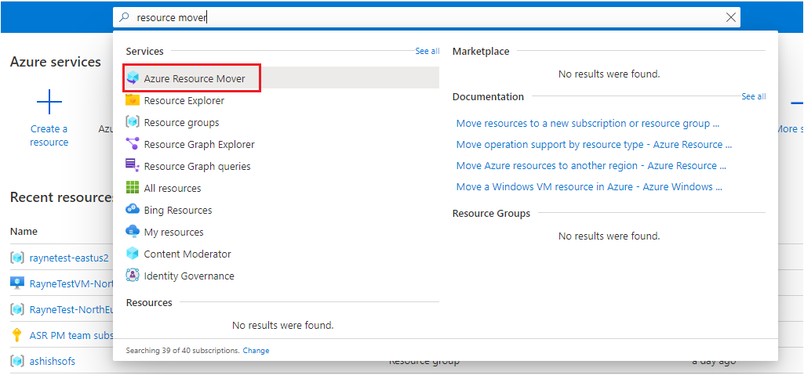

2. In **Overview**, click **Get started**.

    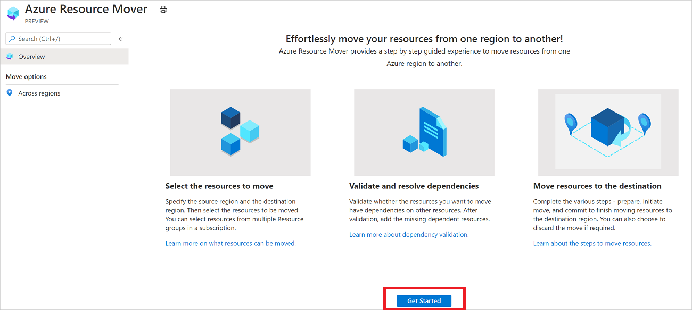

3. In **Move resources** > **Source + destination**, select the source subscription and region.
4. In **Destination**, select the region to which you want to move the resources. Then click **Next**.
5. In **Metadata region**, select where you want to store metadata about resources you're moving. A resource group is created specifically for this purpose. Then click **Next**.

    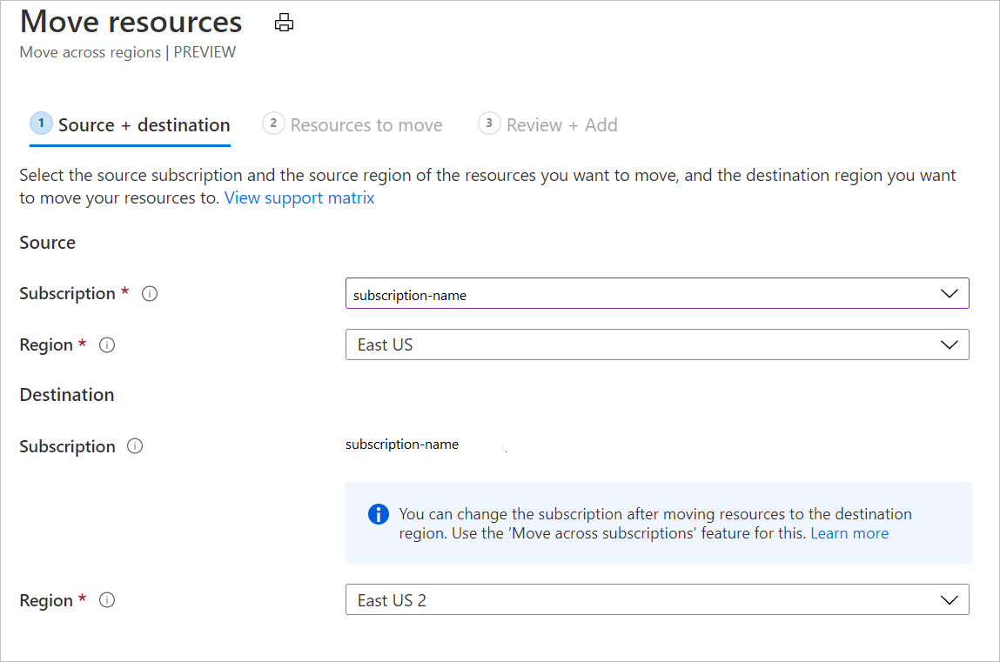

6. In **Resources to move**, click **Select resources**.
7. In **Select resources**, select the resources. You can only add resources supported for move. Then click **Done**.

    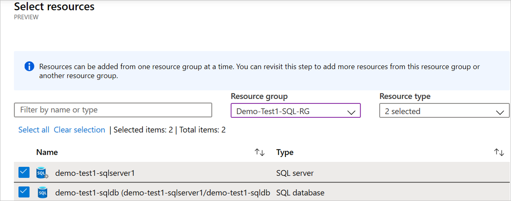

8. In **Resources to move**, click **Next**.

9. In **Review + Add**, check the source and destination settings.

    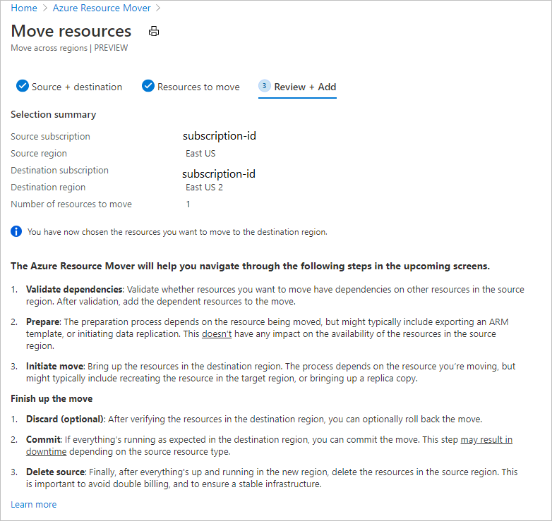

10. Click **Proceed**, to begin adding the resources.
11. After the add process finishes successfully, click **Adding resources for move** in the notification icon.
12. After clicking the notification, review the resources on the **Across regions** page.

> [!NOTE]
> 
> - The SQL Server is now in a *Manual assignment pending* state.
> - Other added resources are in a *Prepare pending* state.
> - If you want to remove an resource from a move collection, the method for doing that depends on where you are in the move process. [Learn more](remove-move-resources.md).

## Resolve dependencies

1. In **Across regions**, if resources show a *Validate dependencies* message in the **Issues** column, click the **Validate dependencies** button. The validation process begins.
2. If dependencies are found, click **Add dependencies**.

    
   
3. In **Add dependencies**, select the dependent resources > **Add dependencies**. Monitor progress in the notifications.

4. Add additional dependencies if needed, and validate dependencies again. 

5. On the **Across regions** page, verify that resources are now in a *Prepare pending* state, with no issues.

    

## Move the SQL Server

Assign a target SQL Server in the target region, and commit the move.

### Assign a target SQL Server

1. In **Across regions**, for the SQL Server resource, in the **Destination configuration** column, click **Resource not assigned**.
2. Select an existing SQL Server resource in the target region. 
    
     

    
> [!NOTE]
> The source SQL Server state changes to *Commit move pending*. 

### Commit the SQL Server move

1. In **Across regions**, select the SQL Server, and then click **Commit move**.
2. In **Commit resources**, click **Commit**.

    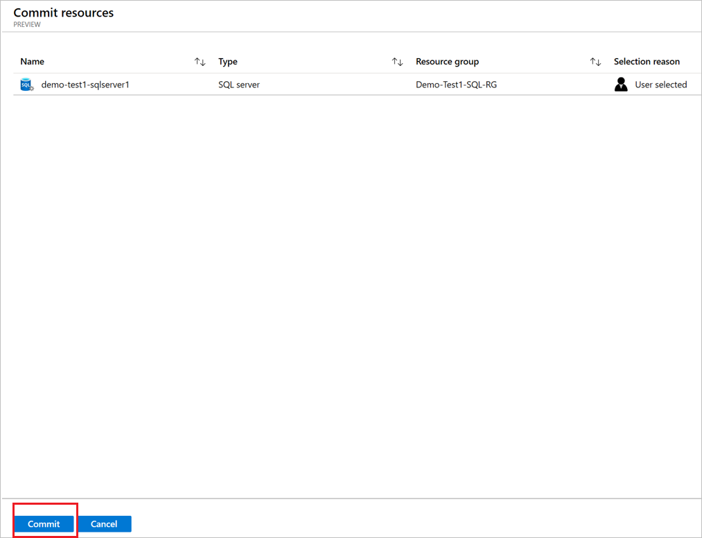

3. Track move progress in the notifications bar.

> [!NOTE]
> After the commit, the SQL Server is now in a *Delete source pending* state.

## Prepare resources to move

With the source SQL Server moved, you can prepare to move the other resources.

## Prepare an elastic pool

1. In **Across regions**, select the source elastic pool (demo-test1-elasticpool in our walkthrough), and then click **Prepare**.

    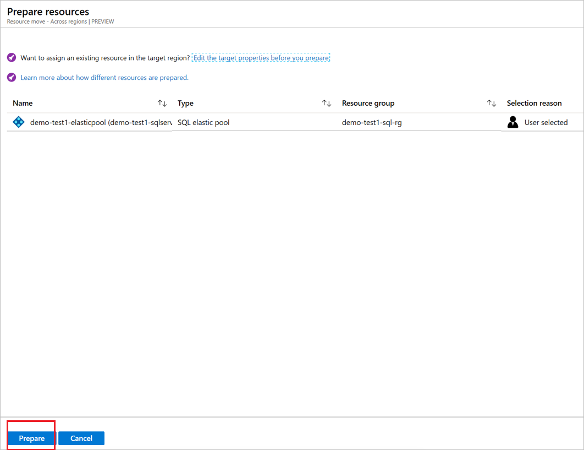

2. In **Prepare resources**, click **Prepare**.
3. When  notifications show that the prepare process was successful, click **Refresh**.

> [!NOTE]
> The elastic pool is now in an *Initiate move pending* state.

## Prepare a single database

1. In **Across regions**, select the single database (not in an elastic pool), and then click **Prepare**.

    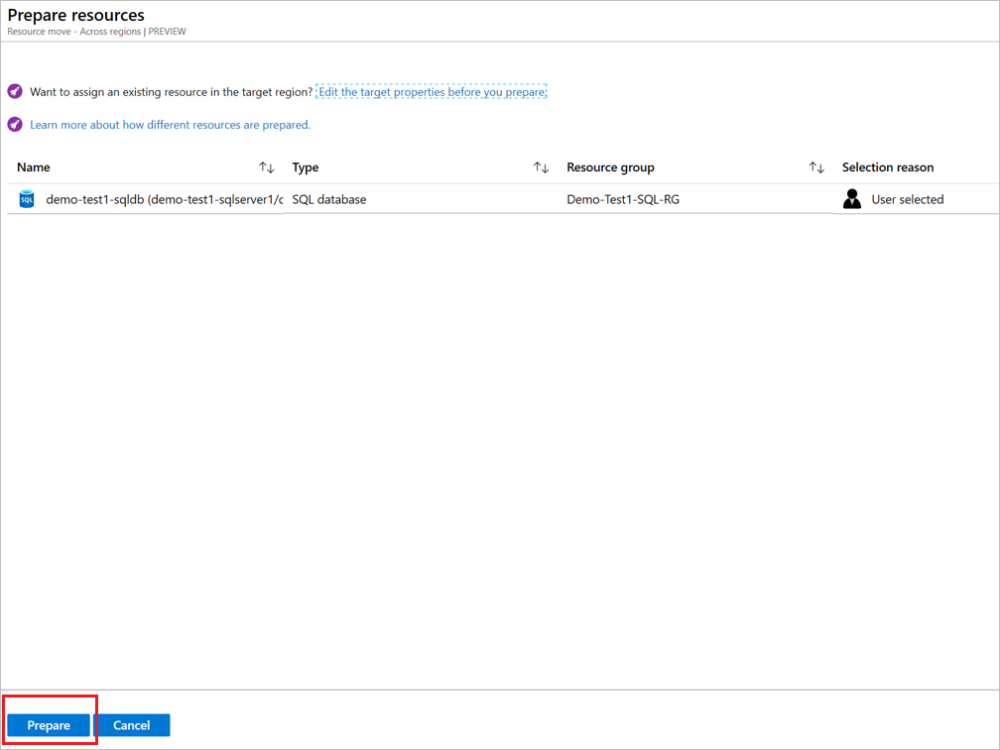

2. In **Prepare resources**, click **Prepare**.
3. When  notifications show that the prepare process was successful, click **Refresh**.

> [!NOTE]
> The database is now in an *Initiate move pending* state, and has been created in the target region.

## Move the pool and prepare pool databases

To prepare databases in an elastic pool, the elastic pool must be in a *Commit move pending* state. To move to this state, initiate the move for the pool.

#### Initiate move - elastic pool

1. In **Across regions**, select the source elastic pool (demo-test1-elasticpool in our walkthrough), and then click **Initiate move**.
2. In **Move resources**, click **Initiate move**.

    
    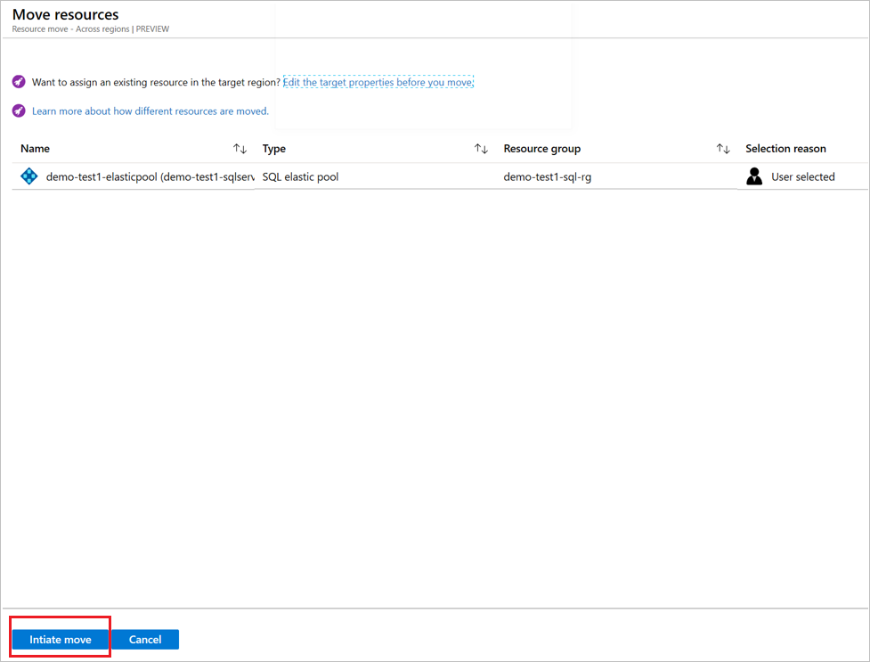

1. Track move progress in the notifications bar.
1. When the notifications show that the move was successful, click **Refresh**.

> [!NOTE]
> The elastic pool is now in a *Commit move pending* state.

#### Prepare database

1. In **Across regions**, select the database (demo-test2-sqldb in our walkthrough), and then click **Prepare**.
2. In **Prepare resources**, click **Prepare**.

    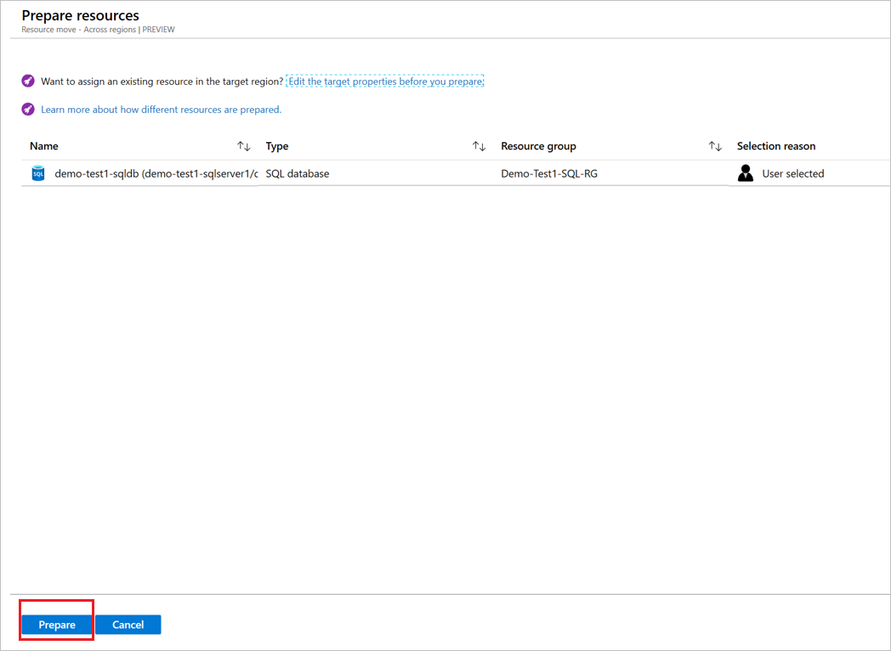 

During prepare, the target database is created in the target region, and data replication starts. After Prepare, the database is in an *Initiate move pending* state. 

 

## Move databases

Start to move the databases.
1. In **Across regions**, select resources with state **Initiate move pending**. Then click **Initiate move**.
2. In **Move resources**, click **Initiate move**.

    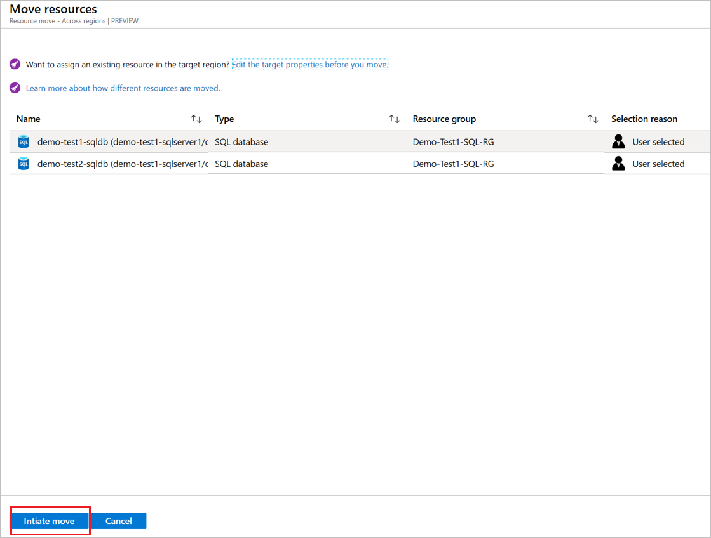

3. Track move progress in the notifications bar.

> [!NOTE]
> Databases are now in a *Commit move pending* state.

## Discard or commit?

After the initial move, you can decide whether you want to commit the move, or to discard it. 

- **Discard**: You might want to discard a move if you're testing, and you don't want to actually move the source resource. Discarding the move returns the resource to a state of **Initiate move pending**.
- **Commit**: Commit completes the move to the target region. After committing, a source resource will be in a state of **Delete source pending**, and you can decide if you want to delete it.

## Discard the move 

You can discard the move as follows:

1. In **Across regions**, select resources with state **Commit move pending**, and click **Discard move**.
2. In **Discard move**, click **Discard**.
3. Track move progress in the notifications bar.

> [!NOTE]
> - After discarding resources, they're in an *Initiate move pending* state.
> - If there's only an elastic pool, discard progresses, and the elastic pool created in the target region is deleted.
> - If there's an elastic pool with associated databases in the *Commit move pending* state, you can't discard the elastic pool.
> - If you discard a SQL database, target region resources aren't deleted. 

If you want to start the move again after discarding, select the SQL database or elastic pool, and initiate the move again.

## Commit the move

Finishing moving databases and elastic pools as follows:

1. Check that the SQL Server is a *Delete source pending* state.
2. Update database connection strings to the target region, before you commit.
3. In **Across regions**, select the SQL resources, and then click **Commit move**.
4. In **Commit resources**, click **Commit**.

    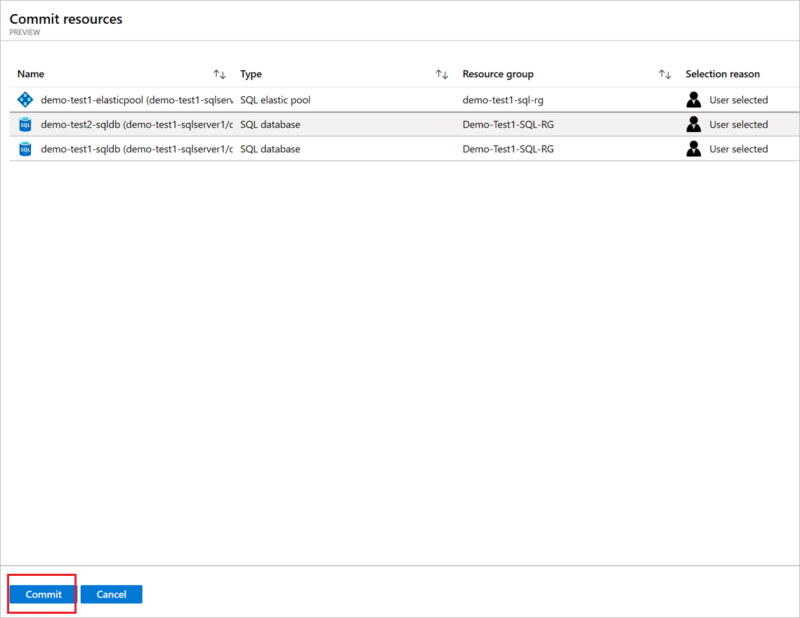

5. Track commit progress in the notifications bar.

> [!NOTE]
> Some downtime occurs for SQL databases during the commit process.
> Committed databases and elastic pools are now in a *Delete source pending* state.
> After the commit, update database-related settings, including firewall rules, policies, and alerts, on the target database.

## Delete source resources after commit

After the move, you can optionally delete resources in the source region. 

1. In **Across Regions**, click the name of each source resource that you want to delete.
2. In the properties page for each resource, select **Delete**.

## Next steps

In this tutorial, you:

> [!div class="checklist"]
> * Moved Azure SQL databases to another Azure region.
> * Moved Azure SQL elastic pools to another region.

Now, trying moving Azure VMs to another region.

> [!div class="nextstepaction"]
> [Move Azure VMs](./tutorial-move-region-virtual-machines.md)
