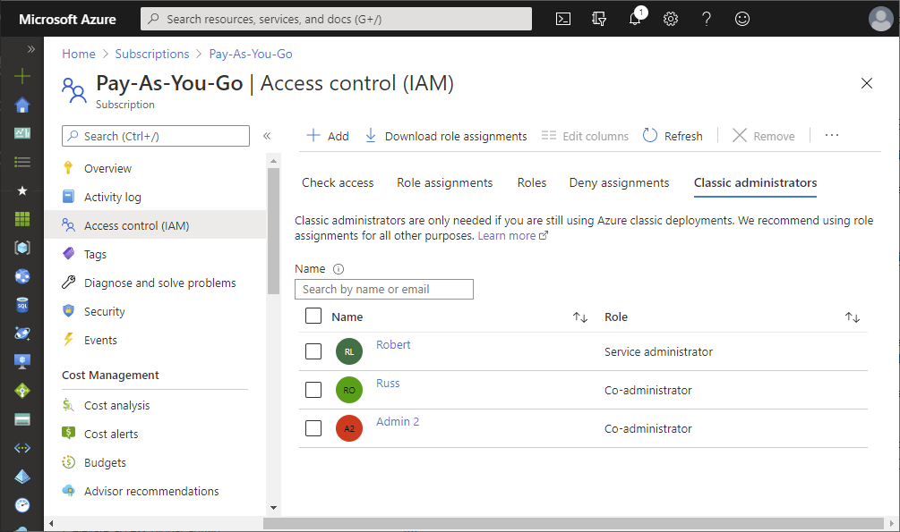
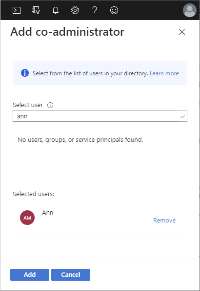
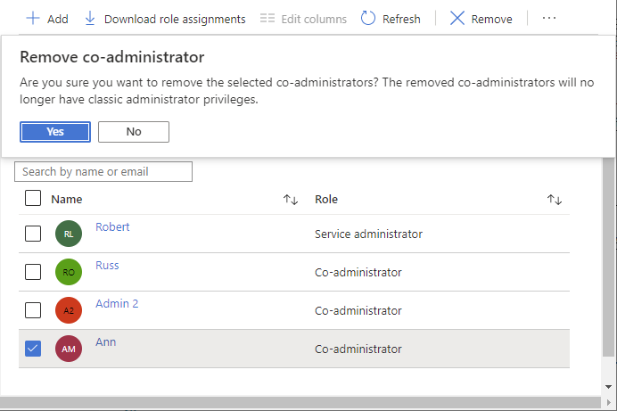
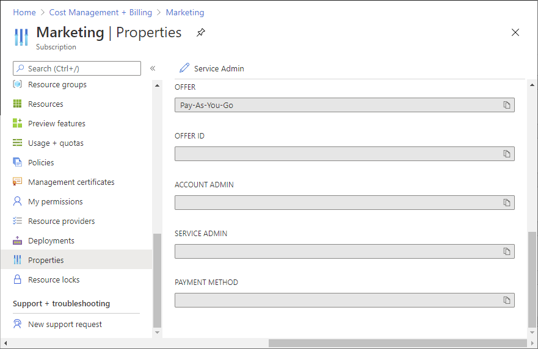

# Azure classic subscription administrators

Microsoft recommends that you manage access to Azure resources using Azure role-based access control (Azure RBAC). However, if you are still using the classic deployment model, you'll need to use a classic subscription administrator role: Service Administrator and Co-Administrator. For more information, see [Azure Resource Manager vs. classic deployment](../azure-resource-manager/management/deployment-models.md).

This article describes how to add or change the Co-Administrator and Service Administrator roles, and how to view the Account Administrator.

## Add a Co-Administrator

> [!TIP]
> You only need to add a Co-Administrator if the user needs to manage Azure classic deployments by using [Azure Service Management PowerShell Module](https://docs.microsoft.com/powershell/module/servicemanagement/azure). If the user only uses the Azure portal to manage the classic resources, you won’t need to add the classic administrator for the user.

1. Sign in to the [Azure portal](https://portal.azure.com) as a Service Administrator or Co-Administrator.

1. Open [Subscriptions](https://portal.azure.com/#blade/Microsoft_Azure_Billing/SubscriptionsBlade) and select a subscription.

    Co-Administrators can only be assigned at the subscription scope.

1. Click **Access control (IAM)**.

1. Click the **Classic administrators** tab.

    

1. Click **Add** > **Add co-administrator** to open the Add co-administrators pane.

    If the Add co-administrator option is disabled, you do not have permissions.

1. Select the user that you want to add and click **Add**.

    

## Add a guest user as a Co-Administrator

To add a guest user as a Co-Administrator, follow the same steps as in the previous [Add a Co-Administrator](#add-a-co-administrator) section. The guest user must meet the following criteria:

- The guest user must have a presence in your directory. This means that the user was invited to your directory and accepted the invite.

For more information, about how to add a guest user to your directory, see [Add Azure Active Directory B2B collaboration users in the Azure portal](../active-directory/b2b/add-users-administrator.md).

### Differences for guest users

Guest users that have been assigned the Co-Administrator role might see some differences as compared to member users with the Co-Administrator role. Consider the following scenario:

- User A with an Azure AD account (work or school account) is a Service Administrator for an Azure subscription.
- User B has a Microsoft account.
- User A assigns the Co-Administrator role to user B.
- User B can do almost everything, but is unable to register applications or look up users in the Azure AD directory.

You would expect that user B could manage everything. The reason for this difference is that the Microsoft account is added to the subscription as a guest user instead of a member user. Guest users have different default permissions in Azure AD as compared to member users. For example, member users can read other users in Azure AD and guest users cannot. Member users can register new service principals in Azure AD and guest users cannot.

If a guest user needs to be able to perform these tasks, a possible solution is to assign the specific Azure AD administrator roles the guest user needs. For example, in the previous scenario, you could assign the [Directory Readers](../active-directory/users-groups-roles/directory-assign-admin-roles.md#directory-readers) role to read other users and assign the [Application Developer](../active-directory/users-groups-roles/directory-assign-admin-roles.md#application-developer) role to be able to create service principals. For more information about member and guest users and their permissions, see [What are the default user permissions in Azure Active Directory?](../active-directory/fundamentals/users-default-permissions.md). For more information about granting access for guest users, see [Manage access to Azure resources for external guest users using RBAC](role-assignments-external-users.md).

Note that the [Azure built-in roles](../role-based-access-control/built-in-roles.md) are different than the [Azure AD administrator roles](../active-directory/users-groups-roles/directory-assign-admin-roles.md). The built-in roles don't grant any access to Azure AD. For more information, see [Understand the different roles](../role-based-access-control/rbac-and-directory-admin-roles.md).

For information that compares member users and guest users, see [What are the default user permissions in Azure Active Directory?](../active-directory/fundamentals/users-default-permissions.md).

## Remove a Co-Administrator

1. Sign in to the [Azure portal](https://portal.azure.com) as a Service Administrator or Co-Administrator.

1. Open [Subscriptions](https://portal.azure.com/#blade/Microsoft_Azure_Billing/SubscriptionsBlade) and select a subscription.

1. Click **Access control (IAM)**.

1. Click the **Classic administrators** tab.

1. Add a checkmark next to the Co-Administrator you want to remove.

1. Click **Remove**.

1. In the message box that appears, click **Yes**.

    

## Change the Service Administrator

Only the Account Administrator can change the Service Administrator for a subscription. By default, when you sign up for an Azure subscription, the Service Administrator is the same as the Account Administrator. The user with the Account Administrator role has no access to the Azure portal. The user with the Service Administrator role has full access to the Azure portal. If the Account Administrator and Service Administrator are the same user and you change the Service Administrator to a different user, then the Account Administrator loses access to Azure portal. However, the Account Administrator can always use Account Center to change the Service Administrator back to themselves.

Follow these steps to change the Service Administrator in **Account Center**.

### Account Center

1. Make sure your scenario is supported by checking the [limitations for changing the Service Administrator](#limitations-for-changing-the-service-administrator).

1. Sign in to [Account Center](https://account.windowsazure.com/subscriptions) as the Account Administrator.

1. Click a subscription.

1. On the right side, click **Edit subscription details**.

    

1. In the **SERVICE ADMINISTRATOR** box, enter the email address of the new Service Administrator.

    

1. Click the checkmark to save the change.

### Limitations for changing the Service Administrator

There can only be one Service Administrator per Azure subscription. Changing the Service Administrator will behave differently depending on whether the Account Administrator is a Microsoft account or whether it is an Azure AD account (work or school account).

| Account Administrator account | Can change the Service Administrator to a different Microsoft account? | Can change the Service Administrator to an Azure AD account in the same directory? | Can change the Service Administrator to an Azure AD account in a different directory? |
| --- | --- | --- | --- |
| Microsoft account | Yes | No | No |
| Azure AD account | Yes | Yes | No |

If the Account Administrator is an Azure AD account, you can change the Service Administrator to an Azure AD account in the same directory, but not in a different directory. For example, abby@contoso.com can change the Service Administrator to bob@contoso.com, but cannot change the Service Administrator to john@notcontoso.com unless john@notcontoso.com has a presence in the contoso.com directory.

For more information about Microsoft accounts and Azure AD accounts, see [What is Azure Active Directory?](../active-directory/fundamentals/active-directory-whatis.md).

## View the Account Administrator

The Account Administrator is the user that initially signed up for the Azure subscription, and is responsible as the billing owner of the subscription. To change the Account Administrator of a subscription, see [Transfer ownership of an Azure subscription to another account](../cost-management-billing/manage/billing-subscription-transfer.md).

Follow these steps to view the Account Administrator.

1. Sign in to the [Azure portal](https://portal.azure.com).

1. Open [Subscriptions](https://portal.azure.com/#blade/Microsoft_Azure_Billing/SubscriptionsBlade) and select a subscription.

1. Click **Properties**.

    The Account Administrator of the subscription is displayed in the **Account Admin** box.

    

## Next steps

* [Understand the different roles in Azure](../role-based-access-control/rbac-and-directory-admin-roles.md)
* [Manage access to Azure resources using RBAC and the Azure portal](../role-based-access-control/role-assignments-portal.md)
* [Add or change Azure subscription administrators](../cost-management-billing/manage/add-change-subscription-administrator.md)
