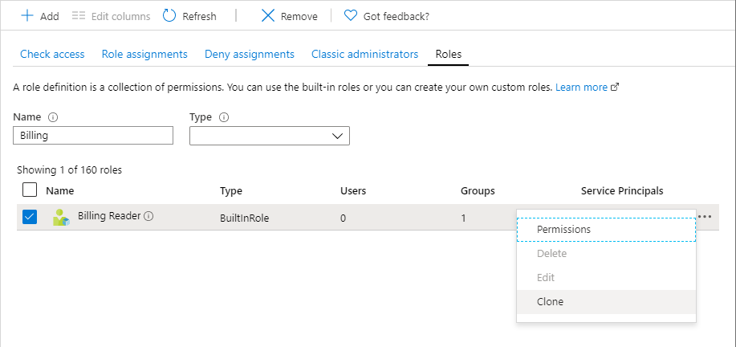
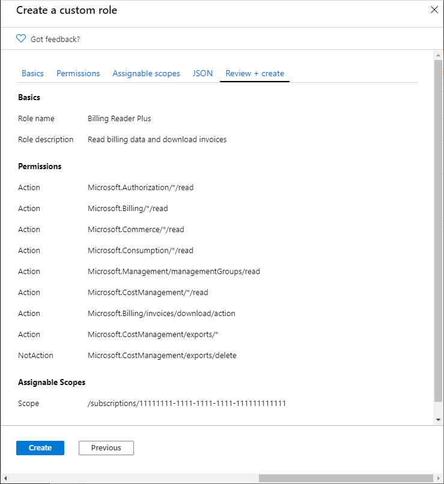

# Create or update Azure custom roles using the Azure portal (Preview)

If the [Azure built-in roles](built-in-roles.md) don't meet the specific needs of your organization, you can create your own Azure custom roles. Just like built-in roles, you can assign custom roles to users, groups, and service principals at subscription, resource group, and resource scopes. Custom roles are stored in an Azure Active Directory (Azure AD) directory and can be shared across subscriptions. Each directory can have up to 2000 custom roles. Custom roles can be created using the Azure portal, Azure PowerShell, Azure CLI, or the REST API. This article describes how to create custom roles using the Azure portal (currently in preview).

This example shows how to clone the [Billing Reader](built-in-roles.md#billing-reader) role and add the ability to download invoices.

## Prerequisites

To create custom roles, you need:

- Permissions to create custom roles, such as [Owner](built-in-roles.md#owner) or [User Access Administrator](built-in-roles.md#user-access-administrator)

## Step 1: Determine the permissions you need

Azure has thousands of permissions that you can potentially include in your custom role. There are multiple ways that you can determine the permissions you will need.

- Look at existing roles
- Search for permissions
- Download all permissions
- View the permissions in the docs 

## Step 2: Choose how to start

### Clone a role

If an existing role does not quite meet your needs, you can clone it and then modify the permissions for your scenario.

1. Open a subscription, resource group, or resource where you want the custom role to be assignable and then open **Access control (IAM)**.

    The following screenshot shows the Access control (IAM) blade opened for a subscription.

    

1. Click the **Roles** tab to see a list of all the built-in and custom roles.

1. Search for a role you want to clone such as the Billing Reader role.

1. At the end of the row, click the ellipsis (**...**) and then click **Clone**.

    

    This opens the Basics tab with the **Clone a role** option selected.

### Start from scratch

1. Open a subscription, resource group, or resource where you want the custom role to be assignable and then open **Access control (IAM)**.

1. Click **Add** and then click **Add custom role (preview)**.

    This opens the Basics tab with the **Start from scratch** option selected.

### Start from JSON

1. Create a JSON file the has the following format:

1. Open a subscription, resource group, or resource where you want the custom role to be assignable and then open **Access control (IAM)**.

1. Click **Add** and then click **Add custom role (preview)**.

    This opens the Basics tab.

1. In Baseline permissions, select **Start from JSON**.

1. Next to the Select a file box, click the folder button to open the **Open** dialog box.

1. Select the file your JSON file and then click **Open**.

## Step 3: Basics

On the **Basics** tab, you specify the name, description, and baseline permissions for your custom role.

1. In the **Custom role name** box, specify a name for the custom role. The name must be unique for the Azure AD directory. The name can include letters, numbers, spaces, and special characters.

1. In the **Description** box, specify an optional description for the custom role. This will become the tooltip for the custom role.

    The **Baseline permissions** option should already be set to **Clone a role**.

    

## Step 4: Permissions

On the **Permissions** tab, you define the permissions for your custom role. Depending on whether you cloned a role or if you started with JSON, the Permissions tab might already list some permissions.

### Add permissions

1. To add permissions, click **Add permissions** to open the Add permissions pane.

    This pane lists all available permissions grouped into different categories in a card format. Each category represents a *resource provider*, which is a service that supplies Azure resources.

1. In the **Search for a permission** box, type a string to search for permissions. For example, search for **invoice** to find permissions related to invoices.

    A list of resource provider cards will be displayed based on your search string. For a list of how resource providers map to Azure services, see [Resource providers for Azure services](../azure-resource-manager/management/azure-services-resource-providers.md).

1. In the list, click a resource provider card that has permissions you want to add to your custom role, such as **Microsoft Billing**.

    A list of the management permissions for that resource provider are displayed based on your search string.

1. If necessary, update the search string to further refine your search.

1. If necessary, click the actions toggle. Click **Actions** to see permissions that apply to the management plane or click **Data Actions** to see permissions that apply to the data plane.

1. Once you find one or more permissions you want to add to your custom role, add a check mark next to the permissions. For example, add a check mark next to **Other : Download Invoice** to add the permission to download invoices.

    

1. Click **Add** to add the permission to your permission list.

    The permission gets added as Actions or a DataActions.

    

### Remove permissions

1. For any permissions you don't need, click the delete icon at the end of the row. In this example, since a user will not need the ability to create support tickets, the Microsoft.Support/* permission is deleted.

### Add wildcard permissions

A wildcard (*) extends a permission to everything that matches the string you provide. Fore example, ... Depending on how you choose to start, you might already have wildcard permissions in your list of permissions. If you want to add wildcard permissions, you have to use the JSON tab.

### Exclude permissions

1. If your role has a wildcard (*) permission and you want to exclude specific permissions from that wildcard permission, click **Exclude permissions** to open the Exclude permissions pane. On this pane, you specify the management or data operations that are excluded or subtracted from the allowed wildcard permission.

    If you want to add your own wildcard permission, you'll to manually add it on the JSON tab.

1. Once you find one or more permissions, add a check mark next to the permissions to exclude and then click the **Add** button.

    

    The permission gets added as a NotActions or NotDataActions.

    

    The effective management permissions are computed by adding all of the Actions and then subtracting all of the NotActions. The effective data permissions are computed by adding all of the DataActions and then subtracting all of the NotDataActions.

## Step 5: Assignable scopes

On the **Assignable scopes** tab, you specify where your custom role is available for assignment, such as subscription, resource group, or resource.

1. Click **Add assignable scopes** to open the Add assignable scopes pane.

1. Click a scope that you want to use, typically your subscription.

    

1. Click the **Add** button to add your assignable scope.

    

## Step 6: JSON

On the **JSON** tab, you see your custom role formatted in JSON.

1. If you want to add a wildcard (*) permission or directly edit the JSON, click **Edit**.

## Step 7: Review + create

On the **Review + create** tab, you can review your settings and check for any validation errors.

1. Click **Create** to create your custom role.

    After a few moments, a message box appears indicating your custom role was successfully created.

    

1. Click **OK** in the success message box.

    Your custom role appears in the list of roles.

    

## Step 8: List custom roles

A role definition is a collection of permissions that you use for role assignments. Follow these steps to view your custom roles, if any.

1. Open a subscription, resource group, or resource and then open **Access control (IAM)**.

    The following screenshot shows the Access control (IAM) blade opened for a subscription.

    

1. Click the **Roles** tab to see a list of all the built-in and custom roles.

1. In the **Type** list, select **CustomRole** to just see your custom roles.

    You might not have any custom roles.

    

## Update a custom role

1. As described earlier in this article, open your list of custom roles.

    

1. Click the ellipsis (**...**) for the custom role you want to edit and then click **Edit**.

    

1. On the **Basics** tab, you can update the name or description.

1. On the **Permissions** tab, you can add or remove permissions.

1. On the **Assignable scopes** tab, you can update the assignable scopes.

1. On the **JSON** tab, you can directly edit the JSON.

1. Once you are finished with your changes, click the **Review + create** tab to review your changes.

1. Click the **Update** button to update your custom role.

## Delete a custom role

1. As described earlier in this article, open your list of custom roles.

    

1. Click the ellipsis (**...**) for the custom role you want to delete and then click **Delete**.

    

    After a few moments, your custom role is deleted.

## Troubleshoot

## Next steps

- [Tutorial: Create a custom role using Azure PowerShell](tutorial-custom-role-powershell.md)
- [Custom roles in Azure](custom-roles.md)
- [Azure Resource Manager resource provider operations](resource-provider-operations.md)
