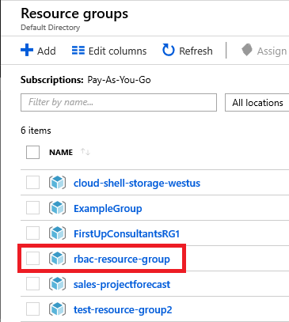
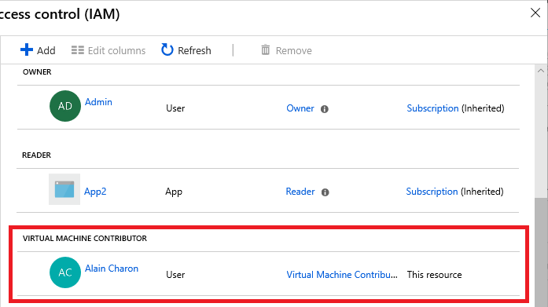

# Quickstart: Grant access for a user using RBAC and the Azure Portal

Role-based access control (RBAC) is the way that you manage access to resources in Azure. In this quickstart, you grant a user access to create and manage virtual machines in a resource group.

If you don't have an Azure subscription, create a [free account](https://azure.microsoft.com/free/?WT.mc_id=A261C142F) before you begin.

## Sign in to Azure

Sign in to the Azure portal at http://portal.azure.com.

## Create a resource group

1. In the navigation list, choose **Resource groups**.

1. Choose **Add** to open the **Resource group** blade.

   

1. For **Resource group name**, enter **rbac-quickstart-resource-group**.

1. Select a subscription and a location.

1. Choose **Create** to create the resource group.

1. Choose **Refresh** to refresh the list of resource groups.

   The new resource group appears in your resource groups list.

   

## Grant access

In RBAC, to grant access, you create a role assignment.

1. In the list of **Resource groups**, choose the new **rbac-quickstart-resource-group** resource group.

1. Choose **Access control (IAM)** to see the current list of role assignments.

   

1. Choose **Add** to open the **Add permissions** pane.

   If you don't have permissions to assign roles, you won't see the **Add** option.

   

1. In the **Role** drop-down list, select **Virtual Machine Contributor**.

1. In the **Select** list, select yourself or another user.

1. Choose **Save** to create the role assignment.

   After a few moments, the user is assigned the Virtual Machine Contributor role at the rbac-quickstart-resource-group resource group scope.

   

## Remove access

In RBAC, to remove access, you remove a role assignment.

1. In the list of role assignments, add a checkmark next to user with the Virtual Machine Contributor role.

1. Choose **Remove**.

   

1. In the remove role assignment message that appears, choose **Yes**.

## Clean up

1. In the navigation list, choose **Resource groups**.

1. Choose **rbac-quickstart-resource-group** to open the resource group.

1. Choose **Delete resource group** to delete the resource group.

   

1. On the **Are you sure you want to delete** blade, type the resource group name: **rbac-quickstart-resource-group**.

1. Choose **Delete** to delete the resource group.

## Next steps

> [!div class="nextstepaction"]
> [Assign a role to a user using PowerShell](tutorial-role-assignments-user-powershell.md)

