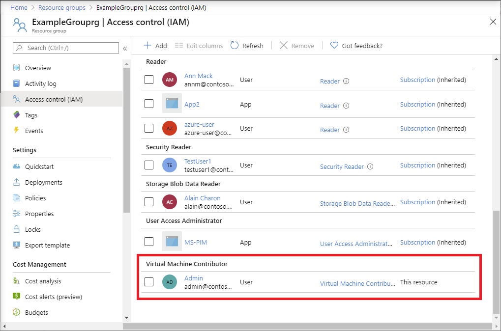

# Quickstart: Add an Azure role assignment using an Azure Resource Manager template

[Azure role-based access control (Azure RBAC)](overview.md) is the way that you manage access to Azure resources. In this quickstart, you create a resource group and grant a user access to create and manage virtual machines in the resource group. This quickstart uses a Resource Manager template to grant the access.

[!INCLUDE [About Azure Resource Manager](../../includes/resource-manager-quickstart-introduction.md)]

If you don't have an Azure subscription, create a [free account](https://azure.microsoft.com/free/?WT.mc_id=A261C142F) before you begin.

## Prerequisites

To add role assignments, you must have:

* `Microsoft.Authorization/roleAssignments/write` and `Microsoft.Authorization/roleAssignments/delete` permissions, such as [User Access Administrator](built-in-roles.md#user-access-administrator) or [Owner](built-in-roles.md#owner)

## Create a role assignment

To add a role assignment, you must specify three elements: security principal, role definition, and scope. For this quickstart, the security principal is you or another user in your directory, the role definition is [Virtual Machine Contributor](built-in-roles.md#virtual-machine-contributor), and the scope is a resource group that you specify.

### Review the template

The template used in this quickstart is from [Azure Quickstart templates](https://azure.microsoft.com/resources/templates/101-rbac-builtinrole-resourcegroup/). The template has three parameters and a resources section. In the resources section, notice that it has the three elements of a role assignment: security principal, role definition, and scope. 

:::code language="json" source="~/quickstart-templates/101-rbac-builtinrole-resourcegroup/azuredeploy.json" highlight="30-32":::

### Deploy the template

1. Sign in to the [Azure portal](https://portal.azure.com).

1. Determine your email address that is associated with your Azure subscription. Or determine the email address of another user in your directory.

1. Open Azure Cloud Shell for PowerShell.

1. Copy and paste the following script into Cloud Shell.

    ```azurepowershell
    $resourceGroupName = Read-Host -Prompt "Enter a resource group name (i.e. ExampleGrouprg)"
    $emailAddress = Read-Host -Prompt "Enter an email address for a user in your directory"
    $location = Read-Host -Prompt "Enter the location (i.e. centralus)"
    
    $roleAssignmentName = New-Guid
    $principalId = (Get-AzAdUser -Mail $emailAddress).id
    $roleDefinitionId = (Get-AzRoleDefinition -name "Virtual Machine Contributor").id
    $templateUri = "https://raw.githubusercontent.com/Azure/azure-quickstart-templates/master/101-rbac-builtinrole-resourcegroup/azuredeploy.json"
    
    New-AzResourceGroup -Name $resourceGroupName -Location $location
    New-AzResourceGroupDeployment -ResourceGroupName $resourceGroupName -TemplateUri $templateUri -roleAssignmentName $roleAssignmentName -roleDefinitionID $roleDefinitionId -principalId $principalId
    ```

1. Enter a resource group name such as ExampleGrouprg.

1. Enter an email address for yourself or another user in your directory.

1. Enter a location for the resource group such as centralus.

    The [New-AzResourceGroup](/powershell/module/az.resources/new-azresourcegroup) command creates a new resource group and the [New-AzResourceGroupDeployment](/powershell/module/az.resources/new-azresourcegroupdeployment) command deploys the template to add the role assignment.

## Review deployed resources

1. In the Azure portal, open the resource group you created.

1. In the left menu, click **Access control (IAM)**.

1. Click the **Role assignments** tab.

1. Verify that the **Virtual Machine Contributor** role is assigned to the user you specified.

   

## Clean up resources

To remove the role assignment and resource group you created, follow these steps.

1. Copy and paste the following script into Cloud Shell.

    ```azurepowershell
    $resourceGroupName = Read-Host -Prompt "Enter a resource group name (i.e. ExampleGrouprg)"
    $emailAddress = Read-Host -Prompt "Enter an email address for a user in your directory"
    
    $principalId = (Get-AzAdUser -Mail $emailAddress).id
    Remove-AzRoleAssignment -ObjectId $principalId -RoleDefinitionName "Virtual Machine Contributor" -ResourceGroupName $resourceGroupName
    
    Remove-AzResourceGroup -Name $resourceGroupName
    ```
    
1. Enter the resource group name.

1. Enter **Y** to confirm that you want to remove the resource group.

## Next steps

> [!div class="nextstepaction"]
> [Tutorial: Grant a user access to Azure resources using Azure PowerShell](tutorial-role-assignments-user-powershell.md)