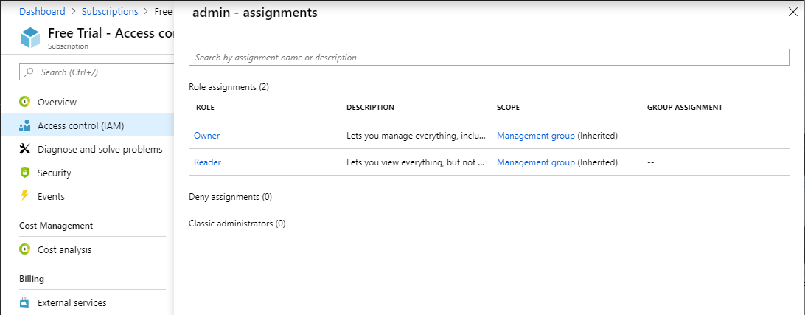

# List role assignments using RBAC and the Azure portal

[Role-based access control (RBAC)](overview.md) is the way that you manage access to Azure resources. This article describes how you list role assignments using the Azure portal. If you need to manage access to Azure Active Directory, see [View and assign administrator roles in Azure Active Directory](../active-directory/users-groups-roles/directory-manage-roles-portal.md).

## Prerequisites

To add and remove role assignments, you must have:

- `Microsoft.Authorization/roleAssignments/write` and `Microsoft.Authorization/roleAssignments/delete` permissions, such as [User Access Administrator](built-in-roles.md#user-access-administrator) or [Owner](built-in-roles.md#owner)

## List role assignments for a single user

To list access for a user, group, service principal, or managed identity, you view their role assignments. Follow these steps to view the access for a single user, group, service principal, or managed identity at a particular scope.

1. In the Azure portal, click **All services** and then select the scope. For example, you can select **Management groups**, **Subscriptions**, **Resource groups**, or a resource.

1. Click the specific resource.

1. Click **Access control (IAM)**.

1. Click the **Check access** tab.

    

1. In the **Find** list, select the type of security principal you want to check access for.

1. In the search box, enter a string to search the directory for display names, email addresses, or object identifiers.

    

1. Click the security principal to open the **assignments** pane.

    

    On this pane, you can see the roles assigned to the selected security principal and the scope. If there are any deny assignments at this scope or inherited to this scope, they will be listed.

## List all role assignments at a scope

1. In the Azure portal, click **All services** and then select the scope. For example, you can select **Management groups**, **Subscriptions**, **Resource groups**, or a resource.

1. Click the specific resource.

1. Click **Access control (IAM)**.

1. Click the **Role assignments** tab to view all the role assignments at this scope.

   

   On the Role assignments tab, you can see who has access at this scope. Notice that some roles are scoped to **This resource** while others are **(Inherited)** from another scope. Access is either assigned specifically to this resource or inherited from an assignment to the parent scope.

## Next steps

* [Tutorial: Grant a user access to Azure resources using RBAC and the Azure portal](quickstart-assign-role-user-portal.md)
* [Tutorial: Grant a user access to Azure resources using RBAC and Azure PowerShell](tutorial-role-assignments-user-powershell.md)
* [Troubleshoot RBAC for Azure resources](troubleshooting.md)
* [Organize your resources with Azure management groups](../governance/management-groups/overview.md)
