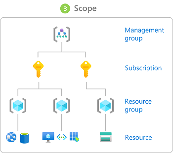

# Steps to assign an Azure role

A role assignment consists of three elements: security principal, role definition, and scope. To assign a role, follow these high-level overview steps.

## Step 1: Determine who needs access

You first need to determine who needs access. You can assign a role to a user, group, service principal, or managed identity. This is also called a *security principal*.

## Step 2: Find the appropriate role

Permissions are grouped together into roles. You can select from a list of several built-in roles or you can use your own custom roles.

1. Begin with the comprehensive article, [Azure built-in roles](built-in-roles.md). The table at the top of the article is an index into the details later in the article.

1. In that article, navigate to the service category (compute, storage, databases, etc.) for the resource to which you want to grant permissions. The easiest way to find what your looking for is typically to search the page for a relevant keyword, like "blob", "virtual machine", and so on.

1. Review the roles listed for the service category and identify the specific operations you need. Again, always start with the most restrictive role.

    For example, if a security principal needs to read blobs in an Azure storage account, but doesn't need write access, then choose [Storage Blob Data Reader](built-in-roles.md#storage-blob-data-reader) rather than [Storage Blob Data Contributor](built-in-roles.md#storage-blob-data-contributor) (and definitely not the administrator-level [Storage Blob Data Owner](built-in-roles.md#storage-blob-data-owner) role). You can always update the role assignments later as needed.

    If the security principal also needs access to queue storage, you can use roles such as [Storage Queue Data Reader](built-in-roles.md#storage-queue-data-reader) and [Storage Queue Data Contributor](built-in-roles.md#storage-queue-data-contributor). Again, be as specific as you can rather than assigning a broad role such as [Reader and Data Access](built-in-roles.md#reader-and-data-access), which gives access to account keys through which the principal can access anything in the entire storage account.

1. If you don't find a suitable role, you can create [custom roles](custom-roles.md).

## Step 3: Identify the needed scope

Azure provides four levels of scope: [management groups](../governance/management-groups/overview.md), subscriptions, [resource groups](../azure-resource-manager/management/overview.md#resource-groups), and resources. The following image shows an example of these levels.

You can assign roles at any of these levels of scope. The level you select determines how widely the role is applied. Lower levels inherit role permissions from higher levels. For example, when you assign a role at a subscription scope, the role is applied to all resource groups and resources in your subscription. When you assign a role at a resource group scope, the role is applied to the resource group and all its resources. However, another resource group doesn't have that role assignment.

For more information about scope, see [Understand scope](scope-overview.md).

## Step 4. Check your prerequisites

To assign roles, you must be signed in with a user that is assigned a role that has the `Microsoft.Authorization/roleAssignments/write` permission, such as [Owner](built-in-roles.md#owner) or [User Access Administrator](built-in-roles.md#user-access-administrator) at the scope you are trying to assign the role. Similarly, to remove a role assignment, you must have the `Microsoft.Authorization/roleAssignments/delete` permissions.

If your user account doesn't have permission to assign a role within your subscription, you see an error message that your account "does not have authorization to perform action 'Microsoft.Authorization/roleAssignments/write'." In this case, contact the administrators of your subscription as they can assign the permissions on your behalf.

## Step 5. Assign the role

You can assign roles in several ways. Check out the following articles for detailed steps for how to assign roles using the Azure portal, Azure PowerShell, Azure CLI, or the REST API.

- [Add or remove Azure role assignments using the Azure portal](role-assignments-portal.md)
- [Add or remove Azure role assignments using Azure PowerShell](role-assignments-powershell.md)
- [Add or remove Azure role assignments using Azure CLI](role-assignments-cli.md)
- [Add or remove Azure role assignments using the REST API](role-assignments-rest.md)

> [!TIP]
> It can take some time for changes in role assignments to propagate within Azure. If you see unexpected behavior, wait a few minutes and try again.

## Next steps

- [Tutorial: Grant a user access to Azure resources using the Azure portal](quickstart-assign-role-user-portal.md)
