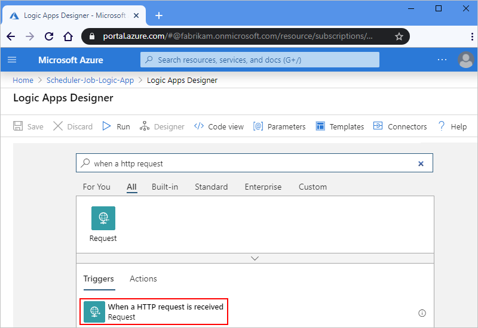
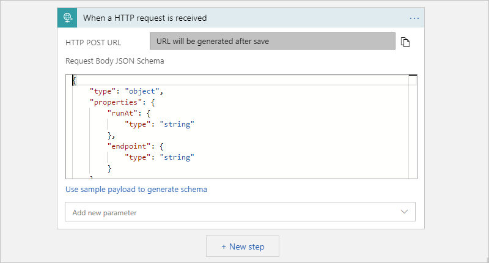
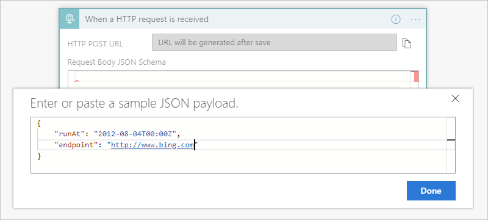
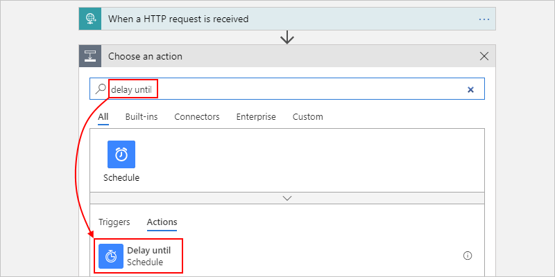
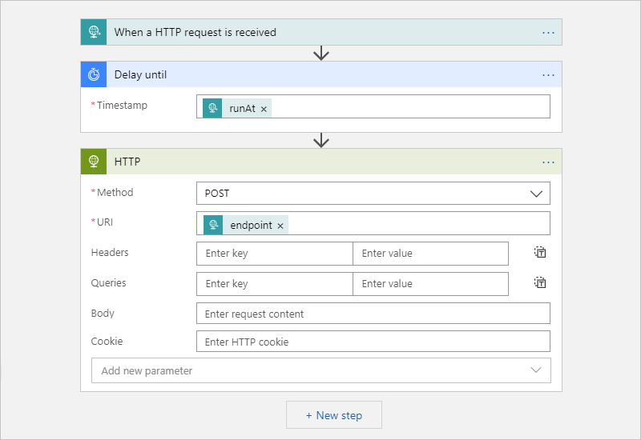
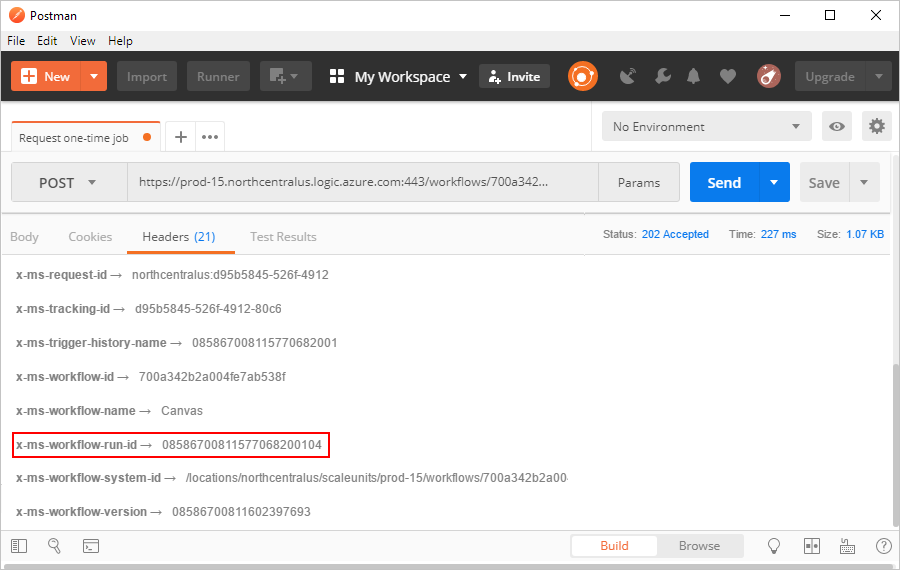
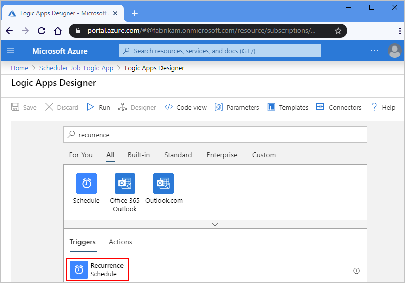
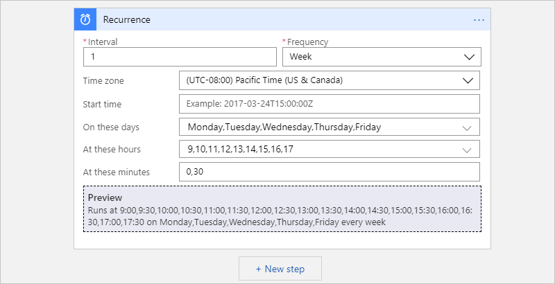
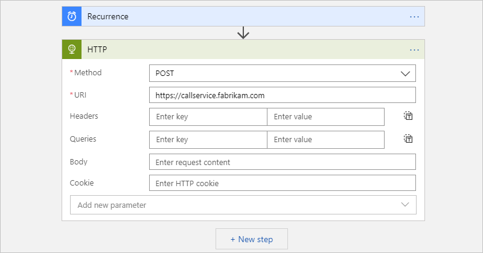
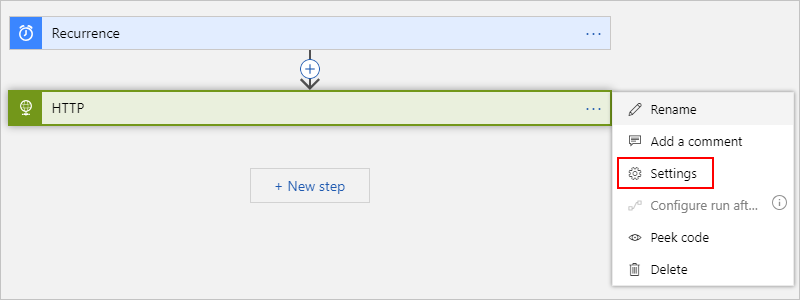

# Migrate Azure Scheduler jobs to Azure Logic Apps

> [!IMPORTANT]
> Azure Logic Apps is replacing Azure Scheduler, 
> which is being retired. To schedule jobs, 
> follow this article for moving to Azure Logic Apps instead.

This article shows how you can schedule one-time 
and recurring jobs by creating automated workflows 
with Azure Logic Apps, rather than with Azure Scheduler. 
When you create scheduled jobs with Logic Apps, you get these benefits:

* You don't have to worry about the concept of a *job collection* 
because each logic app is a separate Azure resource.

* You can run multiple one-time jobs by using a single logic app.

* The Azure Logic Apps service supports time zone and daylight savings time (DST).

To learn more, see [What is Azure Logic Apps?](../logic-apps/logic-apps-overview.md) 
or try creating your first logic app in this quickstart: 
[Create your first logic app](../logic-apps/quickstart-create-first-logic-app-workflow.md).

## Prerequisites

* An Azure subscription. If you don't have an Azure subscription, 
<a href="https://azure.microsoft.com/free/" target="_blank">sign up for a free Azure account</a>.

* To trigger your logic app by sending HTTP requests, 
use a tool such as the [Postman desktop app](https://www.getpostman.com/apps).

## Schedule one-time jobs

You can run multiple one-time jobs by creating just a single logic app. 

### Create your logic app

1. In the [Azure portal](https://portal.azure.com), 
create a blank logic app in Logic App Designer. 

   For the basic steps, follow [Quickstart: Create your first logic app](../logic-apps/quickstart-create-first-logic-app-workflow.md).

1. In the search box, enter "when a http request" as your filter. 
From the triggers list, select this trigger: 
**When a HTTP request is received** 

   

1. For the Request trigger, you can optionally provide a JSON schema, 
which helps the Logic App Designer understand the structure 
for the inputs from the incoming request and makes the outputs easier 
for you to select later in your workflow.

   To specify a schema, enter the schema in the 
   **Request Body JSON Schema** box, for example: 

   

   If you don't have a schema, but you have a sample payload in JSON format, 
   you can generate a schema from that payload.

   1. In the Request trigger, choose **Use sample payload to generate schema**.

   1. Under **Enter or paste a sample JSON payload**, provide your sample payload, 
   and then choose **Done**, for example:

      

1. Under the trigger, choose **Next step**. 

1. In the search box, enter "delay until" as your filter. 
Under the actions list, select this action: **Delay until**

   This action pauses your logic app workflow until a specified date and time.

   

1. Enter the timestamp for when you want to start the logic app's workflow. 

   When you click inside the **Timestamp** box, 
   the dynamic content list appears so you can 
   optionally select an output from the trigger.

   

1. Add any other actions you want to run by 
selecting from [~200+ connectors](../connectors/apis-list.md). 

   For example, you can include an HTTP 
   action that sends a request to a URL, 
   or actions that work with Storage Queues, 
   Service Bus queues, or Service Bus topics: 

   

1. When you're done, save your logic app.

   

   When you save your logic app for the first time, 
   the endpoint URL for your logic app's Request 
   trigger appears in the **HTTP POST URL** box. 
   When you want to call your logic app and send 
   inputs to your logic app for processing, 
   use this URL as the call destination.

   

1. Copy and save this endpoint URL so you can later 
send a manual request that triggers your logic app. 

## Start a one-time job

To manually run or trigger a one-time job, send a call 
to the endpoint URL for your logic app's Request trigger. 
In this call, specify the input or payload to send, 
which you might have described earlier by specifying a schema. 

For example, using the Postman app, you can create 
a POST request with the settings similar to this sample, 
and then choose **Send** to make the request.

| Request method | URL | Body | Headers |
|----------------|-----|------|---------| 
| **POST** | <*endpoint-URL*> | **raw** 
**JSON(application/json)** 
In the **raw** box, enter the payload you want to send in the request. 
**Note**: This setting automatically configures the **Headers** values. | **Key**: Content-Type  **Value**: application/json
 |||| 

After you send the call, the response from your logic 
app appears under the **raw** box on the **Body** tab. 

> [!IMPORTANT]
>
> If you want to cancel the job later, choose the **Headers** tab. 
> Find and copy the **x-ms-workflow-run-id** header value in the response. 
>
> 

## Cancel a one-time job

In Logic Apps, each one-time job executes as a single logic 
app run instance. To cancel a one-time job, you can use 
[Workflow Runs - Cancel](https://docs.microsoft.com/rest/api/logic/workflowruns/cancel) 
in the Logic Apps REST API. When you send a call to the trigger, 
provide the [workflow run ID](#workflow-run-id).

## Schedule recurring jobs

### Create your logic app

1. In the [Azure portal](https://portal.azure.com), 
create a blank logic app in Logic App Designer. 

   For the basic steps, follow [Quickstart: Create your first logic app](../logic-apps/quickstart-create-first-logic-app-workflow.md).

1. In the search box, enter "recurrence" as your filter. 
From the triggers list, select this trigger: 
**Recurrence** 

   

1. Set up a more advanced schedule, if you want.

   

   For more information about advanced scheduling options, see 
   [Create and run recurring tasks and workflows with Azure Logic Apps](../connectors/connectors-native-recurrence.md)

1. Add other actions you want by selecting from 
[200+ connectors](../connectors/apis-list.md). 
Under the trigger, choose **Next step**. 
Find and select the actions you want.

   For example, you can include an HTTP 
   action that sends a request to a URL, 
   or actions that work with Storage Queues, 
   Service Bus queues, or Service Bus topics: 

   

1. When you're done, save your logic app.

   

## Advanced setup

Here are other ways you can customize your jobs.

### Retry policy

To control the way that an action tries to rerun in your 
logic app when intermittent failures happen, you can set the 
[retry policy](../logic-apps/logic-apps-exception-handling.md#retry-policies) 
in each action's settings, for example:

1. Open the action's (**...**) menu, and select **Settings**.

   

1. Select the retry policy you want. For more information about each policy, 
see [Retry policies](../logic-apps/logic-apps-exception-handling.md#retry-policies).

   

## Handle exceptions and errors

In Azure Scheduler, if the default action fails to run, 
you can run an alterative action that addresses the error condition. 
In Azure Logic Apps, you can also perform the same task.

1. In Logic App Designer, above the action you want to handle, 
move your pointer over the arrow between steps, 
and select and **Add a parallel branch**. 

   

1. Find and select the action you want to run instead as the alternative action.

   

1. On the alternative action, open the (**...**) menu, and select **Configure run after**.

   

1. Clear the box for the **is successful** property. Select these properties: 
**has failed**, **is skipped**, and **has timed out**

   

1. When you're finished, choose **Done**.

To learn more about exception handling, see 
[Handle errors and exceptions - RunAfter property](../logic-apps/logic-apps-exception-handling.md#catch-and-handle-failures-with-the-runafter-property).

## FAQ

 

**Q**: When is Azure Scheduler retiring?  
**A**: Azure Scheduler is scheduled to retire on September 17, 2019.

**Q**: What happens to my Scheduler job collections and jobs after the service retires?  
**A**: All Scheduler job collections and jobs will be deleted from the system.

**Q**: Do I have to back up or perform any other tasks before migrating my Scheduler jobs to Logic Apps?  
**A**: As a best practice, always back up your work. Check that the logic apps you created are running as expected before deleting or disabling your Scheduler jobs. 

**Q**: Is there a tool that can help me migrate my jobs from Scheduler to Logic Apps?  
**A**: Each Scheduler job is unique, so a one-size-fits-all tool doesn't exist. However, various scripts will be available for you to modify for your needs. For script availability, check back later.

**Q**: Where can I get support for migrating my Scheduler jobs?  
**A**: Here are some ways to get support: 

**Azure portal**

If your Azure subscription has a paid support plan, you can 
create a technical support request in the Azure portal. 
Otherwise, you can select a different support option.

1. On the [Azure portal](https://portal.azure.com) main menu, 
select **Help + support**.

1. Under **Support**, select **New support request**. 
Provide these details for your request:

   | Setting | Value |
   |---------|-------|
   | **Issue type** | **Technical** | 
   | **Subscription** | <*your-Azure-subscription*> | 
   | **Service** | Under **Monitoring & Management**, select **Scheduler**. | 
   ||| 

1. Select the support option you want. If you have a paid support plan, 
choose **Next**.

**Community**

* [Azure Logic Apps forum](https://social.msdn.microsoft.com/Forums/en-US/home?forum=azurelogicapps)
* [Stack Overflow](https://stackoverflow.com/questions/tagged/azure-scheduler)

## Next steps

* [Create regularly running tasks and workflows with Azure Logic Apps](../connectors/connectors-native-recurrence.md)
* [Tutorial: Check traffic with a schedule-based logic app](../logic-apps/tutorial-build-schedule-recurring-logic-app-workflow.md)