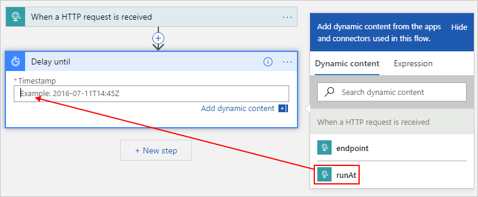
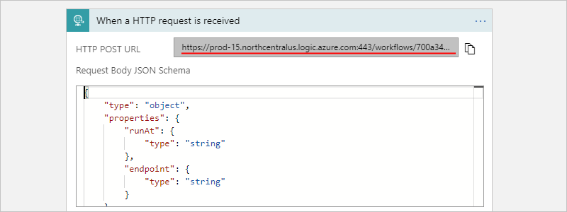
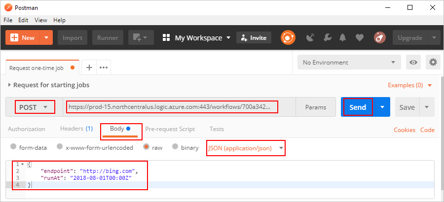
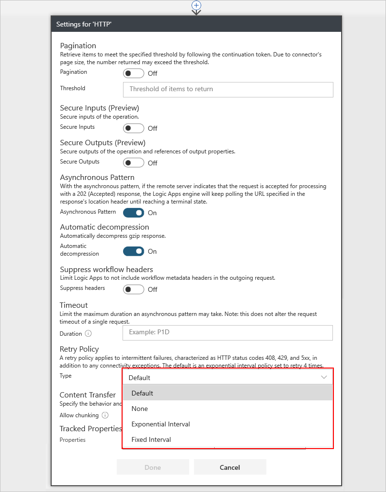

# Migrate to Azure Logic Apps from Azure Scheduler 

> Azure Logic Apps is replacing Azure Scheduler, 
> which is being retired. To schedule jobs, please start using 
> Azure Logic Apps instead, not Azure Scheduler.

This article shows how you can schedule one-time 
and recurring jobs by creating automated workflows 
with Azure Logic Apps. When you create scheduled 
jobs with Logic Apps, you get these benefits:

* You don't have to worry about the concept of a *job collection* 
because each logic app is a separate Azure resource.

* You can run multipe one-time jobs by using a single logic app.

* The Azure Logic Apps service supports time zone and daylight savings time (DST).

To learn more, see [What is Azure Logic Apps?](../logic-apps/logic-apps-overview.md) 
or try creating your first logic app in this quickstart: 
[Create your first logic app](../logic-apps/quickstart-create-first-logic-app-workflow.md).

## Prerequisites

* An Azure subscription. If you don't have an Azure subscription, 
<a href="https://azure.microsoft.com/free/" target="_blank">sign up for a free Azure account</a>.

* To trigger your logic app by sending HTTP requests, 
use a tool such as the [Postman desktop app](https://www.getpostman.com/apps).

## Schedule one-time jobs

You can run multiple one-time jobs by creating just a single logic app. 

### Create your logic app

1. In the [Azure portal](https://portal.azure.com), 
create a blank logic app in Logic App Designer. 

   For the basic steps, follow [Quickstart: Create your first logic app](../logic-apps/quickstart-create-first-logic-app-workflow.md).

1. In the search box, enter "when a http request" as your filter. 
From the triggers list, select this trigger: 
**When a HTTP request is received** 

   

1. For the Request trigger, you can optionally provide a JSON schema, 
which helps the Logic App Designer understand the structure 
for the inputs from the incoming request and makes the outputs easier 
for you to select later in your workflow.

   To specify a schema, enter the schema in the 
   **Request Body JSON Schema** box, for example: 

   

   If you don't have a schema, but you have a sample payload in JSON format, 
   you can generate a schema from that payload.

   1. In the Request trigger, choose **Use sample payload to generate schema**.

   1. Under **Enter or paste a sample JSON payload**, provide your sample payload, 
   and then choose **Done**, for example:

      

1. Under the trigger, choose **Next step**. 

1. In the search box, enter "delay until" as your filter. 
Under the actions list, select this action: **Delay until**

   This action pauses your logic app workflow until a specificed date and time.

   

1. Enter the timestamp for when you want to start the logic app's workflow. 

   When you click inside the **Timestamp** box, 
   the dynamic content list appears so you can 
   optionally select an output from the trigger.

   

1. Add any other actions you want to run by 
selecting from [~200+ connectors](../connectors/apis-list.md). 

   For example, you can include an HTTP 
   action that sends a request to a URL, 
   or actions that work with Storage Queues, 
   Service Bus queues, or Service Bus topics: 

   

1. When you're done, save your logic app.

   

   When you save your logic app for the first time, 
   the endpoint URL for your logic app's Request 
   trigger appears in the **HTTP POST URL** box. 
   When you want to call your logic app and send 
   inputs to your logic app for processing, 
   use this URL as the call destination.

   

1. Copy and save this endpoint URL so you can later 
send a manual request that triggers your logic app. 

## Start a one-time job

To manually run or trigger a one-time job, send a call 
to the endpoint URL for your logic app's Request trigger. 
In this call, specify the input or payload to send, 
which you might have described earlier by providing a schema. 

For example, using the Postman app, you can create 
a POST request with the settings similar to this sample, 
and then choose **Send** to make the request.

| Request method | URL | Body | Headers |
|----------------|-----|------|---------| 
| **POST** | <*endpoint-URL*> | **raw** 
**JSON(application/json)** 
In the **raw** box, enter the payload you want to send in the request. 
**Note**: This setting automatically configures the **Headers** values. | **Key**: Content-Type  **Value**: application/json
 |||| 

After you send the call, the response from your logic 
app appears under the **raw** box on the **Body** tab. 

> [!IMPORTANT]
>
> If you want to cancel the job later, choose the **Headers** tab. 
> Find and copy the **x-ms-workflow-run-id** header value in the response. 
>
> 

## Cancel a one-time job

In Logic Apps, each one-time job executes as a single logic 
app run instance. To cancel a one-time job, you can use 
[Workflow Runs - Cancel](https://docs.microsoft.com/rest/api/logic/workflowruns/cancel) 
in the Logic Apps REST API. You need to provide the 
[workflow run ID](#workflow-run-id) when you call the trigger.

## Create recurring jobs

### Create your logic app

1. Create a Logic App, [learn more](https://docs.microsoft.com/azure/logic-apps/quickstart-create-first-logic-app-workflow)
1. Start the Logic App with `Recurrence` trigger.

    

1. Configure advanced schedule, if desired.

    

1. Add the action you wish to execute.

    

    > [!TIP]
    > In additional to HTTP, Storage queue, Service Bus queue, and Service Bus topic. You can also use more than [hundreds of other connectors](https://docs.microsoft.com/azure/connectors/apis-list).
1. Save the Logic App.

    

# Advanced Configurations

## Retry Policy

Retry policy can be configured for each action in Logic App, by navigating to the `Settings` pane for a given action.

To learn more about retry policy in Logic Apps, see [here](https://docs.microsoft.com/azure/logic-apps/logic-apps-exception-handling#retry-policies).

## Exception Handling / Error Action

An error action can be executed in Scheduler should the default action failed to execute, the same can be done in Logic Apps as well.

Hover about the action in which you want to handle the exception for, and add a parallel action as error action. Select `...`, `Configure run-after`, and check `has failed`, `is skipped`, and `has timed out`.

To learn more about exception handling, see [here](https://docs.microsoft.com/azure/logic-apps/logic-apps-exception-handling#catch-and-handle-failures-with-the-runafter-property).

## Frequently Asked Questions

* **When will Azure scheduler be deprecated?**
  * Azure Scheduler is scheduled to be deprecated on 9/17/2019.
* **What happens to my Scheduler job collections and jobs after the service has been deprecated?**
  * After service deprecation, all Scheduler job collections and jobs will be deleted from the system.
* **Do I need to create a back up, or perform any prerequisite before migrating my Scheduler jobs to Logic Apps?**
  * It is always advised to back up your work. You may also want to ensure that the Logic Apps created is running as expected before delete or disable your Scheduler jobs.
* **Is there a tool to help me migrate my jobs from Scheduler to Logic Apps?**
  * Because every Scheduler jobs are unique, there's no one-size-fits-all tool available. Various scripts will be available for your reference, so you can modify them to fit your need. Please check back for availability.
* **Where do I get support for migrating my Scheduler jobs?**
  * You can receive support for scheduler migrations through [Azure Portal](https://portal.azure.com)
    1. Select “Help + Support”
    1. Select “Technical” for the “Issue Type”
    1. Select the appropriate subscription
    1. Select “Scheduler” as the “Service”
  * You can also leverage some of the other resources we have documented, such as [Stack Overflow](https://stackoverflow.com/questions/tagged/azure-scheduler)
