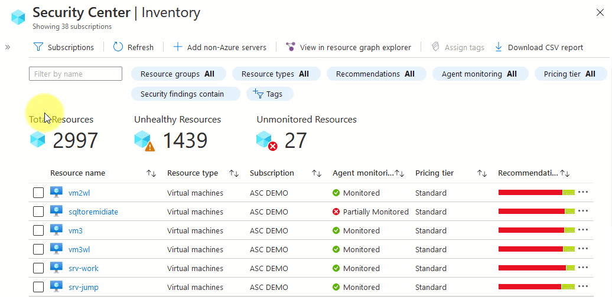
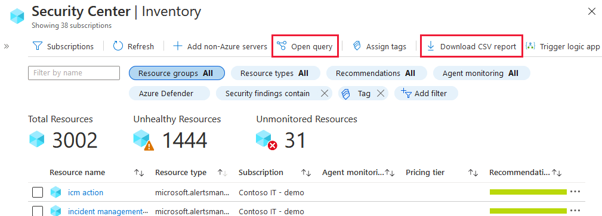

# Explore and manage your resources with asset inventory and management tools

The asset inventory page of Azure Security Center provides a single page for full visibility of the resources you've connected to Security Center. You can use this view and its filters to address such questions as:

- Which of my subscriptions are on Security Center's standard tier?
- Which of my machines with the tag 'Production' are missing the Log Analytics agent?
- How many of my machines are tagged with a specific tag?
- How many resources in a specific resource group have high severity security alerts​?

The asset management possibilities for this tool are substantial and continue to grow. 

## Availability

|Aspect|Details|
|----|:----|
|Release state:|Preview|
|Pricing:|Free|
|Required roles and permissions:|All users|
|Clouds:| Commercial clouds  National/Sovereign (US Gov, China Gov, Other Gov)|
|||

## How does asset inventory work?

Asset inventory utilizes [Azure Resource Graph (ARG)](https://docs.microsoft.com/azure/governance/resource-graph/), the Azure service that stores all of ASC's security posture data.

ARG is designed to provide efficient resource exploration with the ability to query at scale across multiple subscriptions. Using the [Kusto Query Language (KQL)](https://docs.microsoft.com/azure/data-explorer/kusto/query/), asset inventory can quickly and produce deep insights by cross-referencing ASC data with other resource properties.

## What are the key features of asset inventory?

The inventory page provides the following tools:

- **Filters** - The multiple filters at the top of the page provide a way to quickly refine the list of resources according to the question you're trying to answer. For example, if you wanted to answer the question *Which of my machines with the tag 'Production' are missing the Log Analytics agent?* you could combine the **Agent monitoring** filter with the **Tags** filter as shown in the following clip:

    

- **Export options** - Inventory provides the option to export the results of your selected filter options to a CSV file. In addition, you can export the query itself to Azure Resource Graph Explorer to further refine, save, or modify the KQL query.

    

    > [!TIP]
    > The KQL documentation provides a database with some sample data together with some simple queries to get the "feel" for the language. [Learn more in this KQL tutorial](https://docs.microsoft.com/azure/data-explorer/kusto/query/tutorial?pivots=azuredataexplorer).

- **Asset management options** - Inventory lets you perform complex discovery queries. When you've found the resources that match your queries, inventory provides shortcuts for operations such as:

    - Upgrade a subscription from free to standard tier - open the context menu on a subscription to upgrade 
    - Assign tags to the filtered resources - select the checkboxes alongside the resources you want to tag
    - Onboard new servers to Security Center - use the **Add non-Azure servers** toolbar button

- **Page refresh** - If you've defined some filters and left the page open, Security Center won't update the results automatically. Any changes to resources won't impact the displayed results unless manually reload the page or select **Refresh**.

## How to use asset inventory

1. From Security Center's sidebar, select **Inventory**.

1. Optionally, to display a specific resource enter the name in the **Filter by name** box.

1. Define the filters to create the specific query you want to perform.

    

    By default, the resources are sorted by the number of active security recommendations.

1. To further examine the results of your query, select the resources that interest you.

## Next steps

This article described the suppression rules in Azure Security Center that automatically dismiss unwanted alerts.

For more information on security alerts in Azure Security Center, see the following pages:

- [Security alerts and the intent kill chain](alerts-reference.md) - A reference guide for the security alerts you might see in Azure Security Center's Threat Protection module.
- [Threat protection in Azure Security Center](threat-protection.md) - A description of the many aspects of your environment monitored by Azure Security Center's Threat Protection module.