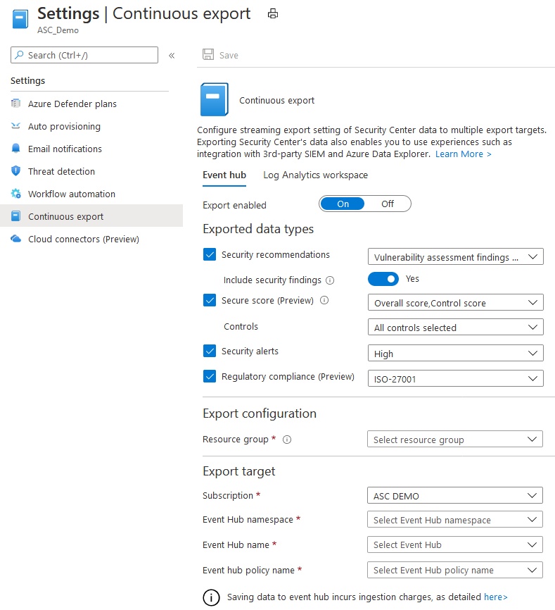
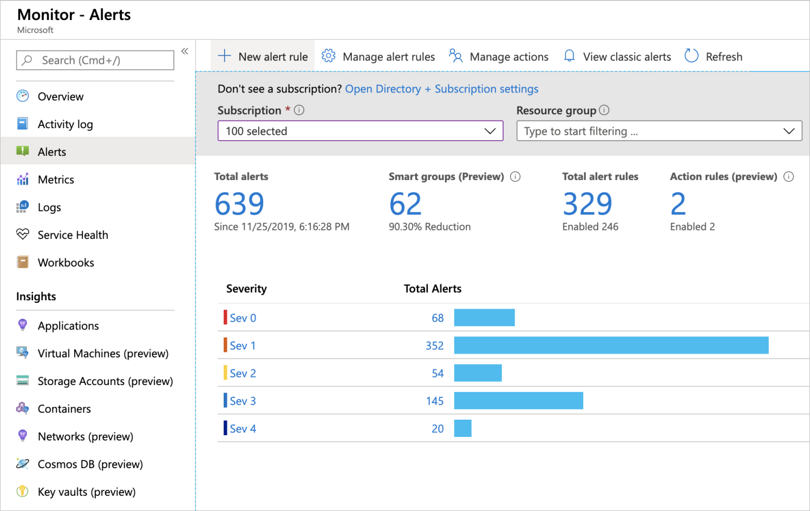
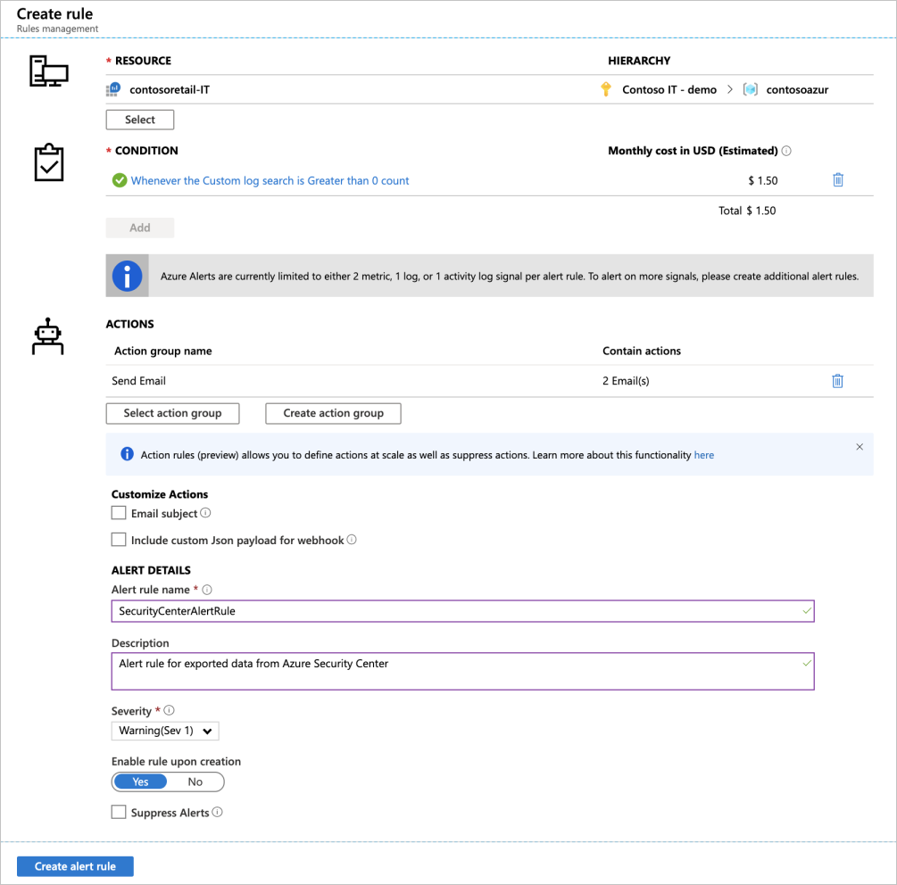
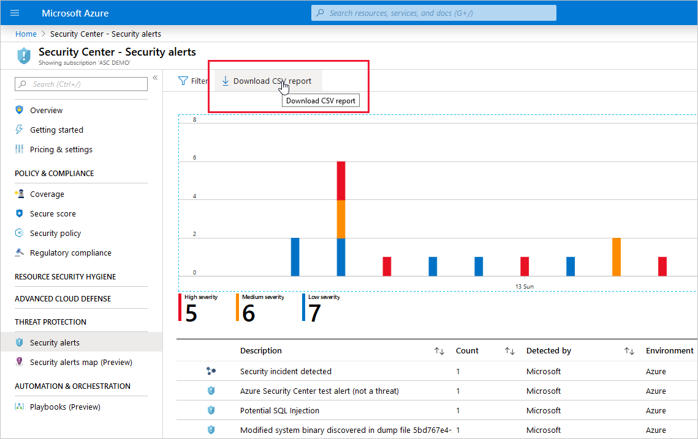

# Export security alerts and recommendations

Azure Security Center generates detailed security alerts and recommendations. You can view them in the portal or through programmatic tools. You may also need to export this information or send it to other monitoring tools in your environment. 

This article describes the set of tools that allow you to export alerts and recommendations either manually or in an ongoing, continuous fashion.

Using these tools you can:

* Continuously export to Log Analytics workspaces
* Continuously export to Azure Event Hubs (for integrations with third-party SIEMs)
* Export to CSV (one time)

## Availability

|Aspect|Details|
|----|:----|
|Release state:|Generally Available|
|Pricing:|Free tier|
|Required roles and permissions:|**Security admin role** on the resource group (or **Owner**) Must also have write permissions for the target resource|
|Clouds:| Commercial clouds  US Gov  China Gov (to Event Hub), Other Gov|
|||

## Set up a continuous export

The steps below are necessary whether you're setting up a continuous export to Log Analytics workspace or Azure Event Hubs.

1. From Security Center's sidebar, select **Pricing & settings**.

1. Select the specific subscription for which you want to configure the data export.
    
1. From the sidebar of the settings page for that subscription, select **Continuous Export**.

    
    Here you see the export options. There's a tab for each available export target. 

1. Select the data type you'd like to export and choose from the filters on each type (for example, export only high severity alerts).

1. Optionally, if your selection includes one of these four recommendations, you can include the vulnerability assessment findings together with them:

    - Vulnerability Assessment findings on your SQL databases should be remediated
    - Vulnerability Assessment findings on your SQL servers on machines should be remediated (Preview)
    - Vulnerabilities in Azure Container Registry images should be remediated (powered by Qualys)
    - Vulnerabilities in your virtual machines should be remediated

    To include the findings with these recommendations, enable the **include security findings** option.

    :::image type="content" source="./media/continuous-export/include-security-findings-toggle.png" alt-text="Include security findings toggle in continuous export configuration" :::

1. From the "Export target" area, choose where you'd like the data saved. Data can be saved in a target on a different subscription (for example on a Central Event Hub instance or a central Log Analytics workspace).

1. Select **Save**.

## Set up continuous export via the REST API

The continuous export feature can be configured and managed via the Azure Security Center [automations API](https://docs.microsoft.com/rest/api/securitycenter/automations). Use this API to create or update automations for exporting to any of the following possible destinations:

- Azure Event Hub
- Log Analytics workspace
- Azure Logic Apps 

The API provides additional functionality not available from the Azure portal, for example:

* **Greater volume** - The API allows you to create multiple export configurations on a single subscription. The **Continuous Export** page in Security Center's portal UI supports only one export configuration per subscription.

* **Additional features** - The API offers additional parameters that aren't shown in the UI. For example, you can add tags to your automation resource as well as define your export based on a wider set of alert and recommendation properties than those offered in the **Continuous Export** page in Security Center's portal UI.

* **More focused scope** - The API provides a more granular level for the scope of your export configurations. When defining an export with the API, you can do so at the resource group level. If you're using the **Continuous Export** page in Security Center's portal UI, you have to define it at the subscription level.

    > [!TIP]
    > If you've setup multiple export configurations using the API, or if you've used API-only parameters, those extra features will not be displayed in the Security Center UI. Instead, there'll be a banner informing you that other configurations exist.

Learn more about the automations API in the [REST API documentation](https://docs.microsoft.com/rest/api/securitycenter/automations).

## Configure SIEM integration via Azure Event Hubs

Azure Event Hubs is a great solution for programatically consuming any streaming data. For Azure Security Center alerts and recommendations, it's the preferred way to integrate with a third-party SIEM.

> [!NOTE]
> The most effective method to stream monitoring data to external tools in most cases is using Azure Event Hubs. [This article](https://docs.microsoft.com/azure/azure-monitor/platform/stream-monitoring-data-event-hubs) provides a brief description for how you can stream monitoring data from different sources to an Event Hub and links to detailed guidance.

> [!NOTE]
> If you previously exported Security Center alerts to a SIEM using Azure Activity log, the procedure below replaces that methodology.

To view the event schemas of the exported data types, visit the [Event Hub event schemas](https://aka.ms/ASCAutomationSchemas).

### To integrate with a SIEM 

After you have configured continuous export of your chosen Security Center data to Azure Event Hubs, you can set up the appropriate connector for your SIEM:

* **Azure Sentinel** - Use the native Azure Security Center alerts [data connector](https://docs.microsoft.com/azure/sentinel/connect-azure-security-center) offered there.
* **Splunk** - Use the [Azure Monitor Add-On for Splunk](https://github.com/Microsoft/AzureMonitorAddonForSplunk/blob/master/README.md)
* **IBM QRadar** - Use [a manually configured log source](https://www.ibm.com/support/knowledgecenter/SS42VS_DSM/com.ibm.dsm.doc/t_dsm_guide_microsoft_azure_enable_event_hubs.html)
* **ArcSight** – Use [SmartConnector](https://community.microfocus.com/t5/ArcSight-Connectors/SmartConnector-for-Microsoft-Azure-Monitor-Event-Hub/ta-p/1671292)

Also, if you'd like to move the continuously exported data automatically from your configured Event Hub to Azure Data Explorer, use the instructions in [Ingest data from Event Hub into Azure Data Explorer](https://docs.microsoft.com/azure/data-explorer/ingest-data-event-hub).

## Continuous export to a Log Analytics workspace

If you want to analyze Azure Security Center data inside a Log Analytics workspace or use Azure alerts together with Security Center, setup continuous export to your Log Analytics workspace.

To export to a Log Analytics workspace, you must have Security Center's Log Analytics solutions enabled on your workspace. If you're using the Azure portal, Security Center's free tier solution is automatically enabled when you enable continuous export. However, if you're configuring your continuous export settings programmatically, you must manually turn Azure Defender on or off from within the **Pricing & settings** page.

### Log Analytics tables and schemas

Security alerts and recommendations are stored in the *SecurityAlert* and *SecurityRecommendations* tables respectively. The name of the Log Analytics solution containing these tables depends on whether you are on the free or standard tier (see [pricing](security-center-pricing.md)): Security('Security and Audit') or SecurityCenterFree.

To view the event schemas of the exported data types, visit the [Log Analytics table schemas](https://aka.ms/ASCAutomationSchemas).

###  View exported security alerts and recommendations in Azure Monitor

In some cases, you may choose to view the exported Security Alerts and/or recommendations in [Azure Monitor](https://docs.microsoft.com/azure/azure-monitor/platform/alerts-overview). 

Azure Monitor provides a unified alerting experience for a variety of Azure alerts including Diagnostic Log, Metric alerts, and custom alerts based on Log Analytics workspace queries.

To view alerts and recommendations from Security Center in Azure Monitor, configure an Alert rule based on Log Analytics queries (Log Alert):

1. From Azure Monitor's **Alerts** page, select **New alert rule**.

    

1. In the create rule page, configure your new rule (in the same way you'd configure a [log alert rule in Azure Monitor](https://docs.microsoft.com/azure/azure-monitor/platform/alerts-unified-log)):

    * For **Resource**, select the Log Analytics workspace to which you exported security alerts and recommendations.

    * For **Condition**, select **Custom log search**. In the page that appears, configure the query, lookback period, and frequency period. In the search query, you can type *SecurityAlert* or *SecurityRecommendation* to query the data types that Security Center continuously exports to as you enable the Continuous export to Log Analytics feature. 
    
    * Optionally, configure the [Action Group](https://docs.microsoft.com/azure/azure-monitor/platform/action-groups) that you'd like to trigger. Action groups can trigger email sending, ITSM tickets, WebHooks, and more.
    

You'll now see new Azure Security Center alerts or recommendations (depending on your configuration) in Azure Monitor alerts, with automatic triggering of an action group (if provided).

## Manual one-time export of security alerts

To download a CSV report for alerts or recommendations, open the **Security alerts** or **Recommendations** page and select the **Download CSV report** button.

> [!NOTE]
> These reports contain alerts and recommendations for resources from the currently selected subscriptions.

## FAQ - Continuous export

### What are the costs involved in exporting data?

There is no cost for enabling a continuous export. Costs might be incurred for ingestion and retention of data in your Log Analytics workspace, depending on your configuration there. 

Learn more about [Log Analytics workspace pricing](https://azure.microsoft.com/pricing/details/monitor/).

Learn more about [Azure Event Hub pricing](https://azure.microsoft.com/pricing/details/event-hubs/).

## Next steps

In this article, you learned how to configure continuous exports of your recommendations and alerts. You also learned how to download your alerts data as a CSV file. 

For related material, see the following documentation: 

- [Azure Event Hubs documentation](https://docs.microsoft.com/azure/event-hubs/)
- [Azure Sentinel documentation](https://docs.microsoft.com/azure/sentinel/)
- [Azure Monitor documentation](https://docs.microsoft.com/azure/azure-monitor/)
- [Workflow automation and continuous export data types schemas](https://aka.ms/ASCAutomationSchemas)
