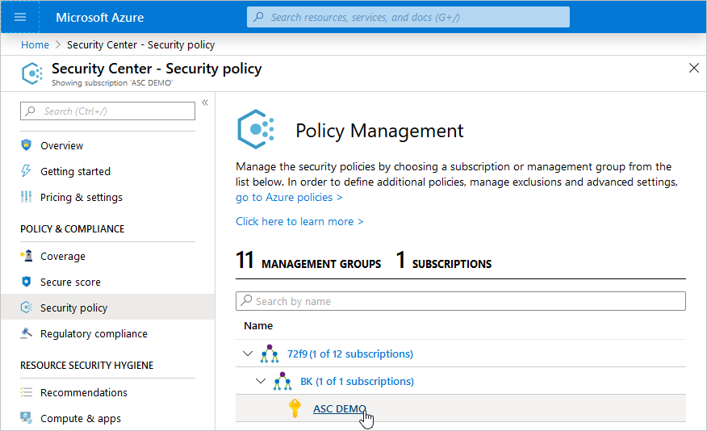
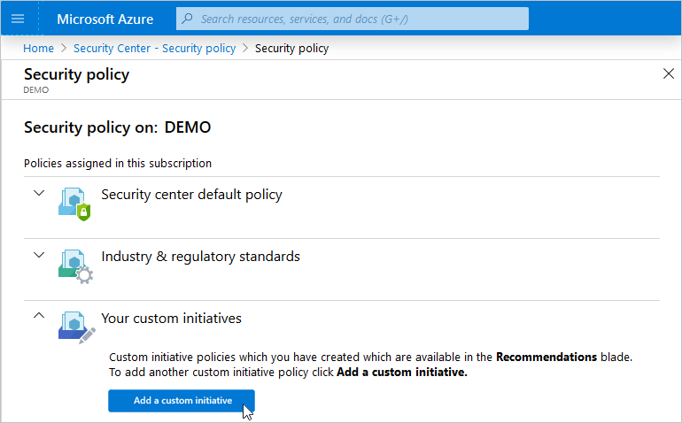

# Using custom security policies (Preview)

To help secure your systems and environment, Azure Security Center generates security recommendations. These recommendations are based on industry best practices, which are incorporated into the generic, default security policy supplied to all customers. They can also come from Security Center's knowledge of industry and regulatory standards.

With this preview feature, you can add your own *custom* initiatives. You'll then receive recommendations if your machines don't follow the policies you create.

## To add a custom initiative to your subscription 

1. From Security Center's sidebar, open the **Security policy** page.

1. Select a subscription or Management Group to which you would like to add a custom initiative.

    

    > [!NOTE]
    > When you add a custom standard, it assigns an *initiative* to that scope. We therefore recommend that you select the widest scope required for that assignment. 

1. In the Security policy page, under Your custom initiatives (Preview), click **Add a custom initiative**.

    

    The following page appears:

    

1. In the Add custom initiatives page, review the list of custom policies already created in your organization. If you see one you want to add to your subscription, click **Add**. If there isn't an initiative in the list that meets your needs, skip this step.

1. To create a new custom initiative:

    1. Click **Create new**.
    1. Enter the definition's location and name.
    1. Select the policies to include and click **Add**.
    1. Enter any desired parameters.
    1. Click **Save**.
    1. In the Add custom initiatives page, click refresh and your new initiative will be shown as available.
    1. Click **Add** to add it to your subscription.

    > [!NOTE]
    > Creating new initiatives requires subscription owner credentials. For more information about Azure roles, see [Permissions in Azure Security Center](security-center-permissions.md).

1. To see the resulting recommendations for your policy, click **Recommendations** from the sidebar to open the recommendations page. The recommendations will appear with a “Custom” label and be available for up to 30 minutes.

    

## Next steps

In this article, you learned how to create custom security policies. 

For other related material, see the following articles: 

- [The overview of security policies](tutorial-security-policy.md)
- [A list of the built-in security policies](security-center-policy-definitions.md)