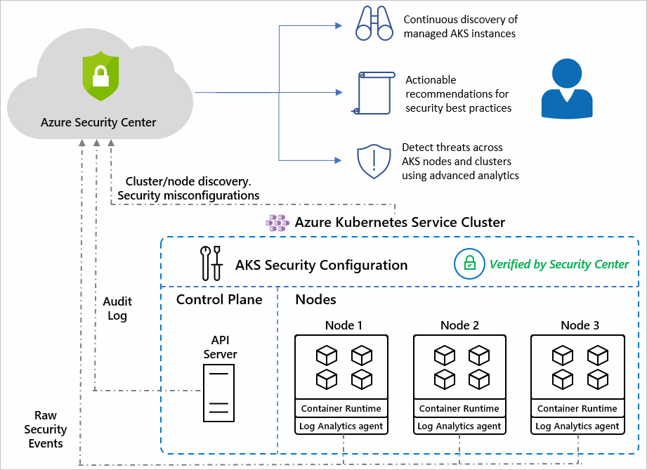

# Introduction to Azure Defender for Kubernetes

Azure Kubernetes Service (AKS) is Microsoft's managed service for developing, deploying, and managing containerized applications.

Enable **Azure Defender for Kubernetes** in Azure Security Center to gain deeper visibility into your AKS nodes, cloud traffic, and security controls.

Together, Azure Security Center and AKS form the best cloud-native Kubernetes security offering.

Using the two services together provides:

* **Security recommendations** - Security Center identifies your AKS resources and categorizes them: from clusters to individual virtual machines. You can then view security recommendations per resource. For more information, see the containers recommendations in the [reference list of recommendations](recommendations-reference.md#recs-containers). 

* **Environment hardening** - Security Center constantly monitors the configuration of your Kubernetes clusters and Docker configurations. It then generates security recommendations that reflect industry standards.

* **Run-time protection** - Through continuous analysis of the following AKS sources, Security Center alerts you to threats and malicious activity detected at the host *and* AKS cluster level.

## What are the components of Security Center's Kubernetes protection?

[!INCLUDE [AKS in ASC threat protection](../../includes/security-center-azure-kubernetes-threat-protection.md)]

## How does Security Center's Kubernetes protection work?

## Azure Defender for Kubernetes - FAQ

### Can I still get AKS protections without the Log Analytics agent?

As mentioned above, the optional Kubernetes bundle provides protections at the cluster level, the Log Analytics agent of Azure Security Center standard tier protect your nodes. 

We recommend deploying both, for the most complete protection possible.

If you choose not to install the agent on your hosts, you will only receive a subset of the threat protection benefits and security alerts. You'll still receive alerts related to network analysis and communications with malicious servers.

## Next steps

In this article, you learned about Security Center's Kubernetes protection including Azure Defender for Kubernetes. 

For related material, see the following articles: 

- Whether an alert is generated by Security Center, or received by Security Center from a different security product, you can export it. To export your alerts to Azure Sentinel, any third-party SIEM, or any other external tool, follow the instructions in [Exporting alerts to a SIEM](continuous-export.md).
- For a list of the Azure App Service alerts, see the [Reference table of alerts](alerts-reference.md#alerts-azureappserv).
- For more information on App Service plans, see [App Service plans](https://azure.microsoft.com/pricing/details/app-service/plans/).
- > [!div class="nextstepaction"]
    > [Enable Azure Defender](security-center-pricing.md)