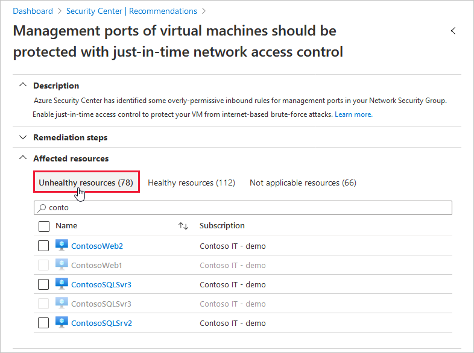

# Understanding just-in-time (JIT) VM access

This page explains the principles behind Azure Security Center's just-in-time (JIT) VM access feature and the logic behind the recommendation.

To learn how to apply JIT to your VMs using the Azure Portal (either Security Center or Azure Virtual Machines) or programatically, see [How to secure your management ports with JIT](security-center-just-in-time.md).

## The risk of open management ports on a virtual machine

Threat actors actively hunt accessible machines with open management ports, like RDP or SSH. All of your virtual machines are potential targets for an attack. When a VM is successfully compromised, it's used as the entry point to attack further resources within your environment.

## Why just-in-time (JIT) virtual machine (VM) access is the solution 

As with all cybersecurity prevention techniques, your goal should be to reduce the attack surface. In this case, that means having fewer open ports, especially management ports.

Your legitimate users also use these ports, so it's not practical to keep them closed.

To solve this dilemma, Azure Security Center offers JIT. With JIT, you can lock down the inbound traffic to your VMs, reducing exposure to attacks while providing easy access to connect to VMs when needed.

## How JIT operates with network security groups and Azure Firewall

When just-in-time is enabled, Security Center creates "deny all inbound traffic" rules for the selected ports in the [network security group](https://docs.microsoft.com/azure/virtual-network/security-overview#security-rules) (NSG) and [Azure Firewall rules](https://docs.microsoft.com/azure/firewall/rule-processing). So the NSG rule, locks down inbound traffic to your Azure VMs by restricting access to management ports and defending them from attack. You can select the ports on the VM to which inbound traffic will be blocked. If other rules already exist for the selected ports, then the existing rules take priority over the new "deny all inbound traffic" rules. If there are no existing rules on the selected ports, then the new rules take top priority in the NSG and Azure Firewall.

When a user requests access to a VM, Security Center checks that the user has [Role-Based Access Control (RBAC)](https://docs.microsoft.com/azure/role-based-access-control/role-assignments-portal) permissions for that VM. If the request is approved, Security Center configures the NSGs and Azure Firewall to allow inbound traffic to the selected ports from the relevant IP address (or range), for the amount of time that was specified. After the time has expired, Security Center restores the NSGs to their previous states. Connections that are already established are not interrupted.

> [!NOTE]
> JIT does not support VMs protected by Azure Firewalls controlled by [Azure Firewall Manager](https://docs.microsoft.com/azure/firewall-manager/overview).

## How does Security Center identify VMs that should have JIT applied?

The diagram below shows the logic that Security Center applies when deciding how to categorize your ARM deployed VMs that are on the standard pricing tier: 

When Security Center finds a machine that can benefit from JIT, it adds that machine to the recommendation's **Unhealthy resources** tab. 

## Next steps

This page explained _why_ just-in-time (JIT) virtual machine (VM) access should be used. Advance to the how-to article to learn how to apply JIT to your machines:

> [!div class="nextstepaction"]
> [How to secure your management ports with JIT](security-center-just-in-time.md)
