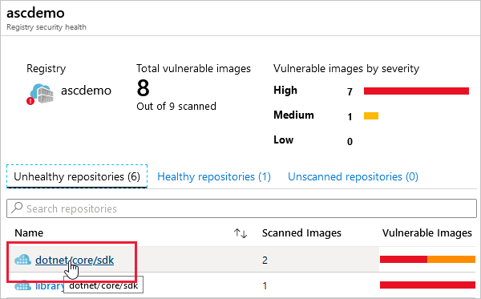
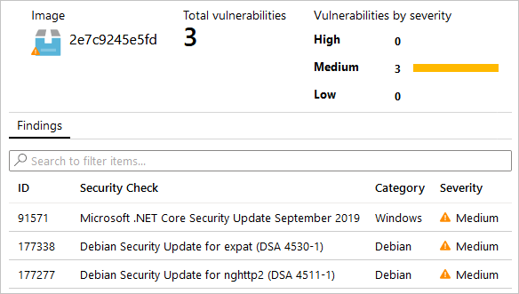
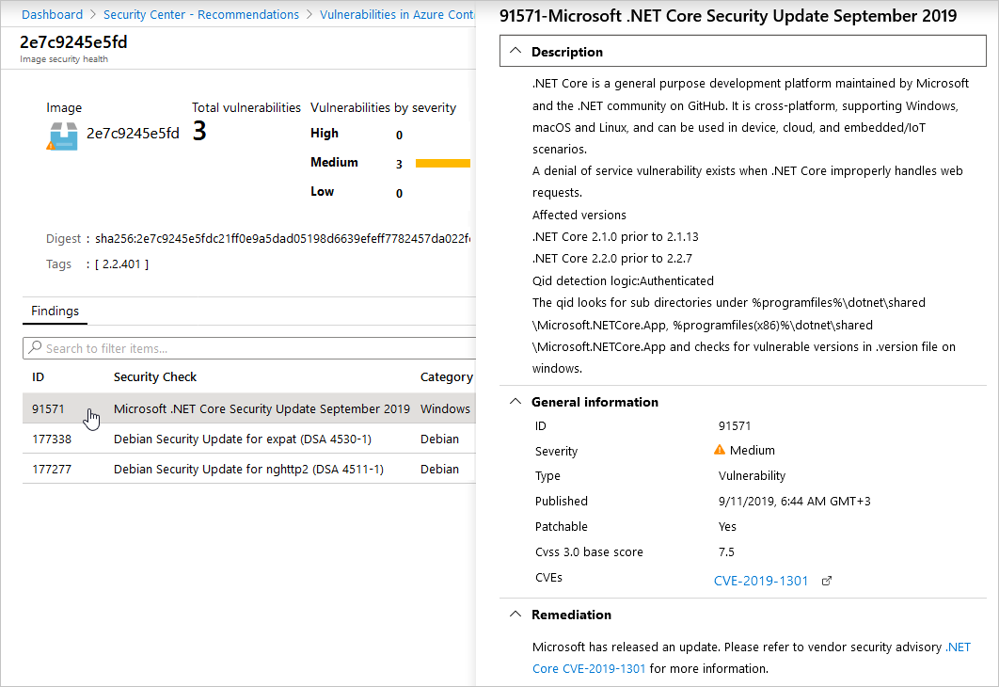
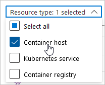

# Monitoring the security of your containers

This page explains how to use the container security features described in the [Container Security article](container-security.md) in our concepts section.

Azure Security Center covers the following three aspects of container security:

- **Vulnerability management** - If you're on Security Center's standard pricing tier (see [pricing](/azure/security-center/security-center-pricing)), you can scan your ARM-based Azure Container Registry every time a new image is pushed. The scanner (powered by Qualys) presents findings as Security Center recommendations.
    For detailed instructions, see [Scanning your container registries for vulnerabilities](#scanning-your-container-registries-for-vulnerabilities) below.

- **Hardening of the container's environment** - Security Center finds unmanaged containers hosted on IaaS Linux VMs or other Linux machines running Docker, and continuously compares the containers' configurations with the Center for Internet Security (CIS) Docker Benchmark. Security Center alerts you if your containers don't satisfy any of the controls. Continuous monitoring for security risks due to misconfigurations is a crucial component of any security program. 
    For detailed instructions, see [Hardening your containers' hosts](#hardening-your-containers-hosts) below.

- **Runtime protection** - If you're on Security Center's standard pricing tier, you'll get real-time threat detection for your containerized environments. Security Center generates alerts for suspicious activities at the host and AKS cluster level.

See below for explanations of how to use each of these features.  

## Scanning your ARM-based container registries for vulnerabilities 

1. To enable vulnerability scans of your Azure Container Registry images:

    1. Ensure you're on Azure Security Center's standard pricing tier.

    1. From the **Pricing & settings** page, enable the optional Container Registries bundle for your subscription:
    

        Security Center is now ready to scan images that get pushed to the registry. 

        >[!NOTE]
        >This feature is charged per image.

1. To trigger the scan of an image, push it to your registry. 

    When the scan completes (typically after approximately 10 minutes), findings are available in Security Center recommendations.
    

1. To view the findings, go to the **Recommendations** page. If issues were found, you'll see the following recommendation:

    

1. Select the recommendation. 
    The recommendation details page opens with additional information. This information includes the list of registries with vulnerable images ("Affected resources") and the remediation steps. 

1. Select a specific registry to see the repositories within it that have vulnerable repositories.

    

    The registry details page opens with the list of affected repositories.

1. Select a specific repository to see the repositories within it that have vulnerable images.

    

    The repository details page opens. It lists the vulnerable images together with an assessment of the severity of the findings.

1. Select a specific image to see the vulnerabilities.

    

    The list of findings for the selected image opens.

    

1. To learn more about a finding, select the finding. 

    The findings details pane opens.

    

    This pane includes a detailed description of the issue and links to external resources to help mitigate the threats.

1. Follow the steps in the remediation section of this pane.

1. When you have taken the steps required to remediate the security issue, replace the image in your registry:

    1. Push the updated image. This will trigger a scan. 
    
    1. Check the recommendations page for the recommendation "Vulnerabilities in Azure Container Registry images should be remediated". 
    
        If the recommendation still appears and the image you've handled still appears in the list of vulnerable images, check the remediation steps again.

    1. When you are sure the updated image has been pushed, scanned, and is no longer appearing in the recommendation, delete the “old” vulnerable image from your registry.

## Hardening your containers' hosts

Security Center constantly monitors the configuration of your Kubernetes clusters and Docker configurations, and generates security recommendations that reflect industry standards.

To view Azure Security Center's security recommendations for your containers' hosts:

1. From the Security Center navigation bar, open **Compute & apps** and select the **Containers** tab.

1. Optionally, filter the list of your container resources to container hosts.

    

1. From the list of your container host machines, select one to investigate further.

    

    The **Container host information page** opens with details of the host and a list of recommendations.

1. From the recommendations list, select a recommendation to investigate further.

    

1. Optionally, read the description, information, threats, and remediation steps. 

1. Select **Take Action** at the bottom of the page.

    

    Log Analytics opens with a custom operation ready to run. The default custom query includes a list of all failed rules that were assessed, along with guidelines to help you resolve the issues.

    

1. Tweak the query parameters and select **Run** when you're sure it's ready for your host. 

## Responding to real-time threat detection

Placeholder text.
Placeholder text.
Placeholder text.
Placeholder text.

## Next steps

In this article, you learned how to use Security Center's container security features. 

For other related material, see the following pages: 

- [Security Center recommendations for containers](recommendations-reference.md#recs-containers)
- [Alerts for AKS cluster level](alerts-reference.md#alerts-akscluster)
- [Alerts for Container host level](alerts-reference.md#alerts-containerhost)
