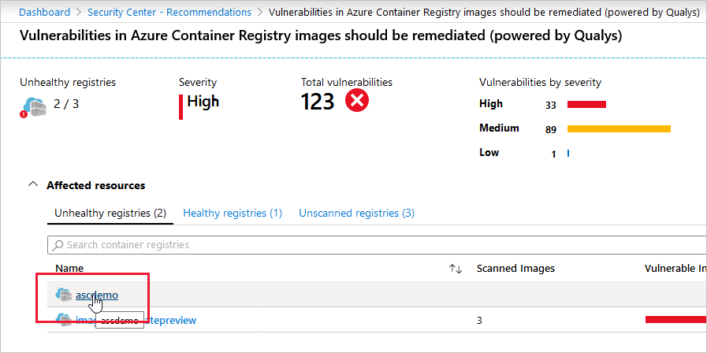

# Monitoring the security of your containers

This page explains how to use the container security features described in the [Container Security article](container-security.md) in our concepts section.

Azure Security Center covers the following three aspects of container security:

- **Vulnerability management** - If you're on Security Center's standard pricing tier (see [pricing](/azure/security-center/security-center-pricing)), you can scan your Azure Container Registry every time a new image is pushed. The scanner (powered by Qualys) presents findings as Security Center [recommendations for containers](recommendations-reference.md#recs-containers).

- **Hardening of the container's environment** - Security Center identifies unmanaged containers hosted on IaaS Linux VMs, or other Linux machines running Docker. Security Center continuously compares the containers' configurations with the [Center for Internet Security (CIS) Docker Benchmark](https://www.cisecurity.org/benchmark/docker/)) and alerts you if your containers don't satisfy any of the controls.

- **Runtime protection** - If you're on Security Center's standard pricing tier, you can utilise  real-time threat detection for your containerized environments. Security Center generates alerts for suspicious activities at the host and AKS cluster level.

See below for explanations of how to use each of these features.  

## How to use container vulnerability scanning

1. To enable vulnerability scans of your Azure Container Registry images:

    1. Ensure you're on Azure Security Center's standard pricing tier.
    1. From the **Pricing & settings** page, enable the optional Container Registries bundle for your subscription:
    
    Security Center is now ready to scan images that get pushed to the registry. 

        > [!NOTE]
        > This feature is charged per image.

1. To trigger the scan of an image, push it to your registry. 

    When the scan completes (typically after approximately 10 minutes), findings are available in Security Center recommendations.
    

1. To view the findings, go to the **Recommendations** page. If issues were found, you'll see the following recommendation:

    

1. Select the recommendation. 
    The recommendation details page appears with additional information including the list of registries with vulnerable images ("Affected resources") and the remediation steps. 

1. Select a specific registry to see the repositories within it that have vulnerable repositories.

    

    The registry details page appears with the list of affected repositories.

1. Select a specific repository to see the repositories within it that have vulnerable images.

    

    The repository details page appears with the list of vulnerable images together with an assessment of the severity of the findings.

1. Select a specific image to see the vulnerabilities.

    

    The list of findings for the selected image appears.

    

1. To learn more about a finding, select the finding. 

    The findings details pane opens.

    

    This pane includes a detailed description of the issue as well as links to external resources to mitigate the threats.

## How to use the container environment hardening tools

##

## Next steps

In this article, you learned [x]]. 

For other related material, see the following articles: 

- [title](page.md)
- [title](page.md)
- [title](page.md)
