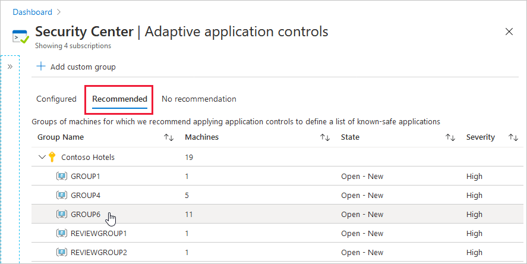
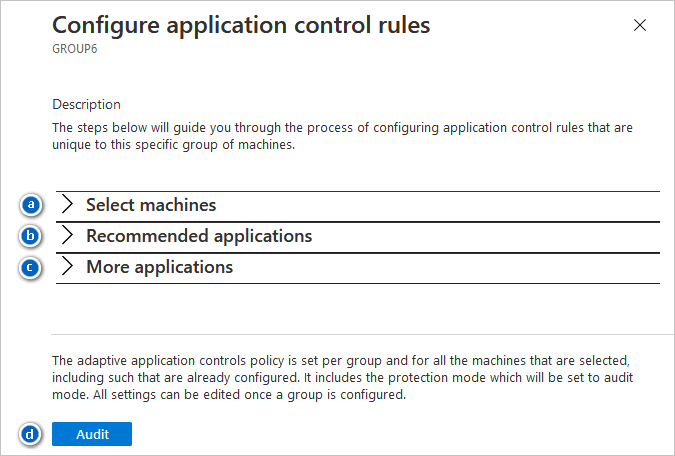
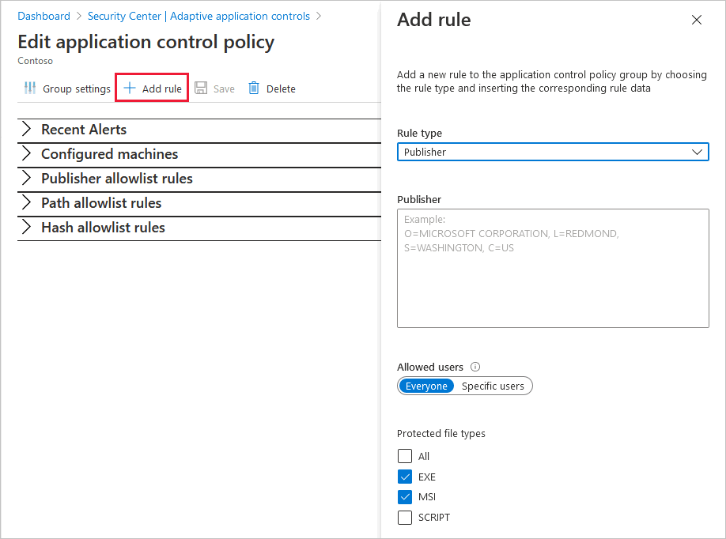
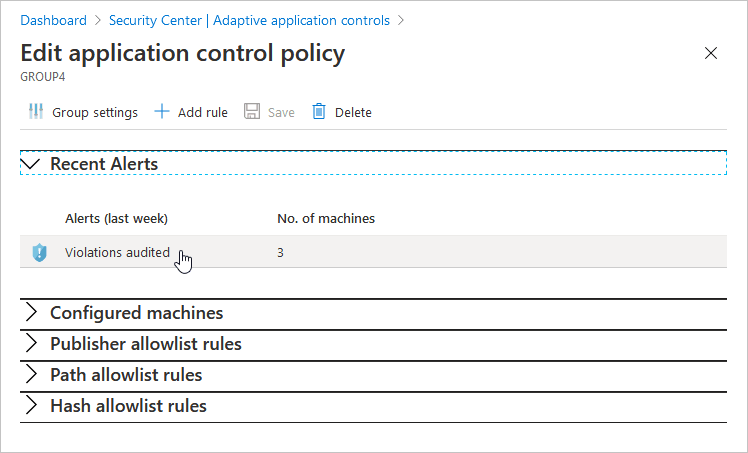

# Use adaptive application controls to reduce your machines' attack surfaces

Learn about the benefits of Azure Security Center's adaptive application controls and how you can enhance your security with this data-driven, intelligent feature.

## What are Security Center's adaptive application controls?

Adaptive application controls are an intelligent and automated solution for defining which applications should run on your machines. 

Often, organizations have collections of stable machines that routinely run the same processes. Security Center uses machine learning to analyze the applications running on your machines and create a list of the known-safe software. Allow lists are based on your specific Azure workloads, and you can further customize the recommendations using the instructions below.

When you've enabled and configured adaptive application controls, you'll get security alerts if any process runs other than the ones you've defined as safe.

## What are the benefits of adaptive application controls?

By defining lists of known-safe applications, and generating alerts when anything else is executed, you can achieve multiple hardening goals:

- Identify potential malware, even any that might be missed by antimalware solutions
- Improve compliance with local security policies that dictate the use of only licensed software
- Avoid running old or unsupported applications
- Prevent specific software that's banned by your organization
- Increase oversight of apps that access sensitive data

## Availability

- Release state: **General availability**
- Pricing: **Standard tier**
- Supported VMs: Azure and non-Azure machines running Windows and Linux
- Required roles and permissions:
    - **Security Reader** and **Reader** roles can both view groups and the lists of known-safe applications
    - **Contributor** and **Security Admin** roles can both edit groups and the lists of known-safe applications
- Clouds: 
    - ✔ Commercial clouds
    - ✔ National/Sovereign (US Gov, China Gov, Other Gov)

## Enable adaptive application controls on a group of machines

If Security Center has identified groups of stable machines in your subscriptions that run a similar set of processes, you'll be prompted with the following recommendation: **Adaptive application controls for defining safe applications should be enabled on your machines**.

Select that recommendation, or open the adaptive application controls page to view the list of suggested known-safe processes and groups of machines.

1. From Security Center's menu, select **Adaptive application controls**.

    The **Adaptive application controls** page opens with your VMs grouped into the following tabs:

    - **Configured** - Groups of machines that already have a defined allow list of applications. For each group, the configured tab shows:
        - the number of machines in the group
        - recent alerts

    - **Recommended** - Groups of machines without a defined allow list of applications, but that can support this feature. We recommend that you enable adaptive application controls for these groups. 
    
      > [!TIP]
      > Security Center needs at least two weeks of data to define the unique recommendations per group of machines. Machines that have recently been created, or which belong to subscriptions that were only recently enabled with standard tier, will appear under the *no recommendation* tab.

    - **No recommendation** - Groups of machines without a defined allow list of applications, and which don't support the feature. Your machine might be in this tab for the following reasons:
      - The list of applications and processes is unstable and Security Center can't see a pattern
      - It's missing a Log Analytics agent
      - The Log Analytics agent isn't sending events
      - The machine has a pre-existing [AppLocker](https://docs.microsoft.com/windows/security/threat-protection/windows-defender-application-control/applocker) policy enabled by either a GPO or a local security policy

1. Open the **Recommended** tab. The groups of machines with recommended allow lists appears.

   

1. Select a group. 

1. To configure your new rule, review the various sections of this **Configure application control rules** page and the contents, which will be unique to this specific group of machines:

   

   1. **Select machines** - By default, all machines in the identified group are selected. Unselect any to removed them from this rule.
   
   1. **Recommended applications** - Review this list of applications that are common to the machines within this group, and recommended to be allowed to run.
   
   1. **More applications** - Review this list of applications that are either seen less frequently on the machines within this group, or are known to be exploitable. A warning icon indicates that a specific application could be used by an attacker to bypass an application allow list. We recommend that you carefully review these applications.

      > [!TIP]
      > Both application lists include the option to restrict a specific application to certain users. Adopt the principle of least privilege whenever possible.
      > 
      > Applications are defined by their publishers, if an application doesn’t have publisher information (it's unsigned), a path rule is created for the full path of the specific application.

   1. To apply the rule, select **Audit**. 

## Editing a group's adaptive application controls rule

You might decide to edit the allow list for a group of machines because of known changes in your organization. 

To edit the rules for a group of machines:

1. From Security Center's menu, select **Adaptive application controls**.

1. From the **recommended** tab, select the group with the rule you want to edit.

1. Review the various sections of the **Configure application control rules** page as described in [Enable adaptive application controls on a group of machines](#enable-adaptive-application-controls-on-a-group-of-machines).

1. Optionally, add one or more custom rules:

   1. Select **Add rule**.

      

   1. If you're defining a known safe path, change the **Rule type** to 'Path'. You can include wildcards in the path.
   
      > [!TIP]
      > Some scenarios for which wildcards in a path might be useful:
      > 
      > * Using a wildcard at the end of a path to allow all executables within this folder and sub-folders.
      > * Using a wildcard in the middle of a path to enable a known executable name with a changing folder name (for example, personal user folders containing a known executable, automatically generated folder names, etc).
  
   1. Define the allowed users and protected file types.

   1. When you've finished defining the rule, select **Add**.

1. To apply the changes, select **Save**.

## Responding to the "Allowlist rules in your adaptive application control policy should be updated" recommendation

This recommendation appears when Security Center's machine learning identifies potentially legitimate behavior that hasn't previously been allowed. The recommendation, prompts you to add new rules to the existing policy to reduce the number of false positive alerts.

To remediate the issues:

1. From the recommendations page, select the **Allowlist rules in your adaptive application control policy should be updated** recommendation to see groups with newly identified, potentially legitimate behavior.

1. Select the group with the rule you want to edit.

1. Review the various sections of the **Configure application control rules** page as described in [Enable adaptive application controls on a group of machines](#enable-adaptive-application-controls-on-a-group-of-machines).

1. To apply the changes, select **Audit**.

## Auditing alerts and violations

1. From Security Center's menu, select **Adaptive application controls**.

1. To see groups with machines that have recent alerts, review the groups listed in the **Configured** tab.

1. To investigate further, select a group.

   

1. For further details and the list of affected machines, select an alert.

## Move a machine from one group to another

When you move a machine from one group to another, the application control policy applied to it changes to the settings of the group that you moved it to. You can also move a machine from a configured group to a non-configured group, doing so removes any application control rules that were applied to the machine.

1. From the **Adaptive application controls** page, from the **Configured** tab, select the group containing the  machine to be moved.

1. Open the list of  **Configured machines**.

1. Open the machine's menu from three dots in the line of the row, and select **Move**. The **Move machine to a different group** pane opens.

1. Select the destination group, and select **Move machine**.

1. To save your changes, select **Save**.

## Managing your adaptive application controls via the REST API 

To manage your adaptive application controls programatically, use our REST API. 

The full API documentation is [here](https://docs.microsoft.com/rest/api/securitycenter/adaptiveapplicationcontrols).

Some of the functions that are available from the REST API:

* **List** retrieves all your group recommendations and provides a JSON with an object for each group.

* **Get** retrieves the JSON with the full recommendation data (that is, list of machines, publisher/path rules, and so on)

* **Put** configures your rule (use the JSON you retrieved with **Get** as the body for this request).
 
   > [!IMPORTANT]
   > The **Put** function expects fewer parameters than the JSON contains. Remove the following properties before using the JSON in the Put **request**: recommendationStatus , configurationStatus, issues, location, sourceSystem.

## Next steps
In this document, you learned how to use adaptive application control in Azure Security Center to define allow lists of applications running on your Azure and non-Azure VMs. To learn more about some of Security Center's other cloud workload protection features, see:

* [Understanding just-in-time (JIT) VM access](just-in-time-explained.md)
* [Securing your Azure Kubernetes clusters](azure-kubernetes-service-integration.md)