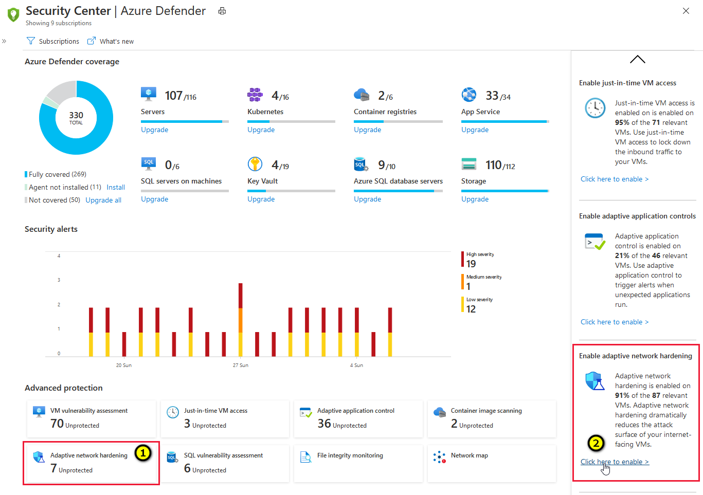
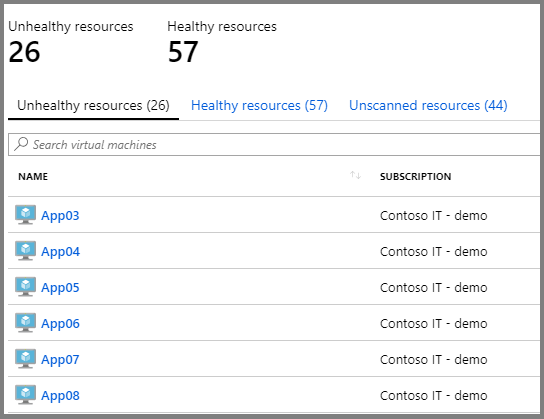
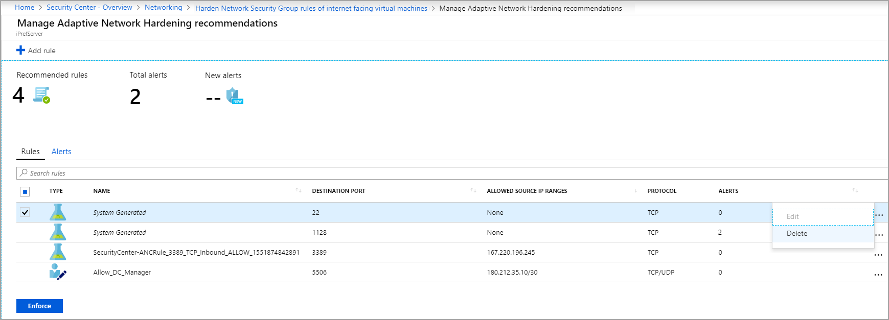

# Adaptive Network Hardening in Azure Security Center
Learn how to configure Adaptive Network Hardening in Azure Security Center.

## What is Adaptive Network Hardening?
Applying [network security groups (NSG)](https://docs.microsoft.com/en-us/azure/virtual-network/security-overview) to filter traffic to and from resources, improves your network security posture. However, there can still be some cases in which the actual traffic flowing through the NSG is a subset of the NSG rules defined. In these cases, further improving the security posture can be achieved by hardening the NSG rules, based on the actual traffic patterns.

Adaptive Network Hardening provides recommendations to further harden the NSG rules. It uses a machine learning algorithm that factors in actual traffic, known trusted configuration, threat intelligence, and other indicators of compromise, and then provides recommendations to allow traffic only from specific IP/port tuples.

For example, let’s say the existing NSG rule is to allow traffic from 140.20.30.10/24 on port 22. The Adaptive Network Hardening’s recommendation, based on the analysis, would be to narrow the range and allow traffic from 140.23.30.10/29 – which is a narrower IP range, and deny all other traffic to that port.

> [!NOTE]
Adaptive Network Hardening recommendations are supported on the following ports: 22, 3389, 21, 23, 445, 4333, 3306, 1433, 1434, 53, 20, 5985, 5986, 5432, 139, 66, 1128

## View Adaptive Network Hardening alerts and rules

1. In Security Center, select **Networking** -> **Adaptive Network Hardening**. The network VMs are listed under three separate tabs:
   * **Unhealthy resources**: VMs that currently have recommendations and alerts that were triggered by running the Adaptive Network Hardening algorithm. 
   * **Healthy resources: VMs without alerts and recommendations.
   * **Unscanned resources**: VMs that the Adaptive Network Hardening algorithm cannot be run on because of one of the following reasons:
      * **VMs are Classic VMs**: -Only ARM VMs are supported.
      * **Not enough data is available**: In order to generate accurate traffic hardening recommendations, Security Center requires at least 30 days of traffic data.
      * **VM is not protected by ASC standard**: Only VMs that are set to Security Center’s Standard pricing tier are eligible for this feature.

    

2. From the **Unhealthy resources** tab, select a VM to view it’s alerts and the recommended hardening rules to apply.

    

## Review and apply Adaptive Network Hardening recommended rules

1. From the **Unhealthy resources** tab, select a VM. The alerts and recommended hardening rules are listed.

  

  >[!NOTE]
The **Rules** tab lists the rules that Adaptive Network Hardening recommends you add. The **Alerts** tab lists the alerts that were generated due to traffic, flowing to the resource, which is not within the IP range allowed in the recommended rules.

   

2. If you want to change some of the parameters of a rule, you can modify it, as explained in [Modify a rule](#modify-rule).
    > [!NOTE]
You can also [delete](#delete-rule) or [add](#add-rule) a rule.

3. Select the rules that you want to apply on the NSG, and click **Enforce**. 

### Modify a rule  

You may want to modify the parameters of a rule that has been recommended. For example, you may want to change the recommended IP ranges.

Some important guidelines for modifying an Adaptive Network Hardening rule:

* You can modify the parameters of “allow” rules only. 
* You cannot change “allow” rules to become “deny” rules. 

  > [!NOTE]
Creating and modifying “deny” rules is done directly on the NSG (See Create, change, or delete a network security group

* A **Deny all traffic** rule is listed is the only type of “deny” rule that would be listed here, and it cannot be modified. You can, however, can delete it (see [Delete a rule](#delete-rule)).
   > [!NOTE]
A **Deny all traffic** rule is recommended when, as a result of running the algorithm, Security Center does not identify traffic that should be allowed, based on the existing NSG configuration. Therefore, the recommended rule is to deny all traffic to the specified port. The name of this type of rule is displayed as “system generated”. After enforcing this rule, its actual name in the NSG will be a string comprised of the protocol, traffic direction, “DENY” and a random number.

*To modify an Adaptive Network Hardening rule:*

1. To modify  some of the parameters of a rule, in the **Rules** tab, click on the three dots (...) at the end of the rule’s row, and click **Edit rule**.

   

2. If you want to change so

1. In the **Edit rule** window, update the details that you want to change, and click **Save**.

   > [!NOTE]
After clicking **Save**, you have successfully changed the rule. *However, you have not applied it to the NSG.* To apply it, you must select the rule in the list, and click **Enforce** (as explained in the next step).

3. To apply the updated rule, from the list, select the updated rule and click **Enforce**.

### Add a new rule 

You can add an “allow” rule that was not recommended by Security Center.

>[!NOTE]
Only “allow” rules can be added here. If you want to add “deny” rules, you can do so directly on the NSG. For more details, see [Create, change, or delete a network security group](https://docs.microsoft.com/en-us/azure/virtual-network/manage-network-security-group).

*To add an Adaptive Network Hardening rule:*

1. Click **Add rule** (located in the top left corner).

   

1. In the **Edit rule** window, enter the details and click **Save**.

    > [!NOTE]
After clicking **Save**, you have successfully added the rule, and it is listed with the other recommended rules. However, you have not applied it on the NSG. To activate it, you must select the rule in the list, and click **Enforce** (as explained in the next step).

3. To apply the new rule, from the list, select the new rule and click **Enforce**.

### Delete a rule 

When necessary, you can delete a recommended rule. For example, you may determine that applying a suggested rule could block legitimate traffic.

*To delete an Adaptive Network Hardening rule:*

1.	In the **Rules** tab, click on the three dots (...) at the end of the rule’s row, and click **Delete rule**.

  

 

