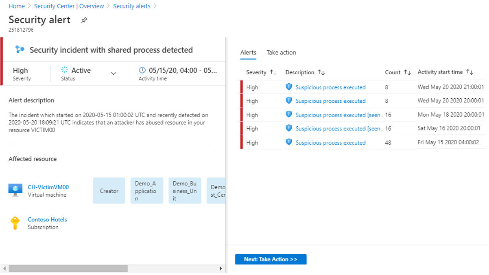

# Cloud Smart Alert Correlation in Azure Security Center

Security Center continuously analyzes the hybrid cloud workloads using advanced analytics and threat intelligence to alert you about malicious activity.

As the breadth of threat coverage grows and the need to detect even the slightest indication of compromised increases, it can be challenging for security analysts to triage the different alerts and identify an actual attack. Security Center helps analysts cope with alert fatigue and diagnosing attacks as they occur, by correlating different alerts and low fidelity signals into security incidents.

Fusion is the technology and analytic back end that powers Security Center incidents, enabling it to correlate different alerts and contextual signals together. 

* Fusion works by looking at the different signals reported on a subscription across the resources, and finding prevalent patterns that shows attack progression or signals with shared contextual information that indicates a unified response procedure should be taken for them.
* Fusion analytics combine security domain knowledge with AI to analyze alerts, discovering new attack patterns as they occur. 

* Security Center leverages MITRE Attack Matrix to associate alerts with their perceived intent, helping formalize security domain knowledge in order to rule out unlikely steps of an attack, combining that with additional information gathering tailored to each step of an attack. As attacks often occur across different tenants, this helps Security Center to combine AI algorithms to analyze attack sequences that are reported on each subscription to discover prevalent alert patterns, separating such from incidental association. 

During an investigation of an incident, analysts often need extra context to reach a verdict about the nature of the threat and how to mitigate it. For example, a network anomaly was detected, but without understanding what else is happening on the network or with regard to the targeted resource it is difficult to understand what actions to take next. To help, a security incident can include artifacts, related events, and information. The additional information available for Security Incidents varies depending on the type of threat detected and the configuration of your environment. 

To better understand Security Incidents, see [How to handle Security Incidents in Azure Security Center](https://docs.microsoft.com/en-us/azure/security-center/security-center-incident).

