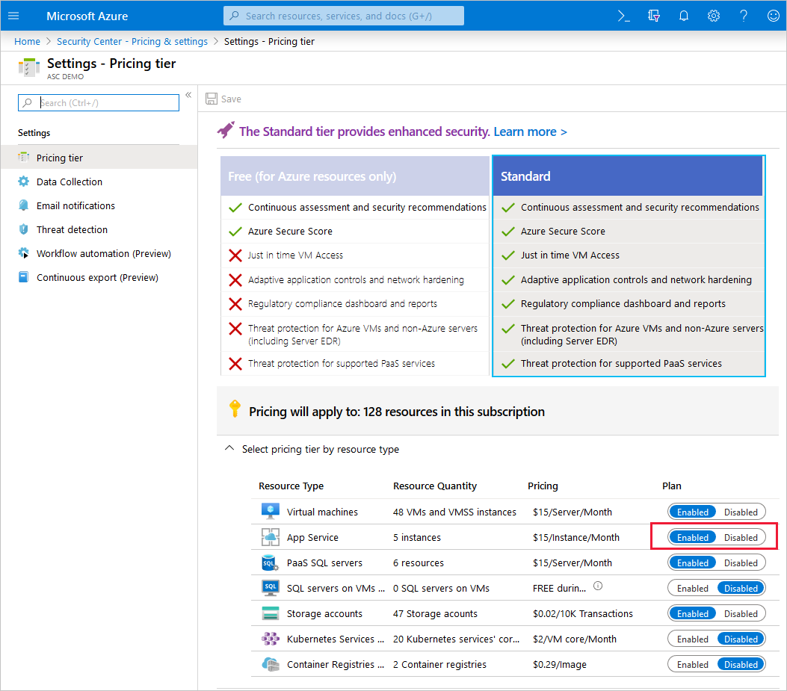

# Protect your Azure App Service web apps and APIs

Azure App Service is a fully managed platform for building and hosting your web apps and APIs without worrying about having to manage the infrastructure. It provides management, monitoring, and operational insights to meet enterprise-grade performance, security, and compliance requirements. For more information, see [Azure App Service](https://azure.microsoft.com/services/app-service/).

To protect your Azure App Service plan with Azure Defender, you must:

- Enable Security Center's Azure Defender on your subscription (you can optionally enable only the **Azure Defender for App Service** plan)
- Enable the App Service plan as shown below. Security Center is natively integrated with App Service, eliminating the need for deployment and onboarding - the integration is transparent.
- Have an App Service plan that is associated with dedicated machines. Supported plans are: Basic, Standard, Premium, Isolated, or Linux. Security Center doesn't support the Free, Shared, or Consumption plans. For more information, see [App Service Plans](https://azure.microsoft.com/pricing/details/app-service/plans/).

With the App Service plan enabled, Security Center assesses the resources covered by your App Service plan and generates security recommendations based on its findings. Security Center protects the VM instance in which your App Service is running and the management interface. It also monitors requests and responses sent to and from your apps running in App Service.

Security Center leverages the scale of the cloud, and the visibility that Azure has as a cloud provider, to monitor for common web app attacks. Security Center can discover attacks on your applications and identify emerging attacks - even while attackers are in the reconnaissance phase, scanning to identify vulnerabilities across multiple Azure-hosted applications. As an Azure-native service, Security Center is also in a unique position to offer host-based security analytics covering the underlying compute nodes for this PaaS, enabling Security Center to detect attacks against web applications that were already exploited.

## Enable monitoring and protection of App Service

1. In the Azure portal, choose Security Center.
2. Go to **Pricing & settings** and choose a subscription.
3. Under **Pricing tier**, in the **App service** row, toggle your plan to **Enabled**.

    

>[!NOTE]
> The number of instances listed for your **Resource Quantity** represents the total number of compute instances, in all App Service plans on this subscription, running at the moment when you opened the pricing tier blade.
>
> Azure App Service offers a variety of plans. Your App Service plan defines the set of compute resources for a web app to run. These are equivalent to server farms in conventional web hosting. One or more apps can be configured to run on the same computing resources (or in the same App Service plan).
>
>To validate the count, head to ‘App Service plans’ in the Azure Portal, where you can see the number of compute instances used by each plan. 

To disable monitoring and recommendations for your App Service, repeat this process and toggle your **App Service** plan to **Disabled**.

## See also
In this article, you learned how to use monitoring capabilities in Azure Security Center. To learn more about Azure Security Center, see the following articles:

* [Setting security policies in Azure Security Center](tutorial-security-policy.md): Learn how to configure security settings in Azure Security Center.
* [Managing and responding to security alerts in Azure Security Center](security-center-managing-and-responding-alerts.md): Learn how to manage and respond to security alerts.
* [Monitoring partner solutions with Azure Security Center](security-center-partner-solutions.md): Learn how to monitor the health status of your partner solutions.
* [Azure Security Blog](https://docs.microsoft.com/archive/blogs/azuresecurity/): Find blog posts about Azure security and compliance.
