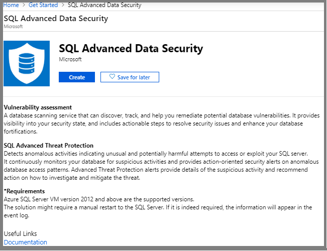
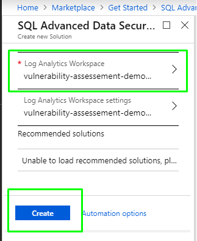

# Advanced data security for SQL servers on IaaS
Advanced data security for SQL Servers on IaaS is a unified package for advanced SQL security capabilities. It currently includes functionality for surfacing and mitigating potential database vulnerabilities and detecting anomalous activities that could indicate a threat to your database.

This security offering for IaaS SQL servers is based on the same fundamental technology used in the [Azure SQL Database Advanced Data Security package](https://docs.microsoft.com/en-us/azure/sql-database/sql-database-advanced-data-security).

## Overview

Advanced data security (ADS) provides a set of advanced SQL security capabilities,  consisting of Vulnerability assessment and Advanced Threat Protection.

* [Vulnerability assessment](https://docs.microsoft.com/en-us/azure/sql-database/sql-vulnerability-assessment) is an easy to configure service that can discover, track, and help you remediate potential database vulnerabilities. It provides visibility into your security state, and includes the steps to implement to resolve security issues and enhance your database fortifications.
* [Advanced Threat Protection](https://docs.microsoft.com/en-us/azure/sql-database/sql-database-threat-detection-overview) detects anomalous activities indicating unusual and potentially harmful attempts to access or exploit your SQL server. It continuously monitors your database for suspicious activities and provides action-oriented security alerts on anomalous database access patterns. These alerts provide the suspicious activity details and recommended actions to investigate and mitigate the threat.

## Getting Started with ADS for IaaS

The following steps get you started with ADS for IaaS.

### Set up ADS for IaaS

Before you begin: You need a Log Analytics workspace to store the security logs being analyzed. If you do not have one, then you can create one easily, as explained in [Create a Log Analytics workspace in the Azure portal](https://docs.microsoft.com/en-us/azure/azure-monitor/learn/quick-create-workspace).

1. Connect the VM hosting the SQL server to the Log Analytics workspace. For instructions, see [Connect Windows computers to Azure Monitor](https://docs.microsoft.com/en-us/azure/azure-monitor/platform/agent-windows).
1. From Azure Marketplace, go to the [SQL Advanced Data Security solution](https://ms.portal.azure.com/#create/Microsoft.SQLAdvancedDataSecurity).
(You can find it using the marketplace search option, as see in the following image.)
1. Select the workspace to use and click Create.
1. Restart the [VM's SQL server](https://docs.microsoft.com/en-us/sql/database-engine/configure-windows/start-stop-pause-resume-restart-sql-server-services?view=sql-server-2017).

## Setting up the 
1. You need a Log Analytics workspace to store the security logs being analyzed. If you do not have one, then create one. For intstructions, see [Create a Log Analyitcs workspace in the Azure portal](https://docs.microsoft.com/en-us/azure/azure-monitor/learn/quick-create-workspace).
1. Connect the VM hosting the SQL server to the Log Analytics workspace. For instructions, see [Connect Windows computers to Azure Monitor](https://docs.microsoft.com/en-us/azure/azure-monitor/platform/agent-windows).
1. Go to **Marketplace** > **Get Started**.
1. Search for SQL Advanced Data Security. 
    
1. Click **SQL Advanced Data Security**. The **SQL Advanced Data Security** page open.
   
1. Click **Create**.
1. Select the workspace to use and click **Create**.
   

1. Restart the [VM's SQL server](https://docs.microsoft.com/en-us/sql/database-engine/configure-windows/start-stop-pause-resume-restart-sql-server-services?view=sql-server-2017).

