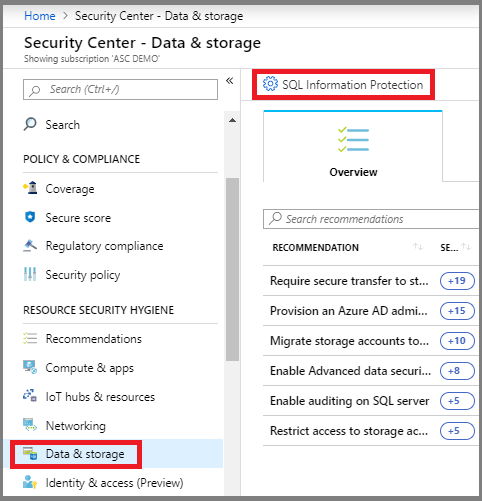
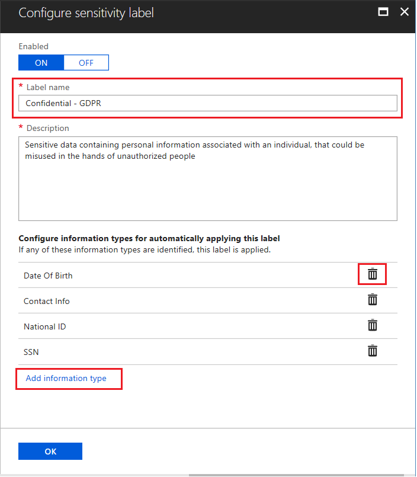
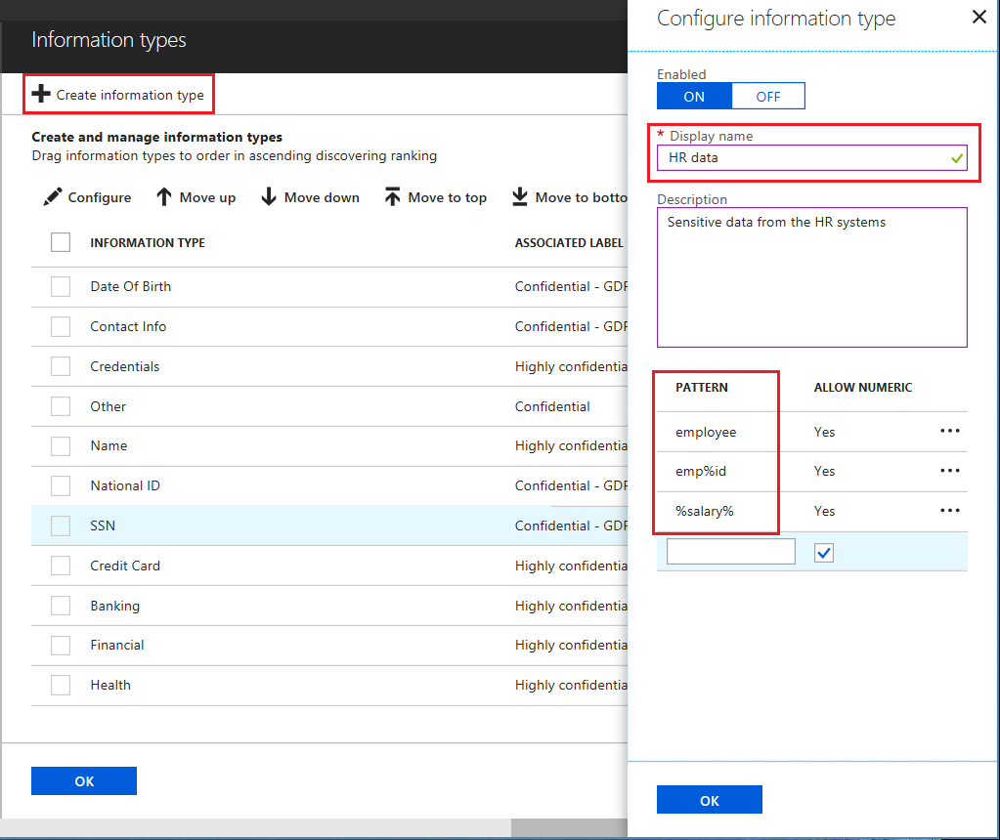

# Customize SQL Information Protection policies in Azure Security Center (Preview)
 
A SQL Information Protection policy can be defined and customized for your entire Azure tenant, in Azure Security Center.

Information protection is an advanced security capability for discovering, classifying, labeling and protecting sensitive data in your Azure data resources. Discovering and classifying your most sensitive data (business, financial, healthcare, PII, etc.) can play a pivotal role in your organizational information protection stature. It can serve as infrastructure for:
- Helping meet data privacy standards and regulatory compliance requirements
- Various security scenarios, such as monitoring (auditing) and alerting on anomalous access to sensitive data
- Controlling access to and hardening the security of data stores containing highly sensitive data
 
[SQL Information Protection](./sql-database/sql-database-data-discovery-and-classification.md) implements this paradigm for your SQL data stores, currently supported for Azure SQL Database. SQL Information Protection automatically discovers and classifies potentially sensitive data, provides a labeling mechanism for persistently tagging the sensitive data with classification attributes, and provides a detailed dashboard showing the classification state of the database. In addition, it calculates the result set sensitivity of SQL queries, so that queries that extract sensitive data can be explicitly audited, and the data can be protected. For more details on SQL Information Protection, see [Azure SQL Database Data Discovery and Classification](./sql-database/sql-database-data-discovery-and-classification.md).
 
The classification mechanism is based on two primary constructs that make up the classification taxonomy - **Labels** and **Information Types**.
- **Labels** – The main classification attributes, used to define the sensitivity level of the data stored in the column. 
- **Information Types** – Provides additional granularity into the type of data stored in the column.
 
Information Protection comes with a built-in set of labels and information types, which are used by default. To customize these, you can define your own information protection policy in Azure Security Center.
 
## Configure an information protection policy
To create a custom information protection policy for your Azure tenant, you need to have administrative privileges on the tenant's [root management group](security-center-management-groups.md). 
 
1. In the Security Center main menu, select **Security policy**.
2. Choose **Hierarchical view (preview)**, and then under **Tenant Root Group**, click **Edit settings**.
 
    
 
3. Under **Policy components**, click **Information protection**. In the **Information protection settings** page, you can view your current set of labels. These are the main classification attributes that are used to categorize the sensitivity level of your data. From here, you can configure the **Information protection labels** and **Information types** for the tenant. 
 
### Customizing labels
 
1. You can edit or delete any existing label, or add a new label. To edit an existing label, select that label and then click **Configure**, either at the top or from the context menu on the right. To add a new label, click **Create label** in the top menu bar or at the bottom of the labels table.
2. In the **Configure sensitivity label** screen, you can create or alter the label name and the description. You can also set whether the label is active or dormant, by toggling the **Enable** switch. Finally, you can add or remove information types associated with the label. Any data discovered that matches that information type will automatically include the associated sensitivity label in the classification recommendations.
3. Click **OK**.
 
   
 
4. Labels are listed in order of ascending sensitivity. To change the ranking between labels, drag the labels to reorder them in the table, or use the **Move up** and **Move down** buttons to change the order. 
 
    
 
5. Be sure to click **Save** at the top of the screen when you are finished.
 
 
## Adding and customizing information types
 
1. You can manage and customize **Information types** by clicking on **Manage information types**.
2. To add a new **Information type**, select **Create information type** in the top menu. You can configure a name, description, and search pattern strings for the **Information type**. Search pattern strings can optionally use keywords with wildcard characters (using the character '%'), which the automated discovery engine uses to identify sensitive data in your databases, based on the columns' metadata.
 
    
 
3. You can also configure the built-in **Information types** by adding additional search pattern strings, or by changing the description. You cannot delete built-in **Information types** or edit their names. 
4. **Information types** are listed in order of ascending discovery ranking, meaning that the types higher in the list will attempt to match first. To change the ranking between information types, drag the types to the right spot in the table, or use the **Move up** and **Move down** buttons to change the order. 
5. Be sure to click **OK** when you are done, and then click **Save** in the main **Labels** blade.
6. After you completed managing your information types, be sure to associate the relevant types with the relevant labels. To do that, click **Configure** for a particular label, and add or delete information types as appropriate.
 
After your Information protection policy is fully defined and saved, it will apply to the classification of data on all Azure SQL databases in your tenant.
 
 
## Next steps
 
In this article, you learned about defining a SQL Information Protection policy in Azure Security Center. To learn more about using SQL Information Protection to classify and protect sensitive data in your SQL databases, see [Azure SQL Database Data Discovery and Classification](./sql-database/sql-database-data-discovery-and-classification.md). 

For more information on security policies and data security in Azure Security Center, see the following articles:
 
- [Security policies overview](security-center-policies-overviewSecurity.md): Get an overview of security policies in Security Center
- [Setting security policies in Azure Security Center](security-center-policies.md): Learn how to configure security policies for your Azure subscriptions and resource groups.
- [Azure Security Center data security](security-center-data-security.md): Learn how Security Center manages and safeguards data.

