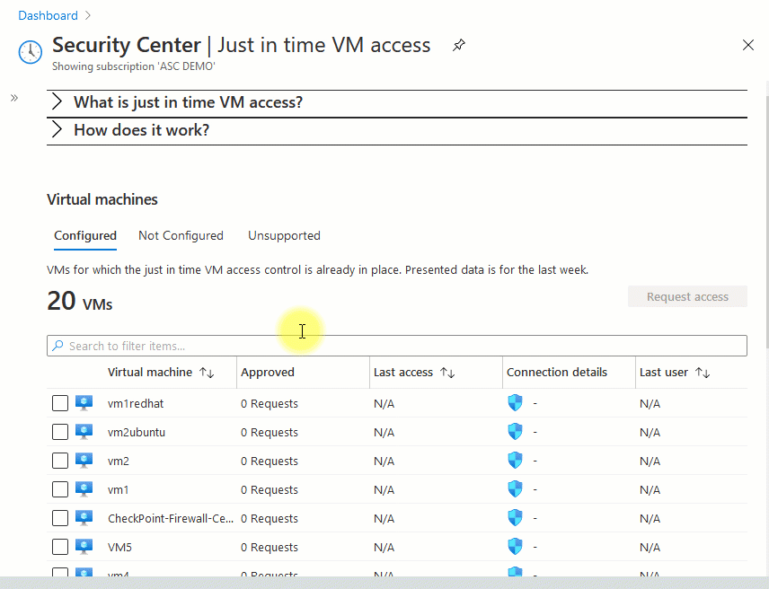
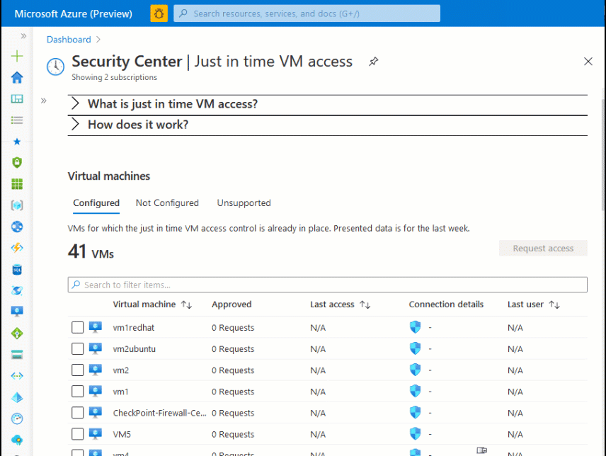
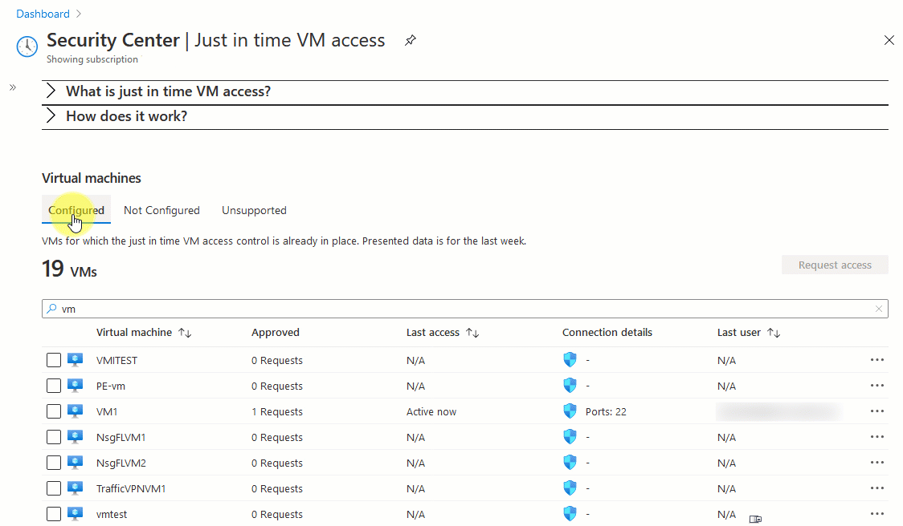

# Secure your management ports with just-in-time access

Lock down inbound traffic to your Azure Virtual Machines with Azure Security Center's just-in-time (JIT) virtual machine (VM) access feature. This reduces exposure to attacks while providing easy access when you need to connect to a VM.

For a full explanation about how JIT works and the underlying logic, see [Just-in-time explained](just-in-time-explained.md).

## Availability

- Release state: **General availability**
- Pricing: **Standard tier**. [Learn more about pricing](/azure/security-center/security-center-pricing).
- Required roles and permissions:
    - **Reader** and **SecurityReader** roles can both read policies. 
    - To create custom roles that can work with JIT, see the FAQ ([What permissions are needed to configure and use JIT?](faq-just-in-time.md#what-permissions-are-needed-to-configure-and-use-jit)).
- Supported VMs: VMs deployed through Azure Resource Manager (ARM). [Learn more about classic vs ARM deployment models](../azure-resource-manager/management/deployment-models.md).
- Clouds: 
    - ✔ Commercial clouds
    - ✔ National/Sovereign (US Gov, China Gov, Other Gov)


## Configure JIT VM access <a name="jit-configure"></a>

You can configure a JIT VM access policy with your own custom options for one or more VMs using Security Center or programmatically. Alternatively, you can enable a JIT VM access policy with default, hard-coded parameters from Azure Virtual machines.

### [Security Center](#tab/jit-config-asc)

### Configure JIT VM access in Azure Security Center <a name="jit-asc"></a>



Configure the JIT policy on your VMs from Security Center.

1. From Security Center's menu, select **Just-in-time VM access**.

    The **Just-in-time VM access** page opens with your VMs grouped into the following tabs:

    - **Configured** - VMs that have been already been configured to support just-in-time VM access. For each VM, the configured tab shows:
        - the number of approved JIT requests in the last seven days
        - the last access date and time
        - the connection details configured in the JIT policy
        - the last user
    - **Not configured** - VMs that can support JIT but haven't got a policy configured. We recommend that you enable JIT for these VMs.
    - **Unsupported** - VMs without a JIT policy and which don't support the feature. Your VM might be in this tab for the following reasons:
      - Missing network security group (NSG) - JIT requires an NSG to be configured
      - Classic VM - JIT supports VMs that are deployed through Azure Resource Manager, not 'classic deployment'. [Learn more about classic vs ARM deployment models](../azure-resource-manager/management/deployment-models.md).
      - Other - Your VM might be in this tab if the JIT solution is disabled in the security policy of the subscription or the resource group, or if the VM doesn't have a public IP and doesn't have an NSG in place.

1. From the **Not configured** tab, mark the VMs to protect with JIT and select **Enable JIT on VMs**. 

    The JIT VM access page opens listing the ports that Security Center recommends protecting:
    - 22 - SSH
    - 3389 - RDP
    - 5985 - WinRM 
    - 5986 - WinRM

    To accept the default settings, select **Save**.

1. To customize the policy:

    - Add custom ports with the **Add** button. 
    - Modify one of the default ports, by selecting it from the list.

    In the **Add port configuration** pane for each port you modify, both custom and default, you can edit the following settings:

    - **Protocol**- The protocol that is allowed on this port when a request is approved
    - **Allowed source IPs**- The IP ranges that are allowed on this port when a request is approved
    - **Maximum request time**- The maximum time window during which a specific port can be opened

     1. Select **OK**.

1. Select **Save**.

> [!NOTE]
> When JIT VM access is enabled for a VM, Azure Security Center creates "deny all inbound traffic" rules for the selected ports in the network security groups associated and Azure Firewall with it. If other rules had been created for the selected ports, then the existing rules take priority over the new "deny all inbound traffic" rules. If there are no existing rules on the selected ports, then the new "deny all inbound traffic" rules take top priority in the Network Security Groups and Azure Firewall.


### Edit a JIT VM access policy via Security Center

You can change a VM's existing just-in-time policy by adding and configuring a new port to protect for that VM, or by changing any other setting related to an already protected port.

To edit an existing just-in-time policy of a VM:

1. From Security Center's menu, select **Just-in-time VM access**.

1. From the **Configured** tab, right-click on the VM to which you want to add a port, and select edit. 

    

1. Under **JIT VM access configuration**, you can either edit the existing settings of an already protected port or add a new custom port.


### [Azure Virtual Machines](#tab/jit-config-avm)

### Configure JIT VM access from the Azure VM page

You can configure your JIT policy from the Azure virtual machines pages of the Azure portal.



1. From the [Azure portal](https://ms.portal.azure.com), search for and select **Virtual machines**. 
2. Select the virtual machine you want to limit to just-in-time access.
3. In the menu, select **Configuration**.
4. Under **Just-in-time access**, select **Enable just-in-time**. 

This enables just-in-time access for the VM using the following settings:

- Windows servers:
    - RDP port 3389
    - Three hours of maximum allowed access
    - Allowed source IP addresses is set to Any
- Linux servers:
    - SSH port 22
    - Three hours of maximum allowed access
    - Allowed source IP addresses is set to Any
     
If a VM already has just-in-time enabled, when you go to its configuration page you will be able to see that just-in-time is enabled and you can use the link to open the policy in Azure Security Center to view and change the settings.


### [PowerShell](#tab/jit-config-powershell)

### Configure JIT VM access using PowerShell

To use the just-in-time VM access solution via PowerShell, use the official Azure Security Center PowerShell cmdlets, and specifically `Set-AzJitNetworkAccessPolicy`.

The following example sets a just-in-time VM access policy on a specific VM, and sets the following:

* Close ports 22 and 3389.
* Set a maximum time window of 3 hours for each so they can be opened per approved request
* Allow the user who is requesting access to control the source IP addresses*
* Allow the user who is requesting access to establish a successful session upon an approved just-in-time access request

The following PowerShell commands create this example policy:

1.    Assign a variable that holds the just-in-time VM access policy for a VM:

        ```powershell
        $JitPolicy = (@{
         id="/subscriptions/SUBSCRIPTIONID/resourceGroups/RESOURCEGROUP/providers/Microsoft.Compute/virtualMachines/VMNAME";
        ports=(@{
             number=22;
             protocol="\*";
             allowedSourceAddressPrefix=@("\*");
             maxRequestAccessDuration="PT3H"},
             @{
             number=3389;
             protocol="\*";
             allowedSourceAddressPrefix=@("\*");
             maxRequestAccessDuration="PT3H"})})
        ```

1.    Insert the VM just-in-time VM access policy to an array:
    
        ```powershell
        $JitPolicyArr=@($JitPolicy)
        ```

1.    Configure the just-in-time VM access policy on the selected VM:
    
        ```powershell
        Set-AzJitNetworkAccessPolicy -Kind "Basic" -Location "LOCATION" -Name "default" -ResourceGroupName "RESOURCEGROUP" -VirtualMachine $JitPolicyArr
        ```

        Use the -Name parameter to specify a VM. For example, to establish the JIT policy for two different VMs, VM1 and VM2, use: ```Set-AzJitNetworkAccessPolicy -Name VM1``` and ```Set-AzJitNetworkAccessPolicy -Name VM2```.


### [REST API](#tab/jit-config-api)

The just-in-time VM access feature can be used via the Azure Security Center API. You can get information about configured VMs, add new ones, request access to a VM, and more, via this API. 

Learn more at [JIT network access policies](https://docs.microsoft.com/rest/api/securitycenter/jitnetworkaccesspolicies).


--- 


## Request JIT VM access

You can request access to a JIT-enabled VM from the Azure portal (in Security Center or Azure Virtual machines) or programmatically.

### [Azure Security Center](#tab/jit-request-asc)

### Request JIT VM access from Azure Security Center 

When a VM has a JIT VM access policy you have to request access. However you've established your JIT policy on your VM, you can request access from Security Center.



1. From the **Just-in-time VM access** page, select the **Configured** tab.

1. Mark the VMs you want to access.

    - The icon in the **Connection Details** column indicates whether JIT is enabled on the network security group or firewall. If it's enabled on both, only the firewall icon appears.

    - The **Connection Details** column provides the information required to connect the VM, and its open ports.

1. Select **Request access**. The **Request access** window opens.

1. Under **Request access**, for each VM, configure the ports that you want to open and the source IP addresses that the port is opened on and the time window for which the port will be open. It will only be possible to request access to the ports that are configured in the just-in-time policy. Each port has a maximum allowed time derived from the just-in-time policy.

1. Select **Open ports**.

> [!NOTE]
> If a user who is requesting access is behind a proxy, the option **My IP** may not work. You may need to define the full IP address range of the organization.


### [Azure Virtual machines](#tab/jit-request-avm)

### Request JIT VM access from the Azure Virtual machine's connect page

When a VM has a JIT VM access policy you have to request access. However you've established your JIT policy on your VM, you can request access from Azure Virtual machines.

In the Azure portal, when you try to connect to a VM, Azure checks to see if you have a just-in-time access policy configured on that VM. If you have a JIT policy configured on the VM, open the **Connect** page and select **Request access** to grant access in accordance with the JIT policy set for the VM. 

  >

  By default, the following parameters are included in the access request:

  - **source IP**: 'Any' (*) (cannot be changed)
  - **time range**: Three hours (cannot be changed) <!--Isn't this set in the policy-->
  - **port number** RDP port 3389 for Windows / port 22 for Linux (can be changed)

    > [!NOTE]
    > After a request is approved for a VM protected by Azure Firewall, Security Center provides the user with the proper connection details (the port mapping from the DNAT table) to use to connect to the VM.

- If you do not have JIT configured on a VM, you will be prompted to configure a JIT policy on it.


### [PowerShell](#tab/jit-request-powershell)

### Request access to a VM via PowerShell

In the following example, you can see a just-in-time VM access request to a specific VM in which port 22 is requested to be opened for a specific IP address and for a specific amount of time:

Run the following in PowerShell:

1.    Configure the VM request access properties
        ```powershell
        $JitPolicyVm1 = (@{
          id="/SUBSCRIPTIONID/resourceGroups/RESOURCEGROUP/providers/Microsoft.Compute/virtualMachines/VMNAME";
        ports=(@{
           number=22;
           endTimeUtc="2018-09-17T17:00:00.3658798Z";
           allowedSourceAddressPrefix=@("IPV4ADDRESS")})})
        ```

1.    Insert the VM access request parameters in an array:

        ```powershell
        $JitPolicyArr=@($JitPolicyVm1)
        ```
        
1.    Send the request access (use the resource ID from step 1)

        ```powershell
        Start-AzJitNetworkAccessPolicy -ResourceId "/subscriptions/SUBSCRIPTIONID/resourceGroups/RESOURCEGROUP/providers/Microsoft.Security/locations/LOCATION/jitNetworkAccessPolicies/default" -VirtualMachine $JitPolicyArr
        ```

Learn more in the [PowerShell cmdlet documentation](https://docs.microsoft.com/powershell/scripting/developer/cmdlet/cmdlet-overview).


### [Rest API](#tab/jit-request-api)

The just-in-time VM access feature can be used via the Azure Security Center API. You can get information about configured VMs, add new ones, request access to a VM, and more, via this API. 

Learn more at [JIT network access policies](https://docs.microsoft.com/rest/api/securitycenter/jitnetworkaccesspolicies).

---


## Audit JIT access activity in Security Center

You can gain insights into VM activities using log search. To view the logs:

1. From **Just-in-time VM access**, select the **Configured** tab.

1. For the VM that you want to audit, open the ellipsis menu at the end of the row.
 
1. Select **Activity Log** from the menu.

   

   The activity log provides a filtered view of previous operations for that VM along with time, date, and subscription.

1. To download the log information, select **Download as CSV**.


## Next steps

In this article, you learned how to setup and use just-in-time VM access. To learn why JIT should be used, read the concept article explaining the threats it's defending against:

> [!div class="nextstepaction"]
> [JIT explained](just-in-time-explained.md)