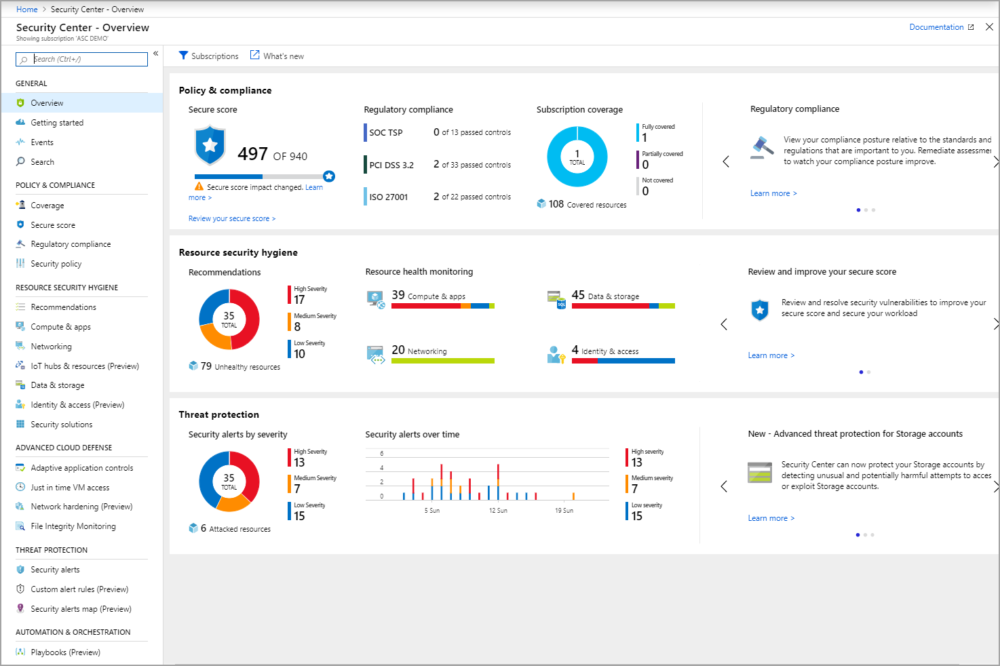

# Security recommendations in Azure Security Center 
This topic explains how to view and understand the recommendations in Azure Security Center to help you protect your Azure resources.

> [!NOTE]
> This document introduces the service by using an example deployment.  This document is not a step-by-step guide.
>

## What are security recommendations?

Recommendations are actions for you to take in order to secure your resources.

Security Center periodically analyzing the security state of your Azure resources to identify potential security vulnerabilities. It then provides you with recommendations on how to remove them.

Each recommendation provides you with:

- A short description of what is being recommended.
- The remediation steps to carry out in order to implement the recommendation. In some cases, one-click remediation is available.
- Which resources are in need of you performing the recommended action on them.
- The **secure score impact**, which is the amount that your secure score will go up if you implement this recommendation.

## Security recommendations and policies

Azure Security Center automatically assigns its built-in security policies on each subscription that is onboarded. You can configure these policies in Azure Policy, which also enables you to set [policies](../governance/policy/overview) across management groups and across multiple subscriptions.

Recommendations tell you what you need to do to keep your resources in accordance with these policies.

Recommendations center around system updates, baseline rules, anti-malware programs, [network security groups](../virtual-network/security-overview.md) 

on subnets and network interfaces, SQL database auditing, SQL database transparent data encryption, and web application firewalls.  You can view and configure these policies. For more information, see [Setting security policies](tutorial-security-policy.md) provides a description of each recommendation option.
[disable security policy](tutorial-security-policydisable-security-policies)

## Monitor recommendations

Security Center analyzes the security state of your resources to identify potential vulnerabilities. The **Recommendations** tile under **Overview** shows the total number of recommendations identified by Security Center.

1. Select the **Recommendations tile** under **Overview**. The **Recommendations** list opens.
    
      

    You can filter recommendations. To filter the recommendations, select **Filter** on the **Recommendations** blade. The **Filter** blade opens and you select the severity and state values you wish to see.

   * **RECOMMENDATIONS**: The recommendation.
   * **SECURE SCORE IMPACT**: A score generated by Security Center using your security recommendations, and applying advanced algorithms to determine how crucial each recommendation is. For more information, see [Secure score calculation](security-center-secure-score.md#secure-score-calculation).
   * **RESOURCE**: Lists the resources to which this recommendation applies.
   * **STATUS BARS**:  Describes the severity of that particular recommendation:
       * **High (Red)**: A vulnerability exists with a meaningful resource (such as an application, a VM, or a network security group) and requires attention.
       * **Medium (Orange)**: A vulnerability exists and non-critical or additional steps are required to eliminate it or to complete a process.
       * **Low (Blue)**: A vulnerability exists that should be addressed but does not require immediate attention. (By default, low recommendations aren't presented, but you can filter on low recommendations if you want to see them.) 
       * **Healthy (Green)**:
       * **Not Available (Grey)**:

1. To view each recommendation's details, click on the recommendation.

    

>[!NOTE] 
> See [classic and Resource Manager deployment models](../azure-classic-rm.md) for Azure resources.
 
## Next steps

In this document, you were introduced to security recommendations in Security Center. To learn more about Security Center, see the following topics:

* [Setting security policies in Azure Security Center](tutorial-security-policy.md) — Learn how to configure security policies for your Azure subscriptions and resource groups.
* [Security health monitoring in Azure Security Center](security-center-monitoring.md) — Learn how to monitor the health of your Azure resources.
* [Managing and responding to security alerts in Azure Security Center](security-center-managing-and-responding-alerts.md) — Learn how to manage and respond to security alerts.
* [Monitoring partner solutions with Azure Security Center](security-center-partner-solutions.md) — Learn how to monitor the health status of your partner solutions.
* [Azure Security Center FAQ](security-center-faq.md) — Find frequently asked questions about using the service.
* [Azure Security blog](https://blogs.msdn.com/b/azuresecurity/) — Find blog posts about Azure security and compliance.
