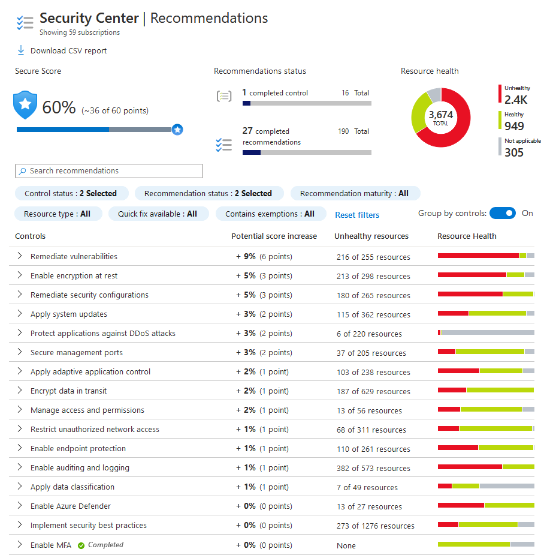
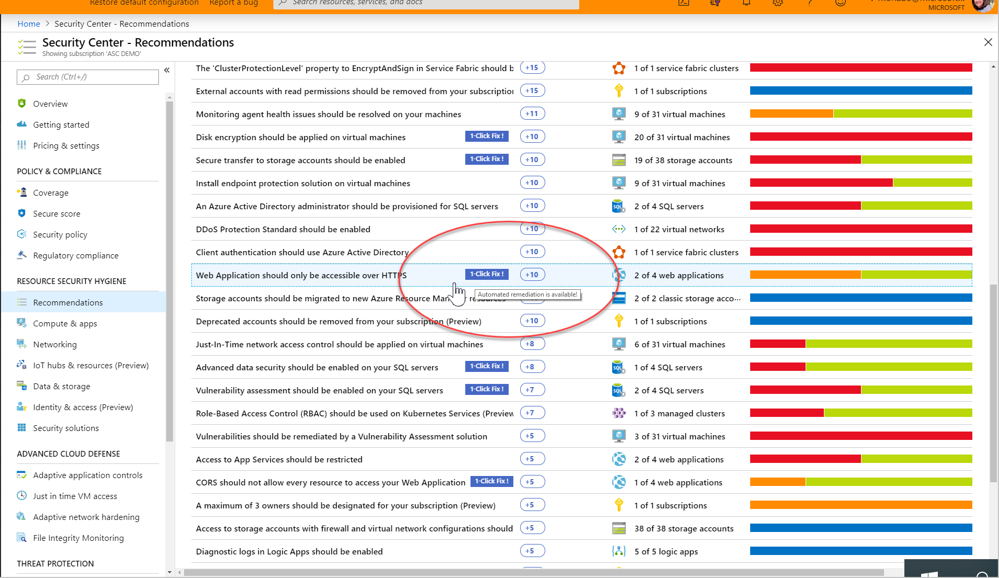

# Remediate recommendations

## Monitor recommendations
After setting a security policy, Security Center analyzes the security state of your resources to identify potential vulnerabilities. The **Recommendations** tile under **Overview** shows the total number of recommendations identified by Security Center.

1. Select the **Recommendations tile** under **Overview**. The **Recommendations** list opens.

      

1. To view each recommendation's details, click on the recommendation.

   

   
    >[!NOTE] 
    > See [classic and Resource Manager deployment models](../azure-classic-rm.md) for Azure resources.
  
 ## Apply recommendations
> After reviewing all recommendations, decide which one to apply first. We recommend that you use the secure score impact to evaluate which recommendations should be applied first.

1. From the list, click on the recommendation.
1. Follow the instructions in the *Remediation steps* section.
 
    

## One-click fix remediation

One-click fix enables you to remediate a recommendation on a bulk of resources, with a single click. It is an option only available for specific recommendations. One-click fix simplifies remediation and enables you to quickly improve your secure score and increase the security in your environment.

To implement one-click remediation:

1. From the list of recommendations that have the **1-Click-fix** label, click on the recommendation.  

   

2. From the **Unhealthy resources** tab, select the resources that you want to implement the recommendation on, and click **Remediate**. 

    > [!NOTE]
    > Some of the listed resources might be disabled, because you do not have the appropriate permissions to modify them.

    

3. In the confirmation box, read the remediation details and implications. 

    > [!NOTE]
    > The implications are listed in the grey box in the **Remediate resources** window that opens after clicking **Remediate**. They list what changes happen when proceeding with the 1-click remediation.

4. Insert the relevant parameters if required, and approve the remediation.
 
   

    > [!NOTE]
    > -It can take several minutes after remediation completes to see the resources in the **Healthy resources** tab. To view the the remediation actions, check the activity log where they are logged.

5. Once completed, a notification appears (click the bell in the menu bar) informing you if the remediation succeeded.

## Next steps

In this document, you were introduced to security recommendations in Security Center. To learn more about Security Center, see the following topics:

* [Setting security policies in Azure Security Center](tutorial-security-policy.md) — Learn how to configure security policies for your Azure subscriptions and resource groups.
* [Security health monitoring in Azure Security Center](security-center-monitoring.md) — Learn how to monitor the health of your Azure resources.
* [Managing and responding to security alerts in Azure Security Center](security-center-managing-and-responding-alerts.md) — Learn how to manage and respond to security alerts.
* [Monitoring partner solutions with Azure Security Center](security-center-partner-solutions.md) — Learn how to monitor the health status of your partner solutions.
* [Azure Security Center FAQ](security-center-faq.md) — Find frequently asked questions about using the service.
* [Azure Security blog](https://blogs.msdn.com/b/azuresecurity/) — Find blog posts about Azure security and compliance.
