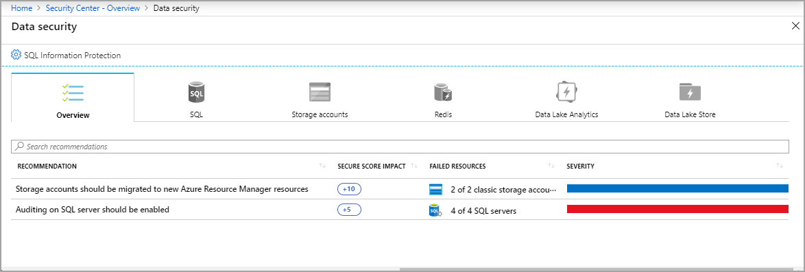
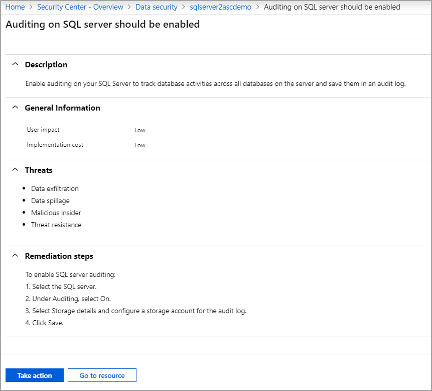
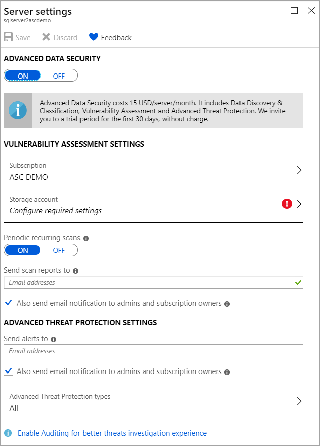

# Protect Azure data and storage services
When Azure Security Center identifies potential security vulnerabilities, it creates recommendations that guide you through the process of configuring the needed controls to harden and protect your resources.

This article explains the **Data Security page** of the resource security section of Security Center.

For a full list of the recommendations you might see on this page, see [Data and Storage recommendations](recommendations-reference.md#recs-datastorage).

## View your data security information

1. In the **Resource security hygiene** section, click **Data and storage resources**.

    

    The **Data security** page opens with recommendations for data resources.

    

    From this page, you can:

    * Click the **Overview** tab lists all the data resources recommendations to be remediated. 
    * Click each tab, and view the recommendations by resource type.

    > [!NOTE]
    > For more information about storage encryption, see [Azure Storage encryption for data at rest](../storage/common/storage-service-encryption.md).

## Remediate a recommendation on a data resource

1. From any of the resource tabs, click a resource. The information page opens listing the recommendations to be remediated.

    

2. Click a recommendation. The Recommendation page opens and displays the **Remediation steps** to implement the recommendation.

   

3. Click **Take action**. The resource settings page appears.

    

4. Follow the **Remediation steps** and click **Save**.

## Next steps

To learn more about recommendations that apply to other Azure resource types, see the following topics:

- [Full reference list of Azure Security Center's security recommendations](recommendations-reference.md)
- [Protecting your network in Azure Security Center](security-center-network-recommendations.md)