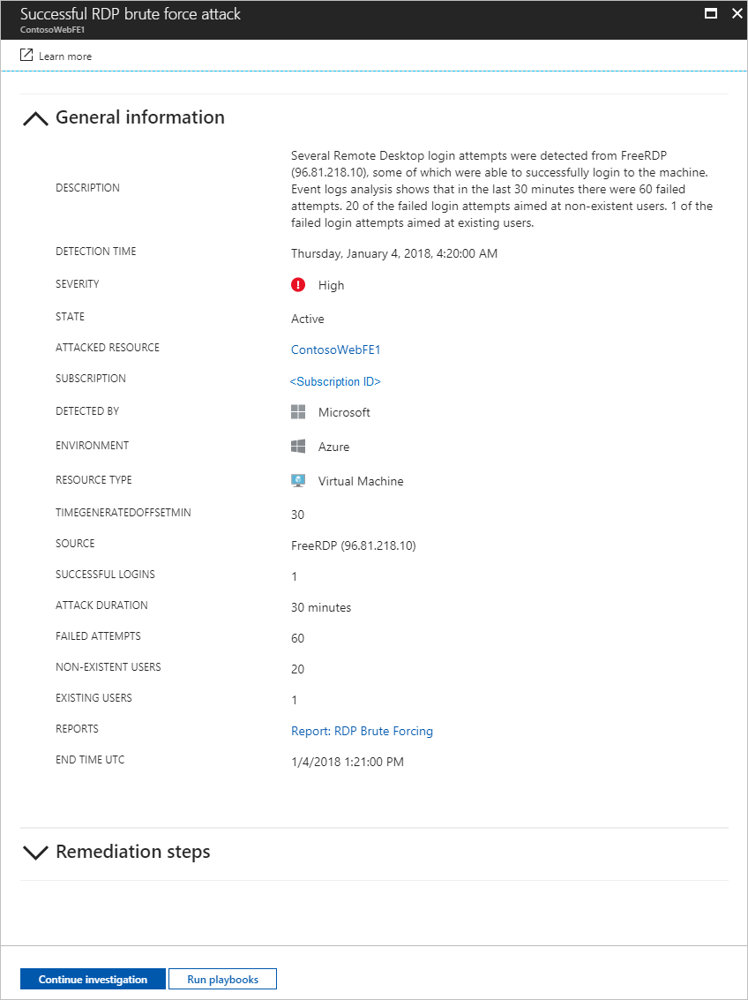
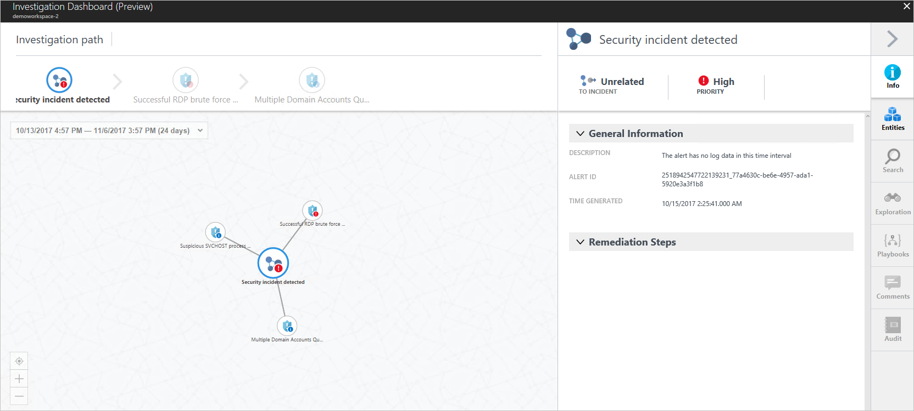

# Tutorial: Respond to Security Incidents
Security Center continuously analyzes your hybrid cloud workloads using advanced analytics and threat intelligence to alert you to malicious activity. In addition, you can integrate alerts from other security products and services into Security Center, and create custom alerts based on your own indicators or intelligence sources. Once an alert is generated, swift action is needed to investigate and remediate. In this tutorial, you will learn how to:

> [!div class="checklist"]
> * Triage security alerts
> * Investigate further to determine the root cause and scope of a security incident
> * Search security data to aid in investigation

If you don’t have an Azure subscription, create a [free account](https://azure.microsoft.com/free/) before you begin.

## Triage security alerts
Security Center provides a unified view of all security alerts. Security alerts are ranked based on the severity and when possible related alerts are combined into a security incident. When triaging alerts and incidents, you should:

- Dismiss alerts for which no additional action is required, for example if the alert is a false positive
- Act to remediate know attacks, for example blocking network traffic from a malicious IP address
- Determine alerts that require further investigation

Start at the Security Center dashboard, under **Detection**, click **Security alerts**:

  

In the list of alerts, click on a security incident, which is a collection of alerts, to learn more about this incident.

In this screen you have the security incident description on top, and the list of alerts that are part of this incident. Click in the security incident that you want to investigate further to obtain more information.

The type of alert can vary, read [Understanding security alerts in Azure Security Center](https://docs.microsoft.com/azure/security-center/security-center-alerts-type) for more details about the type of alert, and potential remediation steps. For alerts that can be safely dismissed, you can right click on the alert and select the option **Dismiss**:

If the root cause and scope of the malicious activity is unknown, proceed to the next step to investigate further.
Investigate an alert or incident

## Investigate an alert or incident
If additional information about is needed, use the [investigation feature](https://docs.microsoft.com/azure/security-center/security-center-investigation) to learn more about the entities involved.

On the **Security alert** page, click **Start investigation** button (if you already started, the name changes to **Continue investigation**).

The investigation map is a graphical representation of the entities that are connected to this security alert or incident. By clicking on an entity in the map, the information about that entity will show new entities, and the map expands. The entity that is selected in the map has its properties highlighted in the pane on the right side of the page. The information available on each tab will vary according to the selected entity. During the investigation process, review all relevant information to better understand the attacker’s movement.

If you need more evidences, or must further investigate entities that were found during the investigation, proceed to the next step.

## Search security data to aid in investigation

You can use search capabilities in Security Center to find more evidences of compromised systems, and more details about the entities that are part of the investigation.

To perform a search open the **Security Center** dashboard, click **Search** in the left navigation pane, select the workspace that contains the entities that you want to search, type the search query, and click the search button.

## Next steps
In this tutorial, you learned about basic tasks to be done during a security incident response with Security Center, such as:

> [!div class="checklist"]
> * Security incident
> * Investigation
> * Search
