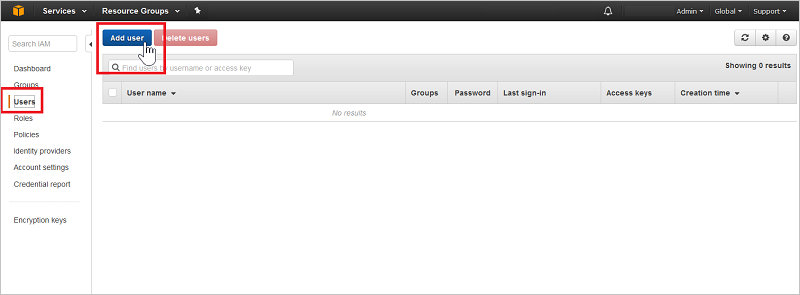
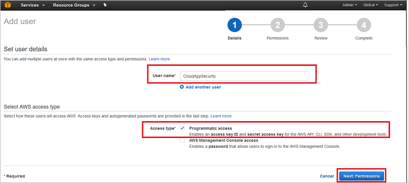
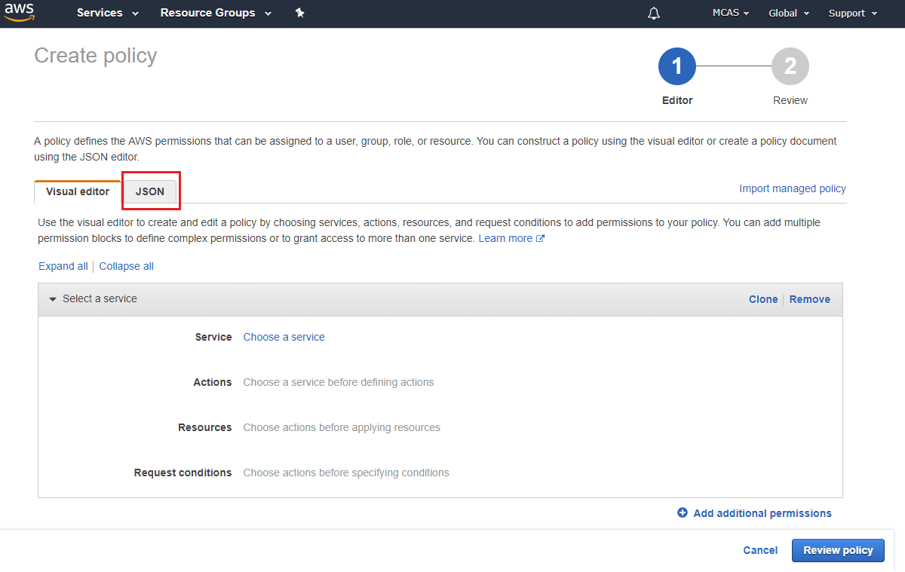
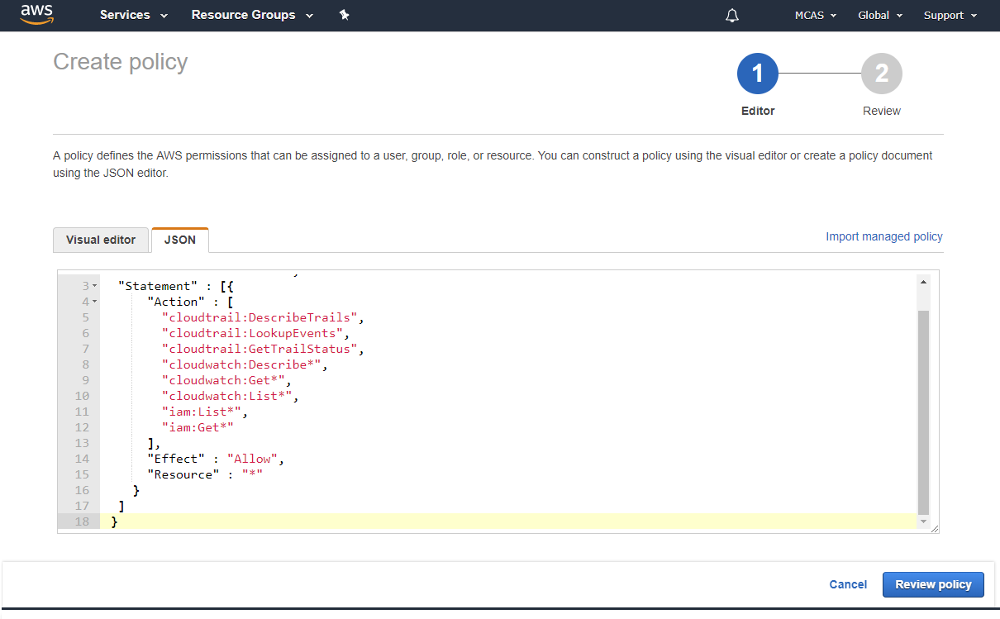
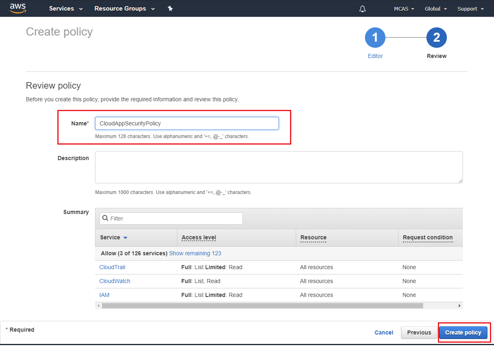
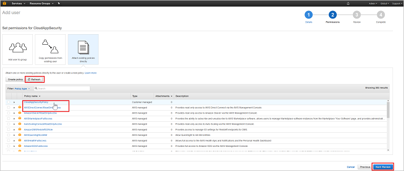
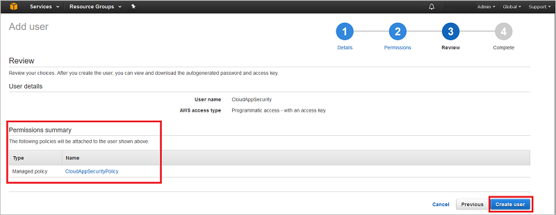

# Collecting data from AWS


This article provides instructions for connecting Security Insights to your existing Amazon Web Services account using the connector. This connection streams AWS logs into Security Insights. 
  
## How to connect Amazon Web Services to Security Insights  

To stream logs from AWS to Security Insights, you first have to download keys to your AWS instance, and then paste them in the new account you create in Security Insights.

## Step 1: Download your AWS keys
  
1.  In your [Amazon Web Services console](https://console.aws.amazon.com/), under **Security, Identity & Compliance**, click on **IAM**.  
  
       
  
2.  Click on the **Users** tab and then click **Add user**.  
  
           
  
4.  In the **Details** step, provide a new user name for Security Insights. Make sure that under **Access type** you select **Programmatic access** and click **Next Permissions**.  

     

5. Click on the JSON tab:

     

6. Paste the following script into the provided area:

    ```     
    {  
      "Version" : "2012-10-17",  
      "Statement" : [{  
          "Action" : [  
            "cloudtrail:DescribeTrails",  
            "cloudtrail:LookupEvents",  
            "cloudtrail:GetTrailStatus",  
            "cloudwatch:Describe*",  
            "cloudwatch:Get*",  
            "cloudwatch:List*",  
            "iam:List*",  
            "iam:Get*",
            "s3:ListAllMyBuckets",
            "s3:PutBucketAcl",
            "s3:GetBucketAcl",
            "s3:GetBucketLocation"
          ],  
          "Effect" : "Allow",  
          "Resource" : "*"  
        }  
      ]  
     }  
  
    ```  

     
    
6. Click **Review policy**.

7. Provide a **Name** and click **Create policy**.

     

9. Back in the **Add user** screen, refresh the list if necessary, and select the user you created, and click **Next Review**.

   

10. If all the details are correct, click **Create user**.

    

11. When you get the success message, click **Download .csv** to save a copy of the new user's credentials, you need these later.  

    
  
## Step 2: Set Security Insights to gather the data

1. In Security Insights, click **Data collection** and then select the **AWS** tile.

2. Click **Add account**. In the **AWS account details** pane, provide the keys that you saved at the end of Step 1 and click **Connect**.


## Next steps
In this document, you learned how to connect Azure AD Identity Protection to Security Center. To learn more about Security Center, see the following articles:

*