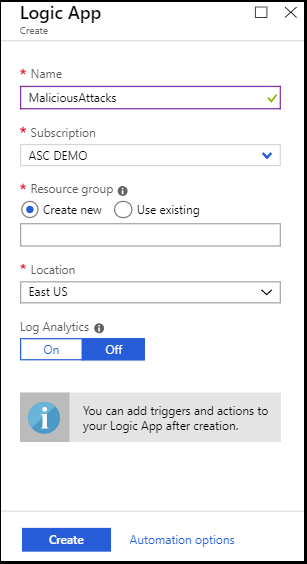
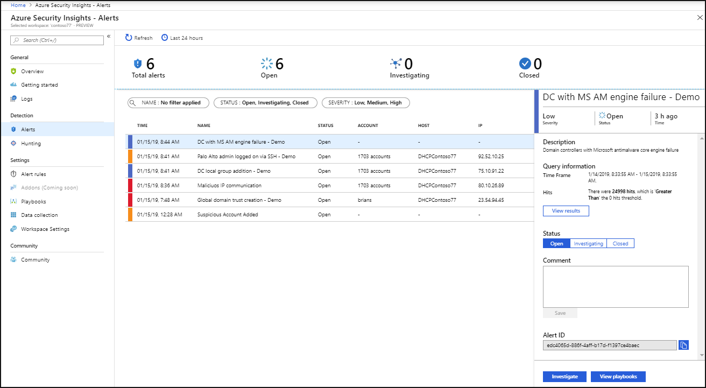

# Tutorial: Set up automated threat responses in Azure Security Insights

This document helps you to use security playbooks in Azure Security Insights to set automated threat responses to security-related issues detected by Azure Security Insights.

## What is security playbook in Security Insights?

A security playbook is a collection of procedures that can be run from Security Insights in response to an alert. A security playbook can help automate and orchestrate your response and can be run manually or set to run automatically when specific alerts are triggered. Security playbooks in Security Insights are based on [Azure Logic Apps](https://docs.microsoft.com/azure/logic-apps/logic-apps-what-are-logic-apps), which means that you get all the power, customizability, and built-in templates of Logic Apps. Each playbook is created for the specific subscription you choose, but when you look at the Playbooks page, you will see all the playbooks across any selected subscriptions.

> [!NOTE]
> Playbooks leverage Azure Logic Apps, therefore charges apply. Visit [Azure Logic Apps](https://azure.microsoft.com/pricing/details/logic-apps/) pricing page for more details.

For example, if you're worried about malicious attackers accessing your network resources, you can set an alert that looks for malicious IP addresses accessing your network. Then, you can create a playbook that does the following:
1. When the alert is triggered, open a ticket in ServiceNow or any other IT ticketing system.
2. Send a message to the SOC channel in Microsoft Teams or Slack to make sure your security analysts are aware of the incident.
3. Send all the information in the alert to your senior network admin and security admin. The email message also includes two user option buttons **Block** or **Ignore**.
4. The playbook continues to run after a response is received from the admins.
5. If the admins choose **Block**, the IP address is blocked in the Palo Alto firewall and the user is disabled in Azure AD.
6. If the admins choose **Ignore**, the alert is closed in Security Insights and the incident is closed in ServiceNow.

Security playbooks can be run either manually or automatically. Running them manually means that when you get an alert, you can choose to run a playbook on-demand as a response to the alert. Running them automatically means that when you configure the alert, you set it to automatically run one or more playbooks when the alert is triggered.

## Create a security playbook

Follow these steps to create a new security playbook in Security Insights:

1.	Open the **Security Insights** dashboard.
2.	Under **Management**, select **Playbooks**.

	

3. In the **Security Insights - Playbooks (Preview)** page, click **Add** button.

	 

4. In the **Create Logic app** page, type the requested information to create your new logic app, and click **Create**. 

5. In the [**Logic App Designer**](../azure/logic-apps/logic-apps-what-are-logic-apps.md), select the template you want to use. If you select a template that necessitates credentials, you will have to provide them. Alternatively, you can create a new blank playbook from scratch. Select **Blank Logic App**. 

	

6. You are taken to the Logic App Designer where you can either build a new or edit the template. For more information on creating a playbook with [Logic Apps](azure/logic-apps/logic-apps-create-a-logic-app).

7. If you are creating a blank playbook, in the **Search all connectors and triggers** field, type *Azure Security Insights*, and select **When a response to an Azure Security Insights alert is triggered**.

	

After it is created, the new playbook appears in the **Playbooks** list. If it doesn’t appear, click **Refresh**. 

7. Now you can define what happens when you trigger the playbook. You can add an action, logical condition, switch case conditions or loops.

	

## How to use a security playbook

You can run a playbook either on demand or set an automated trigger to run it as part of an alert response.

To run a playbook on-demand:

1. In the **Alerts** page, drill down into a specific alert.

2. Click **View playbooks** and select a playbook to **run** from the list of available playbooks on the subscription. 

To set an automated trigger to run a playbook:

1. When you create a [custom alert rule](tutorial-detect-threats.md), click the tab **Response automation**.

2. Click **Add playbook** from the blade that opens, and select the playbooks to run automatically when the alert rule is triggered and click **Apply**.

	

> [!NOTE]
> It is recommended that if you are setting a playbook that enforces administrative actions that impact users or business operations such as blocking a user or deleting files, you should thoroughly test the playbook manually before setting it to run automatically. 
>

## Next steps
In this article, you learned how to run a playbook in Azure Security Insights. To learn more about Security Insights, see the following articles:

* [Azure Security Blog](https://blogs.msdn.com/b/azuresecurity/): Find blog posts about Azure security and compliance.

When importing dashboards from the github community, add your own log analytics workspace ID in JSON file.