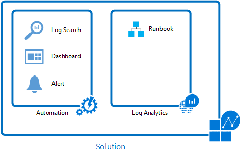
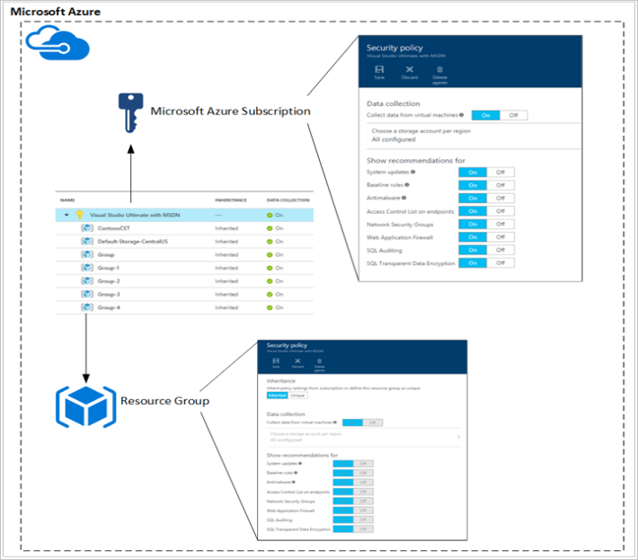
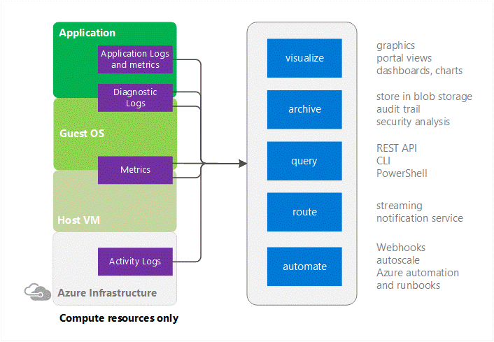
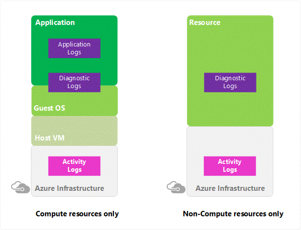
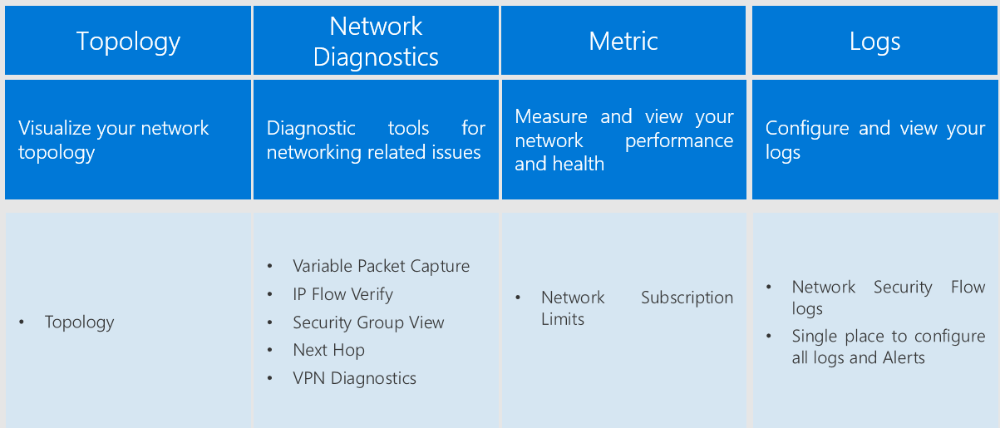

# Azure Operational Security
## Introduction

### Overview
We know that security is job one in the cloud and how important it is that you find accurate and timely information about Azure security. One of the best reasons to use Azure for your applications and services is to take advantage of the wide array of security tools and capabilities available. These tools and capabilities help make it possible to create secure solutions on the secure Azure platform. Windows Azure must provide confidentiality, integrity, and availability of customer data, while also enabling transparent accountability.

To help customers better understand the array of security controls implemented within Microsoft Azure from both the customer's and Microsoft operational perspectives, this white paper, “Azure Operational Security", is written that provides a comprehensive look at the operational security available with Windows Azure.

### Azure Platform
Azure is a public cloud service platform that supports a broad selection of operating systems, programming languages, frameworks, tools, databases,and devices. It can run Linux containers with Docker integration; build apps with JavaScript, Python, .NET, PHP, Java,and Node.js; build back-ends for iOS, Android, and Windows devices. Azure Cloud service supports the same technologies millions of developers and IT professionals already rely on and trust.

When you build on, or migrate IT assets to, a public cloud service provider you are relying on that organization’s abilities to protect your applications and data with the services and the controls they provide to manage the security of your cloud-based assets.

Azure’s infrastructure is designed from the facility to applications for hosting millions of customers simultaneously, and it provides a trustworthy foundation upon which businesses can meet their security requirements. In addition, Azure provides you with a wide array of configurable security options and the ability to control them so that you can customize security to meet the unique requirements of your organization’s deployments. This document will helps you understand how Azure security capabilities can help you fulfill these requirements.

### Abstract
Azure Operational Security refers to the services, controls, and features available to users for protecting their data, applications,and other assets in Microsoft Azure. Azure Operational Security is built on a framework that incorporates the knowledge gained through various capabilities that are unique to Microsoft, including the Microsoft Security Development Lifecycle (SDL), the Microsoft Security Response Center program, and deep awareness of the cybersecurity threat landscape.

This white paper outlines Microsoft’s approach to Azure Operational Security within the Microsoft Azure cloud platform and covers following services:
1.	[Azure Monitor](https://docs.microsoft.com/azure/operations-management-suite/operations-management-suite-overview)

2.	[Azure Security Center](https://docs.microsoft.com/azure/security-center/security-center-intro)

3.	[Azure Monitor](https://docs.microsoft.com/azure/monitoring-and-diagnostics/monitoring-overview)

4.	[Azure Network watcher](https://docs.microsoft.com/azure/network-watcher/network-watcher-monitoring-overview)

5.	[Azure Storage analytics](https://docs.microsoft.com/rest/api/storageservices/fileservices/storage-analytics)

6.	[Azure Active directory](https://docs.microsoft.com/azure/active-directory/active-directory-whatis)

## Microsoft Azure Monitor logs

Microsoft Azure Monitor logs is the IT management solution for the hybrid cloud. Used alone or to extend your existing System Center deployment, Azure Monitor logs gives you the maximum flexibility and control for cloud-based management of your infrastructure.

With Azure Monitor logs, you can manage any instance in any cloud, including on-premises, Azure, AWS, Windows Server, Linux, VMware, and OpenStack, at a lower cost than competitive solutions. Built for the cloud-first world, Azure Monitor logs offers a new approach to managing your enterprise that is the fastest, most cost-effective way to meet new business challenges and accommodate new workloads, applications and cloud environments.

### Azure Monitor services

The core functionality of Azure Monitor logs is provided by a set of services that run in Azure. Each service provides a specific management function, and you can combine services to achieve different management scenarios.

| Service  | Description|
| :------------- | :-------------|
| Azure Monitor logs | Monitor and analyze the availability and performance of different resources including physical and virtual machines. |
|Automation | Automate manual processes and enforce configurations for physical and virtual machines. |
| Backup | Back up and restore critical data. |
| Site Recovery | Provide high availability for critical applications. |

### Azure Monitor logs

[Azure Monitor logs](https://azure.microsoft.com/documentation/services/log-analytics) provides monitoring services by collecting data from managed resources into a central repository. This data could include events, performance data, or custom data provided through the API. Once collected, the data is available for alerting, analysis, and export.

This method allows you to consolidate data from various sources, so you can combine data from your Azure services with your existing on-premises environment. It also clearly separates the collection of the data from the action taken on that data so that all actions are available to all kinds of data.

The Azure Monitor service manages your cloud-based data securely by using the following methods:
-	data segregation
-	data retention
-	physical security
-	incident management
-	compliance
-	security standards certifications

### Azure Backup

[Azure Backup](https://azure.microsoft.com/documentation/services/backup) provides data backup and restore services and is part of the Azure Monitor suite of products and services.
 It protects your application data and retains it for years without any capital investment and with minimal operating costs. It can back up data from physical and virtual Windows servers in addition to application workloads such as SQL Server and SharePoint. It can also be used by [System Center Data Protection Manager (DPM)](https://en.wikipedia.org/wiki/System_Center_Data_Protection_Manager) to replicate protected data to Azure for redundancy and long-term storage.

Protected data in Azure Backup is stored in a backup vault located in a particular geographic region. The data is replicated within the same region and, depending on the type of vault, may also be replicated to another region for further resiliency.

### Management Solutions
[Azure Monitor](https://docs.microsoft.com/azure/operations-management-suite/oms-security-getting-started) is Microsoft's cloud-based IT management solution that helps you manage and protect your on-premises and cloud infrastructure.

[Management Solutions](https://docs.microsoft.com/azure/operations-management-suite/operations-management-suite-solutions) are prepackaged sets of logics that implement a particular management scenario using one or more Azure Monitor services. Different solutions are available from Microsoft and from partners that you can easily add to your Azure subscription to increase the value of your investment in Azure Monitor. As a partner, you can create your own solutions to support your applications and services and provide them to users through the Azure Marketplace or Quick Start Templates.

A good example of a solution that uses multiple services to provide additional functionality is the [Update Management solution](https://docs.microsoft.com/azure/operations-management-suite/oms-solution-update-management). This solution uses the [Azure Monitor logs](https://docs.microsoft.com/azure/log-analytics/log-analytics-overview) agent for Windows and Linux to collect information about required updates on each agent. It writes this data to the Azure Monitor logs repository where you can analyze it with an included dashboard.

When you create a deployment, runbooks in [Azure Automation](https://docs.microsoft.com/azure/automation/automation-intro) are used to install required updates. You manage this entire process in the portal and don’t need to worry about the underlying details.

## Azure Security Center

Azure Security Center helps protect your Azure resources. It provides integrated security monitoring and policy management across your Azure subscriptions. Within the service,you are able to define polices not only against your Azure subscriptions, but also against [Resource Groups](https://docs.microsoft.com/azure/azure-resource-manager/resource-group-overview#resource-groups), so you can be more granular.

### Security policies and recommendations

A security policy defines the set of controls, which are recommended for resources within the specified subscription or resource group.

In Security Center, you define policies according to your company's security requirements and the type of applications or sensitivity of the data.

Policies that are enabled in the subscription level automatically propagate to all resources groups within the subscription as shown in the diagram at the right side:

### Data collection

Security Center collects data from your virtual machines (VMs) to assess their security state, provide security recommendations, and alert you to threats. When your first access Security Center, data collection is enabled on all VMs in your subscription. Data collection is recommended, but you can opt out by turning off data collection in the Security Center policy.

### Data sources

- Azure Security Center analyzes data from the following sources to provide visibility into your security state, identify vulnerabilities and recommend mitigations, and detect active threats:

-	Azure Services: Uses information about the configuration of Azure services you have deployed by communicating with that service’s resource provider.

- Network Traffic: Uses sampled network traffic metadata from Microsoft’s infrastructure, such as source/destination IP/port, packet size, and network protocol.

-	Partner Solutions: Uses security alerts from integrated partner solutions, such as firewalls and antimalware solutions.

-	Your Virtual Machines: Uses configuration information and information about security events, such as Windows event and audit logs, IIS logs, syslog messages, and crash dump files from your virtual machines.

### Data protection

To help customers prevent, detect, and respond to threats, Azure Security Center collects and processes security-related data, including configuration information, metadata, event logs, crash dump files, and more. Microsoft adheres to strict compliance and security guidelines—from coding to operating a service.

-	**Data segregation**: Data is kept logically separate on each component throughout the service. All data is tagged per organization. This tagging persists throughout the data lifecycle, and it is enforced at each layer of the service.

-	**Data access**: To provide security recommendations and investigate potential security threats, Microsoft personnel may access information collected or analyzed by Azure services, including crash dump files, process creation events, VM disk snapshots and artifacts, which may unintentionally include Customer Data or personal data from your virtual machines. We adhere to the [Microsoft Online Services Terms and Privacy Statement](http://www.microsoftvolumelicensing.com/DocumentSearch.aspx?Mode=3&DocumentTypeId=31), which state that Microsoft is not uses Customer Data or derive information from it for any advertising or similar commercial purposes.

-	**Data use**: Microsoft uses patterns and threat intelligence seen across multiple tenants to enhance our prevention and detection capabilities; we do so in accordance with the privacy commitments described in our [Privacy Statement](https://www.microsoft.com/en-us/privacystatement/OnlineServices/).

### Data location

Azure Security Center collects ephemeral copies of your crash dump files and analyzes them for evidence of exploit attempts and successful compromises. Azure Security Center performs this analysis within the same Geo as the workspace, and deletes the ephemeral copies when analysis is complete. Machine artifacts are stored centrally in the same region as the VM.

-	**Your Storage Accounts**: A storage account is specified for each region where virtual machines are running. This enables you to store data in the same region as the virtual machine from which the data is collected.

-	**Azure Security Center Storage**: Information about security alerts, including partner alerts, recommendations, and security health status is stored centrally, currently in the United States. This information may include related configuration information and security events collected from your virtual machines as needed to provide you with the security alert, recommendation, or security health status.

## Azure Monitor

The [Azure Monitor logs Security](https://docs.microsoft.com/azure/operations-management-suite/oms-security-monitoring-resources) and Audit solution enables IT to actively monitor all resources, which can help minimize the impact of security incidents. Azure Monitor logs Security and Audit have security domains that can be used for monitoring resources. The security domain provides quick access to options, for security monitoring the following domains are covered in more details:

-	Malware assessment
-	Update assessment
-	Identity and Access.

Azure Monitor provides pointers to information on specific types of resources. It offers visualization, query, routing, alerting, auto scale, and automation on data both from the Azure infrastructure (Activity Log) and each individual Azure resource (Diagnostic Logs).

Cloud applications are complex with many moving parts. Monitoring provides data to ensure that your application stays up and running in a healthy state. It also helps you to stave off potential problems or troubleshoot past ones.

In addition, you can use monitoring data to gain deep insights about your application. That knowledge can help you to improve application performance or maintainability, or automate actions that would otherwise require manual intervention.

### Azure Activity Log

It is a log that provides insight into the operations that were performed on resources in your subscription. The Activity Log was previously known as “Audit Logs” or “Operational Logs,” since it reports control-plane events for your subscriptions.

Using the Activity Log, you can determine the ‘what, who, and when’ for any write operations (PUT, POST, DELETE) taken on the resources in your subscription. You can also understand the status of the operation and other relevant properties. The Activity Log does not include read (GET) operations or operations for resources that use the Classic model.

### Azure Diagnostic Logs

These logs are emitted by a resource and provide rich, frequent data about the operation of that resource. The content of these logs varies by resource type.

For example, Windows event system logs are one category of Diagnostic Log for VMs and blob, table, and queue logs are categories of Diagnostic Logs for storage accounts.

Diagnostics Logs differ from the [Activity Log (formerly known as Audit Log or Operational Log)](https://docs.microsoft.com/azure/monitoring-and-diagnostics/monitoring-overview-activity-logs). The Activity log provides insight into the operations that were performed on resources in your subscription. Diagnostics logs provide insight into operations that your resource performed itself.

### Metrics

Azure Monitor enables you to consume telemetry to gain visibility into the performance and health of your workloads on Azure. The most important type of Azure telemetry data is the metrics (also called performance counters) emitted by most Azure resources. Azure Monitor provides several ways to configure and consume these [metrics](https://docs.microsoft.com/azure/monitoring-and-diagnostics/monitoring-overview-metrics) for monitoring and troubleshooting. Metrics are a valuable source of telemetry and enable you to do the following tasks:

-	**Track the performance** of your resource (such as a VM, website, or logic app) by plotting its metrics on a portal chart and pinning that chart to a dashboard.

-	**Get notified of an issue** that impacts the performance of your resource when a metric crosses a certain threshold.

-	**Configure automated actions**, such as auto scaling a resource or firing a runbook when a metric crosses a certain threshold.

-	**Perform advanced analytics** or reporting on performance or usage trends of your resource.

-	**Archive** the performance or health history of your resource for compliance or auditing purposes.

### Azure Diagnostics

It is the capability within Azure that enables the collection of diagnostic data on a deployed application. You can use the diagnostics extension from various different sources. Currently supported are [Azure Cloud Service Web and Worker Roles](https://docs.microsoft.com/azure/vs-azure-tools-configure-roles-for-cloud-service), [Azure Virtual Machines](https://docs.microsoft.com/azure/virtual-machines/windows/overview) running Microsoft Windows,and [Service Fabric](https://docs.microsoft.com/azure/monitoring-and-diagnostics/azure-diagnostics). Other Azure services have their own separate diagnostics.

## Azure Network Watcher

Auditing your network security is vital for detecting network vulnerabilities and ensuring compliance with your IT security and regulatory governance model. With Security Group view, you can retrieve the configured Network Security Group and security rules,and  the effective security rules. With the list of rules applied, you can determine the ports that are open and assess network vulnerability.

[Network Watcher](https://docs.microsoft.com/azure/network-watcher/network-watcher-monitoring-overview) is a regional service that enables you to monitor and diagnose conditions at a network level in, to, and from Azure. Network diagnostic and visualization tools available with Network Watcher help you understand, diagnose, and gain insights to your network in Azure. This service includes packet capture, next hop, IP flow verify, security group view, NSG flow logs. Scenario level monitoring provides an end to end view of network resources in contrast to individual network resource monitoring.

Network Watcher currently has the following capabilities:

-	**<a href="https://docs.microsoft.com/azure/network-watcher/network-watcher-monitoring-overview">Audit Logs</a>**- Operations performed as part of the configuration of networks are logged. These logs can be viewed in the Azure portal or retrieved using Microsoft tools such as Power BI or third-party tools. Audit logs are available through the portal, PowerShell, CLI, and Rest API. For more information on Audit logs, see Audit operations with Resource Manager. Audit logs are available for operations done on all network resources.

-	**<a href="https://docs.microsoft.com/azure/network-watcher/network-watcher-ip-flow-verify-overview">IP flow verifies </a>** - Checks if a packet is allowed or denied based on flow information 5-tuple packet parameters (Destination IP, Source IP, Destination Port, Source Port, and Protocol). If the packet is denied by a Network Security Group, the rule and Network Security Group that denied the packet is returned.

-	**<a href="https://docs.microsoft.com/azure/network-watcher/network-watcher-next-hop-overview">Next hop</a>** - Determines the next hop for packets being routed in the Azure Network Fabric, enabling you to diagnose any misconfigured user-defined routes.

-	**<a href="https://docs.microsoft.com/azure/network-watcher/network-watcher-security-group-view-overview">Security group view</a>** - Gets the effective and applied security rules that are applied on a VM.

-	**<a href="https://docs.microsoft.com/azure/network-watcher/network-watcher-nsg-flow-logging-overview">NSG Flow logging</a>** - Flow logs for Network Security Groups enable you to capture logs related to traffic that are allowed or denied by the security rules in the group. The flow is defined by a 5-tuple information – Source IP, Destination IP, Source Port, Destination Port,and Protocol.

## Azure Storage Analytics

[Storage Analytics](https://docs.microsoft.com/rest/api/storageservices/fileservices/storage-analytics) can store metrics that include aggregated transaction statistics and capacity data about Requests to a storage service. Transactions are reported at both the API operation level and at the storage service level, and capacity is reported at the storage service level. Metrics data can be used to analyze storage service usage, diagnose issues with requests made against the storage service, and to improve the performance of applications that use a service.

[Azure Storage Analytics](https://docs.microsoft.com/rest/api/storageservices/fileservices/storage-analytics) performs logging and provides metrics data for a storage account. You can use this data to trace requests, analyze usage trends, and diagnose issues with your storage account. Storage Analytics logging is available for the [Blob, Queue, and Table services](https://docs.microsoft.com/azure/storage/storage-introduction). Storage Analytics logs detailed information about successful and failed requests to a storage service.

This information can be used to monitor individual requests and to diagnose issues with a storage service. Requests are logged on a best-effort basis. Log entries are created only if there are requests made against the service endpoint. For example if a storage account has activity in its Blob endpoint but not in its Table or Queue endpoints, only logs pertaining to the Blob service is created.

To use Storage Analytics, you must enable it individually for each service you want to monitor. You can enable it in the [Azure portal](https://portal.azure.com/); for details, see [Monitor a storage account in the Azure portal](https://docs.microsoft.com/azure/storage/storage-monitor-storage-account). You can also enable Storage Analytics programmatically via the REST API or the client library. Use the Set Service Properties operation to enable Storage Analytics individually for each service.

The aggregated data is stored in a well-known blob (for logging) and in well-known tables (for metrics), which may be accessed using the Blob service and Table service APIs.

Storage Analytics has a 20-TB limit on the amount of stored data that is independent of the total limit for your storage account. All logs are stored in [block blobs](https://docs.microsoft.com/azure/storage/storage-analytics) in a container named $logs, which are automatically created when Storage Analytics is enabled for a storage account.

The following actions performed by Storage Analytics are billable:

-	Requests to create blobs for logging
-	Requests to create table entities for metrics.

> [!Note]
> For more information on billing and data retention policies, see [Storage Analytics and Billing](https://docs.microsoft.com/rest/api/storageservices/fileservices/storage-analytics-and-billing).
> For optimal performance, you want to limit the number of highly utilized disks attached to the virtual machine to avoid possible throttling. If all disks are not being highly utilized at the same time, the storage account can support a larger number disk.

> [!Note]
> For more information on storage account limits, see [Azure Storage Scalability and Performance Targets](https://docs.microsoft.com/azure/storage/storage-scalability-targets).

The following types of authenticated and anonymous requests are logged.

| Authenticated  | Anonymous|
| :------------- | :-------------|
| Successful requests | Successful requests |
|Failed requests, including timeout, throttling, network, authorization, and other errors | Requests using a Shared Access Signature (SAS), including failed and successful requests |
| Requests using a Shared Access Signature (SAS), including failed and successful requests |Time out errors for both client and server |
| 	Requests to analytics data | 	Failed GET requests with error code 304 (Not Modified) |
| Requests made by Storage Analytics itself, such as log creation or deletion, are not logged. A full list of the logged data is documented in the [Storage Analytics Logged Operations and Status Messages](https://docs.microsoft.com/rest/api/storageservices/fileservices/storage-analytics-logged-operations-and-status-messages) and [Storage Analytics Log Format](https://docs.microsoft.com/rest/api/storageservices/fileservices/storage-analytics-log-format) topics. | All other failed anonymous requests are not logged. A full list of the logged data is documented in the [Storage Analytics Logged Operations and Status Messages](https://docs.microsoft.com/rest/api/storageservices/fileservices/storage-analytics-logged-operations-and-status-messages) and [Storage Analytics Log Format](https://docs.microsoft.com/rest/api/storageservices/fileservices/storage-analytics-log-format). |

## Azure Active Directory

Azure AD also includes a full suite of identity management capabilities including multi-factor authentication, device registration, self-service password management, self-service group management, privileged account management, role-based access control, application usage monitoring, rich auditing,and security monitoring and alerting.

-	Improve application security with Azure AD multifactor authentication and conditional access.

-	Monitor application usage and protect your business from advanced threats with security reporting and monitoring.

Azure Active Directory (Azure AD) includes security, activity, and audit reports for your directory. [The Azure Active Directory Audit Report](https://docs.microsoft.com/azure/active-directory/active-directory-reporting-guide) helps customers to identify privileged actions that occurred in their Azure Active Directory. Privileged actions include elevation changes (for example, role creation or password resets), changing policy configurations (for example password policies), or changes to directory configuration (for example, changes to domain federation settings).

The reports provide the audit record for the event name, the actor who performed the action, the target resource affected by the change, and the date and time (in UTC). Customers are able to retrieve the list of audit events for their Azure Active Directory via the [Azure portal](https://portal.azure.com/), as described in [View your Audit Logs](https://docs.microsoft.com/azure/active-directory/active-directory-reporting-azure-portal). Here's a list of the reports included:

| Security reports  | Activity reports| Audit reports |
| :------------- | :-------------| :-------------|
|Sign-ins from unknown sources | Application usage: summary | Directory audit report |
|Sign-ins after multiple failures | Application usage: detailed |   |
|Sign-ins from multiple geographies | Application dashboard |  |
|Sign-ins from IP addresses with suspicious activity |Account provisioning errors |  |
|Irregular sign-in activity |Individual user devices |  |
|Sign-ins from possibly infected devices |Individual user Activity |   |
|Users with anomalous sign-in activity |Groups activity report |   |
| |Password Reset Registration Activity Report |   |
| |Password reset activity |   | |

The data of these reports can be useful to your applications, such as SIEM systems, audit, and business intelligence tools. The Azure AD reporting [APIs](https://docs.microsoft.com/azure/active-directory/active-directory-reporting-api-getting-started) provide programmatic access to the data through a set of REST-based APIs. You can call these APIs from various programming languages and tools.

Events in the Azure AD Audit report are retained for 180 days.

> [!Note]
> For more information about retention on reports, see [Azure Active Directory Report Retention Policies](https://docs.microsoft.com/azure/active-directory/active-directory-reporting-retention).

For customers interested in storing their [audit events](https://docs.microsoft.com/azure/active-directory/active-directory-reporting-audit-events) for longer retention periods, the Reporting API can be used to regularly pull audit events into a separate data store.

## Summary

This article summaries protecting your privacy and securing your data, while delivering software and services that help you manage the IT infrastructure of your organization. Microsoft recognizes that when they entrust their data to others, that trust requires rigorous security. Microsoft adheres to strict compliance and security guidelines—from coding to operating a service. Securing and protecting data is a top priority at Microsoft.

This article explains

-	How data is collected, processed, and secured in the Azure Monitor suite.

-	Quickly analyze events across multiple data sources. Identify security risks and understand the scope and impact of threats and attacks to mitigate the damage of a security breach.

-	Identify attack patterns by visualizing outbound malicious IP traffic and malicious threat types. Understand the security posture of your entire environment regardless of platform.

-	Capture all the log and event data required for a security or compliance audit. Slash the time and resources needed to supply a security audit with a complete, searchable, and exportable log and event data set.

<ul>
<li>Collect security-related events, audit,and breach analysis to keep a close eye your assets:</li>
<ul>
<li>Security posture</li>
<li>Notable issue</li>
<li>Summaries threats</li>
</ul>
</ul>

## Next Steps

- [Design and operational security](https://www.microsoft.com/trustcenter/security/designopsecurity)

Microsoft designs its services and software with security in mind to help ensure that its cloud infrastructure is resilient and defended from attacks.

- [Azure Monitor logs | Security & Compliance](https://www.microsoft.com/cloud-platform/security-and-compliance)

Use Microsoft security data and analysis to perform more intelligent and effective threat detection.

- [Azure Security Center planning and operations](https://docs.microsoft.com/azure/security-center/security-center-planning-and-operations-guide)
A set of steps and tasks that you can follow to optimize your use of Security Center based on your organization’s security requirements and cloud management model.

