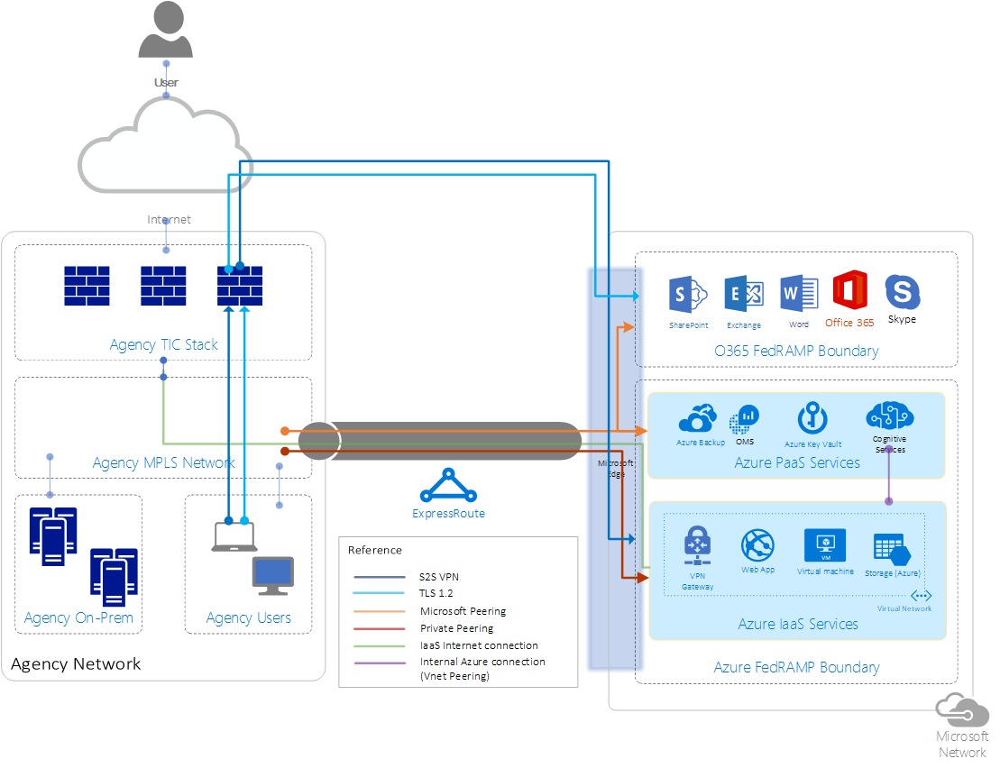
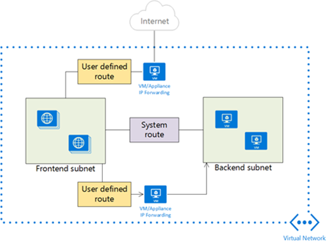
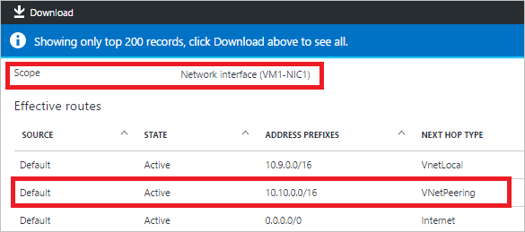
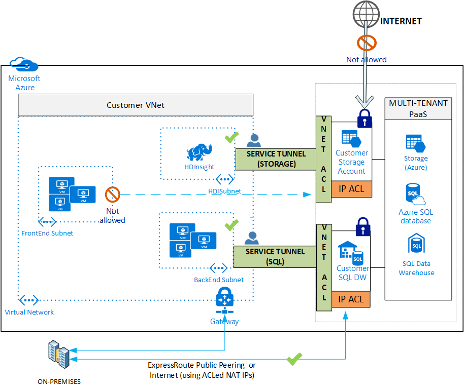
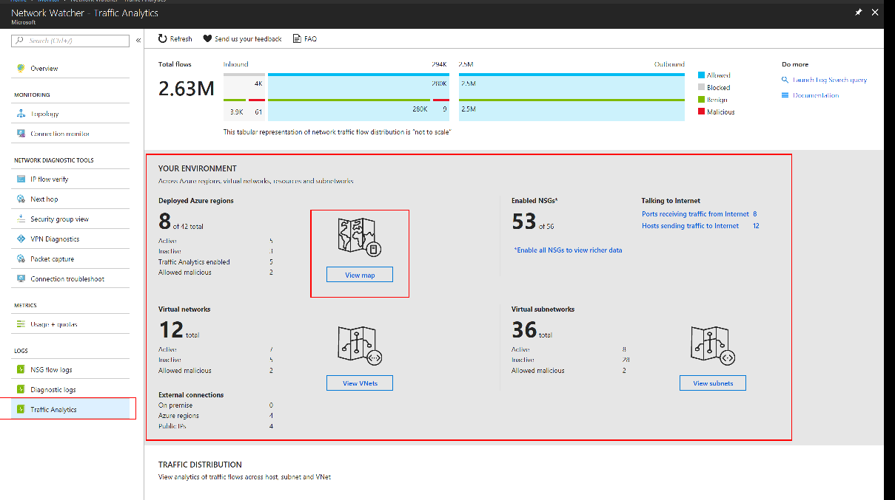

# Trusted Internet Connection Guidance

## Background

The purpose of the Trusted Internet Connections (TIC) Initiative, is to optimize and standardize the security of individual external network connections currently in use by federal agencies. The policy is outlined in the OMB (Office of Management and Budget) [memorandum M-08-05](https://georgewbush-whitehouse.archives.gov/omb/memoranda/fy2008/m08-05.pdf).

In November 2007, the OMB established the TIC program to improve federal network perimeter security and incident response functions. TIC was designed to perform network analysis of all inbound and outbound .gov traffic to identify specific signatures and pattern-based data and uncover behavioral anomalies, such as botnet activity. Agencies were mandated to consolidate their external network connections and have all traffic routed through intrusion detection and prevention devices (known as EINSTEIN) that were hosted at a limited number of network end points (referred to as Trusted Internet Connections).

Simply put, the objective of TIC is for agencies to know:
- Who is on my network (authorized or unauthorized)?
- When is my network being accessed and why?
- What resources are being accessed?

Today all agency external connections must be routed through an OMB-approved TIC. Federal agencies are required to participate in the TIC program either as a TIC Access Provider (TICAP) or by contracting services with one of the major Tier 1 Internet Service Providers referred to as Managed Trusted Internet Protocol Service (MTIPS) providers.  TIC includes mandatory critical capabilities that are performed today by the agency and MTIPS provider. In the current version of TIC, the EINSTEIN 2 intrusion detection and EINSTEIN 3a intrusion prevention devices are deployed at each TICAP and MTIPS and the agency establishes a Memorandum of Understanding with the Department of Homeland Security (DHS) to deploy EINSTEIN capabilities to federal systems.

As part of its responsibility to protect the .gov network, DHS requires raw data feeds of agency Netflow data to correlate incidents across the federal enterprise and perform analyses using specialized tools.NetFlow is a feature that was introduced on Cisco routers that provides the ability to collect IP network traffic as it enters or exits an interface. By analyzing the data provided by NetFlow, a network administrator can determine things such as the source and destination of traffic, class of service, etc. Netflow data is considered “non-content data” (for example, header, source IP, destination IP, etc.) and allows DHS to know information around the content; that is, who was doing what and for how long.

The initiative also includes security policies, guidelines, and frameworks that assume on-premises infrastructure. As government agencies move to the cloud to achieve cost savings, operational efficiency, and innovation, the implementation requirements of TIC are in some cases slowing down network traffic and limiting the speed and agility with which government users can access their cloud-based data.

This article covers how government agencies can use Microsoft Azure Government to achieve compliance with TIC policy across both IaaS and PaaS services.

## Summary of Azure Networking Options

There are three main options when connecting to Azure services:

1. Direct Internet connection: Connect to Azure services directly through an open Internet connection. The medium is public as well as the connection. Application and transport level encryption are relied upon to ensure privacy. Bandwidth is limited by a site’s connectivity to the Internet and multiple active providers can be used to ensure resiliency
1. Virtual Private Network: Connect to your Azure Virtual Network privately using a VPN Gateway.
The medium is public, as it traverses a site’s standard Internet connection but the connection is encrypted in a tunnel to ensure privacy. Bandwidth is limited depending on the VPN devices and the configuration chosen. Azure Point-to-Site connections are typically limited to 100 Mbps while Site-to-Site connections are limited to 1.25 Gbps.
1. Microsoft ExpressRoute: ExpressRoute is a direct connection to Microsoft services. Since connectivity is via an isolated fiber channel, the connection can be public or private depending on the configuration used. The bandwidth is typically limited to a maximum of 10 Gbps.

There are several ways to meet the Trusted Internet Connection Appendix H  (Cloud Considerations) requirements, found in the Department of Homeland Security's, "Trusted Internet Connections (TIC) Reference Architecture Document, Version 2.0". Throughout this document, DHS TIC guidance will be referred to as TIC 2.0.

To enable the connection from the Department or Agency (D/A) to Azure or Office 365, without routing traffic through the D/A TIC, the D/A must use an encrypted tunnel and/or a dedicated connection to the Cloud Service Provider (CSP) services and ensure that connectivity to the D/A cloud assets that are not offered to the public internet, via the cloud,  for agency personnel access.

O365 is compliant with TIC 2.0 Appendix H using either Express Route with Microsoft Peering enabled or an internet connection that encrypts all traffic using TLS 1.2.  D/A end users on the D/A network can connect via their agency network and TIC infrastructure through the internet. All remote internet access to O365 is blocked and routed through the agency. The D/A can also connect to O365 over an Express Route connection with Microsoft peering, which is a type of Public Peering, enabled.  

For Azure only, options 2 (VPN) and 3 (ExpressRoute) can meet these requirements when they are used in conjunction with services that limit access to the Internet.

## How to comply with TIC policy using Azure Infrastructure as a Service offerings

Complying with TIC policy using IaaS is relatively simple since Azure customers manage their own virtual network routing.

The main requirement to comply with the TIC reference architecture is to ensure that your Virtual Network (VNet) becomes a private extension of the Department or Agency's network. To become a _private_ extension, the policy requires no traffic leave your network except via the On-Premises TIC network connection. This process is known as "Force Tunneling", which when used for TIC compliance, is the process of routing all traffic from any system in the CSP environment to go through an on-premises gateway on an organization's network out to the internet through the TIC.

Azure IaaS TIC compliance can be broken into two major steps:

1. Configuration
1. Auditing

### Azure IaaS TIC Compliance Configuration

To configure a TIC-compliant architecture with Azure, you will have to first prevent direct internet access to your virtual network and then force internet traffic through the on-premises network.

#### Prevent Direct Internet Access

Azure IaaS networking is conducted via Virtual Networks comprised of Subnets, to which the Network Interface Controllers (NICs) of Virtual Machines are associated.

The simplest scenario to ensure TIC compliance is to assure that a Virtual Machine, or a collection thereof, cannot connect to any external resources. The disconnection from external networks can be assured using Network Security Groups (NSGs), which can be used to control traffic to one or more NICs or subnets in your virtual network. An NSG contains access control rules that allow or deny traffic based on traffic direction, protocol, source address and port, and destination address and port. The rules of an NSG can be changed at any time, and changes are applied to all associated instances.  To learn more about how to create an NSG, see this article [Creating a NSG](https://docs.microsoft.com/en-us/azure/virtual-network/virtual-networks-create-nsg-arm-pportal).

#### Force Internet Traffic Through On-Premises Network

Azure automatically creates system routes and assigns the routes to each subnet in a virtual network. You can't create system routes, nor can you remove system routes, but you can override some system routes with custom routes. Azure creates default system routes for each subnet, and adds additional optional default routes to specific subnets, or every subnet, when you use specific Azure capabilities. This routing ensures that traffic destined within the Virtual Network stays within the Virtual network, IANA designated private address spaces such as 10.0.0.0/8 are dropped (unless included in the Virtual Network's address space), and the “last-resort” routing of 0.0.0.0/0 to the Virtual Network's Internet endpoint.

To ensure that all traffic traverses the D/A TIC, all traffic leaving the Virtual Network needs to be routed through the On-Premises connection.  You create custom routes by either creating user-defined routes, or by exchanging border gateway protocol (BGP) routes between your on-premises network gateway and an Azure virtual network gateway. More information on User-defined routes can be found at https://docs.microsoft.com/en-us/azure/virtual-network/virtual-networks-udr-overview#user-defined. More information on Border Gateway Protocol can also be found at https://docs.microsoft.com/en-us/azure/virtual-network/virtual-networks-udr-overview#border-gateway-protocol.

#### User-Defined Routes

If you are using a route-based Virtual Network Gateway, force tunneling can be accomplished within Azure by adding a User Defined Route (UDR) setting 0.0.0.0/0 traffic to be routed to a "Next-Hop" of your Virtual Network Gateway. Azure prioritizes User-Defined Routes over System Defined Routes, so this would result in all non-VNet traffic being sent to your  Virtual Network Gateway, which can then route it to On-Premises. Once defined, this User-Defined Route must be associated with all Subnets existing or newly created within all Virtual Networks in your Azure Environment.

#### Border Gateway Protocol

If you are using ExpressRoute or a Border Gateway Protocol (BGP) enabled Virtual Network Gateway, BGP is the preferred mechanism for advertising routes. With a BGP advertised route of 0.0.0.0/0, ExpressRoute and BGP aware Virtual Network Gateways will ensure that this default route is applied to all Subnets within your Virtual Networks.

### Azure IaaS TIC Compliance Auditing

Azure offers multiple ways to audit TIC compliance.

#### Effective Routes

To ensure that your default route has been propagated, you can observe the "Effective Routes" of a particular VM, a specific NIC, or a User-Defined Route Table. This can be done via the Azure portal as described at https://docs.microsoft.com/en-us/azure/virtual-network/virtual-network-routes-troubleshoot-portal, or via PowerShell as described at https://docs.microsoft.com/en-us/azure/virtual-network/virtual-network-routes-troubleshoot-powershell. The Effective Routes blade will allow you to see the relevant User-Defined Routes, BGP advertised routes, and System routes that apply to the relevant entity, as seen below.

**Note**: You cannot view the effective routes for a NIC unless it associated with a running VM.

#### Network Watcher

Azure Network Watcher offers multiple tools that can be used to audit TIC compliance.  Learn more about Network Watcher at https://docs.microsoft.com/en-us/azure/network-watcher/network-watcher-monitoring-overview.

##### Network Security Groups Flow Logs 

Azure Network Watcher provides the capability to capture network flow logs indicating the metadata surrounding IP traffic. In addition to other data, the network flow logs contain the source and destinations addresses of targets. This, combined with logs from the Virtual Network Gateway,  On-Premises edge devices, and/or the TIC, will allow for monitoring that all traffic is indeed being routed On-Premises. 

## How to comply with TIC policy using Azure Platform as a Service offerings

Azure PaaS services such as Azure Storage are accessible through an Internet-reachable URL. Anyone with approved credentials can access the resource, such as a storage account, from any location without traversing a TIC. For this reason, many government customers incorrectly conclude that Azure PaaS services are not compliant with TIC policies. In fact, many Azure PaaS services can be compliant with TIC policy using the same architecture as a TIC-compliant IaaS environment described above if they can be attached to a Virtual Network (VNet). Integrating Azure PaaS services with an Azure VNet allows the service to be privately accessible from that VNet and allows custom routing for 0.0.0.0/0 to be applied via User-Defined Routes or BGP, ensuring that all Internet-bound traffic is routed On-Premises to traverse the TIC.  Some Azure services can be integrated into Vnets using the following patterns:

- **Deploy dedicated instance of service**: An increasing number of PaaS services can be deployed as dedicated instances with VNet attached endpoints. As an example, an App Service Environment (ASE) can be deployed in “Isolated” mode, allowing its network endpoint to be constrained to a VNet. This ASE can then host many Azure PaaS services, such as Web Apps, APIs, and Functions.
- **VNet Service Endpoints**: An increasing number of PaaS services allow the option to move their endpoint to a VNet private IP instead of a public address.

Services that support deployment of dedicated instances into a VNet or Service Endpoints as of May 2018 are listed below:
*(Availability represents Azure Commercial, Azure Government Availability pending).

### Service Endpoints

|Service                   |Status            |
|--------------------------|------------------|
|Azure KeyVault            | Private Preview  |
|Cosmos DB                 | Private Preview  |
|Identity                  | Private Preview  |
|Azure Data Lake           | Private Preview  |
|Sql Postgress/Mysql       | Private Preview  |
|Azure SQL Data Warehouse  | Public Preview   |
|Azure SQL                 | GA               |
|Storage                   | GA               |

### VNet Injection

|Service                            |Status            |
|-----------------------------------|------------------|
|SQL Managed Instance               | Public Preview   |
|Azure Container Service(AKS)       | Public Preview   |
|Service Fabric                     | GA               |
|API Management                     | GA               |
|Azure Active Directory             | GA               |
|Azure Batch                        | GA               |
|ASE                                | GA               |
|Redis                              | GA               |
|HDI                                | GA               |
|Compute virtual machine scale set  | GA               |
|Compute Cloud Service              | GA               |

### VNet Integration Details

The below diagram walks through the general network flow for access to PaaS services using both VNet Injection and VNet Service Tunneling.  Additional information on Network Service Gateways, VNet's and Service Tags can be found here https://docs.microsoft.com/en-us/azure/virtual-network/security-overview#service-tags.

1. Private connection to Azure using ExpressRoute. ExpressRoute private peering with forced tunneling is used to force all Customer VNet traffic over ExpressRoute back to on-premises. Microsoft Peering is not required.
2. Azure VPN Gateway used in conjunction with ExpressRoute Microsoft peering can be used to overlay end-to-end IPSec encryption between the Customer VNet and the on-premises edge. 
3. Network connectivity to the Customer VNet is controlled using Network Security Groups (NSG) allowing customers to permit/deny based on IP, port, and protocol.
4. The Customer VNet is extended to the PaaS service by creating a Service Endpoint for the customer’s service.
5. The PaaS Service Endpoint is secured to default deny all and only permit access from specified subnets within the Customer VNet.  The default deny also includes connections originating from the Internet.
6. Any other Azure services that need to access resources within the Customer VNet should either be:  
  a. Directly deployed into the VNet  
  b. Allowed selectively based on the guidance from the respective Azure service.

#### Option 1: Dedicated Instance "VNet Injection"

With VNet Injection, customers can selectively deploy dedicated instances of a given Azure service, such as HDInsight, into their own VNet. Service instances are deployed into a dedicated subnet in a customer’s VNet. VNet injection allows the service resources to be accessible through the non-Internet routable addresses.  On-premises instances can access these service instances via VNet address space directly via ExpressRoute or Site-to-Site VPN, instead of opening firewalls to public Internet address space. With a dedicated instance attached to an endpoint, the same strategies used for IaaS TIC compliance can be utilized, with default routing ensuring that Internet-bound traffic is redirected to a Virtual Network Gateway bound for On-Premises. Inbound and outbound access can be further controlled through Network Security Groups (NSGs) for the given subnet.

#### Option 2: VNet Service Endpoints 

An increasing number of Azure’s multitenant services offer “Service Endpoint” capability, an alternate method to integrate to Azure VNets. VNet Service Endpoints extend your VNet IP address space and the identity of your VNet to the service over a direct connection.  Traffic from the VNet to the Azure service always stays within the Azure backbone network. Once a Service Endpoint is enabled for a service, connections to the service can be restricted to that VNet via policies exposed by the service. Access checks are enforced in the platform by the Azure Service, and the access to locked resource is granted only if the request originates from the allowed VNet/Subnet, and/or the two IPs used to identify your OnPremises traffic if you use ExpressRoute. This can be used to effectively prevent Inbound/Outbound traffic from directly leaving the PaaS Service.

## Using cloud native tools for network situational awareness

Azure provides cloud native tools to ensure that you have the situational awareness required to understand the traffic flows of your network. They are not required to comply with TIC policy but they can vastly improve your security capabilities.

### Azure Policy

Azure Policy (https://azure.microsoft.com/en-us/services/azure-policy/) is a new Azure service that provides your organization with the ability to audit and enforce compliance initiatives.  Currently available in Public Preview in Azure Commercial Clouds but not yet in Microsoft Azure for Government, TIC-conscious customers can start planning and testing their Policy rules for future compliance assurance.  Azure Policy is targeted at the subscription level, and provides a centralized interface for managing initiatives, policy definitions, auditing and enforcement results, and exception management. In addition to the many built-in Azure Policy definitions, administrators can define their own custom definitions through simple json templating. Microsoft recommends the prioritization of auditing over enforcement where possible.

The following sample policies may be useful for TIC compliance scenarios:

|Policy  |Sample Scenario  |Starting Template  |
|---------|---------|---------|
|Enforce User-Defined Route Table | 	Ensure that the default route on all Virtual Networks points towards an approved Virtual Network Gateway for routing to On Premises	| https://docs.microsoft.com/en-us/azure/azure-policy/scripts/no-user-def-route-table |
|Audit if Network Watcher is not enabled for Region  | Ensure that Network Watcher is enabled for all used regions  | https://docs.microsoft.com/en-us/azure/azure-policy/scripts/net-watch-not-enabled |
|NSG X on every subnet  | Ensure that an NSG (or set of approved NSGs) with Internet traffic blocked is applied to all subnets in every VNet | https://docs.microsoft.com/en-us/azure/azure-policy/scripts/nsg-on-subnet |
|NSG X on every NIC | Ensure that an NSG with Internet traffic blocked is applied to all NICs on all VMs. | https://docs.microsoft.com/en-us/azure/azure-policy/scripts/nsg-on-nic |
|Use approved VNet for VM network interfaces  | Ensure that all NICs are on an approved VNet | https://docs.microsoft.com/en-us/azure/azure-policy/scripts/use-approved-vnet-vm-nics |
|Allowed locations | Ensure that all resources are deployed to regions with compliant VNets and Network Watcher configuration  | https://docs.microsoft.com/en-us/azure/azure-policy/scripts/allowed-locs |
|Not allowed resource types such as PublicIPs  | Prohibit the deployment of resource types, which do not have a compliance plan. As an example, this policy could be used to prohibit the deployment of Public IP address resources. While NSG rules can be used to effectively block inbound Internet traffic, preventing the use of Public IPs further reduces the attack surface.	| https://docs.microsoft.com/en-us/azure/azure-policy/scripts/not-allowed-res-type  |

### Azure Traffic Analytics

Azure Network Watcher’s Traffic Analytics consumes Flow Log data and other logs to provide high-level overview of network traffic, many of which would be useful for auditing TIC compliance and identifying trouble spots. A high-level dashboard can be used to rapidly screen which VMs are communicating with the internet, which would then provide a focused list for TIC routing.

A "Geo Map" can be used to quickly identify the likely physical destinations of Internet traffic for your VMs, allowing you to identify and triage suspicious locations or pattern changes.

A network topology map can be used to rapidly survey existing Virtual Networks:

### Azure Network Watcher Next Hop

Networks in regions monitored by Network Watcher can conduct “Next Hop” tests, allowing easy Portal-based access to type in a source and destination for a sample network flow, for which Network Watcher will resolve the “Next Hop” destination. This can be used against VMs and example Internet addresses to ensure that the “Next Hop” is indeed the Network Virtual Gateway.

## Conclusions

Microsoft Azure, Office 365, and Dynamics 365 access can be easily configured to comply with TIC 2.0 Appendix H guidance as written and defined in May of 2018.  Microsoft is aware that this guidance is subject to change and is committed to helping customers meet the guidance in a timely manner as new guidance is released.

## Appendix: TIC Patterns for Common Workloads

| Category | Workload | IaaS | Dedicated PaaS / /VNet Injection  | Service Endpoints  |
|---------|---------|---------|---------|--------|
| Compute | Linux Virtual Machines | +1 | | |
| Compute | Windows Virtual Machines | +1 | | |
| Compute | Virtual Machine Scale Sets | +1 | | |
| Compute | Azure Functions | | via App Service Environment (ASE) | |
| Web & Mobile | Internal Web Application | | via App Service Environment (ASE) | |
| Web & Mobile | Internal Mobile Application | | via App Service Environment (ASE) | |
| Web & Mobile | API Apps | | via App Service Environment (ASE) | |
| Containers | Azure Container Service (ACS) | | | +1 |
| Containers | Azure Container Service (AKS)* | | | +1 |
| Database | SQL Database | | Azure SQL Database Managed Instance* | Azure SQL |
| Database | Azure Database for MySQL | | | +1 |
| Database | Azure Database for PostgreSQL | | | +1 |
| Database | SQL Data Warehouse | | | +1 |
| Database | Azure Cosmos DB | | | +1 |
| Database | Redis Cache | | +1 | |
| Storage | Blobs | +1 | | |
| Storage | Files | +1 | | |
| Storage | Queues | +1 | | |
| Storage | Tables | +1 | | |
| Storage | Disks | +1 | | |

*: Public Preview in Azure Government as of May 2018  
**: Private Preview in Azure Government as of May 2018

