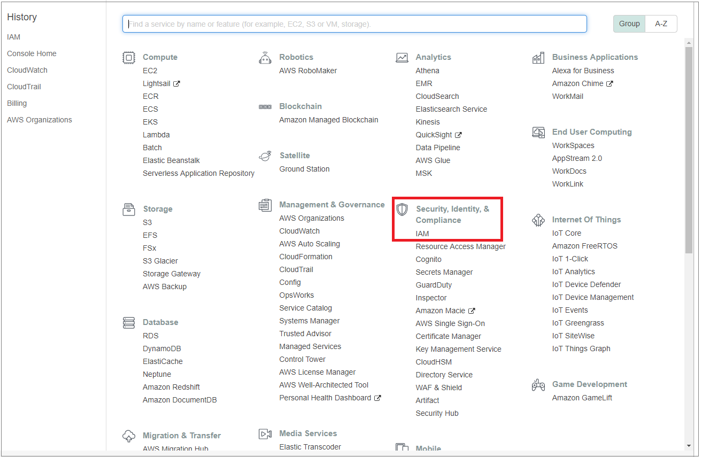
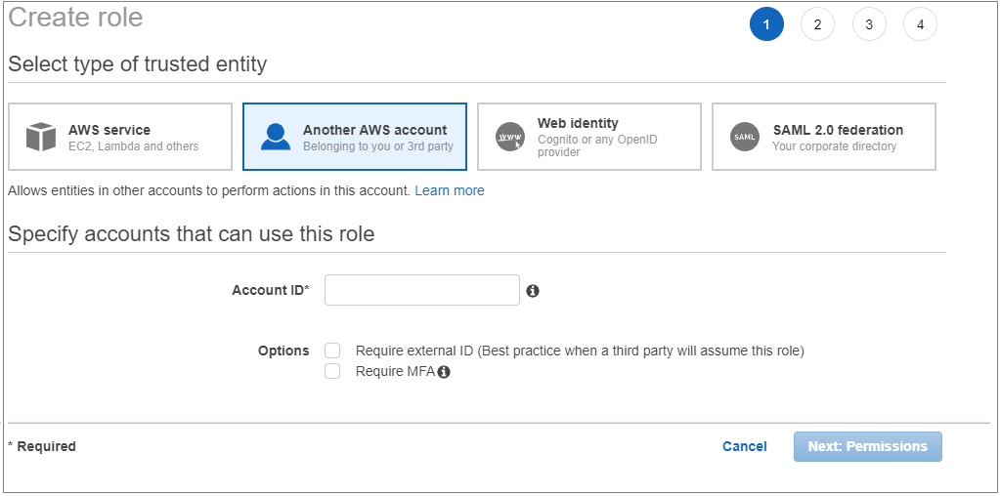
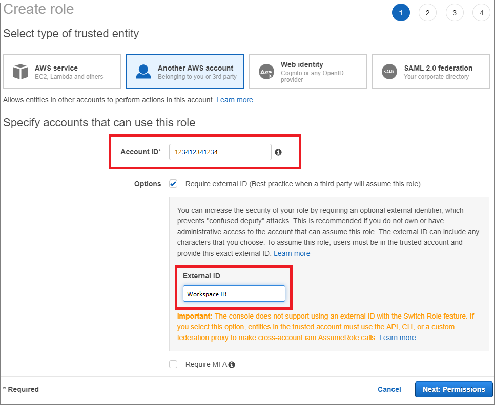
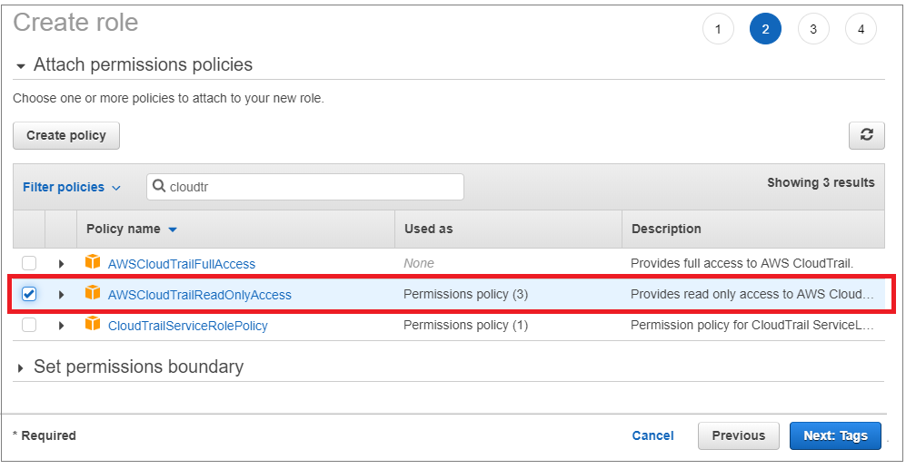
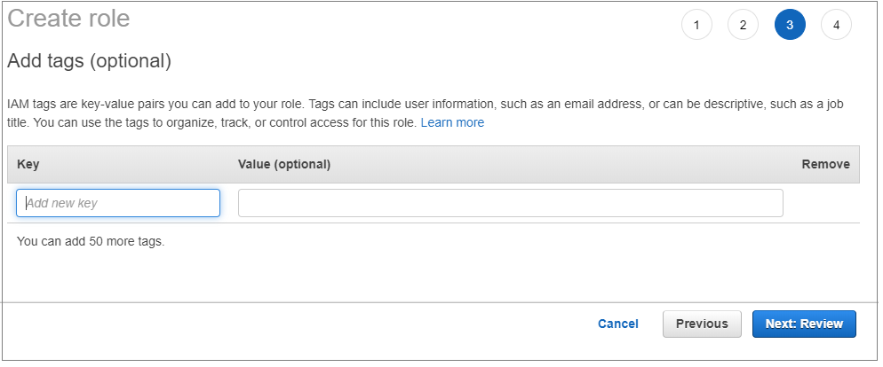
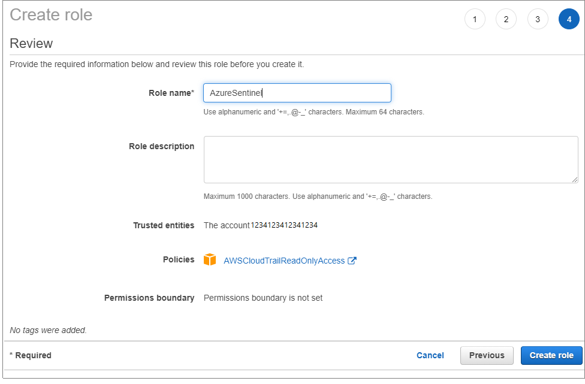
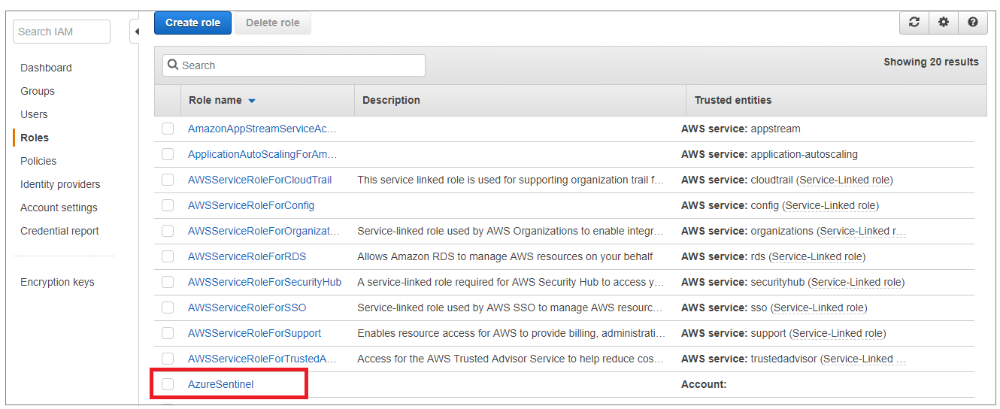
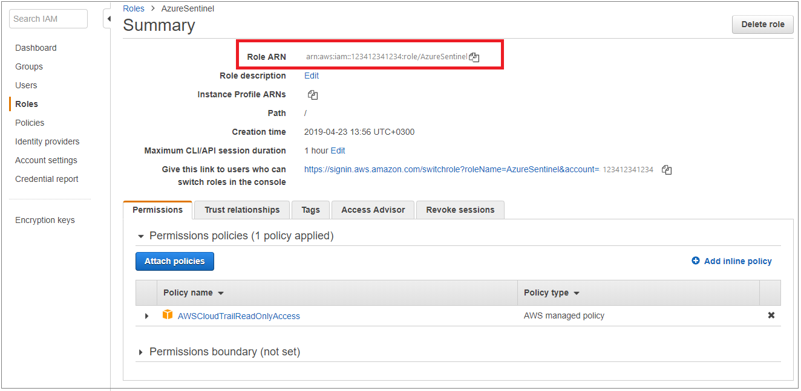

# Connect Azure Sentinel to AWS

Use the AWS connector to stream all your AWS CloudTrail events into Azure Sentinel. This connection process delegates access for Azure Sentinel to your AWS resource logs, creating a trust relationship between AWS CloudTrail and
Azure Sentinel. This is accomplished on AWS by creating a role that gives permission to Azure Sentinel to access your AWS logs.

## Prerequisites

You must have write permission on the Azure Sentinel workspace.

 
1.  In your Amazon Web Services console, under **Security, Identity & Compliance**, click on **IAM**.

    

2.  Choose **Roles** and click **Create role**.

    

3.  Choose **Another AWS account.** In the **Account ID** field, enter the **Microsoft Account ID** (**123412341234**) that can be found in the AWS connector page in the Azure Sentinel portal.

    

4.  Make sure **Require External ID** is selected and then and enter the External ID (Workspace ID) that can be found in the AWS connector page in the Azure Sentinel portal.

    

5.  Under **Attach permissions policy** select **AWSCloudTrailReadOnlyAccess**.

    

6.  Enter a Tag (Optional).

    

7.  Then, enter a **Role name** and click the **Create role** button.

    

8.  In the Roles list, choose the role you created.

    

9.  Copy the **Role ARN** and paste it into the **Role to add** field in the Azure Sentinel Portal.

    

10. To use the relevant schema in Log Analytics for AWS events, search for **AWSCloudTrail**.
