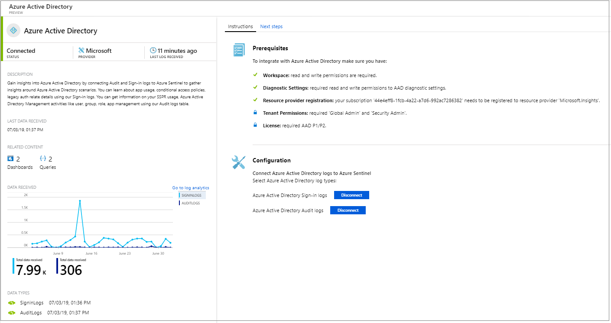
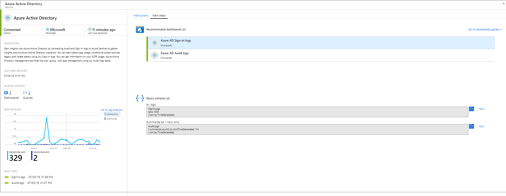

# Connect data sources

To on-board Azure Sentinel, you first need to connect to your data sources. Azure Sentinel comes with a number of connectors for Microsoft solutions, available out of the box and providing real-time integration, including Microsoft Threat Protection solutions, and Microsoft 365 sources, including Office 365, Azure AD, Azure ATP, and Microsoft Cloud App Security, and more. In addition, there are built-in connectors to the broader security ecosystem for non-Microsoft solutions. You can also use common event format, Syslog or REST-API to connect your data sources with Azure Sentinel as well.  

1. On the menu, select **Data connectors**. This page lets you see the full list of connectors that Azure Sentinel provides and their status. Select the connector you want to connect and select **Open connector page**. 

   

1. On the specific connector page, make sure you have fulfilled all the prerequisites and follow the instructions to connect the data to Azure Sentinel. It may take some time for the logs to start syncing with Azure Sentinel. After you connect, you see a summary of the data in the **Data received** graph, and connectivity status of the data types.

   
  
1. Click the **Next steps** tab to get a list of out-of-the-box content Azure Sentinel provides for the specific data type.

   
 

## Data connection methods

The following data connection methods are supported by Azure Sentinel:

- **Microsoft services**:  Microsoft services are connected natively, leveraging the Azure foundation for out-of-the box integration, the following solutions can be connected in a few clicks:
    - [Office 365](connect-office-365.md)
    - [Azure AD audit logs and sign-ins](connect-azure-active-directory.md)
    - [Azure Activity](connect-azure-activity.md)
    - [Azure AD Identity Protection](connect-azure-ad-Identity-protection.md)
    - [Azure Security Center](connect-azure-security-center.md)
    - [Azure Information Protection](connect-azure-information-protection.md)
    - [Azure Advanced Threat Protection](connect-azure-atp.md)
    - [Cloud App Security](connect-cloud-app-security.md)
    - [Windows security events](connect-windows-security-events.md) 
    - [Windows firewall](connect-windows-firewall.md)

- **External solutions via API**: Some data sources are connected using APIs that are provided by the connected data source. Typically, most security technologies provide a set of APIs through which event logs can be retrieved.The APIs connect to Azure Sentinel and gather specific data types and send them to Azure Log Analytics. Appliances connected via API include:
    - [Barracuda](connect-barracuda.md)
    - [Symantec](connect-symantec.md)
- **External solutions via agent**: Azure Sentinel can be connected to all other data sources that can perform real-time log streaming using the Syslog protocol, via an agent.  Most appliances use the Syslog protocol to send event messages that include the log itself and data about the log. The format of the logs varies, but most appliances support the Common Event Format (CEF) standard.  The Azure Sentinel agent, which is based on the Log Analytics agent, converts CEF formatted logs into a format that can be ingested by Log Analytics. Depending on the appliance type, the agent is installed either directly on the appliance, or on a dedicated Linux server. The agent for Linux receives events from the Syslog daemon over UDP, but if a Linux machine is expected to collect a high volume of Syslog events, they are sent over TCP from the Syslog daemon to the agent and from there to Log Analytics.
    - Firewalls, proxies, and endpoints:
        - [F5](connect-f5.md)
        - [Check Point](connect-checkpoint.md)
        - [Cisco ASA](connect-cisco.md)
        - [Fortinet](connect-fortinet.md)
        - [Palo Alto](connect-paloalto.md)
        - [Other CEF appliances](connect-common-event-format.md)
        - [Other Syslog appliances](connect-syslog.md)
    - DLP solutions
    - [Threat intelligence providers](connect-threat-intelligence.md)
    - [DNS machines](connect-dns.md) - agent installed directly on the DNS machine
    - Linux servers
    - Other clouds
    
## Agent connection options

To connect your external appliance to Azure Sentinel, the agent must be deployed on a dedicated machine (VM or on premises) to support the communication between the appliance and Azure Sentinel. You can deploy the agent automatically or manually. Automatic deployment is only available if your dedicated machine is a new VM you are creating in Azure. 

Alternatively, you can deploy the agent manually on an existing Azure VM, on a VM in another cloud, or on an on-premises machine.

## Map data types with Azure Sentinel connection options

| **Data type** | **How to connect** | **Data connector?** | **Comments** |
|------|---------|-------------|------|
| AWSCloudTrail | [Connect AWS](connect-aws.md) | V | |
| AzureActivity | [Connect Azure Activity](connect-azure-activity.md) and [Activity logs overview](../azure-monitor/platform/activity-logs-overview.md)| V | |
| AuditLogs | [Connect Azure AD](connect-azure-active-directory.md)  | V | |
| SigninLogs | [Connect Azure AD](connect-azure-active-directory.md)  | V | |
| AzureFirewall |[Azure Diagnostics](../firewall/tutorial-diagnostics.md) | V | |
| InformationProtectionLogs_CL  | [Azure Information Protection reports](https://docs.microsoft.com/azure/information-protection/reports-aip
)[Connect Azure Information Protection](connect-azure-information-protection.md)  | V | This usually uses the **InformationProtectionEvents** function in addition to the data type. For more information, see [How to modify the reports and create custom queries](https://docs.microsoft.com/azure/information-protection/reports-aip#how-to-modify-the-reports-and-create-custom-queries)|
| AzureNetworkAnalytics_CL  | [Traffic analytic schema](../network-watcher/traffic-analytics.md) [Traffic analytics](../network-watcher/traffic-analytics.md)  | | |
| CommonSecurityLog  | [Connect CEF](connect-common-event-format.md)  | V | |
| OfficeActivity | [Connect Office 365](connect-office-365.md) | V | |
| SecurityEvents | [Connect Windows security events](connect-windows-security-events.md)  | V | For the Insecure Protocols dashboard, see [Insecure protocols dashboard setup](https://blogs.technet.microsoft.com/jonsh/azure-sentinel-insecure-protocols-dashboard-setup/)  |
| Syslog | [Connect Syslog](connect-syslog.md) | V | |
| Microsoft Web Application Firewall (WAF) - (AzureDiagnostics) |[Connect Microsoft Web Application Firewall](connect-microsoft-waf.md) | V | |
| SymantecICDx_CL | [Connect Symantec](connect-symantec.md) | V | |
| ThreatIntelligenceIndicator  | [Connect threat intelligence](connect-threat-intelligence.md)  | V | |
| VMConnection   ServiceMapComputer_CL  ServiceMapProcess_CL|  [Azure Monitor service map](../azure-monitor/insights/service-map.md) [Azure Monitor VM insights onboarding](../azure-monitor/insights/vminsights-onboard.md)   [Enable Azure Monitor VM insights](../azure-monitor/insights/vminsights-enable-overview.md)   [Using Single VM On-boarding](../azure-monitor/insights/vminsights-enable-single-vm.md)   [Using On-boarding Via Policy](../azure-monitor/insights/vminsights-enable-at-scale-policy.md)| X | VM insights dashboard  |
| DnsEvents | [Connect DNS](connect-dns.md) | V | |
| W3CIISLog | [Connect IIS logs](../azure-monitor/platform/data-sources-iis-logs.md)  | X | |
| WireData | [Connect Wire Data](../azure-monitor/insights/wire-data.md) | X | |
| WindowsFirewall | [Connect Windows Firewall](connect-windows-firewall.md) | V | |
| AADIP SecurityAlert  | [Connect Azure AD Identity Protection](connect-azure-ad-identity-protection.md)  | V | |
| AATP SecurityAlert  | [Connect Azure ATP](connect-azure-atp.md) | V | |
| ASC SecurityAlert  | [Connect Azure Security Center](connect-azure-security-center.md)  | V | |
| MCAS SecurityAlert  | [Connect Microsoft Cloud App Security](connect-cloud-app-security.md)  | V | |
| SecurityAlert | | | |
| Sysmon (Event) | [Connect Sysmon](https://azure.microsoft.com/blog/detecting-in-memory-attacks-with-sysmon-and-azure-security-center)  [Connect Windows Events](../azure-monitor/platform/data-sources-windows-events.md)   [Get the Sysmon Parser](https://github.com/Azure/Azure-Sentinel/blob/master/Parsers/SysmonParser.txt)| X | Sysmon collection is not installed by default on virtual machines. For more information on how to install the Sysmon Agent, see [Sysmon](https://docs.microsoft.com/sysinternals/downloads/sysmon). |
| ConfigurationData  | [Automate VM inventory](../automation/automation-vm-inventory.md)| X | |
| ConfigurationChange  | [Automate VM tracking](../automation/change-tracking.md) | X | |
| F5 BIG-IP | [Connect F5 BIG-IP](https://devcentral.f5.com/s/articles/Integrating-the-F5-BIGIP-with-Azure-Sentinel.md)  | X | |
| McasShadowItReporting  |  | X | |
| Barracuda_CL | [Connect Barracuda](connect-barracuda.md) | V | |

## Next steps

- To get started with Azure Sentinel, you need a subscription to Microsoft Azure. If you do not have a subscription, you can sign up for a [free trial](https://azure.microsoft.com/free/).
- Learn how to [onboard your data to Azure Sentinel](quickstart-onboard.md), and [get visibility into your data, and potential threats](quickstart-get-visibility.md).
