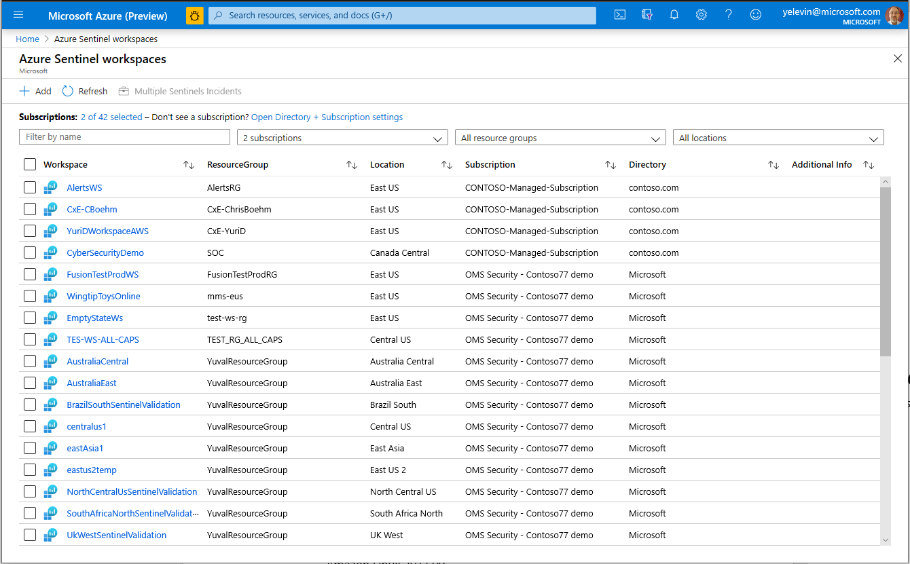
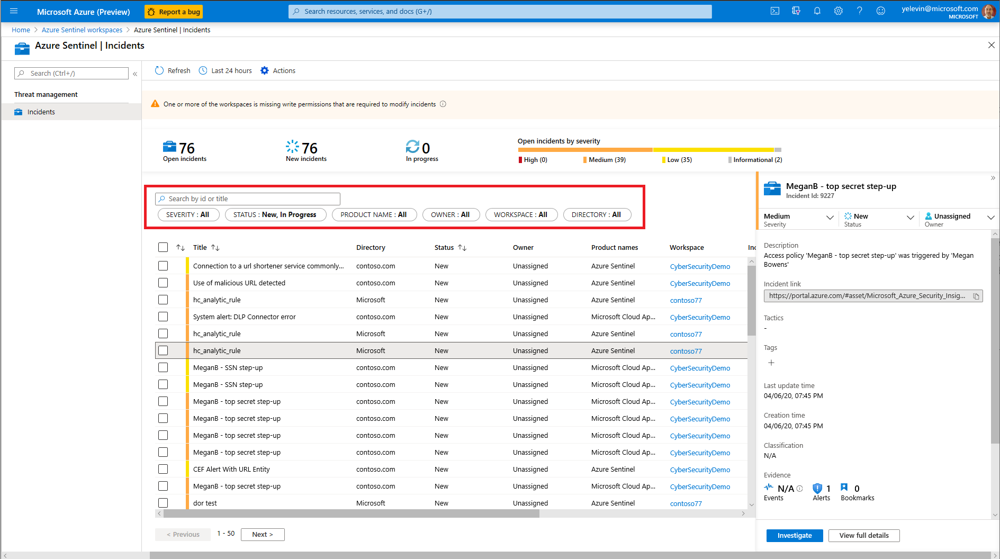

# Work with incidents in many workspaces at once 

 To take full advantage of Azure Sentinel’s capabilities, Microsoft recommends using a single-workspace environment. However, there are some use cases that require having several workspaces, in some cases – for example, that of a [Managed Security Service Provider (MSSP)](./multiple-tenants-service-providers.md) and its customers – across multiple tenants. **Multiple Workspace View** lets you see and work with security incidents across several workspaces at the same time, even across tenants, allowing you to maintain full visibility and control of your organization’s security responsiveness.

## Entering Multiple Workspace View

When you open Azure Sentinel, you are presented with a list of all the workspaces to which you have access rights, across all tenants and all selected subscriptions. To the left of the workspace name is a checkbox. Clicking the name of a single workspace will bring you into that workspace. To choose multiple workspaces, click all the corresponding checkboxes, and then click the **Multiple Workspace View** button at the top of the page.

> [!NOTE]
> Multiple Workspace View currently supports a maximum of 10 concurrently displayed workspaces. 
> 
> If you check more than 10 workspaces, a warning message will appear.

Note that in the list of workspaces, you can see the directory, subscription, and resource group associated with each workspace. The directory corresponds to the tenant.
   

## Working with incidents

In **Multiple Workspace View**, only the **Incidents** screen is available for now. It looks and functions in most ways like the regular **Incidents** screen. There are a few important differences, though:
   

- The counters at the top of the page - Open incidents, New incidents, In progress, etc. - show the numbers for all of the selected workspaces collectively.

## Next steps
In this document, you learned how to manage multiple Azure Sentinel tenants seamlessly. To learn more about Azure Sentinel, see the following articles:
- Learn how to [get visibility into your data, and potential threats](quickstart-get-visibility.md).
- Get started [detecting threats with Azure Sentinel](tutorial-detect-threats-built-in.md).

