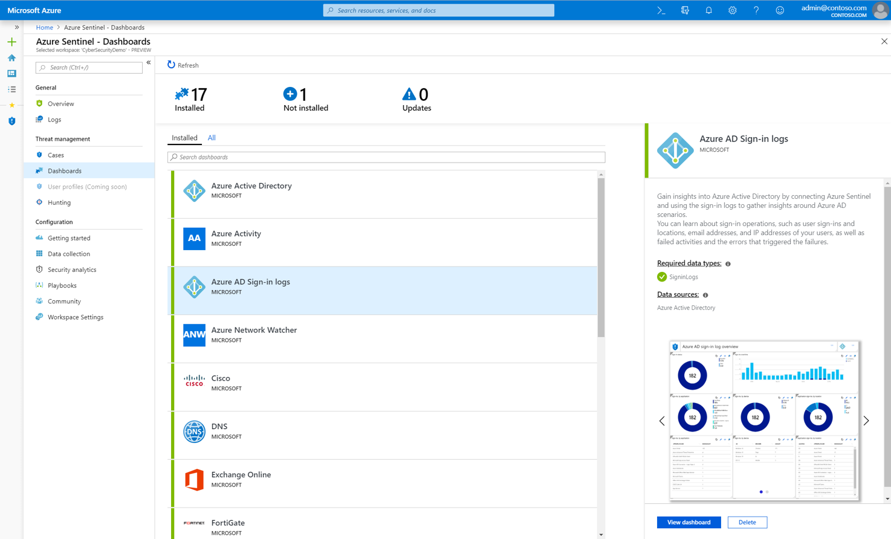
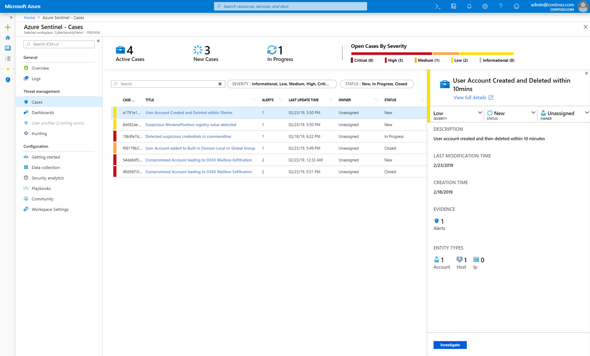
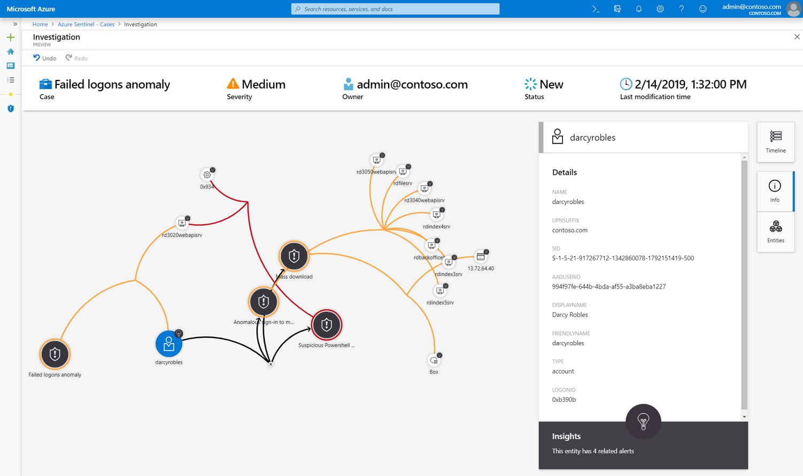
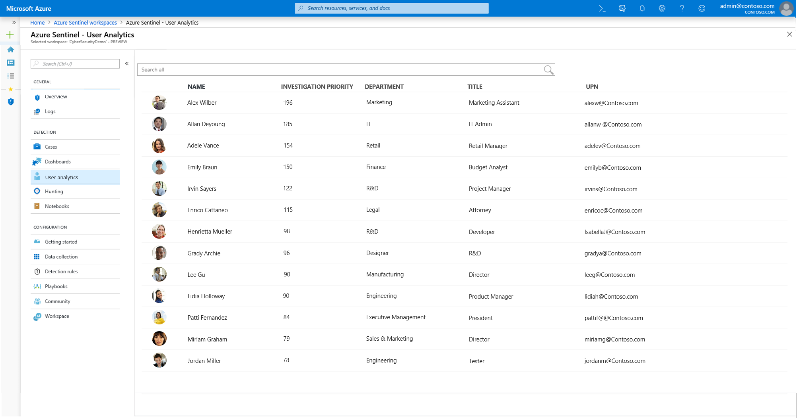

# What is Azure Sentinel?

Microsoft Azure Sentinel is a scalable, cloud-native, **security information and event management (SIEM) and security orchestration and automated response (SOAR)** solution. Azure Sentinel delivers intelligent security analytics and threat intelligence across your enterprise, providing a single solution for alert detection, threat visibility, proactive hunting, and threat response. 

Azure Sentinel is your birds-eye view across your enterprise alleviating the stress of increasingly sophisticated attacks, increasing volumes of alerts, and long resolution timeframes.

- **Collect data at cloud scale** across all users, devices, applications, and infrastructure, both on-premises and in multiple clouds. 

- **Detect previously undetected threats**, and minimize false positives using Microsoft's analytics and unparalleled threat intelligence. 

- **Investigate threats with artificial intelligence**, and hunt for suspicious activities at scale, tapping into years of cyber security work at Microsoft. 

- **Respond to incidents rapidly** with built-in orchestration and automation of common tasks.

Building on the full range of existing Azure services, Azure Sentinel natively incorporates proven foundations, like Log Analytics,and Logic Apps. Azure Sentinel enriches your investigation and detection with AI, and provides Microsoft's threat intelligence stream and enables you to bring your own threat intelligence. 

 
## Connect to all your data

To on-board Azure Sentinel, you first need to connect to your security sources. Azure Sentinel comes with a number of connectors for Microsoft solutions, available out of the box and providing real-time integration, including Microsoft Threat Protection solutions, Microsoft 365 sources, including Office 365, Azure AD, Azure ATP, and Microsoft Cloud App Security, and more. In addition, there are built-in connectors to the broader security ecosystem for non-Microsoft solutions. You can use common event format, Syslog or REST-API to connect your data sources with Azure Sentinel as well.  

Azure Sentinel enables:

- **Effortless data collection from services in the Microsoft ecosystem, including native service-to-service integration of all Microsoft solutions and their raw data:**
    - Azure Information Protection
    - Azure Security Center
    - Azure Advanced Threat Protection
    - Cloud App Security
    - Office 365 
    - Azure AD audit logs and sign-ins
    - Azure Activity
    - Azure AD Identity Protection
- **Integration with other clouds**:
    - AWS
- **Integration with cloud and on-prem data from**:
    - Windows Servers 
    - Linux servers
    - Windows Event Forwarding
    - DNS logs
    - Servers and endpoints
**Integration with any solution supporting Syslog, CEF, and REST API**
    - Firewalls
    - Proxy servers
    - DLP solutions

## Dashboards

After connecting data sources you can choose from a gallery of expertly created dashboards that surface insights from your data sources. Each dashboard is fully customizable - you can add your own logic or modify queries or you can create a dashboard from scratch.

The dashboards provide interactive visualization using advanced analytics to help security analysts get a better understanding of what’s going on during an attack. The investigation tools enable you to deep dive on any field, from any data, to rapidly develop threat context. 

## Security analytics

To help you reduce noise and minimize the number of alerts you have to review and investigate, Azure Sentinel uses a fusion technique to correlate alerts into cases. **Cases** are groups of related alerts that together create an actionable possible-threat that you can investigate and resolve. Use the built-in correlation rules as-is, or use them as a starting point to build your own. Azure Sentinel also provides machine learning rules to map your network behavior and then look for anomalies across your resources. Connecting the dots by combining low fidelity alerts about different entities into potential high-fidelity security incidents.

## Investigation

Azure Sentinel deep investigation tools include helps you to understand the scope and find the root cause of a potential security threat. You  can choose an entity on the interactive graph that allows you to ask interesting questions for a specific entity and drill down into tha entity and its connections to get to the root cause of the threat. 

## Automate & orchestrate responses

Automate your common tasks and simplify security orchestration with playbooks that integrate with Azure services as well as your existing tools. Built on the foundation of Azure Logic Apps, the Azure Sentinel's automation and orchestration solution provides a highly-extensible architecture that enables scalable automation as new technologies and threats emerge. To build playbooks with Azure Logic Apps, you can choose from a growing gallery with [200+ connectors](https://docs.microsoft.com/azure/connectors/apis-list), that include services such as Azure functions that allows you to apply any custom logic in code, ServiceNow, Jira, Zendesk, HTTP requests, Microsoft Teams, Slack, Windows Defender ATP, and Cloud App Security.

For example, if you use the ServiceNow ticketing system, you can use the tools provided to use Azure Logic Apps to automate your workflows and open a ticket in ServiceNow each time a particular event is detected.

## User analytics

With **native integration of machine learning (ML), and user analytics**, Azure Sentinel can help detect threats quickly. Azure Sentinel seamlessly integrates with Azure Advanced Threat Protection to analyze user behavior and prioritize which users you should investigate first, based on their alerts, and suspicious activity patterns across Azure Sentinel and Microsoft 365.

## Hunting

Use Azure Sentinel's powerful hunting search-and-query tools, based on the MITRE framework, which enable you to proactively hunt for security threats across your organization’s data sources, before an alert is triggered. After you discover which hunting query provides high value insights into possible attacks, you can also create custom detection rules based on your query and surface those insights as alerts to your security incident responders. While hunting, you can create bookmarks for interesting events, enabling you to return to them later, share them with others, and group them with other correlating events to create a compelling case for investigation.

## Community

The Azure Sentinel community is a powerful resource for threat detection and automation. Our Microsoft security analysts constantly create and add new dashboards, playbooks, hunting queries, and more, and post them to the community for you to use in your environment. You can download sample content from the private community GitHub [repository](https://aka.ms/asicommunity) to create custom dashboards, hunting queries, notebooks, and playbooks for Azure Sentinel. 

## Next steps

- To get started with Azure Sentinel, you need a subscription to Microsoft Azure. If you do not have a subscription, you can sign up for a [free trial](https://azure.microsoft.com/free/).
- Learn how to [onboard your data to Azure Sentinel](quickstart-onboard.md), and [get visibility into your data, and potential threats](quickstart-get-visibility.md).
