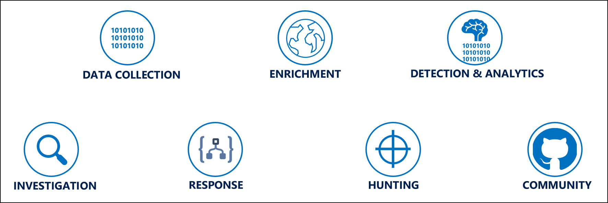

# What is Azure Sentinel?

Azure Sentinel is the first SIEM-as-a-Service that brings the power of the cloud and artificial intelligence to help security operations teams efficiently identify and stop cyber attacks before they cause harm. While the number and type of threats continues to grow, and there's a shortage of security analysts. With so many different providers, it's a challenge for security teams to import and analyze the range of data logs, and traditional SIEMs are hard to maintain and scale. And after the difficult integration, you're left with mountains of unprioritized data that never gets touched. 

Azure Sentinel harnesses the strength of the cloud to make this SIEM easier to update and manage. Building on the full range of existing Azure services, Azure Sentinel natively incorporates powerful engines that have already been tried and tested, like Log Analytics. Azure Sentinel enriches your investigation and detection by providing both Microsoft's threat intelligence stream as well as external threat intelligence streams. Azure Sentinel makes this easier for you, by providing a single dashboard in which to perform investigation and remediation, and provide automation to move smoothly between detection and remediation and to help save you time performing complex investigation. 

## Azure Sentinel capabilities

Azure Sentinel enables seamless data collection from services in the Microsoft ecosystem as well as on-premises data sources like servers, network equipment, and security appliances like firewalls. Azure Sentinel enables data collection in real time to allow for immediate analysis. Data collection methods include agents that are installed directly on monitored event source, collection of data using APIs provided by monitored event source and real-time syslog stream collection.

Azure Sentinel enables connection of:
- Native service-to-service integration of all Microsoft solutions and their raw data.
   - Logs and alerts from Microsoft solutions:
        - Azure Active Directory Identity Protection
        - Azure Security Center
        - Azure Advanced Threat Protection
        - Cloud App Security
        - Office 365 
        - Azure AD audit logs and sign-ins
        - Azure Activity

    - Servers and endpoints:
        - Windows Servers 
        - Linux Servers
        - Windows Event Forwarding
        - DNS Logs
    - Security solutions: supports Syslog via CEF format and REST API
        - Firewall
        - Proxy Servers
        - DLP
        - Syslog
    
## Detections and analytics

Azure Sentinel provides you with custom alerts. You can use the built-in correlation rules designed by Microsoft analysts or use the tools that enable you to build your own. Azure Sentinel also provides machine learning rules that look for anomalies across your resources.

## Investigation

The Azure Sentinel dashboards provide customized views of data ingested to Azure Sentinel.
Azure Sentinel deep investigation tools include interactive visualization and advanced analytics that help you lower the bar to understand what to investigate and help you understand the scope of the incident. You can create custom alert policies that enable your security analysts to define alerts based on data that is ingested in Azure Sentinel.

Azure Sentinel provides interactive visualization using advanced analytics to help security analysts get a better understanding of what’s going on during an attack. The investigation tools enable you to deep dive on any field from any data to rapidly develop threat context.

## Automate & orchestrate responses

Built on the foundation of Azure Logic Apps, the Azure Sentinel automation, and orchestration solution provides a highly extensible architecture that enables scalable automation as new technologies and threats emerge. To build solutions with Azure Logic Apps, you can choose from a growing gallery with [200+ connectors](https://docs.microsoft.com/en-us/azure/connectors/apis-list), that include services such as Azure Service Bus, Functions, and Storage, SQL, Office 365, Dynamics, Salesforce, BizTalk, SAP, Oracle DB, and file shares. 

For example, if you use ServiceNow, you can use the tools provided to use Azure Logic Apps to automate your workflows and open a ticket in ServiceNow each time a particular event is detected.

## Hunting

Use Azure Sentinel' powerful hunting search and query tools to proactively hunt for security threats across your organization’s data sources. After you discover which hunting
query provides high value insights into possible attacks, you can also create custom detection rules based on your query and surface those insights as alerts to your security incident responders.

With Azure Sentinel hunting, you can take advantage of the following capabilities:

-   **Query examples**: To get you started, Azure Sentinel provides preloaded query examples designed to get you started and get you familiar with the tables and the query language.

-   **Powerful query language with IntelliSense**: Hunting is built on top of a query language that gives you the flexibility you need to take hunting to the next level.

-   **Query the stored data**: The data is accessible in tables for you to query. For example, you can query process creation, DNS events, and many other event types.

## Community

The Azure Sentinel community is a powerful resource for threat detection and automation. Our Microsoft security analysts constantly create and add new dashboards and playbooks and post them to the community for you to use in your environment. You can download sample content from the private community GitHub [repository](https://aka.ms/asicommunity) to create custom dashboards, hunting
queries, and playbooks for Azure Sentinel. The GitHub repository contains dashboards and playbooks created by other customers that can also be leveraged in your environment. 

## Next steps

- To get started with Azure Sentinel, you need a subscription to Microsoft Azure. If you do not have a subscription, you can sign up for a [free trial](https://azure.microsoft.com/free/).

