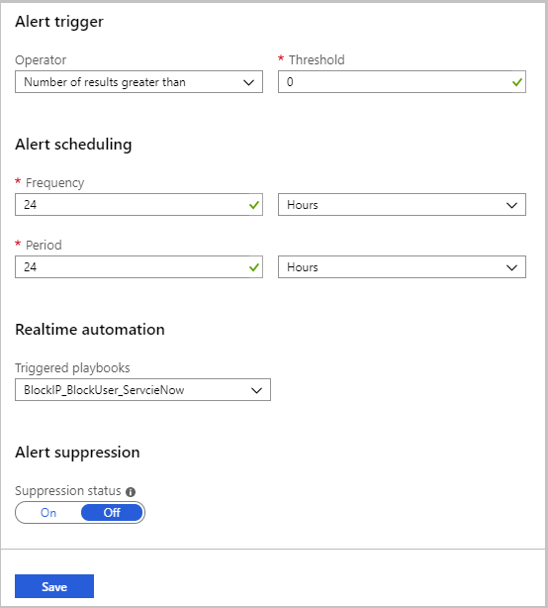

# Tutorial: Detect threats with Azure Sentinel Preview

> [!IMPORTANT]
> Azure Sentinel is currently in public preview.
> This preview version is provided without a service level agreement, and it's not recommended for production workloads. Certain features might not be supported or might have constrained capabilities. 
> For more information, see [Supplemental Terms of Use for Microsoft Azure Previews](https://azure.microsoft.com/support/legal/preview-supplemental-terms/).

After you [connected your data sources](quickstart-onboard.md) to Azure Sentinel, you want to be notified when something suspicious happens. To enable you to do this, Azure Sentinel lets you create advanced alert rules, that generate incidents that you can assign and use to deeply investigate anomalies and threats in your environment. 

This tutorial helps you detect threats with Azure Sentinel.
> [!div class="checklist"]
> * Create detection rules
> * Automate threat responses

## Use out-of-the-box detections

You can enable out-of-the box detections using the templates 
Go to Rule templates. 
There are templates UEBA, scheduled and Microsoft security and fusion
For each you can create as many as you want based on each one 
Mcirosoft security are alerts that we get in sentinel as raw data from other MS security solutions (mcas and aatp, etc).
UEBA - based on ML algorithms - black box, you can't see the logic
Fusion - aggregates from other incidents (take explanation from Ram's article)
For each of these rules you can click create rule and it will make them active. You can do this one time and there are some thing s you can customize, like playbooks for automation.
Fusion is enabled by default.
The scheduled ones you can go in and change and create many of them - they are the only ones in which you can see the logic and make changes and schedule them to run.
For ML, when you click create rule you can select a playbook and create.
For scheduled, When you click create rule it opens the wizard and it's all filled out already and there's a query written. 
For example, you can take the signin by suspicious IP, you can create one for a suspicous user account and create another one for a suspicious IP and save them both indpendently t obe run.
After you created them, you'll see them in the activatedrules tab.

## Automate threat responses

SIEM/SOC teams can be inundated with security alerts on a regular basis. The volume of alerts generated is so huge, that available security admins are overwhelmed. This results all too often in situations where many alerts can't be investigated, leaving the organization vulnerable to attacks that go unnoticed. 

Many, if not most, of these alerts conform to recurring patterns that can be addressed by specific and defined remediation actions. Azure Sentinel already enables you to define your remediation in playbooks. It is also possible to set real-time automation as part of your playbook definition to enable you to fully automate a defined response to particular security alerts. Using real-time automation, response teams can significantly reduce their workload by fully automating the routine responses to recurring types of alerts, allowing you to concentrate more on unique alerts, analyzing patterns, threat hunting, and more.

To automate responses:

1. Choose the alert for which you want to automate the response.
1. From the Azure Sentinel workspace navigation menu, select **Analytics**.
1. Select the alert you want to automate. 
1. In the **Edit alert rule** page, under **Real-time automation**, choose the **Triggered playbook** you want to run when this alert rule is matched.
1. Select **Save**.

   

In addition, you can manually remediate an alert by running a playbook from inside the alert, by clicking **View playbooks** and then selecting a playbook to run. To learn how to create a new playbook or edit an existing one, see [Working with playbooks in Azure Sentinel](tutorial-respond-threats-playbook.md).

## Next steps
In this tutorial, you learned how to get started detecting threats using Azure Sentinel. 

To learn how to automate your responses to threats, [how to respond to threats using automated playbooks](tutorial-respond-threats-playbook.md).
> [!div class="nextstepaction"]
> [Respond to threats](tutorial-respond-threats-playbook.md) to automate your responses to threats.

