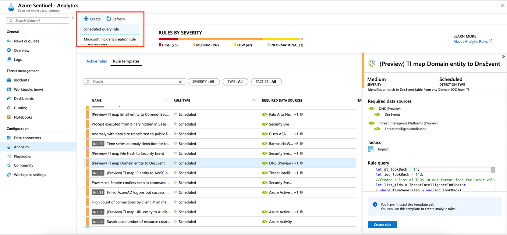
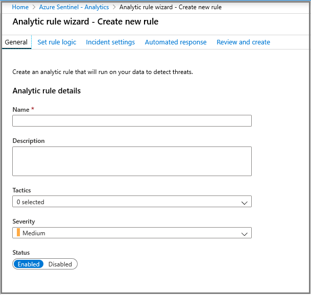
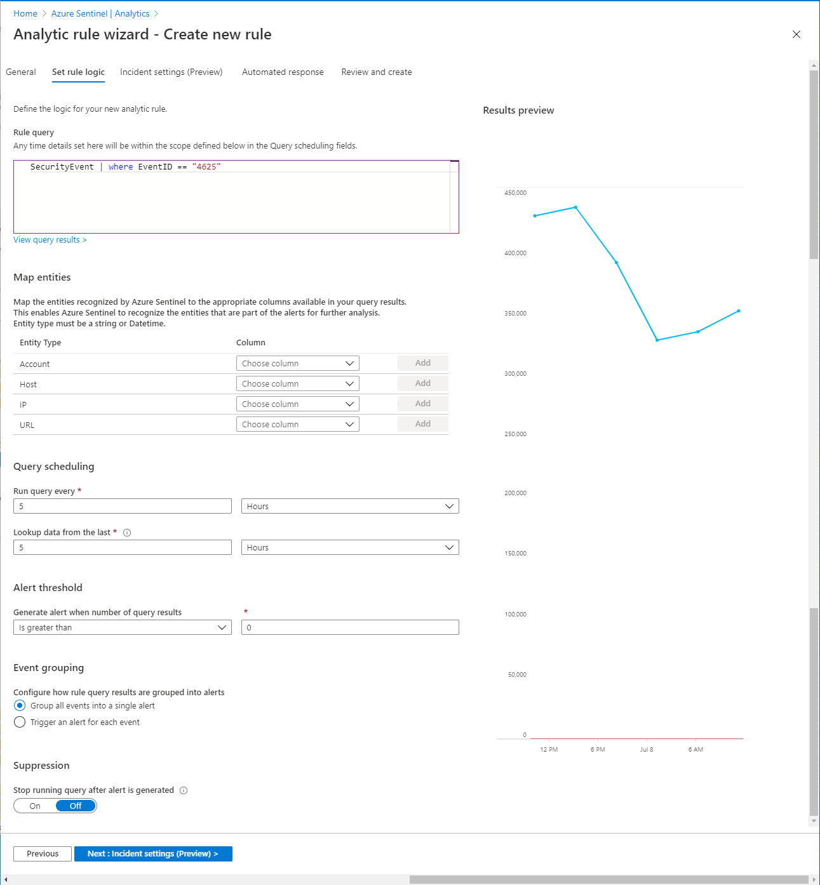

---
title: Create custom analytic rules to detect suspicious threats with Azure Sentinel| Microsoft Docs
description: Use this tutorial to learn how to Create custom analytic rules to detect suspicious threats with Azure Sentinel.
services: sentinel
documentationcenter: na
author: rkarlin
manager: rkarlin
editor: ''

ms.service: azure-sentinel
ms.subservice: azure-sentinel
ms.devlang: na
ms.topic: conceptual
ms.tgt_pltfrm: na
ms.workload: na
ms.date: 02/20/2020
ms.author: rkarlin

---
# Tutorial: Create custom analytic rules to detect suspicious threats

After you [connected your data sources](quickstart-onboard.md) to Azure Sentinel, you can create custom rules that can search for specific criteria across your environment and generate incidents when the criteria are matched so that you can investigate them. This tutorial helps you create custom rules to detect threats with Azure Sentinel.

This tutorial helps you detect threats with Azure Sentinel.
> [!div class="checklist"]
> * Create analytic rules
> * Automate threat responses

## Create custom analytic rules

You can create custom analytic rules to help you search for the types of threats and anomalies that are suspicious in your environment. The rule makes sure you are notified right away, so that you can triage, investigate, and remediate the threats.

1. In the Azure portal under Azure Sentinel, select **Analytics**.

1. In the top menu bar, select **+Create** and select **Scheduled query rule**. This opens the **Analytics rule wizard**.

    

1. In the **General** tab, provide a unique **Name**, and a **Description**. In the **Tactics** field, you can choose from among categories of attacks by which to classify the rule. Set the alert **Severity** as necessary.When you create the rule, its **Status** is **Enabled** by default, which means it will run immediately after you finish creating it. If you don’t want it to run immediately, select **Disabled**, and the rule will be added to your **Active rules** tab and you can enable it from there when you need it.

    

1. In the **Set rule logic** tab, you can either write a query directly in the **Rule query** field, or create the query in Log Analytics, and then copy and paste it there.
 
   

   - See the **Results preview** area to the right, where Azure Sentinel shows the number of results (log events) the query will generate,changing on-the-fly as you write and configure your query. The graph shows the number of results over the defined time period, which is determined by the settings in the **Query scheduling** section.
    - If you see that your query would trigger too many or too frequent alerts, you can set a baseline in the **Alert threshold** section.

      Here's a sample query that would alert you when an anomalous number of resources is created in Azure Activity.

      `AzureActivity
     \| where OperationName == "Create or Update Virtual Machine" or OperationName =="Create Deployment"
     \| where ActivityStatus == "Succeeded"
     \| make-series dcount(ResourceId)  default=0 on EventSubmissionTimestamp in range(ago(7d), now(), 1d) by Caller`

      > [!NOTE]
      > The query length should be between 1 and 10,000 characters and cannot contain “search \*” or “union \*”.

    1. Use the **Map entities** section to link parameters from your query results to Azure Sentinel-recognized entities. These entities form the basis for further analysis, including the grouping of alerts into incidents in the **Incident settings** tab.
    1. In the **Query scheduling** section, set the following parameters:

       1. Set **Run query every** to control how often the query is run - as frequently as every 5 minutes or as infrequently as once a day.

       1. Set **Lookup data from the last** to determine the time period of the data covered by the query - for example, it can query the past 10 minutes of data, or the past 6 hours of data.

       > [!NOTE]
       > These two settings are independent of each other, up to a point. You can run a query at a short interval covering a time period longer than the interval (in effect having overlapping queries), but you cannot run a query at an interval that exceeds the coverage period, otherwise you will have gaps in the overall query coverage.

    1. Use the **Alert threshold** section to define a baseline. For example, set **Generate alert when number of query results** to **Is greater than** and enter the number 1000 if you want the rule to generate an alert only if the query generates more than 1000 results each time it runs. As this is a required field, if you don’t want to set a baseline – that is, if you want your alert to register every event – enter 0 in the number field.

    1. In the **Suppression** section, you can turn the **Stop running query after alert is generated** setting **On** if, once you get an alert, you want to suspend the operation of this rule for a period of time exceeding the query interval. If you turn this on, you must set **Stop running query for** to the amount of time the query should stop running, up to 24 hours.

1. In the **Incident Settings** tab, you can choose whether and how Azure Sentinel turns alerts into actionable incidents. If this tab is left alone, Azure Sentinel will create a single, separate incident from each and every alert. You can choose to have no incidents created, or to group several alerts into a single incident, by changing the settings in this tab.

    1. In the **Incident Settings** section, **Create incidents from alerts triggered by this analytics rule** is set by default to **Enabled**, meaning that Azure Sentinel will create a single, separate incident from each and every alert triggered by the rule.  If you don’t want this rule to result in the creation of any incidents (for example, if this rule is just to collect information for subsequent analysis), set this to **Disabled**.

    1. In the **Alert grouping** section, if you want a single incident to be generated from a group of similar or recurring alerts, set **Group related alerts, triggered by this analytics rule, into incidents** to **Enabled**, and set the following parameters.

    1. **Limit the group to alerts created within the selected time frame**:   Determine the time frame within which the similar or recurring alerts will be grouped together. All of the corresponding alerts within this time frame will collectively generate an incident or a set of incidents (depending on the grouping settings below). Alerts outside this time frame will generate a separate incident or set of incidents.

    2. **Group alerts triggered by this analytics rule into a single incident by**: Choose the basis on which alerts will be grouped together:

        - **Group alerts into a single incident if all the entities match**:   Alerts are grouped together if they share identical values for each of the mapped entities (defined in the Set rule logic tab above). This is the recommended setting.

        - **Group all alerts triggered by this rule into a single incident**:   All the alerts generated by this rule are grouped together even if they share no identical values.

        - **Group alerts into a single incident if the selected entities match**:   Alerts are grouped together if they share identical values for some of the mapped entities (that you can select from the drop-down list). You might want to use this setting if, for example, you want to create separate incidents based on the source or target IP addresses.

    3. **Re-open closed matching incidents**: If an incident has been closed (meaning the underlying issue has been resolved), and subsequently another alert is generated that would have been grouped into that incident, set this setting to **Enabled** if you want the closed incident re-opened, and leave as **Disabled** if you want the alert to create a new incident.

1. In the **Automated responses** tab, select any playbooks you want to run automatically when an alert is generated by the custom rule. For more information on creating and automating playbooks, see [Respond to threats](tutorial-respond-threats-playbook.md).

    

1. Select **Review and create** to review all the settings for your new alert rule and then select **Create to initialize your alert rule**.

   

1. After the alert is created, a custom rule is added to the table under **Active rules**. From this list you can enable, disable, or delete each rule.

1. To view the results of the alert rules you create, go to the **Incidents** page, where you can triage, [investigate incidents](tutorial-investigate-cases.md), and remediate the threats.

> [!NOTE]
> Alerts generated in Azure Sentinel are available through [Microsoft Graph Security](https://aka.ms/securitygraphdocs). For more information, see the [Microsoft Graph Security alerts documentation](https://aka.ms/graphsecurityreferencebetadocs).

## Next steps

In this tutorial, you learned how to get started detecting threats using Azure Sentinel.

To learn how to automate your responses to threats, [Set up automated threat responses in Azure Sentinel](tutorial-respond-threats-playbook.md).

