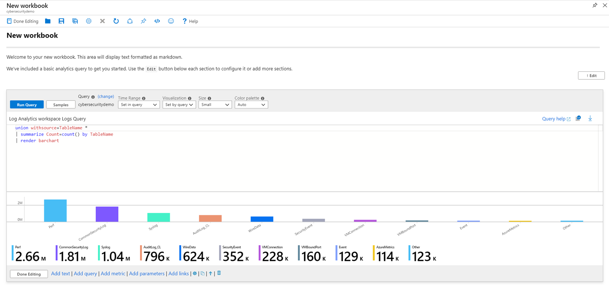

# Tutorial: Monitor your data

After you [connected your data sources](quickstart-onboard.md) to Azure Sentinel, you can monitor the data using the Azure Sentinel integration with Azure Monitor Workbooks, which provides versatility in creating custom dashboards. While the dashboards based on Workbooks are displayed differently in Azure Sentinel, it may be useful for you to see how to [Create interactive reports with Azure Monitor Workbooks](../azure-monitor/app/usage-workbooks.md). Azure Sentinel allows you to create custom workbooks across your data, and also comes with built-in workbooks to allow you to quickly gain insights across your data as soon as you connect a data source.

This tutorial helps you monitor your data in Azure Sentinel.
> [!div class="checklist"]
> * Use built-in workbooks
> * Create new workbooks

## Prerequisites

- You must have at least Workbook reader or Workbook contributor permissions on the resource group of the Azure Sentinel workspace.

- The workbooks that you can see in Azure Sentinel are saved within the Azure Sentinel's workspace resource group and are tagged by the workspace in which they were created.

## Use built-in workbooks

1. Go to **Workbooks** and then select **Templates** to see the full list of Azure Sentinel built-in workbooks. To see which are relevant to the data types you have connected, the **Required data types** field in each workbook will list the data type next to a green check mark if you already stream relevant data to Azure Sentinel.
  
1. Click **View template** to see the template populated with your data.
  
1. To edit the workbook, select **Save**, and then select the location where you want to save the json file for the template. 
   > [!NOTE]
   > This saves only the template, not the data inside the template

1. Select **View workbook**. Then, click the **Edit** button at the top. You can now edit the workbook and customize it according to your needs. For more information on how to customize the workbook, see how to [Create interactive reports with Azure Monitor Workbooks](../azure-monitor/app/usage-workbooks.md).

1. After you make your changes, you can save the workbook making sure to save it under the same subscription and resource group. These workbooks are displayed under the **My workbook** tab.

## Create new workbook

1. Go to **Workbooks** and then select **Add workbook** to create a new workbook from scratch.
  

1. To create the workbook, select **Edit**, and then add text, queries, and parameters as necessary. For more information on how to customize the workbook, see how to [Create interactive reports with Azure Monitor Workbooks](../azure-monitor/app/usage-workbooks.md). 

1. When building a query, make sure that the **Data source** is set to **Logs**, the **Resource type** is set to **Log Analytics** and then choose the relevant workspace(s). 

1. After you create your workbook, save the workbook making sure to save it under the same subscription and resource group.

1. If you want to let others in your organization use the workbook, under **Save to** select **Shared reports**. If you want this workbook to be available only to you, select **My reports**.

1. Under the settings cog, you can see a list of the resources from which this workbook takes data. Make sure that the Azure Sentinel workspace and resource group are listed as resources. These workbooks are displayed under the **My workbooks** tab.

## Next steps

In this tutorial, you learned how to view your data in Azure Sentinel.

To learn how to automate your responses to threats, [how to respond to threats using automated playbooks](tutorial-respond-threats-playbook.md).

[Respond to threats](tutorial-respond-threats-playbook.md) to automate your responses to threats.
