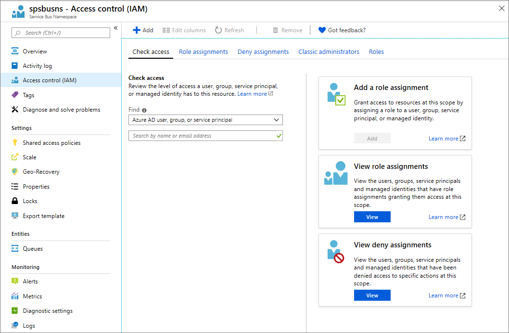
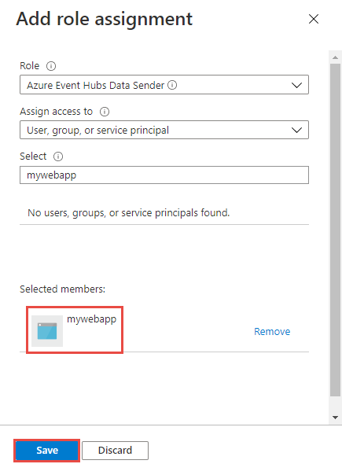
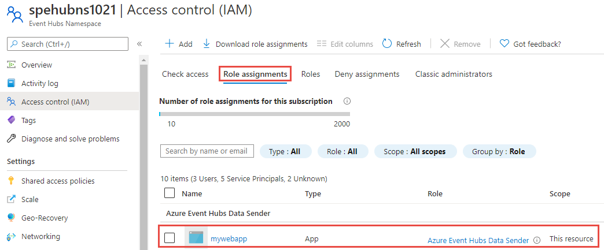
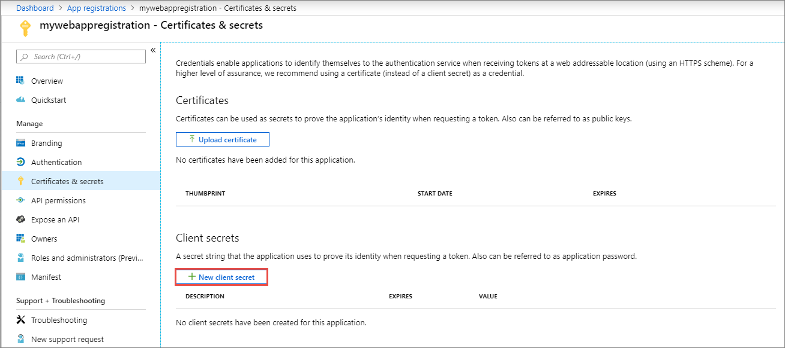
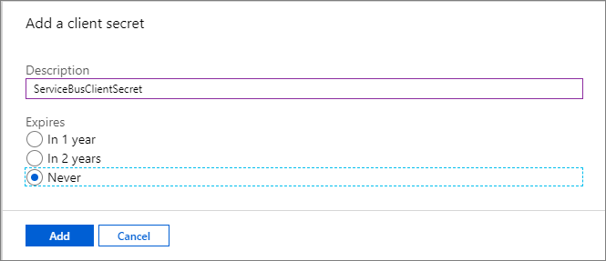

# Authenticate and authorize an application with Azure Active Directory to access Azure Service Bus entities
Azure Service Bus supports using Azure Active Directory (Azure AD) to authorize requests to Service Bus entities (queues, topics, subscriptions, or filters). With Azure AD, you can use role-based access control (RBAC) to grant permissions to a security principal, which may be a user, group, or application service principal. To learn more about roles and role assignments, see [Understanding the different roles](../role-based-access-control/overview.md).

## Overview
When a security principal (a user, group, or application) attempts to access a Service Bus entity, the request must be authorized. With Azure AD, access to a resource is a two-step process. 

 1. First, the security principal’s identity is authenticated, and an OAuth 2.0 token is returned. The resource name to request a token is `https://servicebus.azure.net`.
 1. Next, the token is passed as part of a request to the Service Bus service to authorize access to the specified resource.

The authentication step requires that an application request contains an OAuth 2.0 access token at runtime. If an application is running within an Azure entity such as an Azure VM,  a virtual machine scale set, or an Azure Function app, it can use a managed identity to access the resources. To learn how to authenticate requests made by a managed identity to Service Bus service, see [Authenticate access to Azure Service Bus resources with Azure Active Directory and managed identities for Azure Resources](service-bus-managed-service-identity.md). 

The authorization step requires that one or more RBAC roles be assigned to the security principal. Azure Service Bus provides RBAC roles that encompass sets of permissions for Service Bus resources. The roles that are assigned to a security principal determine the permissions that the principal will have. To learn more about assigning RBAC roles to Azure Service Bus, see [Azure built-in roles for Azure Service Bus](#built-in-rbac-roles-for-azure-service-bus). 

Native applications and web applications that make requests to Service Bus can also authorize with Azure AD. This article shows you how to request an access token and use it to authorize requests for Service Bus resources. 

## Assigning RBAC roles for access rights
Azure Active Directory (Azure AD) authorizes access rights to secured resources through [role-based access control (RBAC)](../role-based-access-control/overview.md). Azure Service Bus defines a set of Azure built-in roles that encompass common sets of permissions used to access Service Bus entities and you can also define custom roles for accessing the data.

When an RBAC role is assigned to an Azure AD security principal, Azure grants access to those resources for that security principal. Access can be scoped to the level of subscription, the resource group, or the Service Bus namespace. An Azure AD security principal may be a user, a group, an application service principal, or a [managed identity for Azure resources](../active-directory/managed-identities-azure-resources/overview.md).

## Azure built-in roles for Azure Service Bus
For Azure Service Bus, the management of namespaces and all related resources through the Azure portal and the Azure resource management API is already protected using the *role-based access control* (RBAC) model. Azure provides the below Azure built-in roles for authorizing access to a Service Bus namespace:

- [Azure Service Bus Data Owner](../role-based-access-control/built-in-roles.md#azure-service-bus-data-owner): Enables data access to Service Bus namespace and its entities (queues, topics, subscriptions, and filters)
- [Azure Service Bus Data Sender](../role-based-access-control/built-in-roles.md#azure-service-bus-data-sender): Use this role to give send access to Service Bus namespace and its entities.
- [Azure Service Bus Data Receiver](../role-based-access-control/built-in-roles.md#azure-service-bus-data-receiver): Use this role to give receiving access to Service Bus namespace and its entities. 

## Resource scope 
Before you assign an RBAC role to a security principal, determine the scope of access that the security principal should have. Best practices dictate that it's always best to grant only the narrowest possible scope.

The following list describes the levels at which you can scope access to Service Bus resources, starting with the narrowest scope:

- **Queue**, **topic**, or **subscription**: Role assignment applies to the specific Service Bus entity. Currently, the Azure portal doesn't support assigning users/groups/managed identities to Service Bus RBAC roles at the subscription level. 
- **Service Bus namespace**: Role assignment spans the entire topology of Service Bus under the namespace and to the consumer group associated with it.
- **Resource group**: Role assignment applies to all the Service Bus resources under the resource group.
- **Subscription**: Role assignment applies to all the Service Bus resources in all of the resource groups in the subscription.

> [!NOTE]
> Keep in mind that RBAC role assignments may take up to five minutes to propagate. 

For more information about how built-in roles are defined, see [Understand role definitions](../role-based-access-control/role-definitions.md#management-and-data-operations). For information about creating Azure custom roles, see [Azure custom roles](../role-based-access-control/custom-roles.md).

## Assign RBAC roles using the Azure portal  
To learn more on managing access to Azure resources using RBAC and the Azure portal, see [this article](..//role-based-access-control/role-assignments-portal.md). 

After you've determined the appropriate scope for a role assignment, navigate to that resource in the Azure portal. Display the access control (IAM) settings for the resource, and follow these instructions to manage role assignments:

> [!NOTE]
> The steps described below assigns a role to your Service Bus namespace. You can follow the same steps to assign a role to other supported scopes (resource group, subscription, etc.).

1. In the [Azure portal](https://portal.azure.com/), navigate to your Service Bus namespace. Select **Access Control (IAM)** on the left menu to display access control settings for the namespace. If you need to create a Service Bus namespace, follow instructions from this article: [Create a Service Bus Messaging namespace](service-bus-create-namespace-portal.md).

    
1. Select the **Role assignments** tab to see the list of role assignments. Select the **Add** button on the toolbar and then select **Add role assignment**. 

    
1. On the **Add role assignment** page, do the following steps:
    1. Select the **Service Bus role** that you want to assign. 
    1. Search to locate the **security principal** (user, group, service principal) to which you want to assign the role.
    1. Select **Save** to save the role assignment. 

        
    4. The identity to whom you assigned the role appears listed under that role. For example, the following image shows that Azure-users is in the Azure Service Bus Data Owner role. 
        
        

You can follow similar steps to assign a role scoped to a resource group, or a subscription. Once you define the role and its scope, you can test this behavior with the [samples on GitHub](https://github.com/Azure/azure-service-bus/tree/master/samples/DotNet/Microsoft.ServiceBus.Messaging/RoleBasedAccessControl).

## Authenticate from an application
A key advantage of using Azure AD with Service Bus is that your credentials no longer need to be stored in your code. Instead, you can request an OAuth 2.0 access token from Microsoft identity platform. Azure AD authenticates the security principal (a user, a group, or service principal) running the application. If authentication succeeds, Azure AD returns the access token to the application, and the application can then use the access token to authorize requests to Azure Service Bus.

Following sections shows you how to configure your native application or web application for authentication with Microsoft identity platform 2.0. For more information about Microsoft identity platform 2.0, see [Microsoft identity platform (v2.0) overview](../active-directory/develop/v2-overview.md).

For an overview of the OAuth 2.0 code grant flow, see [Authorize access to Azure Active Directory web applications using the OAuth 2.0 code grant flow](../active-directory/develop/v2-oauth2-auth-code-flow.md).

### Register your application with an Azure AD tenant
The first step in using Azure AD to authorize Service Bus entities is registering your client application with an Azure AD tenant from the [Azure portal](https://portal.azure.com/). When you register your client application, you supply information about the application to AD. Azure AD then provides a client ID (also called an application ID) that you can use to associate your application with Azure AD runtime. To learn more about the client ID, see [Application and service principal objects in Azure Active Directory](../active-directory/develop/app-objects-and-service-principals.md). 

The following images show steps for registering a web application:

> [!Note]
> If you register your application as a native application, you can specify any valid URI for the Redirect URI. For native applications, this value does not have to be a real URL. For web applications, the redirect URI must be a valid URI, because it specifies the URL to which tokens are provided.

After you've registered your application, you'll see the **Application (client) ID** under **Settings**:

For more information about registering an application with Azure AD, see [Integrating applications with Azure Active Directory](../active-directory/develop/quickstart-v2-register-an-app.md).

> [!IMPORTANT]
> Make note of the **TenantId** and the **ApplicationId**. You will need these values to run the application.

### Create a client secret   
The application needs a client secret to prove its identity when requesting a token. To add the client secret, follow these steps.

1. Navigate to your app registration in the Azure portal if you aren't already on the page.
1. Select **Certificates & secrets** on the left menu.
1. Under **Client secrets**, select **New client secret** to create a new secret.

    
1. Provide a description for the secret, and choose the wanted expiration interval, and then select **Add**.

    
1. Immediately copy the value of the new secret to a secure location. The fill value is displayed to you only once.

    

### Permissions for the Service Bus API
If your application is a console application, you must register a native application and add API permissions for **Microsoft.ServiceBus** to the **required permissions** set. Native applications also need a **redirect-URI** in Azure AD, which serves as an identifier; the URI does not need to be a network destination. Use `https://servicebus.microsoft.com` for this example, because the sample code already uses that URI.

### Client libraries for token acquisition  
Once you've registered your application and granted it permissions to send/receive data in Azure Service Bus, you can add code to your application to authenticate a security principal and acquire OAuth 2.0 token. To authenticate and acquire the token, you can use either one of the [Microsoft identity platform authentication libraries](../active-directory/develop/reference-v2-libraries.md) or another open-source library that supports OpenID or Connect 1.0. Your application can then use the access token to authorize a request against Azure Service Bus.

For a list of scenarios for which acquiring tokens is supported, see the [Scenarios](https://aka.ms/msal-net-scenarios) section of the [Microsoft Authentication Library (MSAL) for .NET](https://github.com/AzureAD/microsoft-authentication-library-for-dotnet) GitHub repository.

## Sample on GitHub
See the following sample on GitHub: [Role-base access control for Service Bus](https://github.com/Azure/azure-service-bus/tree/master/samples/DotNet/Microsoft.ServiceBus.Messaging/RoleBasedAccessControl). 

Use the **Client Secret Login** option, not the **Interactive User Login** option. When you use the client secret option, you don't see a pop-up window. The application utilizes the tenant ID and app ID for authentication. 

### Run the sample

Before you can run the sample, edit the **app.config** file and, depending on your scenario, set the following values:

- `tenantId`: Set to **TenantId** value.
- `clientId`: Set to **ApplicationId** value.
- `clientSecret`: If you want to sign in using the client secret, create it in Azure AD. Also, use a web app or API instead of a native app. Also, add the app under **Access Control (IAM)** in the namespace you previously created.
- `serviceBusNamespaceFQDN`: Set to the full DNS name of your newly created Service Bus namespace; for example, `example.servicebus.windows.net`.
- `queueName`: Set to the name of the queue you created.
- The redirect URI you specified in your app in the previous steps.

When you run the console application, you are prompted to select a scenario. Select **Interactive User Login** by typing its number and pressing ENTER. The application displays a login window, asks for your consent to access Service Bus, and then uses the service to run through the send/receive scenario using the login identity.

## Next steps
- To learn more about RBAC, see [What is Azure role-based access control (Azure RBAC)](../role-based-access-control/overview.md)?
- To learn how to assign and manage RBAC role assignments with Azure PowerShell, Azure CLI, or the REST API, see these articles:
    - [Manage role-based access control (RBAC) with Azure PowerShell](../role-based-access-control/role-assignments-powershell.md)  
    - [Manage role-based access control (RBAC) with Azure CLI](../role-based-access-control/role-assignments-cli.md)
    - [Manage role-based access control (RBAC) with the REST API](../role-based-access-control/role-assignments-rest.md)
    - [Manage role-based access control (RBAC) with Azure Resource Manager Templates](../role-based-access-control/role-assignments-template.md)

To learn more about Service Bus messaging, see the following topics.

- [Service Bus RBAC samples](https://github.com/Azure/azure-service-bus/tree/master/samples/DotNet/Microsoft.ServiceBus.Messaging/RoleBasedAccessControl)
- [Service Bus queues, topics, and subscriptions](service-bus-queues-topics-subscriptions.md)
- [Get started with Service Bus queues](service-bus-dotnet-get-started-with-queues.md)
- [How to use Service Bus topics and subscriptions](service-bus-dotnet-how-to-use-topics-subscriptions.md)
