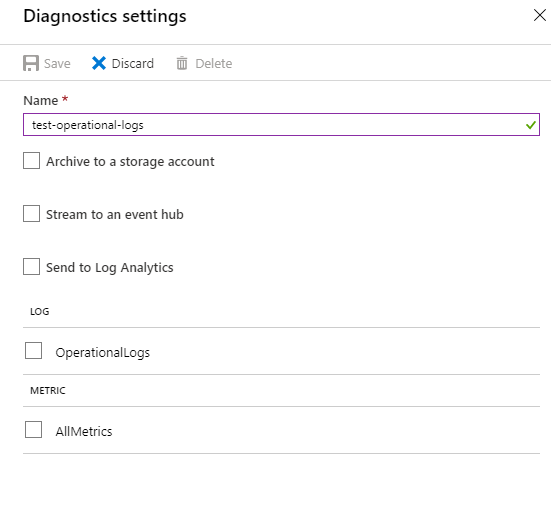

# Enable diagnostic logs for Service Bus

When you start using your Azure Service Bus namespace, you may want to monitor how and when your namespace is created, deleted or accessed. This article provides an overview of all the operational/diagnostic logs that are available.

Azure Service Bus currently supports activity/operational logs which capture **management operations** performed on the Azure Service Bus namespace. Specifically, these logs capture the operation type, including queue creation, resources used, and the status of the operation.

## Operational logs schema

All logs are stored in JavaScript Object Notation (JSON) format.

Operational log JSON strings include elements listed in the following table:

| Name | Description |
| ------- | ------- |
| ActivityId | Internal ID, used to identify the specified activity |
| EventName | Operation name |
| ResourceId | Azure Resource Manager resource ID |
| SubscriptionId | Subscription ID |
| EventTimeString | Operation time |
| EventProperties | Operation properties |
| Status | Operation status |
| Caller | Caller of operation (Azure portal or management client) |
| Category | OperationalLogs |

Here's an example of an operational log JSON string:

```json
{
  "ActivityId": "6aa994ac-b56e-4292-8448-0767a5657cc7",
  "EventName": "Create Queue",
  "resourceId": "/SUBSCRIPTIONS/1A2109E3-9DA0-455B-B937-E35E36C1163C/RESOURCEGROUPS/DEFAULT-SERVICEBUS-CENTRALUS/PROVIDERS/MICROSOFT.SERVICEBUS/NAMESPACES/SHOEBOXEHNS-CY4001",
  "SubscriptionId": "1a2109e3-9da0-455b-b937-e35e36c1163c",
  "EventTimeString": "9/28/2016 8:40:06 PM +00:00",
  "EventProperties": "{\"SubscriptionId\":\"1a2109e3-9da0-455b-b937-e35e36c1163c\",\"Namespace\":\"shoeboxehns-cy4001\",\"Via\":\"https://shoeboxehns-cy4001.servicebus.windows.net/f8096791adb448579ee83d30e006a13e/?api-version=2016-07\",\"TrackingId\":\"5ee74c9e-72b5-4e98-97c4-08a62e56e221_G1\"}",
  "Status": "Succeeded",
  "Caller": "ServiceBus Client",
  "category": "OperationalLogs"
}
```

## What Events/Operations are captured in operational logs?

Operation logs capture all management operations performed on the Azure Service Bus namespace. Data operations are not captured because of the high volume of data operations that are conducted on Azure Service Bus.

> [!NOTE]
> To better track data operations, we recommend using client side tracing.

The below management operations are captured in operational logs - 

| Scope | Operation|
|-------| -------- |
| Namespace | <ul> <li> Create Namespace</li> <li> Update Namespace </li> <li> Delete Namespace </li>  </ul> | 
| Queue | <ul> <li> Create Queue</li> <li> Update Queue</li> <li> Delete Queue </li> </ul> | 
| Topic | <ul> <li> Create Topic </li> <li> Update Topic </li> <li> Delete Topic </li> </ul> |
| Subscription | <ul> <li> Create Subscription </li> <li> Update Subscription </li> <li> Delete Subscription </li> </ul> |


## How to enable operational logs?

Operational logs are disabled by default. To enable diagnostic logs, perform the following steps:

1.	In the [Azure portal](https://portal.azure.com), navigate to your Azure Service Bus namespace and under **Monitoring**, click **Diagnostics settings**.

	

2. Click **Add diagnostic setting** to configure the diagnostic settings.  

	

3. Configure the diagnostic settings
    1. Type a **name** to identify the diagnostic settings.
    2. Pick a destination for the diagnostics.
            1. If you pick **Storage account**, you need to configure the storage account where the diagnostics will be stored.
            2. If you pick **Event hubs**, you need to configure the appropriate Event Hub where the diagnostics settings will be streamed to.
            3. If you pick **Log Analytics**, you need to specify which instance of Log Analytics the diagnostics will be sent.
        3. Check **Operational Logs**.

	

4. Click **Save**.


New settings take effect in about 10 minutes. After that, logs appear in the configured archival target, on the **Diagnostics logs** blade.

For more information about configuring diagnostics, see the [overview of Azure diagnostic logs](../azure-monitor/platform/diagnostic-logs-overview.md).

## Next steps

See the following links to learn more about Service Bus:

* [Introduction to Service Bus](service-bus-messaging-overview.md)
* [Get started with Service Bus](service-bus-dotnet-get-started-with-queues.md)
