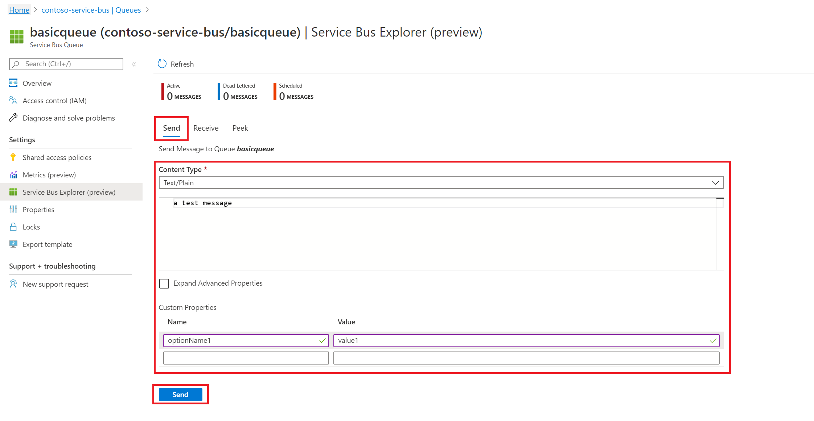
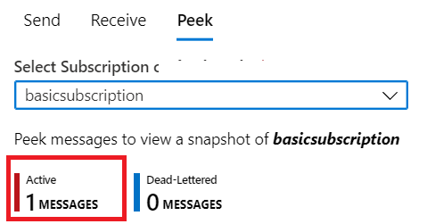
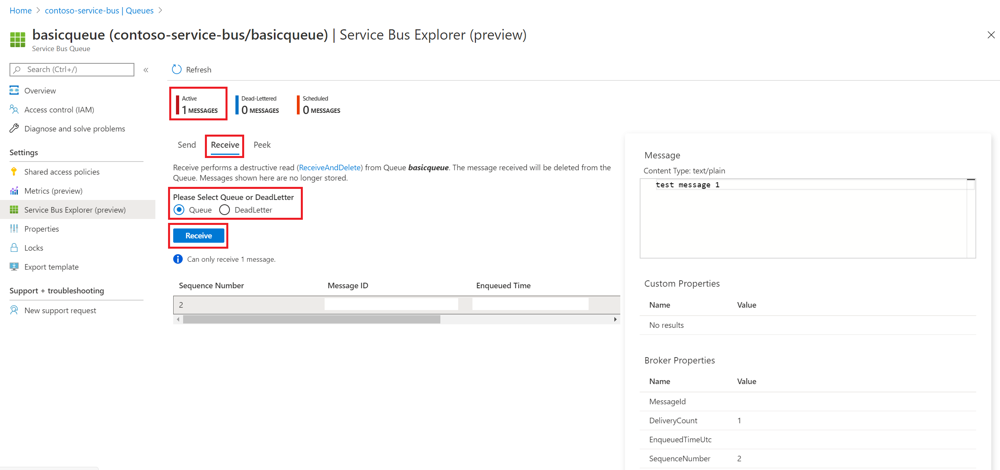
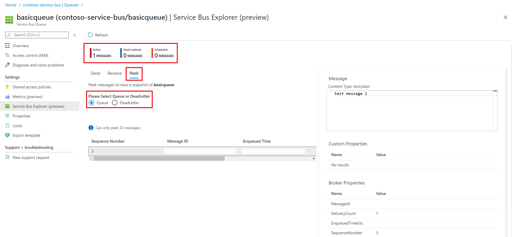
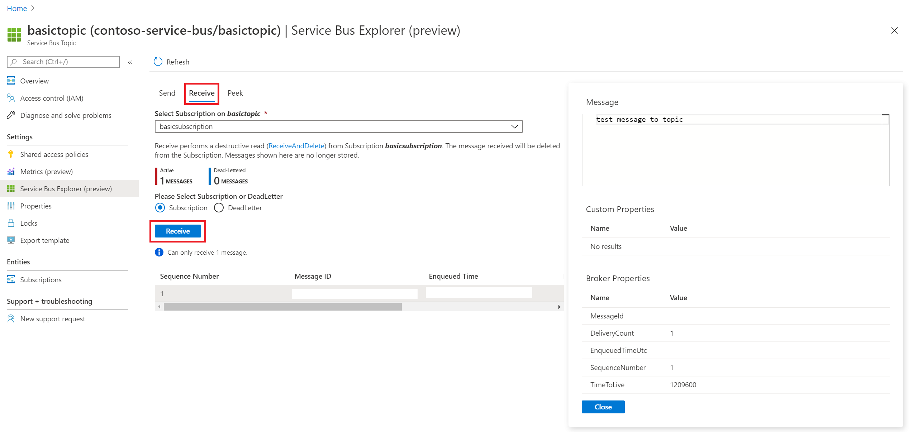
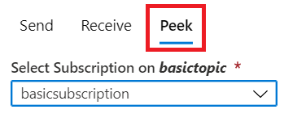
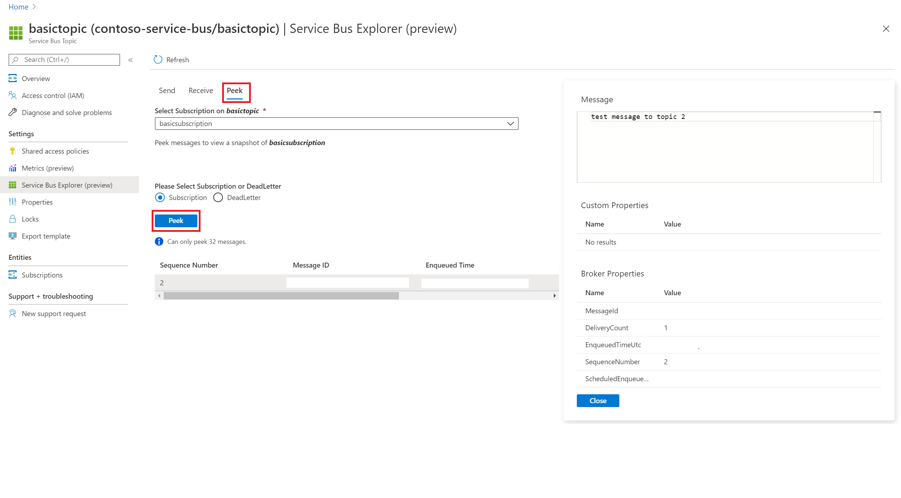

# Use Service Bus Explorer to perform data operations on Service Bus (Preview)

## Overview

Azure Service Bus allows sender and receiver client applications to decouple their business logic with the use of familiar point-to-point (Queue) and publish-subscribe (Topic-Subscription) semantics.

Operations performed on an Azure Service Bus namespace are of two kinds 
   * Management Operations - Create, Update, Delete of Service Bus Namespace, Queues, Topics, and Subscriptions.
   * Data Operations - Send to and Receive Messages from Queues, Topics, and Subscriptions.

The Azure Service Bus Explorer expands the portal functionality beyond the management operations to support data operations (Send, Receive, Peek) on the Queues, Topics, and Subscriptions (and their dead letter subentities) - right from the Azure portal itself.

> [!NOTE]
> This article highlights the functionality of the Azure Service Bus Explorer that lives on the Azure Portal.
>
> The Azure Service Bus explorer tool is ***not*** the community owned OSS tool [Service Bus Explorer](https://github.com/paolosalvatori/ServiceBusExplorer).
>

## Prerequisites

To use the Service Bus Explorer tool, you will need to provision an Azure Service Bus namespace. 

Once the Service Bus namespace is provisioned, you need to create a Queue to send and receive message from or a Topic with a Subscription to test out the functionality.

To know more about how to create Queues, Topics and Subscriptions, refer to the below links
   * [Quickstart - Create Queues](service-bus-quickstart-portal.md)
   * [Quickstart - Create Topics](service-bus-quickstart-topics-subscriptions-portal.md)

## Using the Service Bus Explorer

To use the Azure Service Bus explorer, you need to navigate to the Service Bus namespace on which you want to perform send, peek and receive operations.

If you are looking to perform operations against a Queue, pick **'Queues'** from the navigation menu. If you are looking to perform operations against a Topic (and it's related subscriptions), pick **Topics**. 

[!div class="mx-imgBorder"]

After picking the **'Queues'** or **'Topics'**, pick the specific Queue or Topic.

Select the **'Service Bus Explorer (preview)'** from the left navigation menu

### Sending a Message to a Queue or Topic

To send a message to a **Queue** or a **Topic**, click on the ***Send*** tab on the Service Bus Explorer.

To compose a message here - 

1. Pick the **Content Type** to be either 'Text/Plain', 'Application/Xml' or 'Application/Json'.
2. Add the message **Content**. Ensure that it matches the **Content Type** set earlier.
3. Set the **Advanced Properties** (optional) - these include Correlation ID, Message ID, Label, ReplyTo, Time to Live (TTL) and Scheduled Enqueue Time (for Scheduled Messages).
4. Set the **Custom Properties** - can be any user properties set against a dictionary key.

Once the message has been composed, hit send.

When the send operation is completed successfully, 

1. If sending to the Queue, **Active Messages** metrics counter will increment.

    
2. If sending to the Topic, **Active Messages** metrics counter will increment on the Subscription where the message was routed to.

    

### Receiving a Message from a Queue

The receive function on the Service Bus Explorer permits receiving a single message at a time. The receive operation is performed using the ***ReceiveAndDelete** mode.

> [!IMPORTANT]
> Please note that the Receive operation performed by the Service Bus explorer is a ***destructive receive***, i.e. the message is removed from the queue when it is displayed on the Service Bus Explorer tool.
>
> To browse messages without removing them from the queue, consider using the ***Peek*** functionality.
>

To receive a message from a Queue (or its deadletter subqueue) 

1. click on the ***Receive*** tab on the Service Bus Explorer.
2. Check the metrics to see if there are **Active Messages** or **Dead-lettered Messages** to receive.
    

3. pick between the ***Queue*** or the ***Deadletter*** subqueue.

    

4. Click the ***Receive*** button, followed by ***Yes*** to confirm the 'Receive and Delete' operation.

When the receive operation is successful, the message details will display on the grid as below. You can select the message from the grid to display it's details.

### Peeking a Message from a Queue

With the peek functionality, you can use the Service Bus Explorer to view the top 32 messages on a queue or the deadletter queue.

1. To peek the message on a queue, click on the ***Peek*** tab on the Service Bus Explorer.

    

2. Check the metrics to see if there are **Active Messages** or **Dead-lettered Messages** to peek.

    

3. Then pick between the ***Queue*** or the ***Deadletter*** subqueue.

    

4. Click the ***Peek*** button. 

Once the peek operation completes, up to 32 messages will show up on the grid as below. To view the details of a particular message, select it from the grid. 

> [!NOTE]
>
> Since peek is not a destructive operation the message **will not** be removed from the queue.
>

### Receiving a Message from a Subscription

Just like with a queue, the ***Receive*** operation can be performed against a subscription (or its deadletter entity). However, since a Subscription lives within the context of the Topic, the receive operation is performed by navigating to the Service Bus Explorer for a given Topic.

> [!IMPORTANT]
> Please note that the Receive operation performed by the Service Bus explorer is a ***destructive receive***, i.e. the message is removed from the queue when it is displayed on the Service Bus Explorer tool.
>
> To browse messages without removing them from the queue, consider using the ***Peek*** functionality.
>

1. Click on the ***Receive*** tab and select the specific ***Subscription*** from the dropdown selector.

    

2. Pick between the ***Subscription*** or the ***DeadLetter*** sub-entity.

    

3. Click the ***Receive*** button, followed by ***Yes*** to confirm the 'Receive and Delete' operation.

When the receive operation is successful, the received message will display on the grid as below. To view the message details, click on the message.

### Peeking a Message from a Subscription

To simply browse the messages on a Subscription or its deadletter sub-entity, the ***Peek*** functionality can be utilized on the Subscription as well.

1. Click on the ***Peek*** tab and select the specific ***Subscription*** from the dropdown selector.

    

2. Pick between the ***Subscription*** or the ***DeadLetter*** subentity.

    

3. Click the ***Peek*** button.

Once the peek operation completes, up to 32 messages will show up on the grid as below. To view the details of a particular message, select it from the grid. 

> [!NOTE]
>
> Since peek is not a destructive operation the message **will not** be removed from the queue.
>

## Next Steps

   * Learn more about Service Bus [Queues](service-bus-queues-topics-subscriptions.md#queues) and [Topics](service-bus-queues-topics-subscriptions.md#topics-and-subscriptions)
   * Learn more about creating [Service Bus Queues via the Azure Portal](service-bus-quickstart-portal.md)
   * Learn more about creating [Service Bus Topics and Subscriptions via the Azure Portal](service-bus-quickstart-topics-subscriptions-portal.md)