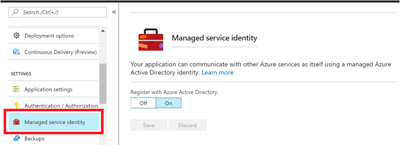

# Managed identities for Azure resources with Service Bus 

[Managed identities for Azure resources](../active-directory/managed-identities-azure-resources/overview) is a cross-Azure feature that enables you to create a secure identity associated with the deployment under which your application code runs. You can then associate that identity with access-control roles that grant custom permissions for accessing specific Azure resources that your application needs.

With managed identities, the Azure platform manages this runtime identity. You do not need to store and protect access keys in your application code or configuration, either for the identity itself, or for the resources you need to access. A Service Bus client app running inside an Azure App Service application or in a virtual machine with enabled managed entities for Azure resources support does not need to handle SAS rules and keys, or any other access tokens. The client app only needs the endpoint address of the Service Bus Messaging namespace. When the app connects, Service Bus binds the managed entity's context to the client in an operation that is shown in an example later in this article. Once it is associated with a managed identity, your Service Bus client can do all authorized operations. Authorization is granted by associating a managed entity with Service Bus roles. 

## Service Bus roles and permissions

You can only add a managed identity to the "Owner" or "Contributor" roles of a Service Bus namespace. It grants the identity full control on all entities in the namespace. However, management operations that change the namespace topology are initially supported only though Azure Resource Manager. It is not through the native Service Bus REST management interface. This support also means that you cannot use the .NET Framework client [NamespaceManager](/dotnet/api/microsoft.servicebus.namespacemanager) object within a managed identity.

## Use Service Bus with managed identities for Azure resources

The following section describes the steps required to create and deploy a sample application that runs under a managed identity, how to grant that identity access to a Service Bus Messaging namespace, and how the application interacts with Service Bus entities using that identity.

This introduction describes a web application hosted in [Azure App Service](https://azure.microsoft.com/services/app-service/). The steps required for a VM-hosted application are similar.

### Create an App Service web application

The first step is to create an App Service ASP.NET application. If you're not familiar with how to do so in Azure, follow [this how-to guide](../app-service/app-service-web-get-started-dotnet-framework.md). However, instead of creating an MVC application as shown in the tutorial, create a Web Forms application.

### Set up the managed identity

Once you create the application, navigate to the newly created web app in the Azure portal (also shown in the how-to), then navigate to the **Managed Service Identity** page, and enable the feature: 

Once you've enabled the feature, a new service identity is created in your Azure Active Directory, and configured into the App Service host.

### Create a new Service Bus Messaging namespace

Next, [create a Service Bus Messaging namespace](service-bus-create-namespace-portal.md) in one of the Azure regions that have preview support for RBAC: **US East**, **US East 2**, or **West Europe**. 

Navigate to the namespace **Access Control (IAM)** page on the portal, and then click **Add** to add the managed identity to the **Owner** role. To do so, search for the name of the web application in the **Add permissions** panel **Select** field, and then click the entry. Then click **Save**.

 
The web application's managed identity now has access to the Service Bus namespace, and to the queue you previously created. 

### Run the app

Now, modify the default page of the ASP.NET application you created. You can use the web application code from [this GitHub repository](https://github.com/Azure-Samples/app-service-msi-servicebus-dotnet).  

The Default.aspx page is your landing page. The code can be found in the Default.aspx.cs file. The result is a minimal web application with a few entry fields, and with **send** and **receive** buttons that connect to Service Bus to either send or receive messages.

Note how the [MessagingFactory](/dotnet/api/microsoft.servicebus.messaging.messagingfactory) object is initialized. Instead of using the Shared Access Token (SAS) token provider, the code creates a token provider for the managed identity with the `TokenProvider.CreateManagedServiceIdentityTokenProvider(ServiceAudience.ServiceBusAudience)` call. As such, there are no secrets to retain and use. The flow of the managed identity context to Service Bus and the authorization handshake are automatically handled by the token provider. It is a simpler model than using SAS.

After you make these changes, publish and run the application. You can obtain the correct publishing data easily by downloading and then importing a publishing profile in Visual Studio:

 
To send or receive messages, enter the name of the namespace and the name of the entity you created. Then, click either **send** or **receive**.

> [!NOTE]
> - The managed identity works only inside the Azure environment, on App services, Azure VMs, and scale sets. For .NET applications, the Microsoft.Azure.Services.AppAuthentication library, which is used by the Service Bus NuGet package, provides an abstraction over this protocol and supports a local development experience. This library also allows you to test your code locally on your development machine, using your user account from Visual Studio, Azure CLI 2.0 or Active Directory Integrated Authentication. For more on local development options with this library, see [Service-to-service authentication to Azure Key Vault using .NET](../key-vault/service-to-service-authentication.md).  
> 
> - Currently, managed identities do not work with App Service deployment slots.

## Next steps

To learn more about Service Bus messaging, see the following topics:

* [Service Bus fundamentals](service-bus-fundamentals-hybrid-solutions.md)
* [Service Bus queues, topics, and subscriptions](service-bus-queues-topics-subscriptions.md)
* [Get started with Service Bus queues](service-bus-dotnet-get-started-with-queues.md)
* [How to use Service Bus topics and subscriptions](service-bus-dotnet-how-to-use-topics-subscriptions.md)