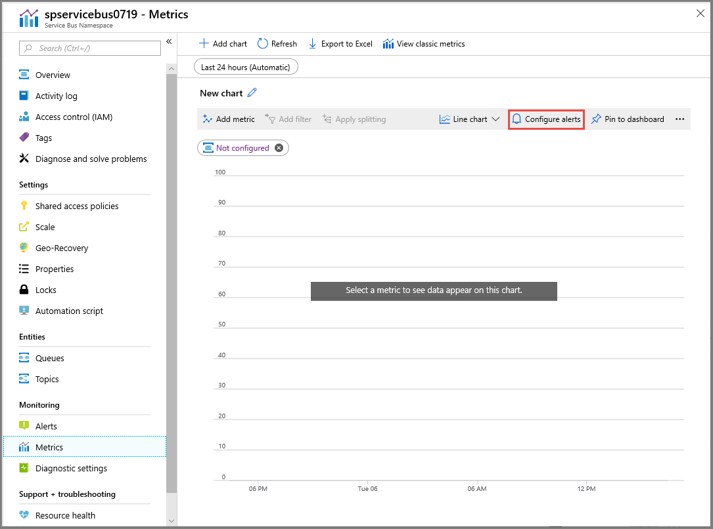
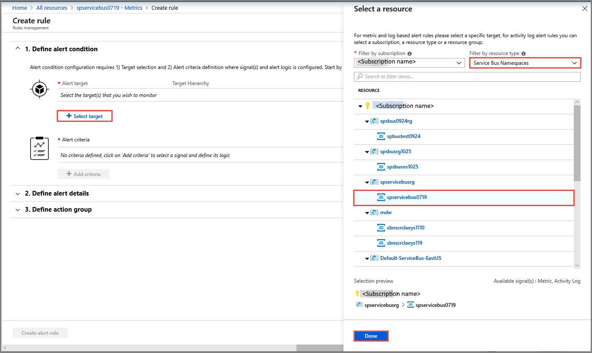
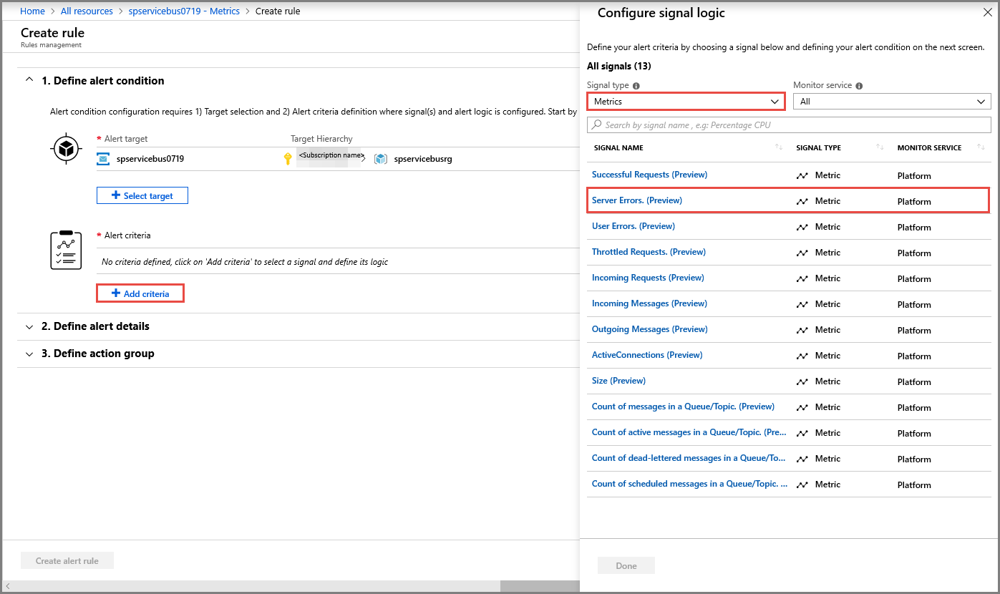
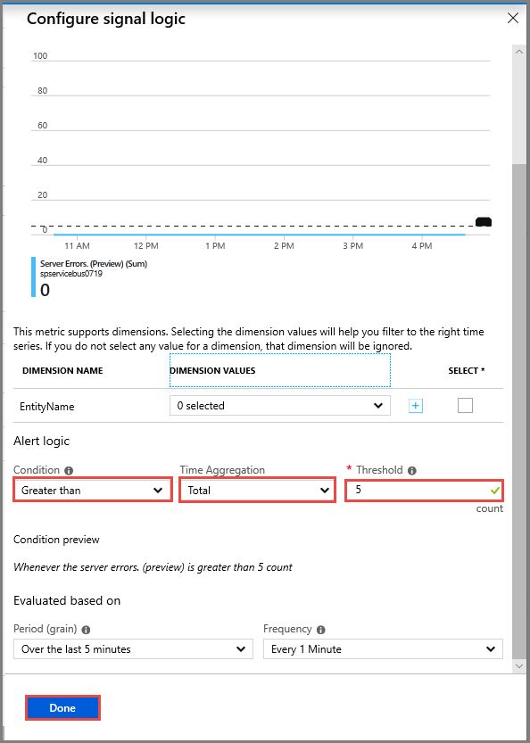
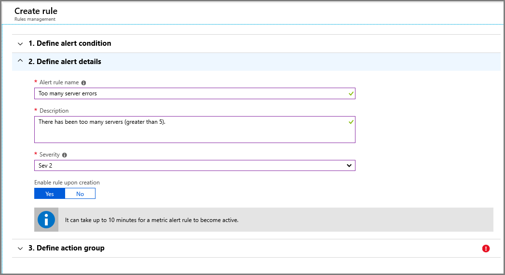
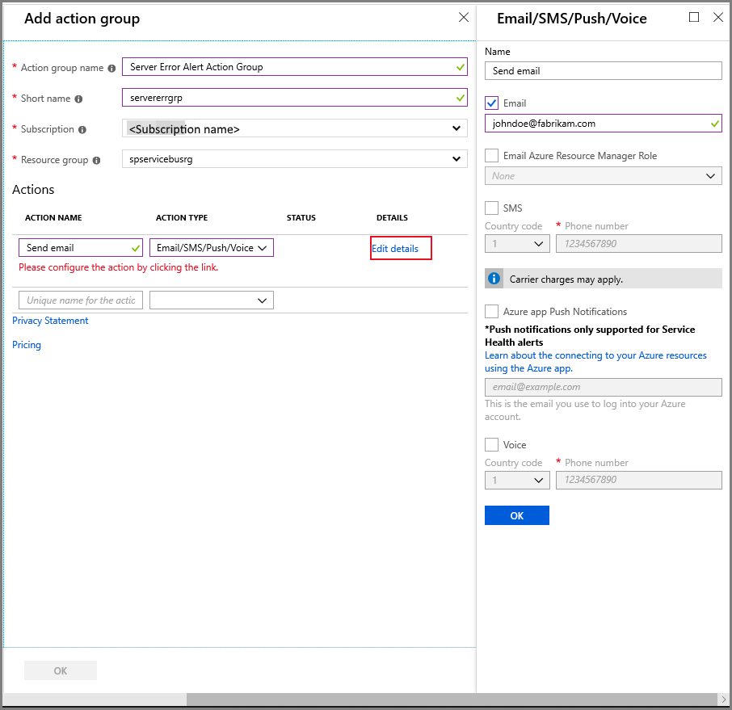
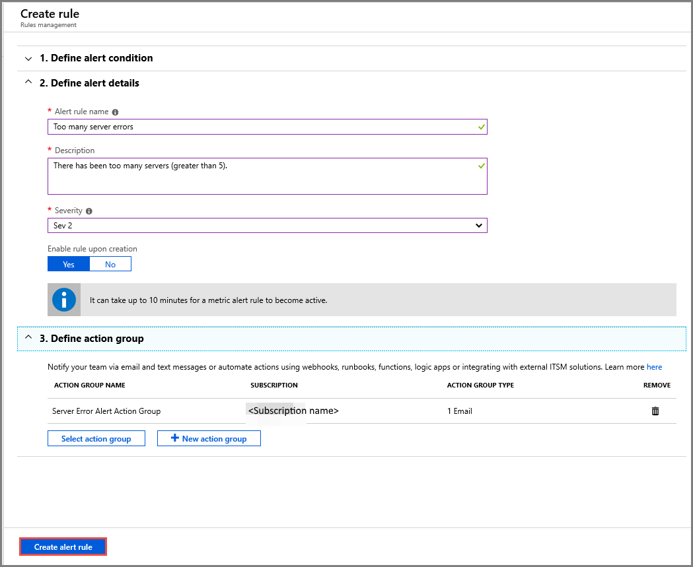

# Azure Service Bus metrics in Azure Monitor

Service Bus metrics give you the state of resources in your Azure subscription. With a rich set of metrics data, you can assess the overall health of your Service Bus resources, not only at the namespace level, but also at the entity level. These statistics can be important as they help you to monitor the state of Service Bus. Metrics can also help troubleshoot root-cause issues without needing to contact Azure support.

Azure Monitor provides unified user interfaces for monitoring across various Azure services. For more information, see [Monitoring in Microsoft Azure](../monitoring-and-diagnostics/monitoring-overview.md) and the [Retrieve Azure Monitor metrics with .NET](https://github.com/Azure-Samples/monitor-dotnet-metrics-api) sample on GitHub.

> [!IMPORTANT]
> When there has not been any interaction with an entity for 2 hours, the metrics will start showing "0" as a value until the entity is no longer idle.

## Access metrics

Azure Monitor provides multiple ways to access metrics. You can either access metrics through the [Azure portal](https://portal.azure.com), or use the Azure Monitor APIs (REST and .NET) and analysis solutions such as Azure Monitor logs and Event Hubs. For more information, see [Metrics in Azure Monitor](../azure-monitor/platform/data-platform-metrics.md).

Metrics are enabled by default, and you can access the most recent 30 days of data. If you need to retain data for a longer period of time, you can archive metrics data to an Azure Storage account. This value is configured in [diagnostic settings](../azure-monitor/platform/resource-logs-overview.md#diagnostic-settings) in Azure Monitor.

## Access metrics in the portal

You can monitor metrics over time in the [Azure portal](https://portal.azure.com). The following example shows how to view successful requests and incoming requests at the account level:

![][1]

You can also access metrics directly via the namespace. To do so, select your namespace and then click **Metrics**. To display metrics filtered to the scope of the entity, select the entity and then click **Metrics**.

![][2]

For metrics supporting dimensions, you must filter with the desired dimension value.

## Billing

Metrics and Alerts on Azure Monitor are charged on a per alert basis. These charges should be available on the portal when the alert is setup and before it is saved. 

Additional solutions that ingest metrics data are billed directly by those solutions. For example, you are billed by Azure Storage if you archive metrics data to an Azure Storage account. You are also billed by Log Analytics if you stream metrics data to Log Analytics for advanced analysis.

The following metrics give you an overview of the health of your service. 

> [!NOTE]
> We are deprecating several metrics as they are moved under a different name. This might require you to update your references. Metrics marked with the "deprecated" keyword will not be supported going forward.

All metrics values are sent to Azure Monitor every minute. The time granularity defines the time interval for which metrics values are presented. The supported time interval for all Service Bus metrics is 1 minute.

## Request metrics

Counts the number of data and management operations requests.

| Metric Name | Description |
| ------------------- | ----------------- |
| Incoming Requests| The number of requests made to the Service Bus service over a specified period.    Unit: Count   Aggregation Type: Total   Dimension: EntityName|
|Successful Requests|The number of successful requests made to the Service Bus service over a specified period.   Unit: Count   Aggregation Type: Total   Dimension: EntityName|
|Server Errors|The number of requests not processed due to an error in the Service Bus service over a specified period.   Unit: Count   Aggregation Type: Total   Dimension: EntityName|
|User Errors (see the following subsection)|The number of requests not processed due to user errors over a specified period.   Unit: Count   Aggregation Type: Total   Dimension: EntityName|
|Throttled Requests|The number of requests that were throttled because the usage was exceeded.   Unit: Count   Aggregation Type: Total   Dimension: EntityName|

### User errors

The following two types of errors are classified as user errors:

1. Client-side errors (In HTTP that would be 400 errors).
2. Errors that occur while processing messages, such as [MessageLockLostException](/dotnet/api/microsoft.azure.servicebus.messagelocklostexception).

## Message metrics

| Metric Name | Description |
| ------------------- | ----------------- |
|Incoming Messages|The number of events or messages sent to Service Bus over a specified period.   Unit: Count   Aggregation Type: Total   Dimension: EntityName|
|Outgoing Messages|The number of events or messages received from Service Bus over a specified period.   Unit: Count   Aggregation Type: Total   Dimension: EntityName|
| Messages| Count of messages in a queue/topic.    Unit: Count   Aggregation Type: Average   Dimension: EntityName |
| ActiveMessages| Count of active messages in a queue/topic.    Unit: Count   Aggregation Type: Average   Dimension: EntityName |
| Dead-lettered messages| Count of dead-lettered messages in a queue/topic.    Unit: Count   Aggregation Type: Average  Dimension: EntityName |
| Scheduled messages| Count of scheduled messages in a queue/topic.    Unit: Count   Aggregation Type: Average    Dimension: EntityName |

## Connection metrics

| Metric Name | Description |
| ------------------- | ----------------- |
|ActiveConnections|The number of active connections on a namespace as well as on an entity.   Unit: Count   Aggregation Type: Total   Dimension: EntityName|

## Resource usage metrics

> [!NOTE] 
> The following metrics are available only with the **premium** tier. 

| Metric Name | Description |
| ------------------- | ----------------- |
|CPU usage per namespace|The percentage CPU usage of the namespace.   Unit: Percent   Aggregation Type: Maximum   Dimension: EntityName|
|Memory size usage per namespace|The percentage memory usage of the namespace.   Unit: Percent   Aggregation Type: Maximum   Dimension: EntityName|

## Metrics dimensions

Azure Service Bus supports the following dimensions for metrics in Azure Monitor. Adding dimensions to your metrics is optional. If you do not add dimensions, metrics are specified at the namespace level. 

|Dimension name|Description|
| ------------------- | ----------------- |
|EntityName| Service Bus supports messaging entities under the namespace.|

## Set up alerts on metrics

1. On the **Metrics** tab of the **Service Bus Namespace** page, select **Configure alerts**. 

    
2. Select the **Select target** option, and do the following actions on the **Select a resource** page: 
    1. Select **Service Bus Namespaces** for the **Filter by resource type** field. 
    2. Select your subscription for the **Filter by subscription** field.
    3. Select the **service bus namespace** from the list. 
    4. Select **Done**. 
    
        
1. Select **Add criteria**, and do the following actions on the **Configure signal logic** page:
    1. Select **Metrics** for **Signal type**. 
    2. Select a signal. For example: **Service errors**. 

        
    1. Select **Greater than** for **Condition**.
    2. Select **Total** for **Time Aggregation**. 
    3. Enter **5** for **Threshold**. 
    4. Select **Done**.    

            
1. On the **Create rule** page, expand **Define alert details**, and do the following actions:
    1. Enter a **name** for the alert. 
    2. Enter a **description** for the alert.
    3. Select **severity** for the alert. 

        
1. On the **Create rule** page, expand **Define action group**, select **New action group**, and do the following actions on the **Add action group page**. 
    1. Enter a name for the action group.
    2. Enter a short name for the action group. 
    3. Select your subscription. 
    4. Select a resource group. 
    5. For this walkthrough, enter **Send email** for **ACTION NAME**.
    6. Select **Email/SMS/Push/Voice** for **ACTION TYPE**. 
    7. Select **Edit details**. 
    8. On the **Email/SMS/Push/Voice** page, do the following actions:
        1. Select **Email**. 
        2. Type the **email address**. 
        3. Select **OK**.

            
        4. On the **Add action group** page, select **OK**. 
1. On the **Create rule** page, select **Create alert rule**. 

    

## Next steps

See the [Azure Monitor overview](../monitoring-and-diagnostics/monitoring-overview.md).

[1]: ./media/service-bus-metrics-azure-monitor/service-bus-monitor1.png
[2]: ./media/service-bus-metrics-azure-monitor/service-bus-monitor2.png

