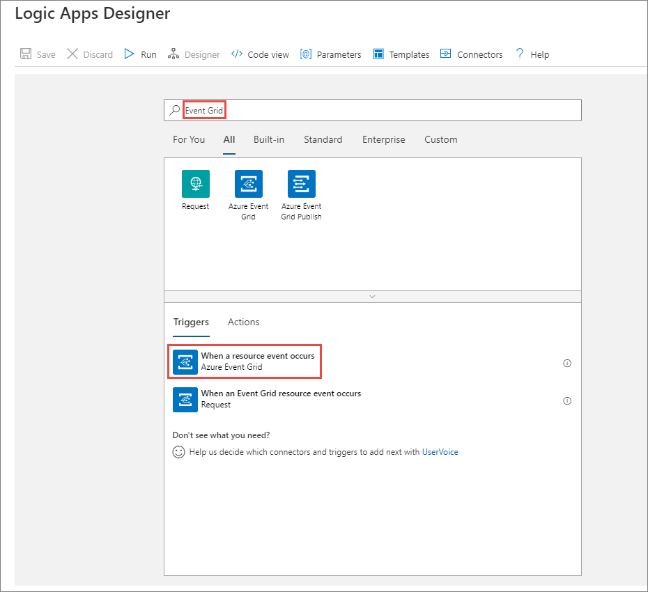
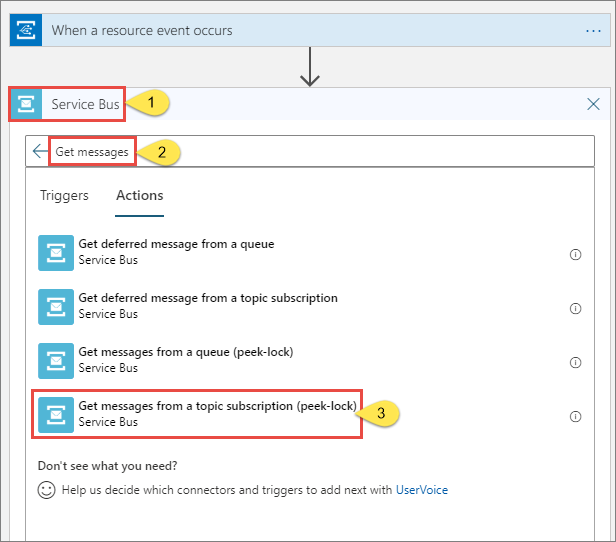
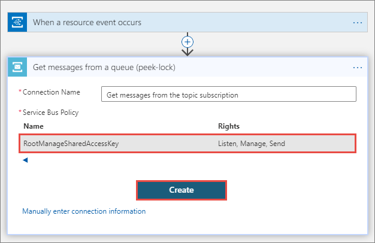
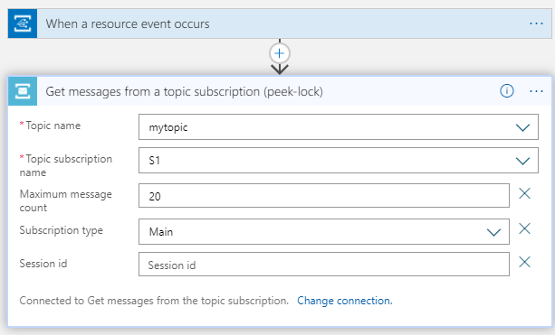
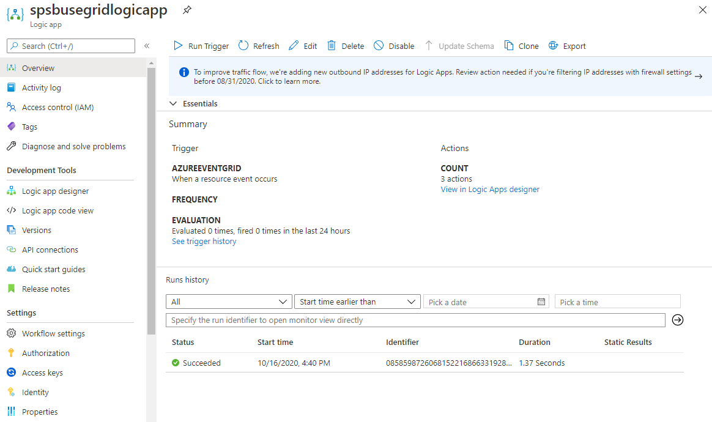

# Tutorial: Respond to Azure Service Bus events received via Azure Event Grid by using Azure Functions and Azure Logic Apps
In this tutorial, you learn how to respond to Azure Service Bus events that are received via Azure Event Grid by using Azure Functions and Azure Logic Apps. 

In this tutorial, you learn how to:
> [!div class="checklist"]
> * Create a Service Bus namespace
> * Prepare a sample application to send messages
> * Send messages to the Service Bus topic
> * Receive messages by using Logic Apps
> * Set up a test function on Azure
> * Connect the function and namespace via Event Grid
> * Receive messages by using Azure Functions

[!INCLUDE [service-bus-event-grid-prerequisites](../../includes/service-bus-event-grid-prerequisites.md)]

## Receive messages by using Logic Apps
Connect a logic app with Azure Service Bus and Azure Event Grid by following these steps:

1. Create a logic app in the Azure portal.
    1. Select **+ Create a resource**, select **Integration**, and then select **Logic App**. 
    2. On the **Logic App - Create** page, enter a **name** for the logic app.
    3. Select your Azure **subscription**. 
    4. Select **Use existing** for the **Resource group**, and select the resource group that you used for other resources (like Azure function, Service Bus namespace) that you created earlier. 
    5. Select the **Location** for the logic app. 
    6. Select **Create** to create the logic app. 
2. On the **Logic Apps Designer** page, select **Blank Logic App** under **Templates**. 
3. On the designer, do the following steps:
    1. Search for **Event Grid**. 
    2. Select **When a resource event occurs - Azure Event Grid**. 

        
4. Select **Sign in**, enter your Azure credentials, and select **Allow Access**. 
5. On the **When a resource event occurs** page, do the following steps:
    1. Select your Azure subscription. 
    2. For **Resource Type**, select **Microsoft.ServiceBus.Namespaces**. 
    3. For **Resource Name**, select your Service Bus namespace. 
    4. Select **Add new parameter**, and select **Suffix Filter**. 
    5. For **Suffix Filter**, enter the name of your second Service Bus topic subscription. 
        
6. Select **+ New Step** in the designer, and do the following steps:
    1. Search for **Service Bus**.
    2. Select **Service Bus** in the list. 
    3. Select for **Get messages** in the **Actions** list. 
    4. Select **Get messages from a topic subscription (peek-lock)**. 

        
    5. Enter a **name for the connection**. For example: **Get messages from the topic subscription**, and select the Service Bus namespace. 

         
    6. Select **RootManageSharedAccessKey**, and then select **Create**.

         
    8. Select your **topic** and **subscription**. 
    
        
7. Select **+ New step**, and do the following steps: 
    1. Select **Service Bus**.
    2. Select **Complete the message in a topic subscription** from the list of actions. 
    3. Select your Service Bus **topic**.
    4. Select the second **subscription** to the topic.
    5. For **Lock token of the message**, select **Lock Token** from the **Dynamic content**. 

        
8. Select **Save** on the toolbar on the Logic Apps Designer to save the logic app. 
9. Follow instruction in the [Send messages to the Service Bus topic](#send-messages-to-the-service-bus-topic) section to send messages to the topic. 
10. Switch to the **Overview** page of your logic app. You see the logic app runs in the **Runs history** for the messages sent.

    

## Next steps

* Learn more about [Azure Event Grid](../event-grid/index.yml).
* Learn more about [Azure Functions](../azure-functions/index.yml).
* Learn more about the [Logic Apps feature of Azure App Service](../logic-apps/index.yml).
* Learn more about [Azure Service Bus](/azure/service-bus/).

[2]: ./media/service-bus-to-event-grid-integration-example/sbtoeventgrid2.png
[3]: ./media/service-bus-to-event-grid-integration-example/sbtoeventgrid3.png
[7]: ./media/service-bus-to-event-grid-integration-example/sbtoeventgrid7.png
[8]: ./media/service-bus-to-event-grid-integration-example/sbtoeventgrid8.png
[9]: ./media/service-bus-to-event-grid-integration-example/sbtoeventgrid9.png
[10]: ./media/service-bus-to-event-grid-integration-example/sbtoeventgrid10.png
[11]: ./media/service-bus-to-event-grid-integration-example/sbtoeventgrid11.png
[12]: ./media/service-bus-to-event-grid-integration-example/sbtoeventgrid12.png
[12-1]: ./media/service-bus-to-event-grid-integration-example/sbtoeventgrid12-1.png
[12-2]: ./media/service-bus-to-event-grid-integration-example/sbtoeventgrid12-2.png
[13]: ./media/service-bus-to-event-grid-integration-example/sbtoeventgrid13.png
[14]: ./media/service-bus-to-event-grid-integration-example/sbtoeventgrid14.png
[15]: ./media/service-bus-to-event-grid-integration-example/sbtoeventgrid15.png
[16]: ./media/service-bus-to-event-grid-integration-example/sbtoeventgrid16.png
[17]: ./media/service-bus-to-event-grid-integration-example/sbtoeventgrid17.png
[18]: ./media/service-bus-to-event-grid-integration-example/sbtoeventgrid18.png
[20]: ./media/service-bus-to-event-grid-integration-example/sbtoeventgridportal.png
[21]: ./media/service-bus-to-event-grid-integration-example/sbtoeventgridportal2.png