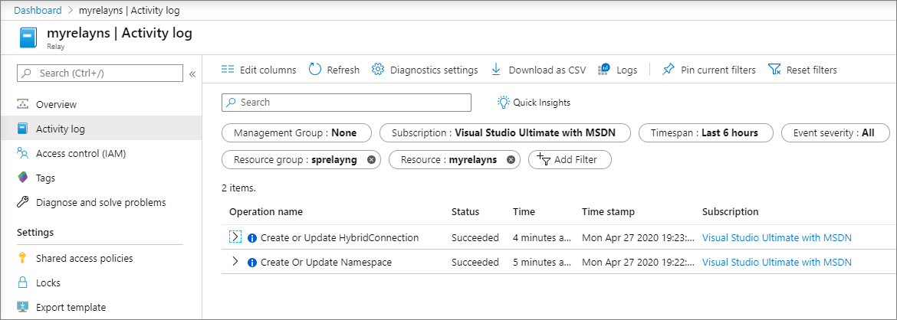
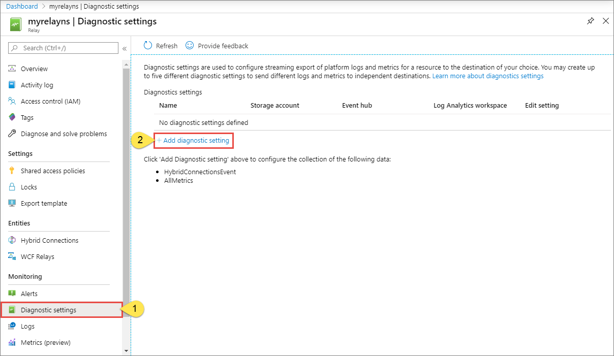
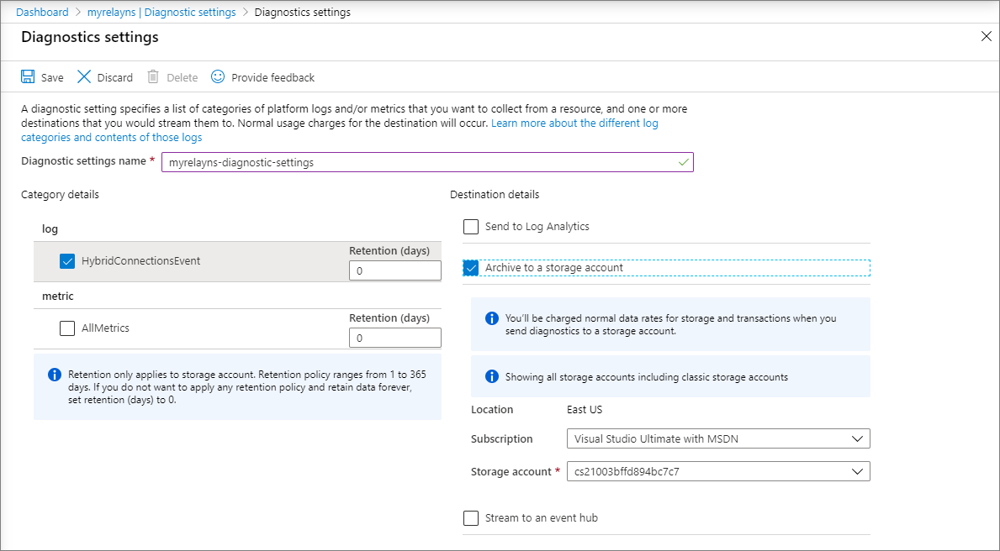

# Enable diagnostics logs for Azure Relay Hybrid Connections
When you start using your Azure Relay Hybrid Connections, you might want to monitor how and when your listeners and senders are opened and closed, and how your Hybrid Connections messages are created and sent. This article provides an overview of all the operational and diagnostics logs that are available.

You can view two types of logs for Azure Relay:

- [Activity logs](../azure-monitor/platform/platform-logs-overview.md): These logs have information about operations performed against your namespace in the Azure portal or through Azure Resource Manager template. These logs are always enabled. For example: "Create or update namespace", "Create or update hybrid connection". 
- [Diagnostic logs](../azure-monitor/platform/platform-logs-overview.md): You can configure diagnostic logs for a richer view of everything that happens with operations and actions that are conducted against your namespace by using the API, or through language SDK.

## View activity logs
To view activity logs for your Azure Relay namespace, switch to the **Activity log** page in the Azure portal.



## Enable diagnostic logs

> [!NOTE]
> Diagnostic logs are available only for hybrid connections, not for Windows Communication Foundation (WCF() relays.

To enable diagnostics logs, do the following steps:

1. In the [Azure portal](https://portal.azure.com), go to your Azure Relay namespace and then, under **Monitoring**, select  **Diagnostic settings**.
1. On the **Diagnostics settings** page, select **Add diagnostic setting**.  

   

1. Configure the diagnostics settings by doing the following steps:
    1. In the **Name** box, enter a name for the diagnostics settings.  
    2. Select **HybridConnectionsEvent** for the type of log. 
    3. Select one of the following three **destinations** for your diagnostics logs:  
        1. If you select **Archive to a storage account**, configure the storage account where the diagnostics logs will be stored.  
        2. If you select **Stream to an event hub**, configure the event hub that you want to stream the diagnostics logs to.
        3. If you select **Send to Log Analytics**, specify which instance of Log Analytics the diagnostics will be sent to.  

        
1. Select **Save** on the toolbar to save the settings.

The new settings take effect in about 10 minutes. The logs are displayed in the configured archival target, in the **Diagnostics logs** pane. For more information about configuring diagnostics settings, see the [overview of Azure diagnostics logs](../azure-monitor/platform/diagnostic-logs-overview.md).


## Schema for hybrid connections events
Hybrid connections event log JSON strings include the elements listed in the following table:

| Name | Description |
| ------- | ------- |
| ResourceId | Azure Resource Manager resource ID |
| ActivityId | Internal ID, used to identify the specified operation. May also be known as "TrackingId" |
| Endpoint | The address of the Relay resource |
| OperationName | The type of the Hybrid Connections operation that’s  being logged |
| EventTimeString | The UTC timestamp of the log record |
| Message | The detailed message of the event |
| Category | Category of the event. Currently, there is only `HybridConnectionsEvents`. 


## Sample hybrid connections event
Here's a sample hybrid connections event in JSON format. 

```json
{
    "resourceId": "/SUBSCRIPTIONS/0000000000-0000-0000-0000-0000000000000/RESOURCEGROUPS/MyResourceGroup/PROVIDERS/MICROSOFT.RELAY/NAMESPACES/MyRelayNamespace",
    "ActivityId": "7006a0db-27eb-445c-939b-ce86133014cc",
    "endpoint": "sb://myrelaynamespace.servicebus.windows.net/myhybridconnection/7006a0db-27eb-445c-939b-ce86133014cc_G5",
    "operationName": "Microsoft.Relay/HybridConnections/NewSenderRegistering",
    "EventTimeString": "2020-04-27T20:27:57.3842810Z",
    "message": "A new on-premises sender is registering.",
    "category": "HybridConnectionsEvent"
}
```

## Events and operations captured in diagnostic logs

| Operation | Description | 
| --------- | ----------- | 
| AuthorizationFailed | Authorization failed.|
| InvalidSasToken | Invalid SAS token. | 
| ListenerAcceptingConnection | The on-prem listener is accepting connection. |
| ListenerAcceptingConnectionTimeout | The on-prem listener accepting connection has timed out. |
| ListenerAcceptingHttpRequestFailed | The listener accepting HTTP request failed due to an exception. |
| ListenerAcceptingRequestTimeout | The listener accepting request has timed out. |  
| ListenerClosingFromExpiredToken | The listener is closing because the security token has expired. | 
| ListenerRejectedConnection | The on-prem listener has rejected the connection. |
| ListenerReturningHttpResponse | The on-prem listener is returning an HTTP response. |  
| ListenerReturningHttpResponseFailed | The listener is returning an HTTP response with a failure code. | 
 ListenerSentHttpResponse | Relay service has received an HTTP response from the on-prem listener. | 
| ListenerUnregistered | The listener is unregistered. | 
| ListenerUnresponsive | The on-prem listener is unresponsive when returning a response. | 
| MessageSendingToOnPremListener | Message is being sent to on-premises listener. |
| MessageSentToOnPremListener | Message is sent to on-premises listener. | 
| NewListenerRegistered | New listener registered. |
| NewSenderRegistering | New on-prem sender is registering. | 
| ProcessingRequestFailed | The processing of a Hybrid Connection operation has failed. | 
| SenderConnectionClosed | The sender connection is closed. |
| SenderListenerConnectionEstablished | The sender and listener established connection successfully. |
| SenderSentHttpRequest | The sender sent an HTTP request. | 


## Next steps

To learn more about Azure Relay, see:

* [Introduction to Azure Relay](relay-what-is-it.md)
* [Get started with Relay Hybrid Connections](relay-hybrid-connections-dotnet-get-started.md)
