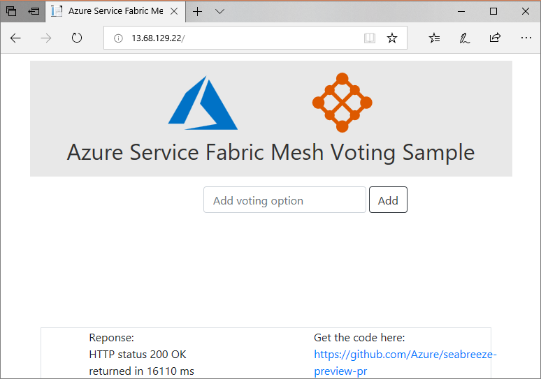

# Deploy an application to Service Fabric Mesh from a template
This article shows how to deploy a .NET Core application to Service Fabric Mesh using a template. When you're finished, you have a voting application with an ASP.NET Core web front end that saves voting results in a back-end service in the cluster.

You can easily create a free Azure subscription, [create a free account](https://azure.microsoft.com/free/) before you begin. 

[!INCLUDE [preview note](./includes/include-preview-note.md)]

[!INCLUDE [cloud-shell-try-it.md](../../includes/cloud-shell-try-it.md)] 

You can use the Azure Cloud Shell or a local installation of the Azure CLI to complete these steps. If you choose to install and use the CLI locally, you must install the Azure CLI version 2.0.35 or later. Run `az --version` to find the version. To install or upgrade to the latest version of the CLI, see [Install Azure CLI 2.0][azure-cli-install]. 

Also install the [Service Fabric Mesh CLI module](service-fabric-mesh-setup-developer-environment-sdk.md#install-the-service-fabric-mesh-cli) if it's not already installed.

## Deploy the application
Login to Azure and set your subscription.

```azurecli-interactive
az login
az account set --subscription "<subscriptionID>"
```

Create a resource group to deploy the application to. You can use an existing resource group and skip this step. 

```azurecli-interactive
az group create --name myResourceGroup --location eastus 
```

Create your application in the resource group using the `deployment create` command, using our [mesh_rp.linux.json template] (https://sfmeshsamples.blob.core.windows.net/templates/voting/mesh_rp.linux.json), or [mesh_rp.windows.json template](https://sfmeshsamples.blob.core.windows.net/templates/voting/mesh_rp.windows.json):

```azurecli-interactive
az mesh deployment create --resource-group myResourceGroup --template-uri https://sfmeshsamples.blob.core.windows.net/templates/voting/mesh_rp.windows.json --parameters "{\"location\": {\"value\": \"eastus\"}}"
```

In a few seconds, your command should return with `"provisioningState": "Succeeded"`. 

## Check the application deployment status
Your application is now deployed. You can check the application's status using the `app show` command. The application name for the deployed application is "VotingApp", so fetch its details. 

```azurecli-interactive
az mesh app show --resource-group myResourceGroup --name VotingApp
```

## List the deployed applications
You can use the "app list" command to get a list of applications you have deployed to your subscription. 

```azurecli-interactive
az mesh app list -o table
```

## Open the application
Once the application status is returned as ""provisioningState": "Succeeded", get the ingress endpoint of the service.  Query the network resource to find the IP address of the container where the service is deployed.

The network resource for the application is "VotingAppNetwork", so fetch its details.

```azurecli-interactive
az mesh network show --resource-group myResourceGroup --name VotingAppNetwork
```

The command should now return with the following information:

```json
{
  "addressPrefix": "10.0.0.4/22",
  "description": "Private network for application",
  "id": "/subscriptions/<subscriptionID>/resourcegroups/myResourceGroup/providers/Microsoft.ServiceFabricMesh/networks/VotingAppNetwork",
  "ingressConfig": {
    "layer4": [
      {
        "name": "VotingWebIngress",
        "applicationName": "VotingApp",
        "endpointName": "VotingWebListener",
        "publicPort": "80",
        "serviceName": "VotingWeb"
      }
    ],
    "publicIpAddress": "13.68.129.22",
    "qosLevel": "Bronze"
  },
  "location": "eastus",
  "name": "VotingAppNetwork",
  "provisioningState": "Succeeded",
  "resourceGroup": "myResourceGroup",
  "tags": {},
  "type": "Microsoft.ServiceFabricMesh/networks"
}
```

From the output, copy the public IP address of the service (13.68.129.22 in the preceding example) and open in a browser.



You can now add voting options to the application and vote on it, or delete the voting options.

## Clean up resources
When you no longer need the application and it's related resources, delete the resource group containing them. 

```azurecli-interactive
az group delete --resource-group myResourceGroup  
```

## Next steps
To learn more about Service Fabric Mesh, read the overview:
> [!div class="nextstepaction"]
> [Service Fabric Mesh overview](service-fabric-mesh-overview.md)


[azure-cli-install]: /cli/azure/install-azure-cli

