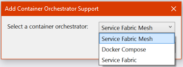

# Containerize an existing .NET app for Service Fabric Mesh

This article shows you how to add Service Fabric Mesh container orchestration support to a legacy .NET app.

In Visual Studio 2017, you can add containerization support to ASP.NET and Console projects that use the full .NET framework.

> [!NOTE]
> .NET **Core** projects are not currently supported.

## Prerequisites

* If you don't have an Azure subscription, you can [create a free account](https://azure.microsoft.com/free/?WT.mc_id=A261C142F) before you begin.

* Make sure that you've [set up your development environment](service-fabric-mesh-howto-setup-developer-environment-sdk.md), including installing the Service Fabric runtime, SDK, Docker, Visual Studio 2017, and creating a local cluster.

## Open a legacy .NET app

Open the app to which you want to add container orchestration support.

If you'd like to try an example, you can use the [eShop](https://github.com/MikkelHegn/ContainersSFLab) code sample. The remainder of this article will assume that we are using that project, but you can apply the steps to your own project.

Get a copy of the **eShop** project:

```git
git clone https://github.com/MikkelHegn/ContainersSFLab.git
```

Once that has downloaded, in Visual Studio 2017 open **ContainersSFLab\eShopLegacyWebFormsSolution\eShopLegacyWebForms.sln**.

## Change Visual Studio settings
 
Add container orchestration support to a legacy ASP.NET or Console project using the Service Fabric Mesh tools as follows:

In the Visual Studio solution explorer, right-click the project name (in the case of the example, eShopLegacyWebForms) and then choose **Add** > **Container orchestrator support**.
The **Add Container Orchestrator Support** dialog appears.



Choose **Service Fabric Mesh** from the drop down, and then click **OK**.

The tools then verifies that Docker is installed, and pulls down a docker image for your project.  
A Service Fabric Mesh application project is also added to your solution. It contains your Mesh publish profiles and configuration files. The name of the project is the same as your project name, with 'Application' concatenated to the end, e.g. **eShopLegacyWebFormsApplication**. 

Once container orchestration support is added to your app, you can press **F5** to run your .NET app on your local Service Fabric Mesh cluster.

[JTW - Add picture of running app here]

## Next steps

Read through the [?](*.md)