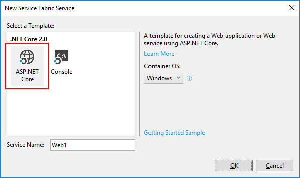

# Quickstart: Create an ASP.NET Core website for Service Fabric Mesh

Azure Service Fabric Mesh is a fully managed service that enables developers to deploy containerized applications without managing VMs, storage, or networking.

In this quickstart you'll create a new Service Fabric Mesh app, an ASP.NET Core website, and run it on the local development cluster.

You can easily create a free Azure subscription, [create a free account](https://azure.microsoft.com/free/) before you begin. 

[!INCLUDE [preview note](./includes/include-preview-note.md)]

## Create a Service Fabric Mesh project

Open Run Visual Studio and select **File** > **New** > **Project...**

In the **New Project** dialog, type **mesh** into the **Search** box at the top. Select the **Service Fabric Mesh Application** template.

In the **Name** box, type **ServiceFabricMesh1** and in the **Location** box, set the folder path of where the files for the project will be stored.

Make sure that **Create directory for solution** is checked, and press **OK** to create the Service Fabric Mesh project.

### Create a service

After you click **OK** create a Service Fabric Application project, the **New Service Fabric Service** dialog appears. Select the **ASP.NET Core** project type, make sure **Container OS** is set to **Windows**.

You must set the **Service Name** to something unique because the name of the service is used as the repository name of the Docker image. If you have an existing Docker image with the same repository name, it will be overwritten by Visual Studio. Open a terminal and use the Docker command `docker images` to make sure your project name isn't already being used.

Press **OK** to create the ASP.NET Core project. 

A new dialog is displayed, **New ASP.NET Core Web Application** dialog. Select **Web Application** and then press **OK**.

Visual Studio will create both the Service Fabric Application project and the ASP.NET Core project.

## Build and publish to your local cluster

A Docker image will automatically be built and published to your local cluster as soon as your project loads. This process may take some time. You can monitor the progress of the Service Fabric tools in the **Output** pane if you want. Select the **Service Fabric Tools** item in the pane.

After the project has been created, press **F5** to compile and run your service locally. Whenever the project is run and debugged locally, Visual Studio will: 

1. Make sure that Docker for Windows is running and set to use Windows as the container operating system.
2. Download any missing Docker base images. This part may take some time.
3. Build (or rebuild) the Docker image used to host your code project.
4. Deploy and run the container on the local Service Fabric development cluster.
5. Run your service and hit any breakpoints you have set.

After the local deployment is finished, and Visual Studio is running your project, a browser window will open with a sample webpage.

When you're done browsing the deployed service, you can stop debugging your project by pressing **Shift+F5** in Visual Studio.

## Clean up resources

Because we did not publish the website to Azure, there are no resources to clean up.

## Next steps
To learn more about Service Fabric Mesh, read the overview:
> [!div class="nextstepaction"]
> [Service Fabric Mesh overview](service-fabric-mesh-overview.md)