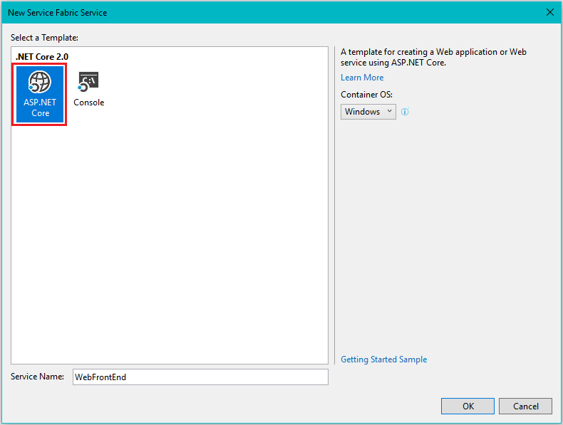
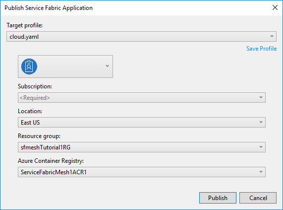
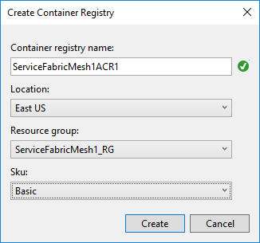

# Tutorial: Create an Azure Service Fabric Mesh app and back-end service. Publish to Azure Service Mesh

In this tutorial, you will create a new Service Fabric Mesh application, which consists of an ASP.NET Core website and a back-end web service, and run it in the local development cluster. You will set a breakpoint to debug the app locally and see how to communicate with another service running on the same cluster. After that, you will publish the project to Azure.

The app will display a to-do list and the data will come from a back-end web service. This will provide a simple example of service-to-service communication.

In this tutorial you learn how to:
> [!div class="checklist"]
> * Create a Service Fabric Mesh project.
> * Add a second service to the project & communicate with it.
> * Debug the service locally.
> * Publish the service to Azure.

If you don't have an Azure subscription, you can [create a free account](https://azure.microsoft.com/free/?WT.mc_id=A261C142F) before you begin.

[!INCLUDE [preview note](./includes/include-preview-note.md)]

## Prerequisites

Before you start, make sure that you've [set up your development environment](service-fabric-mesh-setup-developer-environment-sdk.md) which covers installing the Service Fabric runtime, SDK, Docker, and Visual Studio 2017.

## Create a Service Fabric Mesh project

Run Visual Studio and select **File** > **New** > **Project...**

In the **New Project** dialog, type **mesh** into the **Search** box at the top. Select the **Service Fabric Mesh Application** template.

In the **Name** box, type **ServiceFabricMesh1** and in the **Location** box, set the folder path to where the files for the project will be stored.

Make sure that **Create directory for solution** is checked, and press **OK** to create the Service Fabric Mesh project.


### Create the web front-end service

Next you will see the **New Service Fabric Service** dialog. Select the **ASP.NET Core** project type, make sure **Container OS** is set to **Windows**.

Set the **Service Name** to something unique because the name of the service is used as the repository name of the Docker image. This tutorial will use the name **WebFrontEnd**. If you have an existing Docker image with the same repository name, it will be overwritten by Visual Studio. Open a terminal and use the Docker command `docker images` to verify that the project name you have chosen isn't being used as a docker repository name. If it is, choose another service name unless you have no concerns about overwriting the existing docker image.

Press **OK** to create the ASP.NET Core service. 



The **New ASP.NET Core Web Application** dialog appears. Select **Web Application** and then click **OK**.


Now we have the Service Fabric Application project and the ASP.NET Core project that we will use to display to-do information.  Next, we need to create the model that will contain the to-do information.

## Create the to-do items model

For simplicity, we will store the to-do items in a list in memory. We need to define a class to represent the to-do items, and a list to hold them.  We'll create a class library for this.

In Visual Studio, select **File** > **Add** > **New Project**.

In the **New Project** dialog, type **C# .net core class** into the **Search** box at the top. Select the **Class Library (.NET Core)** template.

In the **Name** box, type **Model** and in the **Location** box, set the folder path to where the files for the project will be stored. Click **OK** to create the class library.

<jtw: picture of Add new project dialog? Or assume they know how to do this since they did earlier>

In the Solution explorer, under **Model**, right-click **Class1.cs** and choose **Rename**.  Rename the class **ToDoItem.cs**.  A prompt will appear asking whether to rename all references to Class1. Click **Yes**.

Replace the contents of `class ToDoItem` with the following:

```csharp
public class ToDoItem
{
    public string Description { get; set; }
    public int Index { get; set; }
    public Guid Id { get; private set; }
    public bool Completed { get; set; }

    public ToDoItem(string description)
    {
        Description = description;
        Index = 0;
        Id = Guid.NewGuid();
    }

    public static ToDoItem Load(string description, int index, Guid id, bool completed)
    {
        ToDoItem newItem = new ToDoItem(description)
        {
            Index = index,
            Id = id,
            Completed = completed
        };

        return newItem;
    }
}
```

This class will represent individual to-do items.

We need a list to hold the to-do items. In Visual Studio, right-click the **Model** class library, and select **Add** > **Class...** The **Add New Item** dialog will appear. Set the **Name** to **ToDoList.cs** and click **Add**.

In **ToDoList.cs**, replace `class ToDoList` with the following code:

```csharp
public class ToDoList
{
    private List<ToDoItem> _items;

    public string Name { get; set; }
    public IEnumerable<ToDoItem> Items { get => _items; }

    public ToDoList(string name)
    {
        Name = name;
        _items = new List<ToDoItem>();
    }

    public ToDoItem Add(string description)
    {
        var item = new ToDoItem(description);
        _items.Add(item);
        item.Index = _items.IndexOf(item);
        return item;
    }
    public void Add(ToDoItem item)
    {
        _items.Add(item);
        item.Index = _items.Count - 1;
    }

    public ToDoItem RemoveAt(int index)
    {
        if (index >= 0 && index < _items.Count)
        {
            var result = _items[index];
            _items.RemoveAt(index);

            // Reorder items
            for (int i = index; i < _items.Count; i++)
            {
                _items[i].Index = i;
            }

            return result;
        }
        else
        {
            throw new IndexOutOfRangeException();
        }
    }
}
```

Now create the service fabric service (a Web API project) that will track the to-do items.

## Create the back-end service

In the Visual Studio Solution Explorer window, right-click **ServiceFabricMesh1** and select **Add** > **New Service Fabric Service...**

The **New Service Fabric Service** dialog appears. Select the **ASP.NET Core** project type, make sure **Container OS** is set to **Windows**.

Set the **Service Name** to something unique because the name of the service is used as the repository name of the Docker image. This tutorial will use the name **ToDoService**. If you have an existing Docker image with the same repository name, it will be overwritten by Visual Studio. Open a terminal and use the Docker command `docker images` to verify that the project name you have chosen isn't being used as a docker repository name. If it is, choose another service name unless you have no concerns about overwriting the existing docker image.

Click **OK** to create the ASP.NET Core service, and the **New ASP.NET Core Web Application** dialog will appear. Select **API** and then **OK**.


<JTW PICTURE?>

Because this is a back-end service that doesn't provide any UI, turn off launching the browser when the service is launched. In the **Solution Explorer**, right-click **ToDoService**, and select **Properties**. In the properties window that appears, select the **Debug** tab on the left and uncheck **Launch browser**.

Because this service maintains the to-do information, we need to add a reference to the Model class library. In the Solution Explorer, right-click **ToDoService** and then select **Add** > **Reference**.  The **Reference Manager** dialog will appear.

In the **Reference Manager**, select the checkbox for **Model**, and click **OK**.

### Add a data context

ASP.Net Web API projects use the model view controller (MVC) pattern. So we will create a data context that coordinates serving up the data from the data model, and a controller that handles the HTTP requests and creates the HTTP response. 

To add the datacontext class, in the solution explorer right click **ToDoService** and then **Add** > **Class**
In the **Add New Item** dialog that appears, set the **Name** to Datacontext.cs

Replace the contents of 'public class DataContext' with the following:

```csharp
public static class DataContext
{
    public static Model.ToDoList ToDoList { get; } = new Model.ToDoList("Main List");

    static DataContext()
    {
        ToDoList = new Model.ToDoList("Main List");

        // Seed data
        ToDoList.Add(Model.ToDoItem.Load("Get milk at the store.", 0, Guid.Parse("{93BEC719-8D33-45C6-8CBF-742C91A8A8CB}"), false));
        ToDoList.Add(Model.ToDoItem.Load("Start the todo list.", 1, Guid.Parse("{7808FD5E-D8DA-4D2F-94DA-93480AE80416}"), true));
    }
}
```

This is a minimal data context that primarily populates a couple sample to-do items and provides access to the list of to-do items.

### Add a controller

When we created the project, a controller was provided by the template.  In the **Solution Explorer**, open the **Controllers** folder and you wil see the **ValuesController.cs** file. We will repurpose that file to be the to-do items controller.

Right-click **ValuesController.cs** and then **Rename**.  Rename the file to  `ToDoController.cs`.  When the prompt to rename all references appears, click **Yes**.

Replace the contents of `public class ToDoController : Controller` with the following:

```csharp
[Route("api/[controller]")]
public class ToDoController : Controller
{
    // GET api/todo
    [HttpGet]
    public IEnumerable<Model.ToDoItem> Get()
    {
        return DataContext.ToDoList.Items;
    }

    // GET api/todo/5
    [HttpGet("{index}")]
    public Model.ToDoItem Get(int index)
    {
        return DataContext.ToDoList.Items.ElementAt(index);
    }

    //// POST api/values
    //[HttpPost]
    //public void Post([FromBody]string value)
    //{
    //}

    //// PUT api/values/5
    //[HttpPut("{id}")]
    //public void Put(int id, [FromBody]string value)
    //{
    //}

    // DELETE api/values/5
    [HttpDelete("{index}")]
    public void Delete(int index)
    {
    }
}
```

For this tutorial, we won't implement add, delete, etc. but will simply focus on retrieving this data.

## Produce the view

Now that we have the back-end service implemented, let's code the web site that will display it. Now we will be working in the **WebFrontEnd** project.

The web front end will need access to the **ToDoItem** class and list, so add a reference in the **Solution Explorer** by right-clicking **WebFrontEnd** and selecting **Add** > **Reference...** The **Reference Manager** dialog will appear.

In the **Reference Manager**, select the checkbox for **Model**, and click **OK**.

In the **Solution Explorer**, open the Index.cshtml page by navigating to **WebFrontEnd** > **Pages** > **Index.cshtml**, and open **Index.cshtml**.

Replace the contents of the entire file with:

```HTML
@page
@model IndexModel
@{
    ViewData["Title"] = "Home page";
}

<div>
    <table class="table-bordered">
        <thead>
            <tr>
                <th>Description</th>
                <th>Done?</th>
            </tr>
        </thead>
        <tbody>
            @foreach (var item in Model.Items)
            {
                <tr>
                    <td>@item.Description</td>
                    <td>@item.Completed</td>
                </tr>
            }
        </tbody>
    </table>
</div>
```

This defines a simple table that displays the to-do items. Now open the code behind for the Index page in the **Solution Explorer** by double-clicking **Index.cshtml** and then opening **Index.cshtml.cs**.

At the top of **Index.cshtml.cs**, add the following using statement: `using System.Net.Http;`

Replace the contents of `public class IndexModel : PageModel` with the following:

```csharp
public class IndexModel : PageModel
{
    public Model.ToDoItem[] Items = new Model.ToDoItem[] { };

    public void OnGet()
    {
        HttpClient client = new HttpClient();

        using (HttpResponseMessage response = client.GetAsync(backendUrl).GetAwaiter().GetResult())
        {
            if (response.StatusCode == System.Net.HttpStatusCode.OK)
            {
                Items = Newtonsoft.Json.JsonConvert.DeserializeObject<Model.ToDoItem[]>(response.Content.ReadAsStringAsync().Result);
            }
        }
    }

    private static string backendDNSName = $"webapi.{Environment.GetEnvironmentVariable("ApiHostName")}";
    private static Uri backendUrl = new Uri($"http://{backendDNSName}:{Environment.GetEnvironmentVariable("ApiHostPort")}/api/todo");
}
```

To communicate with the back-end service, we need to specify the URL of that service. For now, this is done with the following code that we added above:

```csharp
private static string backendDNSName = $"webapi.{Environment.GetEnvironmentVariable("ApiHostName")}";
    private static Uri backendUrl = new Uri($"http://{backendDNSName}:{Environment.GetEnvironmentVariable("ApiHostPort")}/api/todo");
```

The URL is comprised of the application name, the service name, and the port. In this case we define 
JTW JTW JTW - fill in how to do this from the services.yaml file.


We are now ready to build and deploy the image the Service Fabric app, along with the back-end web service, to your local cluster.

## Build and deploy

A Docker image is automatically built and deployed to your local cluster as soon as your project loads. This process may take a while. You can monitor the progress in the Visual Studio **Output** pane if you set the Output pane's **Show output from:** drop-down list to **Service Fabric Tools**.

After the project has been created, press **F5** to compile and run your service locally. Whenever the project is run and debugged locally, Visual Studio will:

* Make sure that Docker for Windows is running and set to use Windows as the container operating system.
* Download any missing Docker base images. This part may take some time
* Build (or rebuild) the Docker image used to host your code project.
* Deploy and run the container on the local Service Fabric development cluster.
* Run your services and hit any breakpoints you have set.

After the local deployment is finished, and Visual Studio is running your app, a browser window will open to a default sample webpage.

When you are done browsing the deployed service you can stop debugging your project by pressing **Shift+F5** in Visual Studio.

========================>  JTW
Add what to do if get VS error that "No Service Fabric local cluster is running".  Ensure that the Service c Local Custer Manager is running, and rt-click the icon in the task bar, and click **Start Local Cluster**. Once it has started, press **F5** again.
================ JTW

=====> JTW
Add setting ab breakpiont
======= /jtw 

## Publish to Azure

To publish your Service Fabric Mesh project to Azure, right-click on the **Service Fabric Mesh project** in Visual studio and select **Publish...**


You will see a **Publish Service Fabric Application** dialog.



Select your Azure account and subscription. Choose a **Location**. This article uses **East US**.

Under **Resource group**, select **\<Create New Resource Group...>**. This will show you a dialog where you will create a new resource group. Choose the **East US** location and name the group **sfmeshTutorial1RG**. Press **Create** to create the resource group and return to the publish dialog.


Back in the **Publish Service Fabric Application** dialog, under **Azure Container Registry**, select **\<Create New Container Registry...>**. In the **Create Container Registry** dialog, use a unique name for the **Container registry name**. For **Location**, pick **East US**. Select the **sfmeshTutorial1RG** resource group. Set the **SKU** to **Basic** and then press **Create** to return to the publish dialog.



In the publish dialog, press the **Publish** button to deploy your Service Fabric application to Azure.

When you publish to Azure for the first time, it can take up to 10 or more minutes. Subsequent publishes of the same project generally take around five minutes. Obviously, these estimates will vary based on your internet connection speed and other factors. You can monitor the progress of the deployment by selecting the **Service Fabric Tools** pane in the Visual Studio **Output** window. Once the deployment has finished, the **Service Fabric Tools** output will display the IP address and port of your application in the form of a URL.

```json
Packaging Application...
Building Images...
Web1 -> C:\Code\ServiceFabricMesh1\Web1\bin\Any CPU\Release\netcoreapp2.0\Web1.dll
Uploading the images to Azure Container Registy...
Deploying application to remote endpoint...
The application was deployed successfully and it can be accessed at http://10.000.38.000:20000.
```

Open a web browser and navigate to the URL to see the website running in Azure.

## Clean up resources

When no longer needed, delete all of the resources you created. Since you created a new resource group to host both the ACR and Service Fabric Mesh service resources, you can safely delete this resource group.

```azurecli
az group delete --resource-group sfmeshTutorial1RG
```

```powershell
Remove-AzureRmResourceGroup -Name sfmeshTutorial1RG
```

Alternatively, you can delete the resource group [from the portal](../azure-resource-manager/resource-group-portal.md#delete-resource-group-or-resources).

## Next steps

Explore the [Voting app sample](https://github.com/MikkelHegn/service-fabric-mesh-preview-pr/tree/private-preview_3/samples/src/quickstart/windows/VotingApp) to see another example of service-to-service communication.
Explore the [samples](https://github.com/Azure/seabreeze-preview-pr/tree/master/samples) for Service Fabric Mesh.